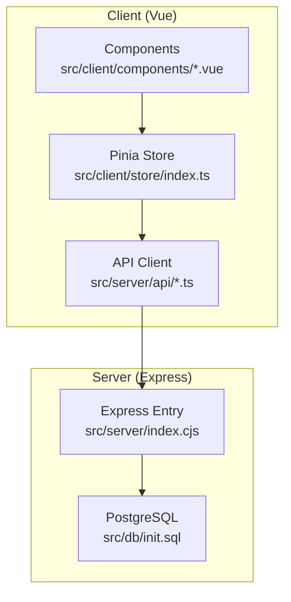
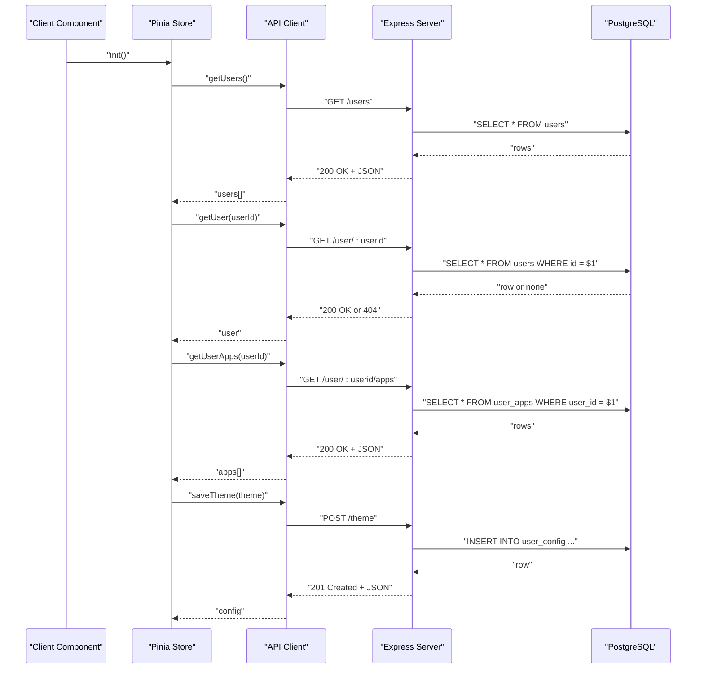
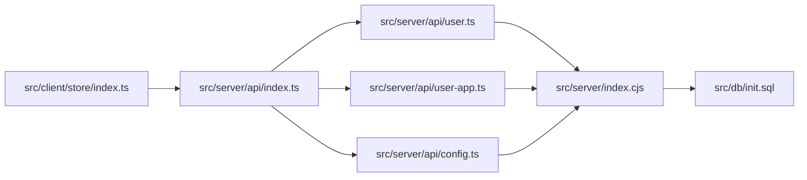

# API Reference

<cite>
**Referenced Files in This Document**
- [src/server/index.cjs](file://src/server/index.cjs)
- [src/server/api/index.ts](file://src/server/api/index.ts)
- [src/server/api/user.ts](file://src/server/api/user.ts)
- [src/server/api/user-app.ts](file://src/server/api/user-app.ts)
- [src/server/api/config.ts](file://src/server/api/config.ts)
- [src/db/init.sql](file://src/db/init.sql)
- [src/client/store/index.ts](file://src/client/store/index.ts)
- [src/client/components/config.vue](file://src/client/components/config.vue)
- [src/client/components/theme.vue](file://src/client/components/theme.vue)
- [README.md](file://README.md)
</cite>

## Table of Contents
1. [Introduction](#introduction)
2. [Project Structure](#project-structure)
3. [Core Components](#core-components)
4. [Architecture Overview](#architecture-overview)
5. [Detailed Component Analysis](#detailed-component-analysis)
6. [Dependency Analysis](#dependency-analysis)
7. [Performance Considerations](#performance-considerations)
8. [Troubleshooting Guide](#troubleshooting-guide)
9. [Conclusion](#conclusion)
10. [Appendices](#appendices)

## Introduction
This document provides a comprehensive API reference for Startora’s RESTful endpoints. It covers HTTP methods, URL patterns, request/response schemas, authentication requirements, and operational guidance for:
- User management: listing users and retrieving a single user
- Application management: listing and managing a user’s applications
- Theme configuration: saving and retrieving theme preferences

It also includes practical examples using curl, client implementation notes, rate limiting considerations, security headers, versioning and compatibility guidance, and debugging/monitoring tips.

## Project Structure
The API surface is implemented in a small Express server and consumed by a Vue 3 client. The server exposes endpoints under the root path and persists data in PostgreSQL. The client integrates these endpoints via a thin Axios-based API client.

**Diagram sources**
- [src/server/index.cjs:12-173](file://src/server/index.cjs#L12-L173)
- [src/db/init.sql:1-26](file://src/db/init.sql#L1-L26)
- [src/server/api/index.ts:1-4](file://src/server/api/index.ts#L1-L4)

**Section sources**
- [README.md:120-132](file://README.md#L120-L132)
- [src/server/index.cjs:12-173](file://src/server/index.cjs#L12-L173)
- [src/db/init.sql:1-26](file://src/db/init.sql#L1-L26)

## Core Components
- Base URL: http://localhost:3000
- CORS: Enabled globally
- JSON body parsing middleware enabled
- PostgreSQL tables:
  - users: id, name, email
  - user_config: id, user_id, config (JSONB)
  - user_apps: id, user_id, app_name, app_data (JSONB)

Key behaviors:
- GET /users returns all users
- GET /user/:userid returns a single user by ID
- POST /users creates a new user
- GET /user/:userid/apps lists a user’s apps
- POST /user/:userid/apps adds a new app for the user
- PUT /user/:userid/apps/:appId updates an existing app
- DELETE /user/:userid/apps/:appId removes an app
- POST /theme saves theme for a user
- GET /theme retrieves theme for a user

**Section sources**
- [src/server/index.cjs:46-164](file://src/server/index.cjs#L46-L164)
- [src/db/init.sql:6-25](file://src/db/init.sql#L6-L25)

## Architecture Overview
The client consumes the server via Axios-based API modules. The store orchestrates user sessions, app lists, and theme updates. The server connects to PostgreSQL and exposes CRUD endpoints.

**Diagram sources**
- [src/client/store/index.ts:20-62](file://src/client/store/index.ts#L20-L62)
- [src/server/api/user.ts:5-45](file://src/server/api/user.ts#L5-L45)
- [src/server/api/user-app.ts:5-39](file://src/server/api/user-app.ts#L5-L39)
- [src/server/api/config.ts:6-18](file://src/server/api/config.ts#L6-L18)
- [src/server/index.cjs:46-164](file://src/server/index.cjs#L46-L164)

## Detailed Component Analysis

### User Management
Endpoints for listing and retrieving users, and for creating a user.

- List Users
  - Method: GET
  - Path: /users
  - Query: None
  - Request Body: None
  - Success Response: 200 OK, array of user objects
  - Error Responses: 500 Internal Server Error
  - Response Schema:
    - id: integer
    - name: string
    - email: string

- Get User by ID
  - Method: GET
  - Path: /user/:userid
  - Path Params:
    - userid: integer, required
  - Query: None
  - Request Body: None
  - Success Response: 200 OK, user object
  - Error Responses: 404 Not Found (if user does not exist), 500 Internal Server Error
  - Response Schema:
    - id: integer
    - name: string
    - email: string
    - avatar?: string
    - isAdmin?: boolean
    - isActive?: boolean

- Create User
  - Method: POST
  - Path: /users
  - Query: None
  - Request Body:
    - name: string, required
    - email: string, required
  - Success Response: 201 Created, user object
  - Error Responses: 500 Internal Server Error
  - Response Schema:
    - id: integer
    - name: string
    - email: string

Example curl:
- List users: curl -X GET http://localhost:3000/users
- Get user: curl -X GET http://localhost:3000/user/1
- Create user: curl -X POST http://localhost:3000/users -H "Content-Type: application/json" -d '{"name":"Alice","email":"alice@example.com"}'

Authentication and Security:
- No authentication is enforced by the server.
- Recommended: Add authentication (e.g., bearer tokens) and enforce HTTPS in production.
- Security headers: Consider adding Content-Security-Policy, X-Content-Type-Options, X-Frame-Options, and Strict-Transport-Security.

Rate Limiting:
- Not implemented. Consider rate limiting per IP or per user for sensitive endpoints.

Common Use Cases:
- Initialize session by fetching users and selecting a user
- Create a new user programmatically

Client Implementation Notes:
- The client uses an Axios-based API module to call these endpoints.
- The store fetches users and a specific user during initialization.

**Section sources**
- [src/server/index.cjs:46-136](file://src/server/index.cjs#L46-L136)
- [src/server/api/user.ts:5-45](file://src/server/api/user.ts#L5-L45)
- [src/client/store/index.ts:24-47](file://src/client/store/index.ts#L24-L47)

### Application Management
Endpoints for listing, adding, updating, and deleting a user’s applications.

- List User Apps
  - Method: GET
  - Path: /user/:userid/apps
  - Path Params:
    - userid: integer, required
  - Query: None
  - Request Body: None
  - Success Response: 200 OK, array of app objects
  - Error Responses: 500 Internal Server Error
  - Response Schema:
    - id: integer
    - user_id: integer
    - app_name: string
    - app_data: JSON object

- Add User App
  - Method: POST
  - Path: /user/:userid/apps
  - Path Params:
    - userid: integer, required
  - Query: None
  - Request Body:
    - appName: string, required
    - appData: JSON object, required
  - Success Response: 201 Created, app object
  - Error Responses: 500 Internal Server Error
  - Response Schema:
    - id: integer
    - user_id: integer
    - app_name: string
    - app_data: JSON object

- Update User App
  - Method: PUT
  - Path: /user/:userid/apps/:appId
  - Path Params:
    - userid: integer, required
    - appId: integer, required
  - Query: None
  - Request Body:
    - appName: string, required
    - appData: JSON object, required
  - Success Response: 200 OK, app object
  - Error Responses: 404 Not Found (if app not found), 500 Internal Server Error
  - Response Schema:
    - id: integer
    - user_id: integer
    - app_name: string
    - app_data: JSON object

- Delete User App
  - Method: DELETE
  - Path: /user/:userid/apps/:appId
  - Path Params:
    - userid: integer, required
    - appId: integer, required
  - Query: None
  - Request Body: None
  - Success Response: 200 OK
  - Error Responses: 500 Internal Server Error
  - Response Schema: None

Example curl:
- List apps: curl -X GET http://localhost:3000/user/1/apps
- Add app: curl -X POST http://localhost:3000/user/1/apps -H "Content-Type: application/json" -d '{"appName":"Google","appData":{"url":"https://google.com"}}'
- Update app: curl -X PUT http://localhost:3000/user/1/apps/2 -H "Content-Type: application/json" -d '{"appName":"Updated","appData":{"url":"https://updated.example.com"}}'
- Delete app: curl -X DELETE http://localhost:3000/user/1/apps/2

Authentication and Security:
- No authentication is enforced by the server.
- Recommended: Enforce authentication and authorization (per-user resource ownership).

Rate Limiting:
- Not implemented. Consider rate limiting for write-heavy endpoints.

Common Use Cases:
- Add a new application shortcut for the current user
- Edit an existing application shortcut
- Remove an unwanted application shortcut

Client Implementation Notes:
- The client store calls these endpoints to manage user apps and refreshes the app list after updates.

**Section sources**
- [src/server/index.cjs:72-122](file://src/server/index.cjs#L72-L122)
- [src/server/api/user-app.ts:5-72](file://src/server/api/user-app.ts#L5-L72)
- [src/client/store/index.ts:63-88](file://src/client/store/index.ts#L63-L88)

### Theme Configuration
Endpoints for saving and retrieving theme configuration for a user.

- Save Theme
  - Method: POST
  - Path: /theme
  - Query: None
  - Request Body:
    - user_id: integer, required
    - theme: JSON object, required
      - primary: string, required
      - accent: string, required
      - background: string, required
  - Success Response: 201 Created, config object
  - Error Responses: 500 Internal Server Error
  - Response Schema:
    - id: integer
    - user_id: integer
    - config: JSON object (contains theme fields)

- Get Theme
  - Method: GET
  - Path: /theme
  - Query:
    - user_id: integer, required
  - Request Body: None
  - Success Response: 200 OK, array of config objects
  - Error Responses: 500 Internal Server Error
  - Response Schema:
    - id: integer
    - user_id: integer
    - config: JSON object (contains theme fields)

Example curl:
- Save theme: curl -X POST http://localhost:3000/theme -H "Content-Type: application/json" -d '{"user_id":1,"theme":{"primary":"#000000","accent":"#ffffff","background":"#eeeeee"}}'
- Get theme: curl -X GET "http://localhost:3000/theme?user_id=1"

Authentication and Security:
- No authentication is enforced by the server.
- Recommended: Enforce authentication and restrict access to the requesting user’s own config.

Rate Limiting:
- Not implemented. Consider rate limiting for write operations.

Common Use Cases:
- Persist user-selected theme preferences
- Retrieve theme preferences for rendering

Client Implementation Notes:
- The client store saves theme updates via the API and persists them to the database.

**Section sources**
- [src/server/index.cjs:138-164](file://src/server/index.cjs#L138-L164)
- [src/server/api/config.ts:6-18](file://src/server/api/config.ts#L6-L18)
- [src/client/store/index.ts:58-62](file://src/client/store/index.ts#L58-L62)

## Dependency Analysis
The client depends on the server’s REST endpoints. The server depends on PostgreSQL for persistence. The API client modules export functions that encapsulate HTTP calls.

**Diagram sources**
- [src/client/store/index.ts:1-91](file://src/client/store/index.ts#L1-L91)
- [src/server/api/index.ts:1-4](file://src/server/api/index.ts#L1-L4)
- [src/server/api/user.ts:1-46](file://src/server/api/user.ts#L1-L46)
- [src/server/api/user-app.ts:1-73](file://src/server/api/user-app.ts#L1-L73)
- [src/server/api/config.ts:1-19](file://src/server/api/config.ts#L1-L19)
- [src/server/index.cjs:12-173](file://src/server/index.cjs#L12-L173)
- [src/db/init.sql:1-26](file://src/db/init.sql#L1-L26)

**Section sources**
- [src/server/api/index.ts:1-4](file://src/server/api/index.ts#L1-L4)
- [src/server/api/user.ts:1-46](file://src/server/api/user.ts#L1-L46)
- [src/server/api/user-app.ts:1-73](file://src/server/api/user-app.ts#L1-L73)
- [src/server/api/config.ts:1-19](file://src/server/api/config.ts#L1-L19)
- [src/server/index.cjs:12-173](file://src/server/index.cjs#L12-L173)
- [src/db/init.sql:1-26](file://src/db/init.sql#L1-L26)

## Performance Considerations
- Database queries are simple SELECT/INSERT/UPDATE statements. For larger datasets, consider indexing on user_id and paginating lists.
- JSONB storage is efficient for flexible app_data and theme config.
- Network latency: batch operations where possible (e.g., bulk app updates).
- Caching: cache frequently accessed user data and themes at the client level.

## Troubleshooting Guide
Common issues and resolutions:
- Connection errors to PostgreSQL:
  - Verify credentials and connection string in the server entry file.
  - Ensure the database exists and the init script has been applied.
- CORS errors:
  - The server enables CORS globally. Confirm the client is calling the correct base URL.
- 404 Not Found:
  - For user or app endpoints, ensure the provided IDs exist.
- 500 Internal Server Error:
  - Check server logs for SQL errors or constraint violations.
- Authentication:
  - Currently unenforced. Add authentication and authorization middleware before deploying to production.

Monitoring:
- Enable logging for all endpoints and track response times.
- Use database query logging for slow queries.
- Instrument client calls to capture failures and retry counts.

**Section sources**
- [src/server/index.cjs:12-44](file://src/server/index.cjs#L12-L44)
- [src/db/init.sql:1-26](file://src/db/init.sql#L1-L26)

## Conclusion
Startora’s API provides a minimal set of endpoints for user and application management plus theme configuration. The current implementation is unauthenticated and intended for local development. Production readiness requires authentication, authorization, HTTPS, rate limiting, and robust error handling. The client integrates these endpoints cleanly via a thin API layer and Pinia store.

## Appendices

### API Versioning and Compatibility
- Current state: No explicit versioning scheme is present.
- Recommendation:
  - Use a version prefix in URLs (e.g., /api/v1) or a Version header.
  - Maintain backward compatibility by deprecating endpoints with sufficient notice and migration paths.

### Security Headers Checklist
- Content-Security-Policy
- X-Content-Type-Options: nosniff
- X-Frame-Options: DENY
- Strict-Transport-Security: max-age=31536000; includeSubDomains
- Referrer-Policy: strict-origin-when-cross-origin

### Client Integration Patterns
- Session initialization: fetch users, select a user, persist in localStorage, then load user apps and theme.
- Offline-first: cache user data and apps; sync on reconnect.
- Idempotency: for retries, ensure idempotent operations where possible.

### Example curl Commands
- List users: curl -X GET http://localhost:3000/users
- Get user: curl -X GET http://localhost:3000/user/1
- Create user: curl -X POST http://localhost:3000/users -H "Content-Type: application/json" -d '{"name":"Alice","email":"alice@example.com"}'
- List apps: curl -X GET http://localhost:3000/user/1/apps
- Add app: curl -X POST http://localhost:3000/user/1/apps -H "Content-Type: application/json" -d '{"appName":"Google","appData":{"url":"https://google.com"}}'
- Update app: curl -X PUT http://localhost:3000/user/1/apps/2 -H "Content-Type: application/json" -d '{"appName":"Updated","appData":{"url":"https://updated.example.com"}}'
- Delete app: curl -X DELETE http://localhost:3000/user/1/apps/2
- Save theme: curl -X POST http://localhost:3000/theme -H "Content-Type: application/json" -d '{"user_id":1,"theme":{"primary":"#000000","accent":"#ffffff","background":"#eeeeee"}}'
- Get theme: curl -X GET "http://localhost:3000/theme?user_id=1"