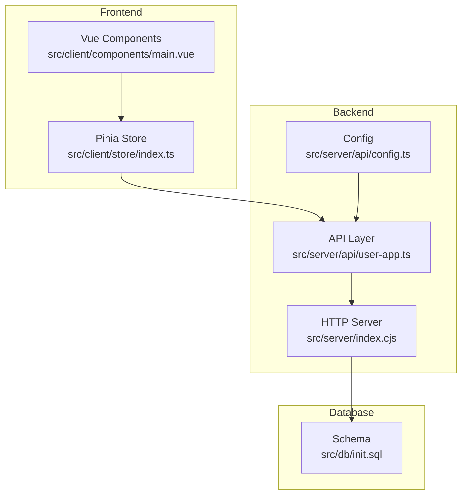
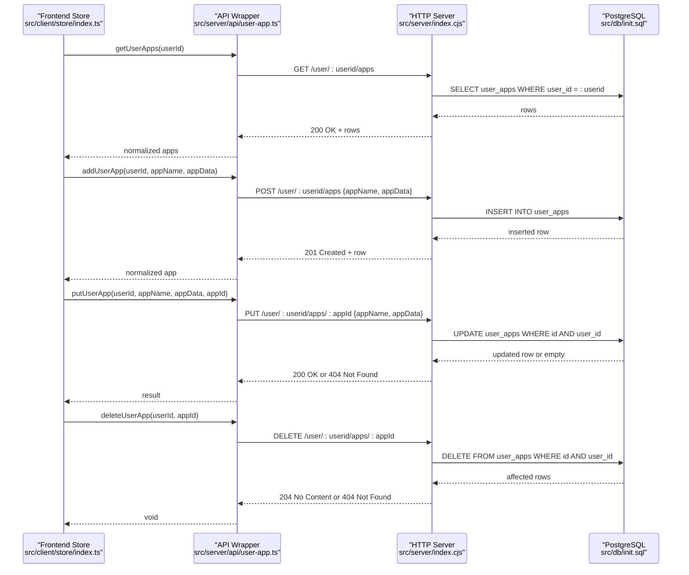
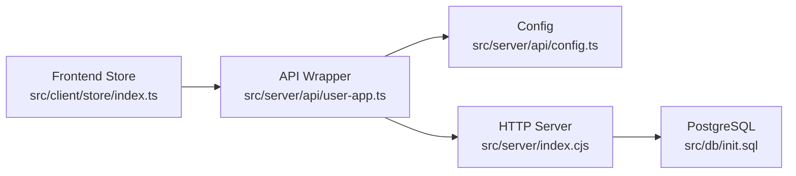

# Application Management API

<cite>
**Referenced Files in This Document**
- [user-app.ts](file://src/server/api/user-app.ts)
- [index.cjs](file://src/server/index.cjs)
- [init.sql](file://src/db/init.sql)
- [config.ts](file://src/server/api/config.ts)
- [index.ts](file://src/client/store/index.ts)
- [main.vue](file://src/client/components/main.vue)
</cite>

## Table of Contents
1. [Introduction](#introduction)
2. [Project Structure](#project-structure)
3. [Core Components](#core-components)
4. [Architecture Overview](#architecture-overview)
5. [Detailed Component Analysis](#detailed-component-analysis)
6. [Dependency Analysis](#dependency-analysis)
7. [Performance Considerations](#performance-considerations)
8. [Troubleshooting Guide](#troubleshooting-guide)
9. [Conclusion](#conclusion)

## Introduction
This document provides comprehensive API documentation for application management endpoints under `/user/:userid/apps`. It covers GET, POST, PUT, and DELETE operations for managing user applications, including request/response schemas, validation rules, error handling patterns, and practical examples using curl commands and code snippets.

## Project Structure
The application consists of:
- Frontend (Vue + Pinia store) that consumes the API
- Backend (Node.js with PostgreSQL) exposing REST endpoints
- Database schema for storing user applications



**Diagram sources**
- [index.ts:1-91](file://src/client/store/index.ts#L1-L91)
- [main.vue:1-45](file://src/client/components/main.vue#L1-L45)
- [user-app.ts:1-73](file://src/server/api/user-app.ts#L1-L73)
- [index.cjs:72-122](file://src/server/index.cjs#L72-L122)
- [config.ts:1-19](file://src/server/api/config.ts#L1-L19)
- [init.sql:1-26](file://src/db/init.sql#L1-L26)

**Section sources**
- [index.ts:1-91](file://src/client/store/index.ts#L1-L91)
- [user-app.ts:1-73](file://src/server/api/user-app.ts#L1-L73)
- [index.cjs:72-122](file://src/server/index.cjs#L72-L122)
- [init.sql:1-26](file://src/db/init.sql#L1-L26)
- [config.ts:1-19](file://src/server/api/config.ts#L1-L19)

## Core Components
- Application model: stored in the `user_apps` table with fields:
  - `id`: serial primary key
  - `user_id`: foreign key to users
  - `app_name`: varchar, not null
  - `app_data`: jsonb for flexible application configuration
- API endpoints:
  - GET `/user/:userid/apps` — retrieve all applications for a user
  - POST `/user/:userid/apps` — add a new application
  - PUT `/user/:userid/apps/:appId` — update an existing application
  - DELETE `/user/:userid/apps/:appId` — remove an application

**Section sources**
- [init.sql:19-25](file://src/db/init.sql#L19-L25)
- [index.cjs:72-122](file://src/server/index.cjs#L72-L122)

## Architecture Overview
The frontend interacts with the backend via Axios-based API wrappers. The backend exposes REST endpoints backed by PostgreSQL.



**Diagram sources**
- [index.ts:49-88](file://src/client/store/index.ts#L49-L88)
- [user-app.ts:5-72](file://src/server/api/user-app.ts#L5-L72)
- [index.cjs:72-122](file://src/server/index.cjs#L72-L122)
- [init.sql:19-25](file://src/db/init.sql#L19-L25)

## Detailed Component Analysis

### GET /user/:userid/apps
- Purpose: Retrieve all applications associated with a specific user.
- Path parameters:
  - `userid`: integer, required
- Response:
  - 200 OK: Array of application objects
  - 500 Internal Server Error: Error message
- Response schema:
  - id: integer
  - user_id: integer
  - app_name: string
  - app_data: jsonb
- Example curl:
  ```bash
  curl -X GET http://localhost:3000/user/1/apps
  ```
- Frontend usage:
  - The store calls the API wrapper to fetch apps and updates local state.

**Section sources**
- [index.cjs:72-84](file://src/server/index.cjs#L72-L84)
- [user-app.ts:5-17](file://src/server/api/user-app.ts#L5-L17)
- [index.ts:49-56](file://src/client/store/index.ts#L49-L56)

### POST /user/:userid/apps
- Purpose: Add a new application for the specified user.
- Path parameters:
  - `userid`: integer, required
- Request body:
  - appName: string, required
  - appData: jsonb, required
- Response:
  - 201 Created: Newly created application object
  - 500 Internal Server Error: Error message
- Example curl:
  ```bash
  curl -X POST http://localhost:3000/user/1/apps \
    -H "Content-Type: application/json" \
    -d '{"appName":"My App","appData":{"url":"https://example.com"}}'
  ```
- Frontend usage:
  - The store action invokes the API wrapper with user id, app name, and app data.

**Section sources**
- [index.cjs:86-103](file://src/server/index.cjs#L86-L103)
- [user-app.ts:19-39](file://src/server/api/user-app.ts#L19-L39)
- [index.ts:63-75](file://src/client/store/index.ts#L63-L75)

### PUT /user/:userid/apps/:appId
- Purpose: Update an existing application for the specified user.
- Path parameters:
  - `userid`: integer, required
  - `appId`: integer, required
- Request body:
  - appName: string, required
  - appData: jsonb, required
- Response:
  - 200 OK: Updated application object
  - 404 Not Found: App not found
  - 500 Internal Server Error: Error message
- Example curl:
  ```bash
  curl -X PUT http://localhost:3000/user/1/apps/1 \
    -H "Content-Type: application/json" \
    -d '{"appName":"Updated App","appData":{"url":"https://updated.example.com"}}'
  ```
- Frontend usage:
  - The store action calls the API wrapper with user id, app id, and updated data.

**Section sources**
- [index.cjs:105-122](file://src/server/index.cjs#L105-L122)
- [user-app.ts:41-60](file://src/server/api/user-app.ts#L41-L60)
- [index.ts:76-88](file://src/client/store/index.ts#L76-L88)

### DELETE /user/:userid/apps/:appId
- Purpose: Remove an application for the specified user.
- Path parameters:
  - `userid`: integer, required
  - `appId`: integer, required
- Response:
  - 204 No Content: Successful deletion
  - 404 Not Found: App not found
  - 500 Internal Server Error: Error message
- Example curl:
  ```bash
  curl -X DELETE http://localhost:3000/user/1/apps/1
  ```
- Frontend usage:
  - The API wrapper performs the delete operation; the store refreshes app lists after successful updates.

**Section sources**
- [user-app.ts:62-72](file://src/server/api/user-app.ts#L62-L72)
- [index.cjs:105-122](file://src/server/index.cjs#L105-L122)

### Data Serialization for app_data Field
- The `app_data` field is stored as JSONB in PostgreSQL, enabling flexible, structured storage.
- Frontend examples show passing an object like `{ url: "..." }` in appData.
- The backend persists the raw JSON payload as-is.

**Section sources**
- [init.sql:24-24](file://src/db/init.sql#L24-L24)
- [main.vue:13-25](file://src/client/components/main.vue#L13-L25)

### Parameter Validation Rules
- Path parameters:
  - `userid`: integer, must reference an existing user
  - `appId`: integer, must reference an existing application
- Request body:
  - `appName`: string, required
  - `appData`: jsonb, required
- Backend behavior:
  - GET: Returns all rows matching user_id
  - POST: Inserts a new row with provided values
  - PUT: Updates row where both user_id and id match; returns 404 if not found
  - DELETE: Removes row where both user_id and id match; returns 404 if not found

**Section sources**
- [index.cjs:72-122](file://src/server/index.cjs#L72-L122)
- [init.sql:19-25](file://src/db/init.sql#L19-L25)

### Error Handling Patterns
- HTTP status codes:
  - 200 OK: Successful GET/PUT
  - 201 Created: Successful POST
  - 204 No Content: Successful DELETE
  - 404 Not Found: Resource not found during PUT/DELETE
  - 500 Internal Server Error: General server errors
- Logging:
  - Frontend logs errors to console
  - Backend logs SQL errors and request details

**Section sources**
- [index.cjs:72-122](file://src/server/index.cjs#L72-L122)
- [user-app.ts:5-72](file://src/server/api/user-app.ts#L5-L72)
- [index.ts:49-88](file://src/client/store/index.ts#L49-L88)

## Dependency Analysis
- Frontend depends on API wrappers for network calls.
- API wrappers depend on the configured base URL and Axios.
- Backend endpoints depend on PostgreSQL tables and queries.
- The store orchestrates UI interactions and API calls.



**Diagram sources**
- [index.ts:1-91](file://src/client/store/index.ts#L1-L91)
- [user-app.ts:1-73](file://src/server/api/user-app.ts#L1-L73)
- [config.ts:1-19](file://src/server/api/config.ts#L1-L19)
- [index.cjs:72-122](file://src/server/index.cjs#L72-L122)
- [init.sql:1-26](file://src/db/init.sql#L1-L26)

**Section sources**
- [index.ts:1-91](file://src/client/store/index.ts#L1-L91)
- [user-app.ts:1-73](file://src/server/api/user-app.ts#L1-L73)
- [config.ts:1-19](file://src/server/api/config.ts#L1-L19)
- [index.cjs:72-122](file://src/server/index.cjs#L72-L122)
- [init.sql:1-26](file://src/db/init.sql#L1-L26)

## Performance Considerations
- Use pagination for large datasets if retrieving many applications.
- Index user_id on user_apps for efficient filtering.
- Minimize unnecessary re-fetches by caching results in the store.
- Batch updates when possible to reduce round trips.

## Troubleshooting Guide
- 404 Not Found on PUT/DELETE:
  - Verify that both user_id and app_id exist and belong to the same user.
- 500 Internal Server Error:
  - Check server logs for SQL errors.
  - Ensure the database connection is healthy.
- CORS or Network Issues:
  - Confirm the API URL matches the server address.
  - Verify firewall and port accessibility.

**Section sources**
- [index.cjs:72-122](file://src/server/index.cjs#L72-L122)
- [config.ts:3-3](file://src/server/api/config.ts#L3-L3)

## Conclusion
The Application Management API provides a straightforward CRUD interface for user applications backed by PostgreSQL. The frontend integrates seamlessly with the backend via Axios-based wrappers, while the backend enforces minimal validation and returns clear HTTP status codes. The `app_data` field supports flexible JSON configurations, enabling diverse application metadata storage.