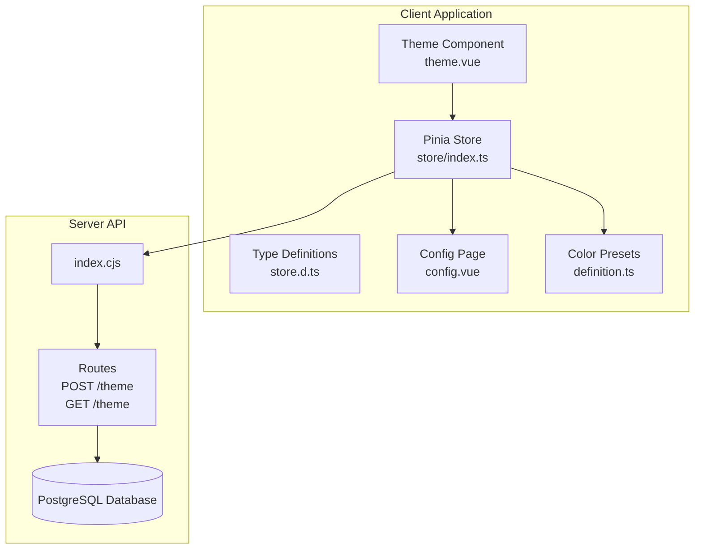
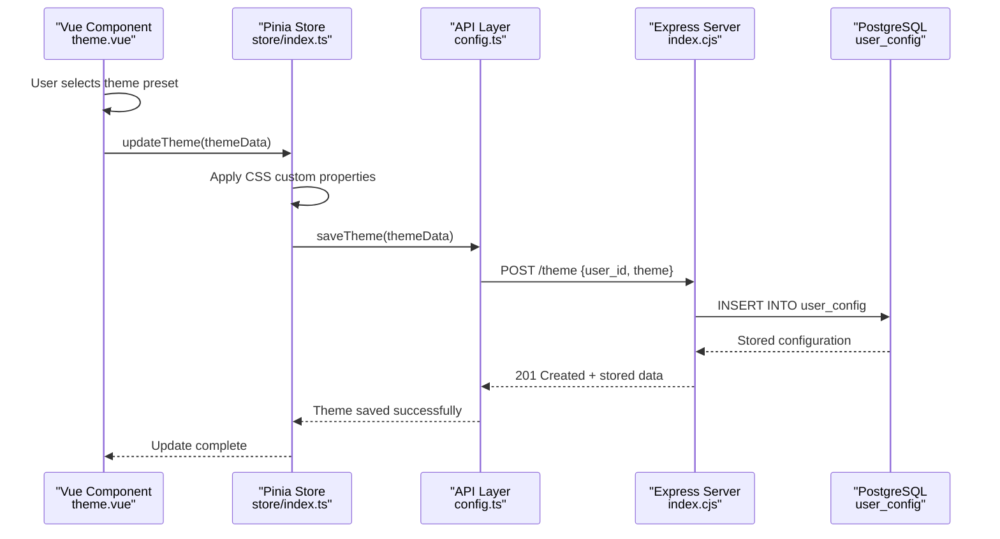
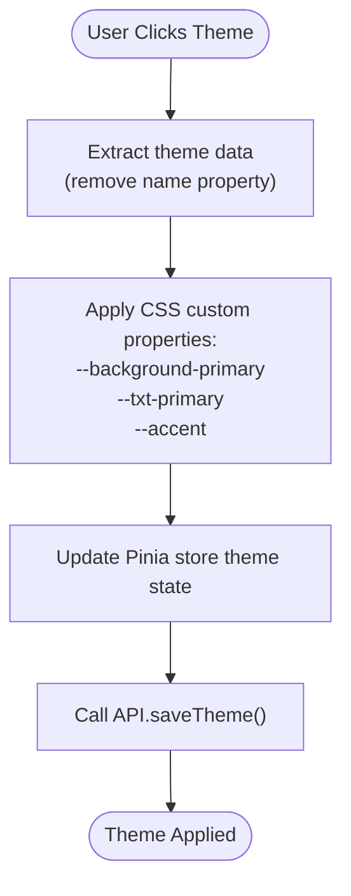
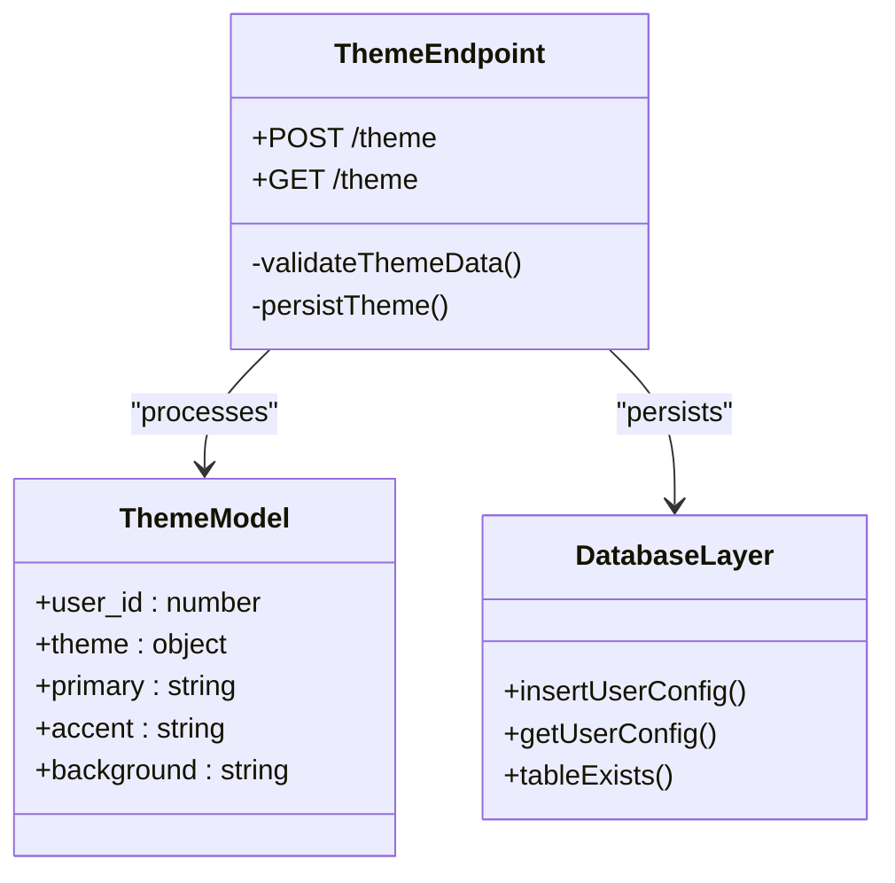
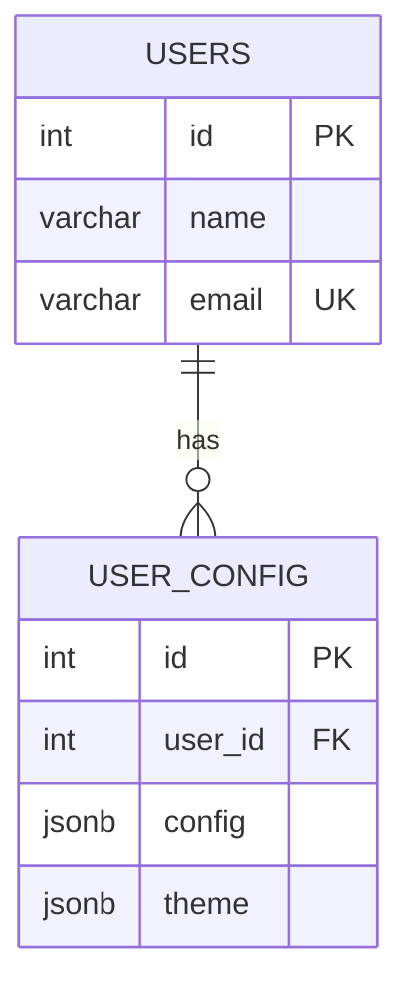

# Theme Configuration API

<cite>
**Referenced Files in This Document**
- [index.cjs](file://src/server/index.cjs)
- [config.ts](file://src/server/api/config.ts)
- [store/index.ts](file://src/client/store/index.ts)
- [theme.vue](file://src/client/components/theme.vue)
- [definition.ts](file://src/client/definition.ts)
- [store.d.ts](file://src/client/types/store.d.ts)
- [config.vue](file://src/client/components/config.vue)
- [init.sql](file://src/db/init.sql)
</cite>

## Table of Contents
1. [Introduction](#introduction)
2. [Project Structure](#project-structure)
3. [Core Components](#core-components)
4. [Architecture Overview](#architecture-overview)
5. [Detailed Component Analysis](#detailed-component-analysis)
6. [Dependency Analysis](#dependency-analysis)
7. [Performance Considerations](#performance-considerations)
8. [Troubleshooting Guide](#troubleshooting-guide)
9. [Conclusion](#conclusion)

## Introduction
This document provides comprehensive API documentation for the theme configuration endpoints. It covers the `/theme` endpoint with both POST and GET methods, detailing request/response schemas, validation rules, color format specifications, persistence mechanisms, and integration patterns with the frontend theme system. The documentation includes practical examples using curl commands and code snippet references to guide developers through theme customization workflows.

## Project Structure
The theme configuration system spans both the client-side Vue application and the server-side Node.js/PostgreSQL backend. The client manages theme state and interacts with the server via API functions, while the server persists theme configurations in a PostgreSQL database.



**Diagram sources**
- [index.cjs:138-164](file://src/server/index.cjs#L138-L164)
- [store/index.ts:58-62](file://src/client/store/index.ts#L58-L62)
- [theme.vue:11-21](file://src/client/components/theme.vue#L11-L21)

**Section sources**
- [index.cjs:138-164](file://src/server/index.cjs#L138-L164)
- [store/index.ts:58-62](file://src/client/store/index.ts#L58-L62)
- [theme.vue:11-21](file://src/client/components/theme.vue#L11-L21)

## Core Components
The theme configuration system consists of three primary components:
- Theme data model with primary, accent, and background color properties
- Client-side theme management with immediate visual feedback
- Server-side persistence with PostgreSQL storage

Key characteristics:
- Theme data structure includes name, primary, accent, and background color properties
- Color values support multiple formats (named colors, hex codes)
- Immediate visual updates via CSS custom properties
- Persistent storage in user_config table with JSONB format

**Section sources**
- [store.d.ts:1-7](file://src/client/types/store.d.ts#L1-L7)
- [definition.ts:1-21](file://src/client/definition.ts#L1-L21)
- [init.sql:12-17](file://src/db/init.sql#L12-L17)

## Architecture Overview
The theme configuration follows a client-server architecture with immediate client-side visual feedback and server-side persistence.



**Diagram sources**
- [theme.vue:11-21](file://src/client/components/theme.vue#L11-L21)
- [store/index.ts:58-62](file://src/client/store/index.ts#L58-L62)
- [config.ts:6-18](file://src/server/api/config.ts#L6-L18)
- [index.cjs:138-150](file://src/server/index.cjs#L138-L150)

## Detailed Component Analysis

### Theme Data Model
The theme configuration uses a structured data model with the following properties:

| Property | Type | Required | Description | Example |
|----------|------|----------|-------------|---------|
| name | string | No | Theme display name | "Default", "Dark Mode" |
| primary | string | Yes | Primary text/accent color | "black", "#ffffff" |
| accent | string | Yes | Secondary accent color | "gray", "#cccccc" |
| background | string | Yes | Background/base color | "white", "#000000" |

Supported color formats:
- Named colors: "black", "white", "blue", "red"
- Hex colors: "#ffffff", "#000000", "#ff0000"
- RGB/RGBA: "rgb(255,255,255)", "rgba(255,255,255,1)"
- HSL/HSLA: "hsl(0,0%,100%)", "hsla(0,0%,100%,1)"

Validation rules:
- All color values must be valid CSS color strings
- Primary and accent colors should provide sufficient contrast against background
- Color values are stored as-is without validation on the server side

**Section sources**
- [store.d.ts:1-7](file://src/client/types/store.d.ts#L1-L7)
- [definition.ts:1-21](file://src/client/definition.ts#L1-L21)

### Client-Side Theme Management
The Vue component provides immediate visual feedback through CSS custom properties:



**Diagram sources**
- [theme.vue:11-21](file://src/client/components/theme.vue#L11-L21)
- [store/index.ts:58-62](file://src/client/store/index.ts#L58-L62)

**Section sources**
- [theme.vue:11-21](file://src/client/components/theme.vue#L11-L21)
- [store/index.ts:58-62](file://src/client/store/index.ts#L58-L62)

### Server-Side Persistence
The server handles theme persistence through dedicated routes:



**Diagram sources**
- [index.cjs:138-164](file://src/server/index.cjs#L138-L164)
- [init.sql:12-17](file://src/db/init.sql#L12-L17)

**Section sources**
- [index.cjs:138-164](file://src/server/index.cjs#L138-L164)
- [init.sql:12-17](file://src/db/init.sql#L12-L17)

## API Specification

### POST /theme
Creates or updates a user's theme configuration.

**Request Body Schema**
```json
{
  "user_id": "number",
  "theme": {
    "primary": "string",
    "accent": "string", 
    "background": "string"
  }
}
```

**Response Schema**
```json
{
  "id": "number",
  "user_id": "number",
  "config": "null",
  "theme": {
    "primary": "string",
    "accent": "string",
    "background": "string"
  }
}
```

**Example Request**
```bash
curl -X POST http://localhost:3000/theme \
  -H "Content-Type: application/json" \
  -d '{
    "user_id": 1,
    "theme": {
      "primary": "#ffffff",
      "accent": "#cccccc", 
      "background": "#000000"
    }
  }'
```

**Example Response**
```json
{
  "id": 1,
  "user_id": 1,
  "config": null,
  "theme": {
    "primary": "#ffffff",
    "accent": "#cccccc",
    "background": "#000000"
  }
}
```

### GET /theme
Retrieves a user's theme configuration.

**Query Parameters**
- `user_id`: number (required) - The user identifier

**Response Schema**
```json
[
  {
    "id": "number",
    "user_id": "number", 
    "config": "null",
    "theme": {
      "primary": "string",
      "accent": "string",
      "background": "string"
    }
  }
]
```

**Example Request**
```bash
curl "http://localhost:3000/theme?user_id=1"
```

**Example Response**
```json
[
  {
    "id": 1,
    "user_id": 1,
    "config": null,
    "theme": {
      "primary": "#ffffff",
      "accent": "#cccccc",
      "background": "#000000"
    }
  }
]
```

**Section sources**
- [index.cjs:138-164](file://src/server/index.cjs#L138-L164)

## Implementation Details

### Frontend Integration
The theme system integrates seamlessly with the Vue application through the following workflow:

1. **Theme Selection**: Users select predefined themes from the theme component
2. **Immediate Feedback**: CSS custom properties are applied immediately
3. **State Update**: Theme data is stored in Pinia store
4. **Persistence**: Theme is sent to server for permanent storage

### Backend Implementation
The server uses PostgreSQL with JSONB storage for flexible theme configuration:



**Diagram sources**
- [init.sql:6-17](file://src/db/init.sql#L6-L17)

**Section sources**
- [config.vue:13-20](file://src/client/components/config.vue#L13-L20)
- [definition.ts:1-21](file://src/client/definition.ts#L1-L21)

## Practical Examples

### Basic Theme Setup Workflow
1. **Select a theme preset** from the theme component
2. **Apply theme immediately** - CSS custom properties update instantly
3. **Persist to server** - Theme saved via API call
4. **Verify persistence** - Retrieve theme using GET endpoint

### Advanced Theme Customization
```typescript
// Example of programmatic theme updates
const customTheme = {
  name: "Custom Theme",
  primary: "#1a73e8",
  accent: "#5f6368", 
  background: "#ffffff"
};

await store.updateTheme({
  primary: customTheme.primary,
  accent: customTheme.accent,
  background: customTheme.background
});
```

### Integration with Existing Applications
The theme system can be integrated with existing applications by:
- Importing the theme component into existing pages
- Using the Pinia store for centralized theme state management
- Leveraging the existing API endpoints for persistence

**Section sources**
- [theme.vue:27-35](file://src/client/components/theme.vue#L27-L35)
- [store/index.ts:58-62](file://src/client/store/index.ts#L58-L62)

## Validation and Error Handling

### Client-Side Validation
- Color format validation occurs during CSS property application
- Immediate visual feedback prevents invalid color combinations
- User-friendly error messages via Naive UI notifications

### Server-Side Validation
- Input validation performed via PostgreSQL constraints
- JSONB format ensures flexible theme structure
- Error handling returns standardized JSON error responses

### Error Scenarios
Common error conditions and responses:
- **Invalid user_id**: Server returns 404 Not Found
- **Database connection failure**: Server returns 500 Internal Server Error  
- **Invalid JSON format**: Server returns 400 Bad Request
- **Missing required fields**: Server returns 400 Bad Request

**Section sources**
- [index.cjs:147-149](file://src/server/index.cjs#L147-L149)
- [index.cjs:161-163](file://src/server/index.cjs#L161-L163)

## Performance Considerations

### Client-Side Performance
- CSS custom properties provide instant visual updates
- Minimal DOM manipulation reduces rendering overhead
- Local state management minimizes network requests

### Server-Side Performance
- PostgreSQL JSONB storage optimizes query performance
- Index on user_id enables fast theme retrieval
- Connection pooling manages concurrent requests efficiently

### Caching Strategies
- Client-side caching via Pinia store reduces repeated API calls
- Browser caching of static assets improves load times
- Database-level caching through connection pooling

## Troubleshooting Guide

### Common Issues and Solutions

**Issue**: Theme changes not persisting
- **Cause**: Network connectivity or server errors
- **Solution**: Check server logs, verify API endpoint accessibility, retry operation

**Issue**: Colors not displaying correctly  
- **Cause**: Invalid CSS color format or insufficient contrast
- **Solution**: Verify color format compliance, adjust color values for better contrast

**Issue**: Theme not loading on page refresh
- **Cause**: Missing user_id parameter or database connectivity issues
- **Solution**: Ensure user_id is properly set, verify database connection, check server logs

### Debugging Steps
1. **Verify API connectivity**: Test endpoints with curl commands
2. **Check browser console**: Look for JavaScript errors or warnings
3. **Inspect network requests**: Monitor API calls and responses
4. **Review server logs**: Check for database errors or exceptions
5. **Validate data formats**: Ensure color values match supported formats

**Section sources**
- [config.ts:11-18](file://src/server/api/config.ts#L11-L18)
- [store/index.ts:44-47](file://src/client/store/index.ts#L44-L47)

## Conclusion
The theme configuration API provides a robust, flexible solution for managing user interface themes with immediate visual feedback and persistent storage. The system supports multiple color formats, integrates seamlessly with Vue applications, and offers comprehensive error handling and validation. The modular architecture allows for easy extension and customization while maintaining performance and reliability.