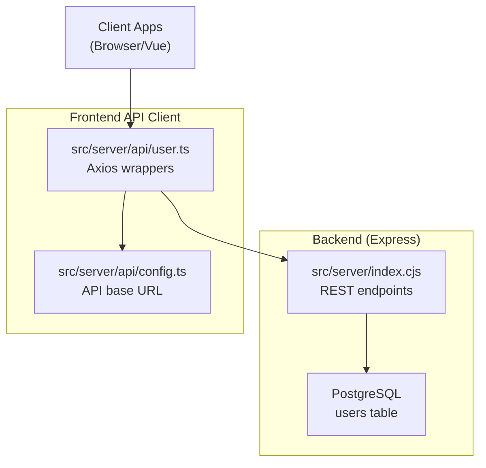
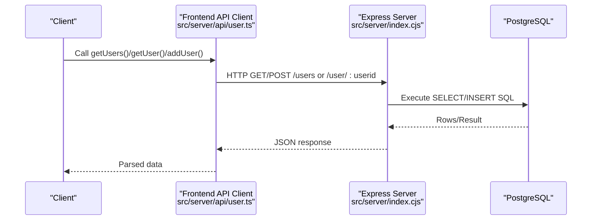
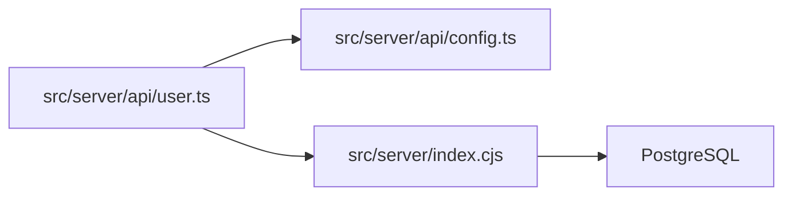

# User Management API

<cite>
**Referenced Files in This Document**
- [src/server/index.cjs](file://src/server/index.cjs)
- [src/server/api/user.ts](file://src/server/api/user.ts)
- [src/server/api/config.ts](file://src/server/api/config.ts)
- [src/db/init.sql](file://src/db/init.sql)
- [README.md](file://README.md)
</cite>

## Table of Contents
1. [Introduction](#introduction)
2. [Project Structure](#project-structure)
3. [Core Components](#core-components)
4. [Architecture Overview](#architecture-overview)
5. [Detailed Component Analysis](#detailed-component-analysis)
6. [Dependency Analysis](#dependency-analysis)
7. [Performance Considerations](#performance-considerations)
8. [Troubleshooting Guide](#troubleshooting-guide)
9. [Conclusion](#conclusion)
10. [Appendices](#appendices)

## Introduction
This document provides comprehensive API documentation for user management endpoints. It covers:
- Retrieving all users and creating new users via the /users endpoint
- Retrieving a specific user by ID via the /user/:userid endpoint
- Complete request/response schemas, status codes, and error handling patterns
- Authentication requirements, rate limiting considerations, and security headers
- Practical examples using curl commands and code snippets

The backend is a Node.js/Express server exposing REST endpoints backed by PostgreSQL. The frontend client consumes these endpoints through an Axios-based API client.

## Project Structure
The user management functionality spans the backend Express server and a frontend API client module.

**Diagram sources**
- [src/server/index.cjs:46-136](file://src/server/index.cjs#L46-L136)
- [src/server/api/user.ts:1-46](file://src/server/api/user.ts#L1-L46)
- [src/server/api/config.ts:1-19](file://src/server/api/config.ts#L1-L19)

**Section sources**
- [README.md:120-132](file://README.md#L120-L132)
- [src/server/index.cjs:46-136](file://src/server/index.cjs#L46-L136)
- [src/server/api/user.ts:1-46](file://src/server/api/user.ts#L1-L46)
- [src/server/api/config.ts:1-19](file://src/server/api/config.ts#L1-L19)

## Core Components
- Backend REST endpoints:
  - GET /users: Returns an array of user objects
  - POST /users: Creates a new user
  - GET /user/:userid: Returns a single user by ID
- Frontend API client:
  - getUsers(): Fetches all users
  - addUser(name, email): Creates a new user
  - getUser(id): Fetches a user by ID
- Database schema:
  - users table with id, name, email fields

**Section sources**
- [src/server/index.cjs:46-136](file://src/server/index.cjs#L46-L136)
- [src/server/api/user.ts:5-45](file://src/server/api/user.ts#L5-L45)
- [src/db/init.sql:6-10](file://src/db/init.sql#L6-L10)

## Architecture Overview
The frontend client communicates with the backend via Axios. The backend connects to PostgreSQL and exposes REST endpoints.

**Diagram sources**
- [src/server/api/user.ts:5-45](file://src/server/api/user.ts#L5-L45)
- [src/server/index.cjs:46-136](file://src/server/index.cjs#L46-L136)

## Detailed Component Analysis

### Endpoint: GET /users
- Purpose: Retrieve all users
- Response: Array of user objects
- Status codes:
  - 200 OK: Successful retrieval
  - 500 Internal Server Error: Database error

Response schema (array element):
- id: integer
- name: string
- email: string

curl example:
- curl -X GET http://localhost:3000/users

**Section sources**
- [src/server/index.cjs:46-54](file://src/server/index.cjs#L46-L54)
- [src/server/api/user.ts:5-15](file://src/server/api/user.ts#L5-L15)

### Endpoint: POST /users
- Purpose: Create a new user
- Request body:
  - name: string (required)
  - email: string (required)
- Response: Created user object
- Status codes:
  - 201 Created: User created successfully
  - 500 Internal Server Error: Database error

curl example:
- curl -X POST http://localhost:3000/users -H "Content-Type: application/json" -d '{"name":"John","email":"john@example.com"}'

**Section sources**
- [src/server/index.cjs:124-136](file://src/server/index.cjs#L124-L136)
- [src/server/api/user.ts:37-45](file://src/server/api/user.ts#L37-L45)

### Endpoint: GET /user/:userid
- Purpose: Retrieve a specific user by ID
- Path parameters:
  - userid: integer (required)
- Response: Single user object
- Status codes:
  - 200 OK: User found
  - 404 Not Found: User does not exist
  - 500 Internal Server Error: Database error

Response schema (object):
- id: integer
- name: string
- email: string
- avatar: string (optional)
- isAdmin: boolean (optional)
- isActive: boolean (optional)

curl example:
- curl -X GET http://localhost:3000/user/1

Notes:
- The backend returns id, name, email from the users table.
- The optional fields (avatar, isAdmin, isActive) are supported by the frontend client typing but are not persisted in the current users table schema.

**Section sources**
- [src/server/index.cjs:56-70](file://src/server/index.cjs#L56-L70)
- [src/server/api/user.ts:17-34](file://src/server/api/user.ts#L17-L34)
- [src/db/init.sql:6-10](file://src/db/init.sql#L6-L10)

### Frontend API Client Functions
- getUsers(): Returns Promise of array of { id, name, email }
- getUser(id): Returns Promise of { id, name, email, avatar?, isAdmin?, isActive? }
- addUser(name, email): Returns Promise of created user

These functions wrap Axios calls to the backend endpoints and forward responses to callers.

**Section sources**
- [src/server/api/user.ts:5-45](file://src/server/api/user.ts#L5-L45)

### Database Schema
Users table definition:
- id: SERIAL PRIMARY KEY
- name: VARCHAR(100)
- email: VARCHAR(100) UNIQUE NOT NULL

**Section sources**
- [src/db/init.sql:6-10](file://src/db/init.sql#L6-L10)

## Dependency Analysis
- Frontend API client depends on:
  - Axios for HTTP requests
  - Base URL configured in config.ts
- Backend depends on:
  - Express for routing
  - pg (node-postgres) for PostgreSQL connectivity
  - CORS middleware enabled globally

**Diagram sources**
- [src/server/api/user.ts:1-46](file://src/server/api/user.ts#L1-L46)
- [src/server/api/config.ts:1-19](file://src/server/api/config.ts#L1-L19)
- [src/server/index.cjs:30-44](file://src/server/index.cjs#L30-L44)

**Section sources**
- [src/server/api/user.ts:1-46](file://src/server/api/user.ts#L1-L46)
- [src/server/api/config.ts:1-19](file://src/server/api/config.ts#L1-L19)
- [src/server/index.cjs:9-10](file://src/server/index.cjs#L9-L10)

## Performance Considerations
- The /users endpoint performs a full table scan; consider adding an index on id if scaling to very large datasets.
- Parameterized queries are used to prevent SQL injection.
- No explicit rate limiting is implemented in the backend; consider adding rate limiting middleware for production deployments.

## Troubleshooting Guide
Common errors and resolutions:
- 404 Not Found when fetching a user by ID:
  - Cause: Non-existent user ID
  - Resolution: Verify the user exists or handle gracefully in the client
- 500 Internal Server Error:
  - Causes: Database connectivity issues, constraint violations, unhandled exceptions
  - Resolution: Check server logs, verify database credentials and connection string, ensure the users table exists
- Email uniqueness violation on POST /users:
  - Cause: Duplicate email address
  - Resolution: Change the email or handle the error in the client

**Section sources**
- [src/server/index.cjs:56-70](file://src/server/index.cjs#L56-L70)
- [src/server/index.cjs:124-136](file://src/server/index.cjs#L124-L136)

## Conclusion
The user management API provides essential CRUD operations for users with straightforward request/response schemas and clear status codes. The backend is simple and effective for small to medium workloads, while the frontend client encapsulates HTTP communication via Axios. For production, consider adding authentication, rate limiting, and input validation.

## Appendices

### Authentication Requirements
- Current implementation: No authentication is enforced by the backend.
- Recommendation: Add authentication middleware (e.g., JWT) and protect endpoints as needed.

### Security Headers
- Current implementation: CORS is enabled globally.
- Recommendation: Configure CORS policies to restrict origins and add security headers (e.g., Content-Security-Policy, X-Content-Type-Options).

### Rate Limiting Considerations
- Current implementation: None.
- Recommendation: Integrate a rate limiting solution (e.g., express-rate-limit) to protect against abuse.

### API Base URL
- The frontend API client uses http://localhost:3000 as the base URL. Adjust the API_URL constant in config.ts to match your deployment.

**Section sources**
- [src/server/api/config.ts:3](file://src/server/api/config.ts#L3)
- [README.md:125](file://README.md#L125)