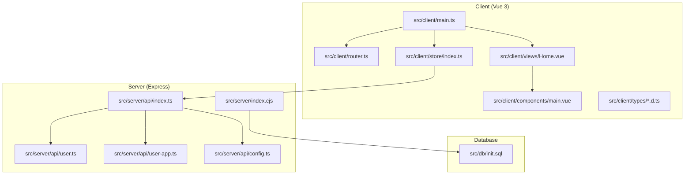
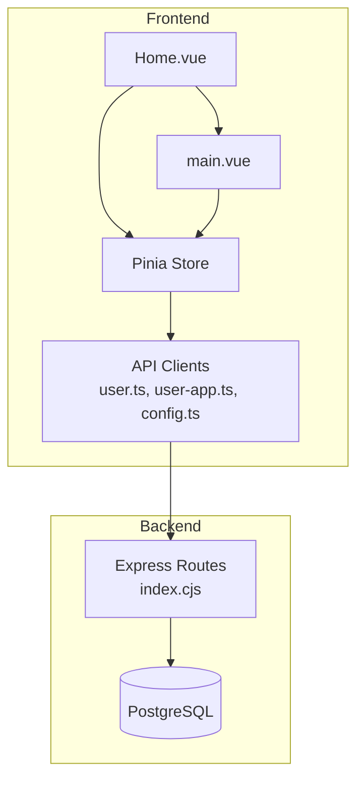
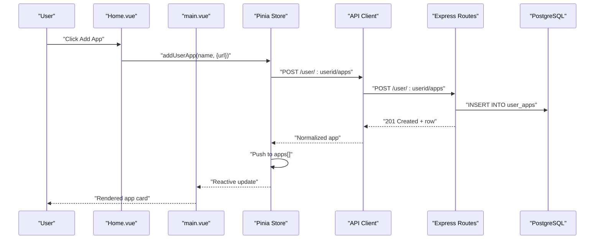
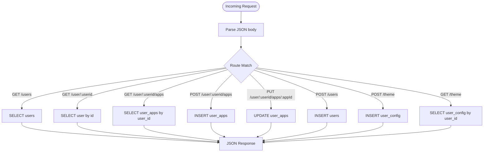
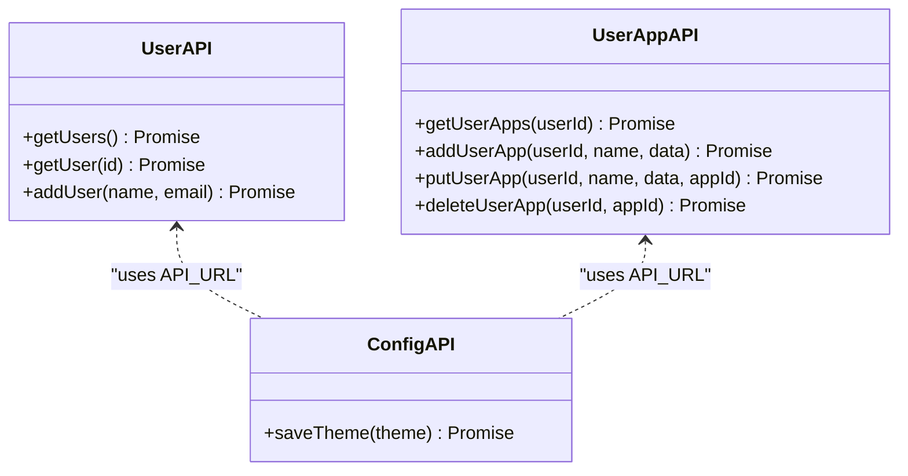
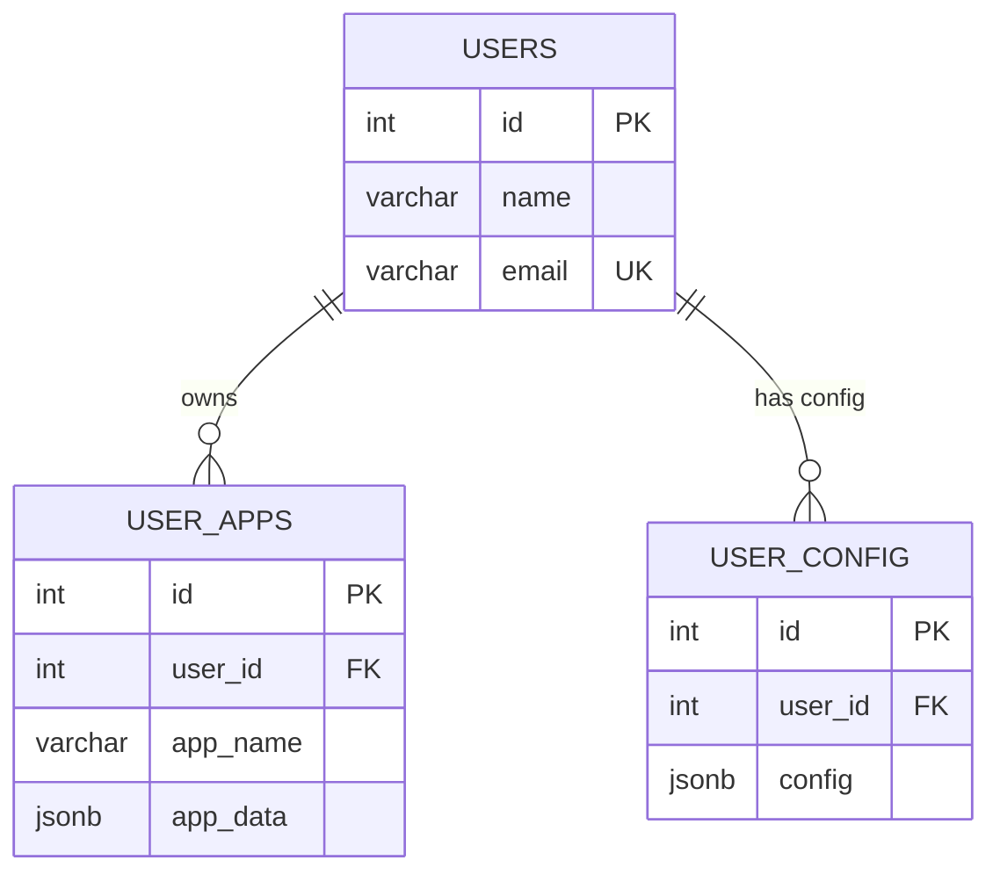
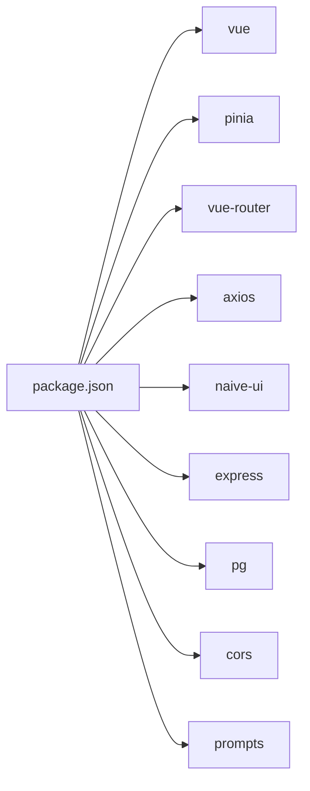
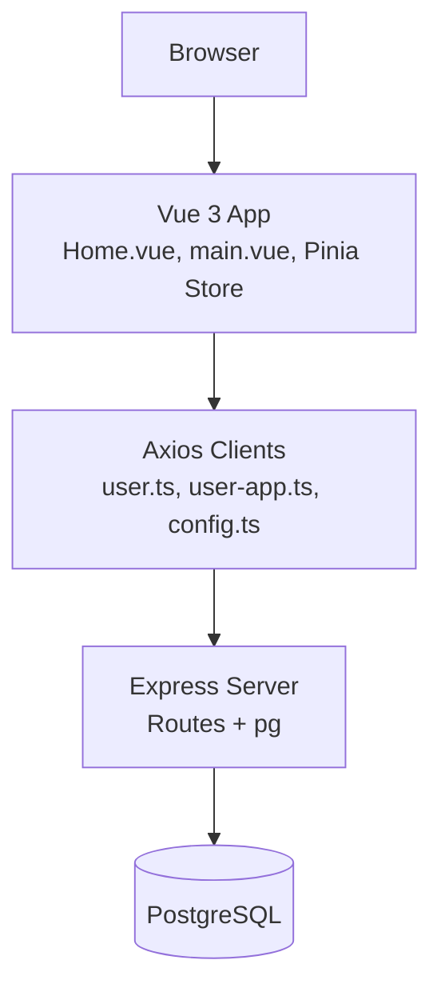

# Architecture Overview

<cite>
**Referenced Files in This Document**
- [README.md](file://README.md)
- [package.json](file://package.json)
- [src/client/main.ts](file://src/client/main.ts)
- [src/client/router.ts](file://src/client/router.ts)
- [src/client/store/index.ts](file://src/client/store/index.ts)
- [src/client/views/Home.vue](file://src/client/views/Home.vue)
- [src/client/components/main.vue](file://src/client/components/main.vue)
- [src/client/types/store.d.ts](file://src/client/types/store.d.ts)
- [src/client/types/user.d.ts](file://src/client/types/user.d.ts)
- [src/server/index.cjs](file://src/server/index.cjs)
- [src/server/api.ts](file://src/server/api.ts)
- [src/server/api/index.ts](file://src/server/api/index.ts)
- [src/server/api/config.ts](file://src/server/api/config.ts)
- [src/server/api/user.ts](file://src/server/api/user.ts)
- [src/server/api/user-app.ts](file://src/server/api/user-app.ts)
- [src/db/init.sql](file://src/db/init.sql)
</cite>

## Table of Contents
1. [Introduction](#introduction)
2. [Project Structure](#project-structure)
3. [Core Components](#core-components)
4. [Architecture Overview](#architecture-overview)
5. [Detailed Component Analysis](#detailed-component-analysis)
6. [Dependency Analysis](#dependency-analysis)
7. [Performance Considerations](#performance-considerations)
8. [Troubleshooting Guide](#troubleshooting-guide)
9. [Conclusion](#conclusion)
10. [Appendices](#appendices)

## Introduction
This document describes Startora’s full-stack architecture: a Vue 3 + TypeScript + Pinia frontend communicating with an Express.js backend over REST APIs. The backend persists data in PostgreSQL. The documentation explains component interactions, data flow from user actions through Vue components and Pinia to the API layer and Express server, and finally to the database. It also documents the MVC-style separation of concerns and system constraints.

## Project Structure
The repository is organized into three major areas:
- Frontend (Vue 3 + TypeScript + Pinia + Naive UI)
- Backend (Express + pg client)
- Database (PostgreSQL DDL)

**Diagram sources**
- [src/client/main.ts:1-11](file://src/client/main.ts#L1-L11)
- [src/client/router.ts:1-24](file://src/client/router.ts#L1-L24)
- [src/client/store/index.ts:1-91](file://src/client/store/index.ts#L1-L91)
- [src/client/views/Home.vue:1-62](file://src/client/views/Home.vue#L1-L62)
- [src/client/components/main.vue:1-109](file://src/client/components/main.vue#L1-L109)
- [src/server/index.cjs:1-173](file://src/server/index.cjs#L1-L173)
- [src/server/api/index.ts:1-4](file://src/server/api/index.ts#L1-L4)
- [src/server/api/user.ts:1-46](file://src/server/api/user.ts#L1-L46)
- [src/server/api/user-app.ts:1-73](file://src/server/api/user-app.ts#L1-L73)
- [src/server/api/config.ts:1-19](file://src/server/api/config.ts#L1-L19)
- [src/db/init.sql:1-26](file://src/db/init.sql#L1-L26)

**Section sources**
- [README.md:33-56](file://README.md#L33-L56)
- [package.json:1-31](file://package.json#L1-L31)

## Core Components
- Frontend entry and bootstrapping
  - Application bootstrap initializes Vue, Pinia, routing, and UI library.
  - Router defines two routes: Home and Login.
- State management (Pinia)
  - Centralized store manages session, theme, and user apps.
  - Actions orchestrate API calls and local storage synchronization.
- Views and components
  - Home view wires user input to store actions.
  - Main component renders apps and opens edit modal.
- API layer (frontend)
  - Axios-based clients for users, user apps, and theme configuration.
  - API base URL configured for localhost:3000.
- Backend (Express)
  - JSON parsing middleware and CORS enabled.
  - Routes for users, user apps, and theme configuration.
  - PostgreSQL connection via pg client with runtime credential prompting.
- Database
  - Initialization script creates users, user_config, and user_apps tables.

**Section sources**
- [src/client/main.ts:1-11](file://src/client/main.ts#L1-L11)
- [src/client/router.ts:1-24](file://src/client/router.ts#L1-L24)
- [src/client/store/index.ts:1-91](file://src/client/store/index.ts#L1-L91)
- [src/client/views/Home.vue:1-62](file://src/client/views/Home.vue#L1-L62)
- [src/client/components/main.vue:1-109](file://src/client/components/main.vue#L1-L109)
- [src/server/api.ts:1-2](file://src/server/api.ts#L1-L2)
- [src/server/api/index.ts:1-4](file://src/server/api/index.ts#L1-L4)
- [src/server/api/config.ts:1-19](file://src/server/api/config.ts#L1-L19)
- [src/server/api/user.ts:1-46](file://src/server/api/user.ts#L1-L46)
- [src/server/api/user-app.ts:1-73](file://src/server/api/user-app.ts#L1-L73)
- [src/server/index.cjs:1-173](file://src/server/index.cjs#L1-L173)
- [src/db/init.sql:1-26](file://src/db/init.sql#L1-L26)

## Architecture Overview
Startora follows a classic layered architecture:
- Presentation Layer (View): Vue components render UI and capture user events.
- Application Layer (State/Actions): Pinia store encapsulates business logic and orchestrates API interactions.
- API Abstraction Layer (Axios clients): Encapsulate REST endpoints and normalize responses.
- Service Layer (Controller): Express routes handle HTTP requests and delegate to database operations.
- Persistence Layer (Model): PostgreSQL tables store user profiles, configurations, and app shortcuts.

**Diagram sources**
- [src/client/views/Home.vue:1-62](file://src/client/views/Home.vue#L1-L62)
- [src/client/components/main.vue:1-109](file://src/client/components/main.vue#L1-L109)
- [src/client/store/index.ts:1-91](file://src/client/store/index.ts#L1-L91)
- [src/server/api/user.ts:1-46](file://src/server/api/user.ts#L1-L46)
- [src/server/api/user-app.ts:1-73](file://src/server/api/user-app.ts#L1-L73)
- [src/server/api/config.ts:1-19](file://src/server/api/config.ts#L1-L19)
- [src/server/index.cjs:1-173](file://src/server/index.cjs#L1-L173)
- [src/db/init.sql:1-26](file://src/db/init.sql#L1-L26)

## Detailed Component Analysis

### Frontend: Vue Components and Pinia Store
- Home view
  - Wires user input to store actions for adding apps.
  - Initializes store on mount.
- Main component
  - Renders user apps and opens an edit modal.
  - Calls store action to update an existing app.
- Pinia store
  - Manages session, theme, and apps arrays.
  - Actions:
    - init: loads session and apps.
    - initSession: prefers localStorage, falls back to API.
    - initApps: fetches user apps.
    - updateTheme: persists theme via API.
    - addUserApp: posts new app and updates local list.
    - putUserApp: updates an existing app and refreshes list.

**Diagram sources**
- [src/client/views/Home.vue:14-26](file://src/client/views/Home.vue#L14-L26)
- [src/client/components/main.vue:13-25](file://src/client/components/main.vue#L13-L25)
- [src/client/store/index.ts:63-88](file://src/client/store/index.ts#L63-L88)
- [src/server/api/user-app.ts:19-39](file://src/server/api/user-app.ts#L19-L39)
- [src/server/index.cjs:86-103](file://src/server/index.cjs#L86-L103)
- [src/db/init.sql:19-25](file://src/db/init.sql#L19-L25)

**Section sources**
- [src/client/views/Home.vue:1-62](file://src/client/views/Home.vue#L1-L62)
- [src/client/components/main.vue:1-109](file://src/client/components/main.vue#L1-L109)
- [src/client/store/index.ts:1-91](file://src/client/store/index.ts#L1-L91)

### Backend: Express Routes and Data Access
- Routes
  - GET /users, GET /user/:userid
  - GET /user/:userid/apps
  - POST /user/:userid/apps
  - PUT /user/:userid/apps/:appId
  - POST /users
  - POST /theme, GET /theme
- Data access
  - Uses pg Client connected to PostgreSQL.
  - Environment-driven configuration with runtime prompt fallback.
- CORS and JSON parsing
  - Enabled globally for development convenience.

**Diagram sources**
- [src/server/index.cjs:46-164](file://src/server/index.cjs#L46-L164)

**Section sources**
- [src/server/index.cjs:1-173](file://src/server/index.cjs#L1-L173)

### API Layer: Frontend Axios Clients
- Users
  - getUsers, getUser, addUser
- User Apps
  - getUserApps, addUserApp, putUserApp, deleteUserApp
- Theme
  - saveTheme (POST /theme)
- Base URL
  - http://localhost:3000

**Diagram sources**
- [src/server/api/user.ts:1-46](file://src/server/api/user.ts#L1-L46)
- [src/server/api/user-app.ts:1-73](file://src/server/api/user-app.ts#L1-L73)
- [src/server/api/config.ts:1-19](file://src/server/api/config.ts#L1-L19)

**Section sources**
- [src/server/api/user.ts:1-46](file://src/server/api/user.ts#L1-L46)
- [src/server/api/user-app.ts:1-73](file://src/server/api/user-app.ts#L1-L73)
- [src/server/api/config.ts:1-19](file://src/server/api/config.ts#L1-L19)

### Database Schema
- users: id, name, email
- user_config: id, user_id → users.id, config JSONB
- user_apps: id, user_id → users.id, app_name, app_data JSONB

**Diagram sources**
- [src/db/init.sql:6-25](file://src/db/init.sql#L6-L25)

**Section sources**
- [src/db/init.sql:1-26](file://src/db/init.sql#L1-L26)

## Dependency Analysis
- Frontend depends on:
  - Vue 3 runtime and router
  - Pinia for state management
  - Axios for HTTP
  - Naive UI for components
- Backend depends on:
  - Express for HTTP
  - pg for PostgreSQL connectivity
  - prompts for runtime credentials
- Build and tooling:
  - Vite for dev/build
  - TypeScript for type checking

**Diagram sources**
- [package.json:12-29](file://package.json#L12-L29)

**Section sources**
- [package.json:1-31](file://package.json#L1-L31)

## Performance Considerations
- Network round trips
  - Each store action triggers one or more API calls; batching or optimistic updates could reduce perceived latency.
- Database queries
  - Current queries are simple; ensure appropriate indexing on foreign keys (user_id) for scalability.
- Frontend rendering
  - Reactive lists update efficiently; avoid unnecessary reactivity by normalizing data and minimizing deep object mutations.
- CORS and middleware
  - Global CORS enabled for development; restrict origins in production and add rate limiting.

## Troubleshooting Guide
- Backend connection
  - If PostgreSQL connection fails, confirm environment variables or enter password at runtime prompt.
- API base URL mismatch
  - Ensure frontend API clients target the same host/port as the backend server.
- Session initialization
  - If session is missing, verify that a user exists and that the first user is selected by the store initializer.
- CORS errors
  - Confirm that the backend enables CORS and that the frontend origin matches expectations.

**Section sources**
- [src/server/index.cjs:12-44](file://src/server/index.cjs#L12-L44)
- [src/server/api/config.ts:3-3](file://src/server/api/config.ts#L3-L3)
- [src/client/store/index.ts:24-47](file://src/client/store/index.ts#L24-L47)

## Conclusion
Startora’s architecture cleanly separates concerns across layers:
- View (Vue components) captures user intent.
- State (Pinia) coordinates actions and side effects.
- API clients abstract REST endpoints.
- Controller (Express routes) mediates HTTP and database operations.
- Model (PostgreSQL) persists structured data.

This design supports incremental enhancements such as typed API responses, centralized error handling, and improved caching strategies.

## Appendices

### System Context Diagram

**Diagram sources**
- [src/client/views/Home.vue:1-62](file://src/client/views/Home.vue#L1-L62)
- [src/client/components/main.vue:1-109](file://src/client/components/main.vue#L1-L109)
- [src/client/store/index.ts:1-91](file://src/client/store/index.ts#L1-L91)
- [src/server/api/user.ts:1-46](file://src/server/api/user.ts#L1-L46)
- [src/server/api/user-app.ts:1-73](file://src/server/api/user-app.ts#L1-L73)
- [src/server/api/config.ts:1-19](file://src/server/api/config.ts#L1-L19)
- [src/server/index.cjs:1-173](file://src/server/index.cjs#L1-L173)
- [src/db/init.sql:1-26](file://src/db/init.sql#L1-L26)