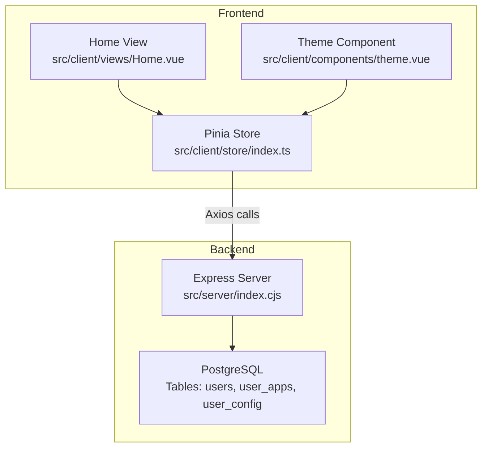
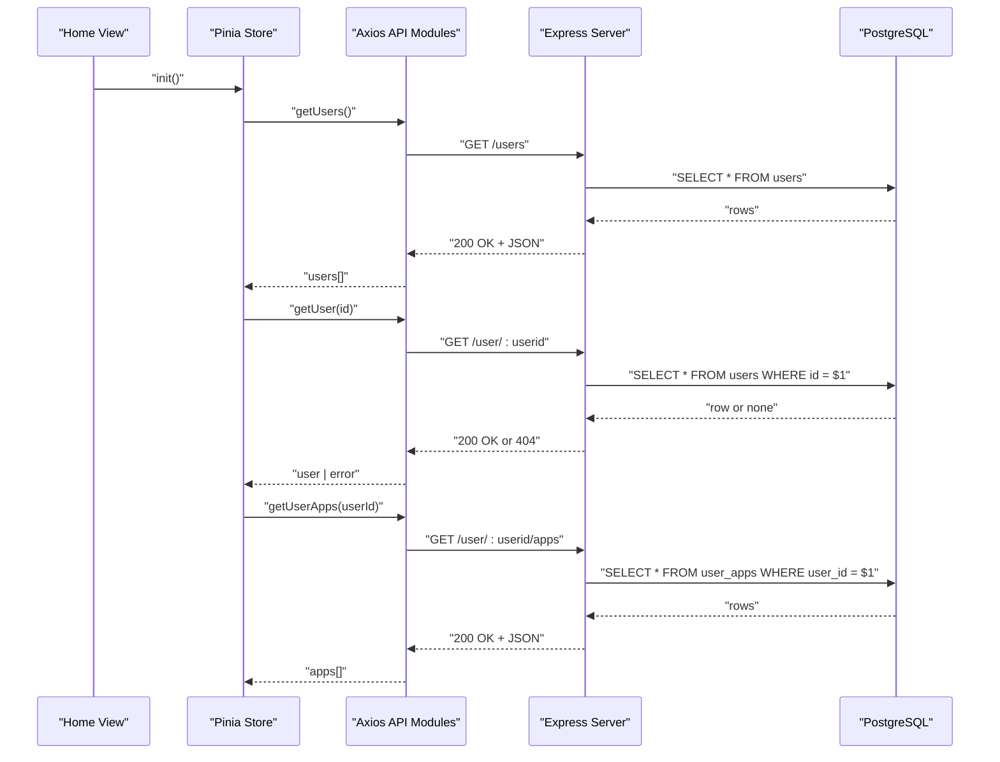
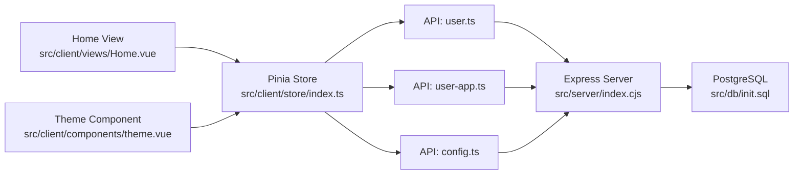
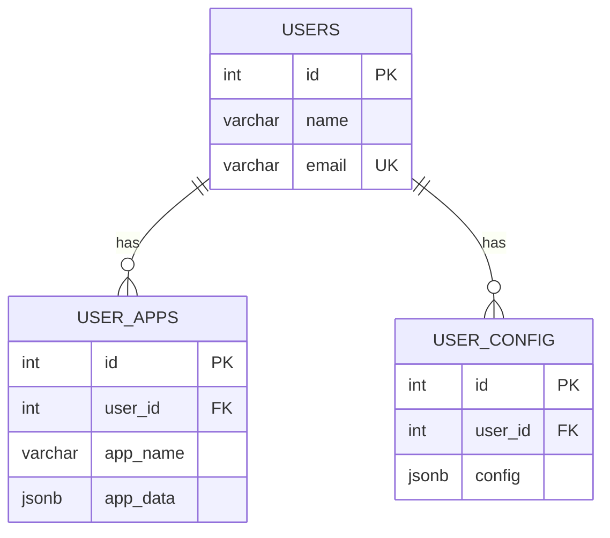

# API Endpoints

<cite>
**Referenced Files in This Document**
- [index.cjs](file://src/server/index.cjs)
- [init.sql](file://src/db/init.sql)
- [user.ts](file://src/server/api/user.ts)
- [user-app.ts](file://src/server/api/user-app.ts)
- [config.ts](file://src/server/api/config.ts)
- [index.ts](file://src/server/api/index.ts)
- [api.ts](file://src/server/api.ts)
- [store/index.ts](file://src/client/store/index.ts)
- [views/Home.vue](file://src/client/views/Home.vue)
- [components/theme.vue](file://src/client/components/theme.vue)
- [types/store.d.ts](file://src/client/types/store.d.ts)
- [types/user.d.ts](file://src/client/types/user.d.ts)
</cite>

## Table of Contents
1. [Introduction](#introduction)
2. [Project Structure](#project-structure)
3. [Core Components](#core-components)
4. [Architecture Overview](#architecture-overview)
5. [Detailed Component Analysis](#detailed-component-analysis)
6. [Dependency Analysis](#dependency-analysis)
7. [Performance Considerations](#performance-considerations)
8. [Troubleshooting Guide](#troubleshooting-guide)
9. [Conclusion](#conclusion)
10. [Appendices](#appendices)

## Introduction
This document provides comprehensive API documentation for the backend server exposing REST endpoints used by the application. It covers:
- User management endpoints
- Application management endpoints per user
- Theme configuration endpoints
For each endpoint, we specify HTTP methods, URL patterns, request/response schemas, parameter validation, error responses, and practical usage examples. We also describe authentication requirements, rate limiting considerations, and integration patterns with the frontend application.

## Project Structure
The backend is implemented as a small Express server that exposes REST endpoints backed by a PostgreSQL database. The frontend integrates with the backend via Axios-based API modules exported from the server-side API layer.

**Diagram sources**
- [index.cjs:12-173](file://src/server/index.cjs#L12-L173)
- [init.sql:6-25](file://src/db/init.sql#L6-L25)
- [store/index.ts:1-91](file://src/client/store/index.ts#L1-L91)

**Section sources**
- [index.cjs:12-173](file://src/server/index.cjs#L12-L173)
- [init.sql:6-25](file://src/db/init.sql#L6-L25)

## Core Components
- Backend server: Express-based HTTP server with CORS enabled and JSON body parsing middleware.
- Database: PostgreSQL with three tables:
  - users: stores user identity
  - user_apps: stores per-user application entries
  - user_config: stores per-user configuration (theme)
- Frontend integration: Axios-based API modules under src/server/api export functions that the frontend Pinia store consumes.

Key behaviors:
- Authentication: No authentication middleware is present in the backend; all endpoints are public.
- Rate limiting: Not implemented in the backend.
- Validation: Minimal validation is performed; the backend relies on database constraints and basic checks.

**Section sources**
- [index.cjs:9-11](file://src/server/index.cjs#L9-L11)
- [index.cjs:46-164](file://src/server/index.cjs#L46-L164)
- [init.sql:6-25](file://src/db/init.sql#L6-L25)

## Architecture Overview
The frontend interacts with the backend through Axios-based API modules. The Pinia store orchestrates data fetching and updates, while the UI components trigger actions.

**Diagram sources**
- [store/index.ts:20-57](file://src/client/store/index.ts#L20-L57)
- [user.ts:4-34](file://src/server/api/user.ts#L4-L34)
- [user-app.ts:4-17](file://src/server/api/user-app.ts#L4-L17)
- [index.cjs:46-84](file://src/server/index.cjs#L46-L84)

## Detailed Component Analysis

### User Management Endpoints

#### GET /users
- Description: Retrieve all users.
- Method: GET
- URL: /users
- Authentication: None
- Request: No body
- Response:
  - 200 OK: Array of user objects
  - 500 Internal Server Error: Error object
- Schema:
  - Array item: { id: number, name: string, email: string }
- Validation: None
- Example request:
  - curl -X GET http://localhost:3000/users
- Example response:
  - [
      { "id": 1, "name": "Alice", "email": "alice@example.com" },
      { "id": 2, "name": "Bob", "email": "bob@example.com" }
    ]

**Section sources**
- [index.cjs:46-54](file://src/server/index.cjs#L46-L54)
- [user.ts:4-15](file://src/server/api/user.ts#L4-L15)

#### GET /user/:userid
- Description: Retrieve a single user by ID.
- Method: GET
- URL: /user/:userid
- Path parameters:
  - userid: number (required)
- Authentication: None
- Request: No body
- Response:
  - 200 OK: User object
  - 404 Not Found: Error object
  - 500 Internal Server Error: Error object
- Schema:
  - { id: number, name: string, email: string, avatar?: string, isAdmin?: boolean, isActive?: boolean }
- Validation: Path parameter must be a number; backend returns 404 if not found.
- Example request:
  - curl -X GET http://localhost:3000/user/1
- Example response:
  - { "id": 1, "name": "Alice", "email": "alice@example.com" }

**Section sources**
- [index.cjs:56-70](file://src/server/index.cjs#L56-L70)
- [user.ts:17-34](file://src/server/api/user.ts#L17-L34)

#### POST /users
- Description: Add a new user.
- Method: POST
- URL: /users
- Authentication: None
- Request body:
  - name: string (required)
  - email: string (required)
- Response:
  - 201 Created: New user object
  - 500 Internal Server Error: Error object
- Schema:
  - { id: number, name: string, email: string }
- Validation: Backend inserts with provided fields; uniqueness enforced by DB.
- Example request:
  - curl -X POST http://localhost:3000/users -H "Content-Type: application/json" -d '{"name":"Charlie","email":"charlie@example.com"}'
- Example response:
  - { "id": 3, "name": "Charlie", "email": "charlie@example.com" }

**Section sources**
- [index.cjs:124-136](file://src/server/index.cjs#L124-L136)
- [user.ts:36-45](file://src/server/api/user.ts#L36-L45)

### Application Management Endpoints

#### GET /user/:userid/apps
- Description: List all applications for a given user.
- Method: GET
- URL: /user/:userid/apps
- Path parameters:
  - userid: number (required)
- Authentication: None
- Request: No body
- Response:
  - 200 OK: Array of app objects
  - 500 Internal Server Error: Error object
- Schema:
  - Array item: { id: number, app_name: string, app_data: any }
- Validation: Path parameter must be a number.
- Example request:
  - curl -X GET http://localhost:3000/user/1/apps
- Example response:
  - [
      { "id": 101, "app_name": "Calendar", "app_data": { "url": "https://calendar.example.com" } },
      { "id": 102, "app_name": "Drive", "app_data": { "url": "https://drive.example.com" } }
    ]

**Section sources**
- [index.cjs:72-84](file://src/server/index.cjs#L72-L84)
- [user-app.ts:4-17](file://src/server/api/user-app.ts#L4-L17)

#### POST /user/:userid/apps
- Description: Add a new application for a user.
- Method: POST
- URL: /user/:userid/apps
- Path parameters:
  - userid: number (required)
- Authentication: None
- Request body:
  - appName: string (required)
  - appData: any (required)
- Response:
  - 201 Created: Newly inserted app object
  - 500 Internal Server Error: Error object
- Schema:
  - { id: number, app_name: string, app_data: any }
- Validation: Path parameter must be a number; app_data is stored as JSONB.
- Example request:
  - curl -X POST http://localhost:3000/user/1/apps -H "Content-Type: application/json" -d '{"appName":"Notes","appData":{"url":"https://notes.example.com"}}'
- Example response:
  - { "id": 103, "app_name": "Notes", "app_data": { "url": "https://notes.example.com" } }

**Section sources**
- [index.cjs:86-103](file://src/server/index.cjs#L86-L103)
- [user-app.ts:19-39](file://src/server/api/user-app.ts#L19-L39)

#### PUT /user/:userid/apps/:appId
- Description: Update an existing application for a user.
- Method: PUT
- URL: /user/:userid/apps/:appId
- Path parameters:
  - userid: number (required)
  - appId: number (required)
- Authentication: None
- Request body:
  - appName: string (required)
  - appData: any (required)
- Response:
  - 200 OK: Updated app object
  - 404 Not Found: Error object
  - 500 Internal Server Error: Error object
- Schema:
  - { id: number, app_name: string, app_data: any }
- Validation: Path parameters must be numbers; backend returns 404 if not found.
- Example request:
  - curl -X PUT http://localhost:3000/user/1/apps/103 -H "Content-Type: application/json" -d '{"appName":"Notes Pro","appData":{"url":"https://notes-pro.example.com"}}'
- Example response:
  - { "id": 103, "app_name": "Notes Pro", "app_data": { "url": "https://notes-pro.example.com" } }

**Section sources**
- [index.cjs:105-122](file://src/server/index.cjs#L105-L122)
- [user-app.ts:41-60](file://src/server/api/user-app.ts#L41-L60)

#### DELETE /user/:userid/apps/:appId
- Description: Delete an application for a user.
- Method: DELETE
- URL: /user/:userid/apps/:appId
- Path parameters:
  - userid: number (required)
  - appId: number (required)
- Authentication: None
- Request: No body
- Response:
  - 200 OK: Success
  - 500 Internal Server Error: Error object
- Validation: Path parameters must be numbers.
- Example request:
  - curl -X DELETE http://localhost:3000/user/1/apps/103

Note: The delete endpoint is defined in the frontend API module but not exposed by the backend server. It is not documented here as it is not callable.

**Section sources**
- [user-app.ts:62-72](file://src/server/api/user-app.ts#L62-L72)
- [index.cjs:86-122](file://src/server/index.cjs#L86-L122)

### Theme Configuration Endpoints

#### POST /theme
- Description: Save theme configuration for a user.
- Method: POST
- URL: /theme
- Authentication: None
- Request body:
  - user_id: number (required)
  - theme: object (required)
    - primary: string (required)
    - accent: string (required)
    - background: string (required)
- Response:
  - 201 Created: New configuration object
  - 500 Internal Server Error: Error object
- Schema:
  - { id: number, user_id: number, config: { primary: string, accent: string, background: string } }
- Validation: user_id must be a number; theme fields are stored as JSONB.
- Example request:
  - curl -X POST http://localhost:3000/theme -H "Content-Type: application/json" -d '{"user_id":1,"theme":{"primary":"#0000ff","accent":"#ff0000","background":"#ffffff"}}'
- Example response:
  - { "id": 1, "user_id": 1, "config": { "primary": "#0000ff", "accent": "#ff0000", "background": "#ffffff" } }

**Section sources**
- [index.cjs:138-150](file://src/server/index.cjs#L138-L150)
- [config.ts:5-18](file://src/server/api/config.ts#L5-L18)

#### GET /theme
- Description: Retrieve theme configuration for a user.
- Method: GET
- URL: /theme
- Query parameters:
  - user_id: number (required)
- Authentication: None
- Request: No body
- Response:
  - 200 OK: Array of configuration objects
  - 500 Internal Server Error: Error object
- Schema:
  - Array item: { id: number, user_id: number, config: { primary: string, accent: string, background: string } }
- Validation: user_id must be a number.
- Example request:
  - curl -X GET 'http://localhost:3000/theme?user_id=1'
- Example response:
  - [
      { "id": 1, "user_id": 1, "config": { "primary": "#0000ff", "accent": "#ff0000", "background": "#ffffff" } }
    ]

**Section sources**
- [index.cjs:152-164](file://src/server/index.cjs#L152-L164)
- [config.ts:5-18](file://src/server/api/config.ts#L5-L18)

## Dependency Analysis
The frontend depends on Axios-based API modules that wrap the backend endpoints. The store coordinates initialization, user sessions, app lists, and theme updates.

**Diagram sources**
- [views/Home.vue:14-30](file://src/client/views/Home.vue#L14-L30)
- [components/theme.vue:11-21](file://src/client/components/theme.vue#L11-L21)
- [store/index.ts:19-89](file://src/client/store/index.ts#L19-L89)
- [user.ts:1-46](file://src/server/api/user.ts#L1-L46)
- [user-app.ts:1-73](file://src/server/api/user-app.ts#L1-L73)
- [config.ts:1-19](file://src/server/api/config.ts#L1-L19)
- [index.cjs:46-164](file://src/server/index.cjs#L46-L164)
- [init.sql:6-25](file://src/db/init.sql#L6-L25)

**Section sources**
- [store/index.ts:19-89](file://src/client/store/index.ts#L19-L89)
- [user.ts:1-46](file://src/server/api/user.ts#L1-L46)
- [user-app.ts:1-73](file://src/server/api/user-app.ts#L1-L73)
- [config.ts:1-19](file://src/server/api/config.ts#L1-L19)
- [index.cjs:46-164](file://src/server/index.cjs#L46-L164)
- [init.sql:6-25](file://src/db/init.sql#L6-L25)

## Performance Considerations
- Database queries are executed synchronously; consider connection pooling and query optimization for production.
- No caching layer is implemented; repeated reads can be mitigated by frontend caching or backend caching strategies.
- JSON parsing overhead is minimal; avoid excessively large app_data payloads.
- Consider adding pagination for /users and /user/:userid/apps when datasets grow large.

## Troubleshooting Guide
Common issues and resolutions:
- 404 Not Found on GET /user/:userid
  - Cause: Non-existent user ID.
  - Resolution: Ensure the user exists before querying.
- 404 Not Found on PUT /user/:userid/apps/:appId
  - Cause: Non-existent app ID or mismatched user ID.
  - Resolution: Verify both IDs and ownership.
- 500 Internal Server Error
  - Cause: Database errors or unhandled exceptions.
  - Resolution: Check server logs and database connectivity.
- CORS errors
  - Cause: Cross-origin requests blocked.
  - Resolution: Confirm CORS middleware is enabled and origins match.

**Section sources**
- [index.cjs:56-70](file://src/server/index.cjs#L56-L70)
- [index.cjs:105-122](file://src/server/index.cjs#L105-L122)
- [index.cjs:38-44](file://src/server/index.cjs#L38-L44)

## Conclusion
The backend exposes straightforward REST endpoints for user management, application management per user, and theme configuration. The frontend integrates with these endpoints via Axios-based API modules and a centralized Pinia store. Authentication and rate limiting are not implemented; deployers should consider adding security measures appropriate to their environment.

## Appendices

### Endpoint Reference Summary

- Users
  - GET /users → 200: array of users
  - GET /user/:userid → 200: user or 404
  - POST /users → 201: new user

- User Apps
  - GET /user/:userid/apps → 200: array of apps
  - POST /user/:userid/apps → 201: new app
  - PUT /user/:userid/apps/:appId → 200 or 404
  - DELETE /user/:userid/apps/:appId → 200

- Theme
  - POST /theme → 201: new config
  - GET /theme → 200: array of configs

**Section sources**
- [index.cjs:46-164](file://src/server/index.cjs#L46-L164)
- [user-app.ts:4-72](file://src/server/api/user-app.ts#L4-L72)
- [config.ts:5-18](file://src/server/api/config.ts#L5-L18)

### Data Models

**Diagram sources**
- [init.sql:6-25](file://src/db/init.sql#L6-L25)

### Frontend Integration Patterns
- Initialization flow:
  - On mount, the store initializes session and apps by calling backend APIs.
- Adding an app:
  - The Home view collects inputs and delegates to the store, which calls the backend and refreshes the app list.
- Theme updates:
  - The Theme component triggers local state updates and persists to the backend via the store.

**Section sources**
- [store/index.ts:20-57](file://src/client/store/index.ts#L20-L57)
- [views/Home.vue:14-30](file://src/client/views/Home.vue#L14-L30)
- [components/theme.vue:11-21](file://src/client/components/theme.vue#L11-L21)