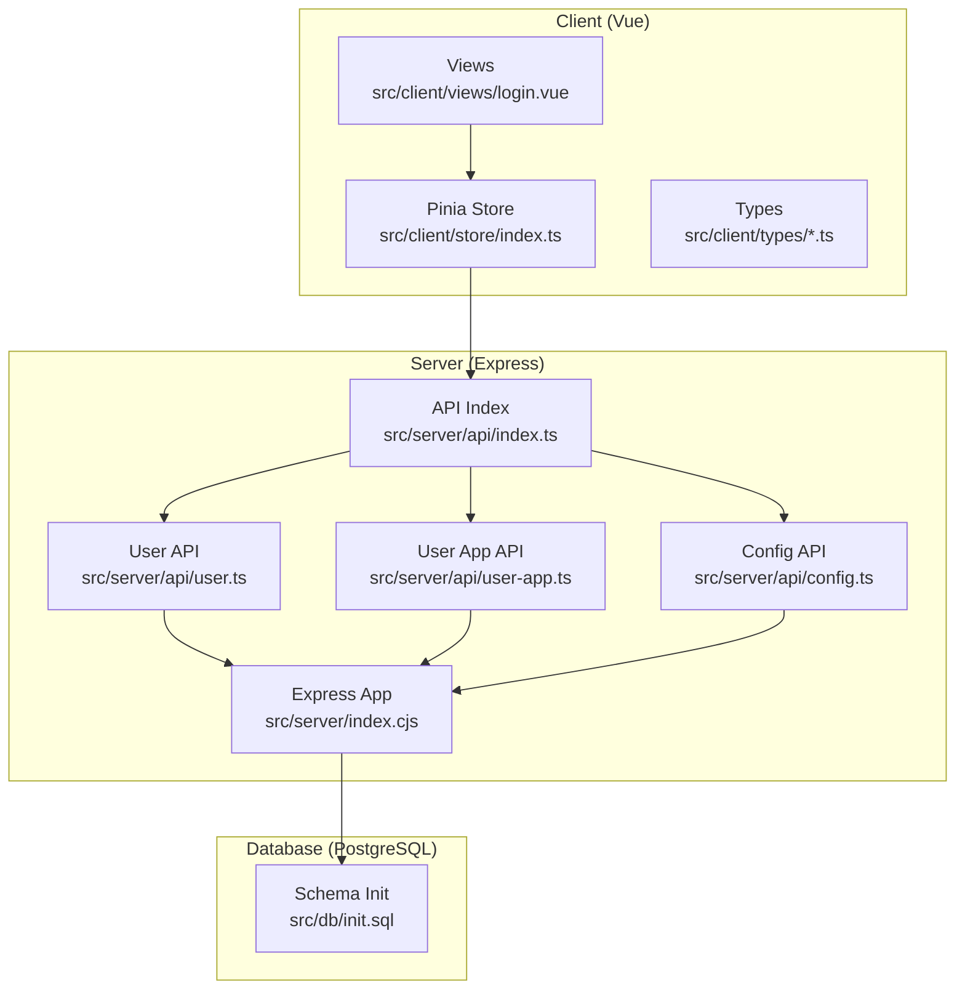
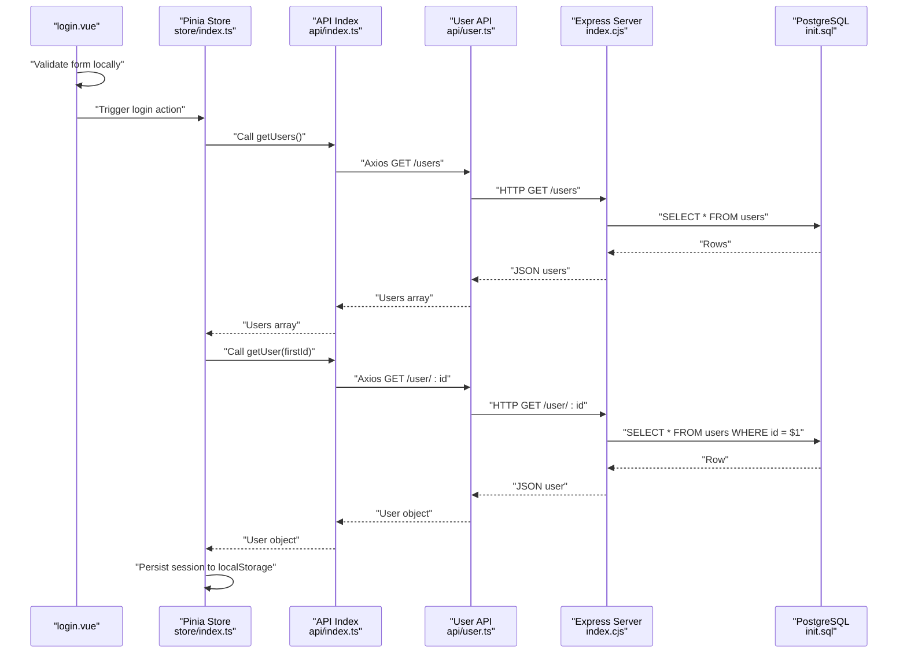
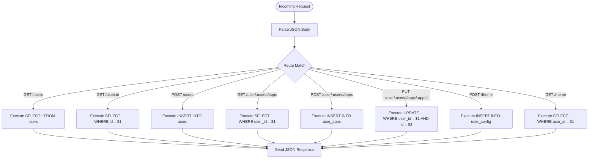
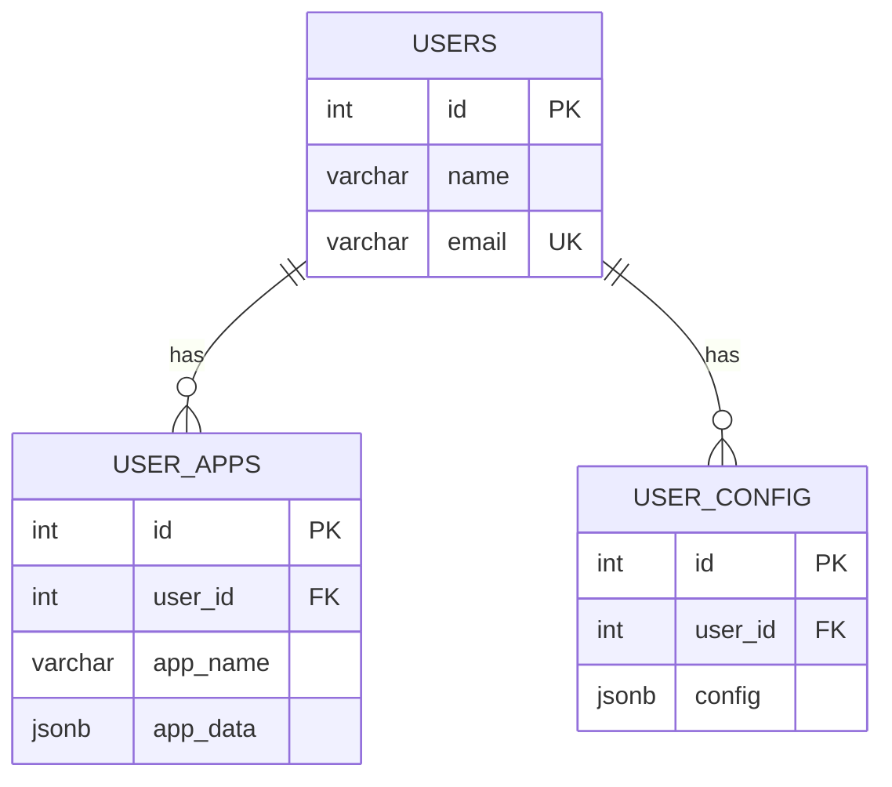
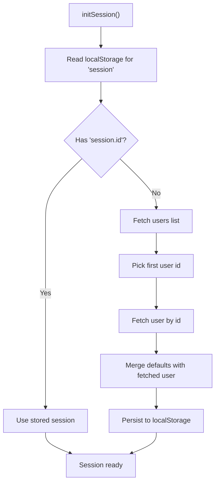
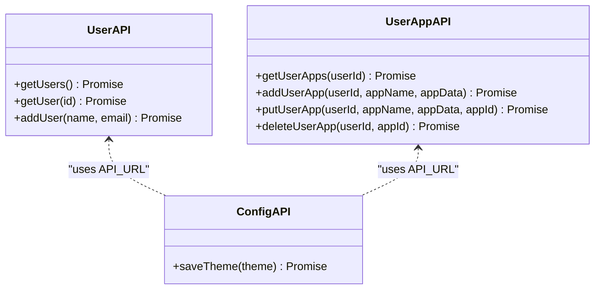
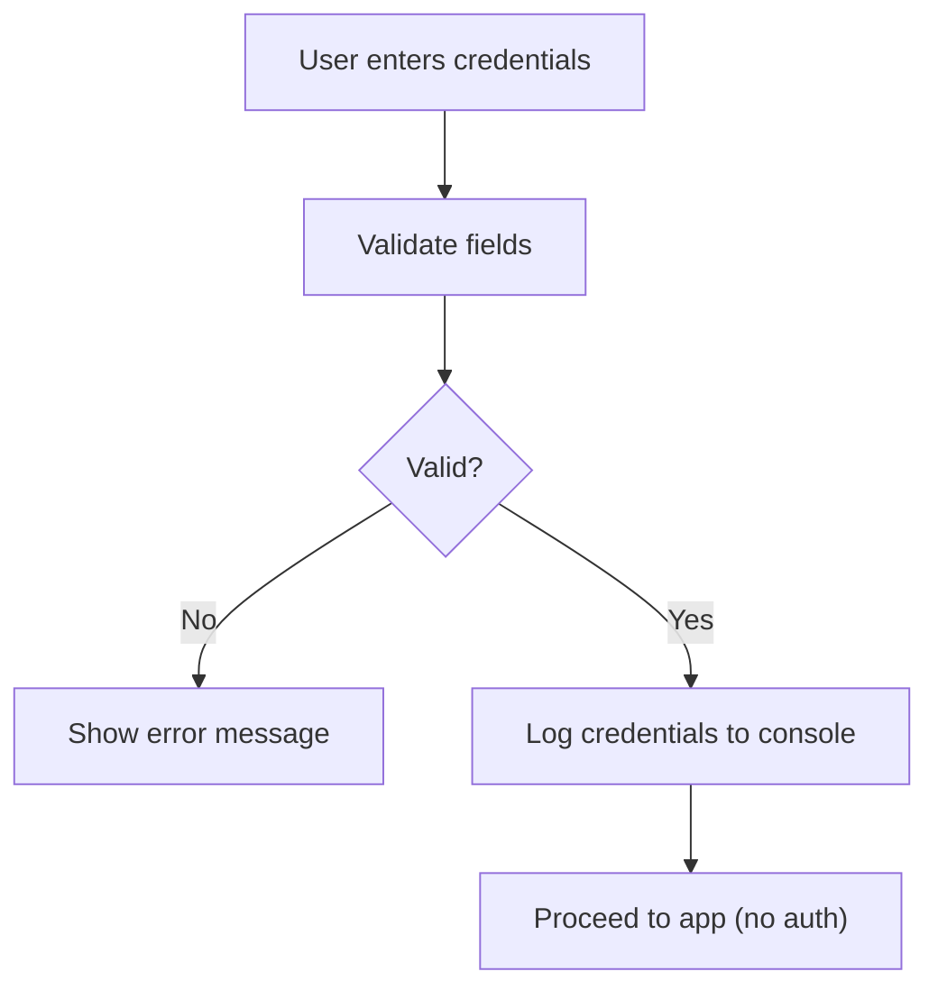
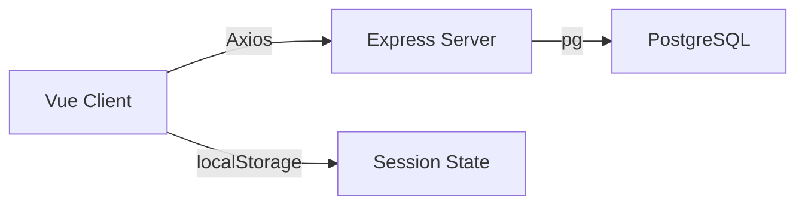

# Authentication & Authorization

<cite>
**Referenced Files in This Document**
- [index.cjs](file://src/server/index.cjs)
- [init.sql](file://src/db/init.sql)
- [api.ts](file://src/server/api.ts)
- [api/index.ts](file://src/server/api/index.ts)
- [api/config.ts](file://src/server/api/config.ts)
- [api/user.ts](file://src/server/api/user.ts)
- [api/user-app.ts](file://src/server/api/user-app.ts)
- [store/index.ts](file://src/client/store/index.ts)
- [types/store.d.ts](file://src/client/types/store.d.ts)
- [types/user.d.ts](file://src/client/types/user.d.ts)
- [login.vue](file://src/client/views/login.vue)
- [package.json](file://package.json)
</cite>

## Table of Contents
1. [Introduction](#introduction)
2. [Project Structure](#project-structure)
3. [Core Components](#core-components)
4. [Architecture Overview](#architecture-overview)
5. [Detailed Component Analysis](#detailed-component-analysis)
6. [Dependency Analysis](#dependency-analysis)
7. [Performance Considerations](#performance-considerations)
8. [Troubleshooting Guide](#troubleshooting-guide)
9. [Conclusion](#conclusion)
10. [Appendices](#appendices)

## Introduction
This document analyzes the authentication and authorization patterns implemented in the backend server and associated frontend components. It explains the current user management system, session handling approaches, and security considerations. It also documents how user data is validated and sanitized, input validation strategies, and protections against common vulnerabilities such as SQL injection and cross-site scripting (XSS). Finally, it provides recommendations for implementing more robust authentication mechanisms and authorization patterns.

## Project Structure
The system comprises:
- A Node.js/Express server exposing REST endpoints for users, user applications, and user configuration.
- A PostgreSQL database initialized with tables for users, user configuration, and user applications.
- A Vue client using Pinia for state management and Axios for API communication.
- Minimal server middleware: CORS enabled globally and JSON body parsing.

**Diagram sources**
- [index.cjs:1-173](file://src/server/index.cjs#L1-L173)
- [api/index.ts:1-4](file://src/server/api/index.ts#L1-L4)
- [api/user.ts:1-46](file://src/server/api/user.ts#L1-L46)
- [api/user-app.ts:1-73](file://src/server/api/user-app.ts#L1-L73)
- [api/config.ts:1-19](file://src/server/api/config.ts#L1-L19)
- [store/index.ts:1-91](file://src/client/store/index.ts#L1-L91)
- [init.sql:1-26](file://src/db/init.sql#L1-L26)

**Section sources**
- [index.cjs:1-173](file://src/server/index.cjs#L1-L173)
- [api.ts:1-2](file://src/server/api.ts#L1-L2)
- [api/index.ts:1-4](file://src/server/api/index.ts#L1-L4)
- [api/config.ts:1-19](file://src/server/api/config.ts#L1-L19)
- [api/user.ts:1-46](file://src/server/api/user.ts#L1-L46)
- [api/user-app.ts:1-73](file://src/server/api/user-app.ts#L1-L73)
- [store/index.ts:1-91](file://src/client/store/index.ts#L1-L91)
- [types/store.d.ts:1-7](file://src/client/types/store.d.ts#L1-L7)
- [types/user.d.ts:1-6](file://src/client/types/user.d.ts#L1-L6)
- [login.vue:1-106](file://src/client/views/login.vue#L1-L106)
- [init.sql:1-26](file://src/db/init.sql#L1-L26)
- [package.json:1-31](file://package.json#L1-L31)

## Core Components
- Express server with global CORS and JSON body parsing middleware.
- Database-backed endpoints for users, user applications, and user configuration.
- Frontend state management storing a synthetic session and persisting it to local storage.
- Client-side input validation via a form library; login view currently logs credentials instead of authenticating.

Key observations:
- No explicit authentication middleware or session tokens are present.
- Users are identified by numeric IDs; no roles or permissions are enforced.
- SQL queries use parameterized placeholders to mitigate injection risks.
- XSS protections rely on client-side templating and lack of inline script execution.

**Section sources**
- [index.cjs:9-11](file://src/server/index.cjs#L9-L11)
- [index.cjs:46-164](file://src/server/index.cjs#L46-L164)
- [store/index.ts:24-47](file://src/client/store/index.ts#L24-L47)
- [login.vue:26-37](file://src/client/views/login.vue#L26-L37)

## Architecture Overview
The system follows a thin-client architecture:
- Client stores a session object locally and initializes it by fetching the first user from the backend.
- All API interactions are performed via Axios to the server’s REST endpoints.
- The server executes parameterized SQL queries against PostgreSQL.

**Diagram sources**
- [login.vue:26-37](file://src/client/views/login.vue#L26-L37)
- [store/index.ts:24-47](file://src/client/store/index.ts#L24-L47)
- [api/index.ts:1-4](file://src/server/api/index.ts#L1-L4)
- [api/user.ts:5-34](file://src/server/api/user.ts#L5-L34)
- [index.cjs:46-70](file://src/server/index.cjs#L46-L70)
- [init.sql:6-10](file://src/db/init.sql#L6-L10)

## Detailed Component Analysis

### Backend Server (Express)
- Middleware stack:
  - Global CORS enabled without restrictions.
  - JSON body parser for request payloads.
- Database connectivity:
  - Uses environment variables for connection parameters with interactive fallback for missing password.
- Endpoints:
  - Users: list, retrieve by ID, create.
  - User apps: list, add, update, delete.
  - User configuration: save and retrieve theme.
- Security posture:
  - Parameterized queries prevent SQL injection.
  - No CSRF protection, authentication, or authorization middleware.
  - No HTTPS enforcement or secure cookie flags.

**Diagram sources**
- [index.cjs:46-164](file://src/server/index.cjs#L46-L164)

**Section sources**
- [index.cjs:9-11](file://src/server/index.cjs#L9-L11)
- [index.cjs:30-44](file://src/server/index.cjs#L30-L44)
- [index.cjs:46-164](file://src/server/index.cjs#L46-L164)

### Database Schema
- Users table with unique email and JSONB configuration storage.
- User apps table with JSONB app data.
- User configuration table linking to users.

**Diagram sources**
- [init.sql:6-25](file://src/db/init.sql#L6-L25)

**Section sources**
- [init.sql:1-26](file://src/db/init.sql#L1-L26)

### Frontend Session Management (Pinia Store)
- Initializes session by:
  - Loading from localStorage if present.
  - Otherwise fetching the first user and the user’s profile, merging defaults, and persisting to localStorage.
- Provides actions to manage user apps and theme persistence.

**Diagram sources**
- [store/index.ts:24-47](file://src/client/store/index.ts#L24-L47)

**Section sources**
- [store/index.ts:24-47](file://src/client/store/index.ts#L24-L47)
- [types/store.d.ts:1-7](file://src/client/types/store.d.ts#L1-L7)
- [types/user.d.ts:1-6](file://src/client/types/user.d.ts#L1-L6)

### API Layer (Axios-based)
- Exposes typed functions for:
  - Listing and retrieving users.
  - Adding users.
  - Managing user apps (list, add, update, delete).
  - Saving and retrieving theme.
- API base URL configured for localhost.

**Diagram sources**
- [api/user.ts:5-45](file://src/server/api/user.ts#L5-L45)
- [api/user-app.ts:5-72](file://src/server/api/user-app.ts#L5-L72)
- [api/config.ts:3-18](file://src/server/api/config.ts#L3-L18)

**Section sources**
- [api.ts:1-2](file://src/server/api.ts#L1-L2)
- [api/index.ts:1-4](file://src/server/api/index.ts#L1-L4)
- [api/config.ts:1-19](file://src/server/api/config.ts#L1-L19)
- [api/user.ts:1-46](file://src/server/api/user.ts#L1-L46)
- [api/user-app.ts:1-73](file://src/server/api/user-app.ts#L1-L73)

### Client-Side Login View
- Implements client-side validation using a form library.
- Logs credentials to the console instead of invoking authentication logic.
- Provides UI scaffolding for username/password and reset password.

**Diagram sources**
- [login.vue:26-37](file://src/client/views/login.vue#L26-L37)

**Section sources**
- [login.vue:1-106](file://src/client/views/login.vue#L1-L106)

## Dependency Analysis
- Runtime dependencies include Express, CORS, PostgreSQL driver, Axios, and Prompts.
- The client consumes server APIs via Axios and persists a session in localStorage.
- No explicit JWT, OAuth, or session middleware is present in the server.

**Diagram sources**
- [package.json:12-21](file://package.json#L12-L21)
- [store/index.ts:24-47](file://src/client/store/index.ts#L24-L47)
- [index.cjs:30-44](file://src/server/index.cjs#L30-L44)

**Section sources**
- [package.json:1-31](file://package.json#L1-L31)
- [store/index.ts:24-47](file://src/client/store/index.ts#L24-L47)
- [index.cjs:30-44](file://src/server/index.cjs#L30-L44)

## Performance Considerations
- Parameterized queries are used consistently, reducing overhead and preventing repeated parsing of SQL statements.
- Global CORS without origin restriction may increase attack surface; consider narrowing origins in production.
- Frequent round-trips to the database occur during initialization; consider caching or batching where appropriate.
- JSONB fields enable flexible storage but may increase payload sizes; validate and prune unnecessary fields.

[No sources needed since this section provides general guidance]

## Troubleshooting Guide
Common issues and mitigations:
- CORS errors: Verify allowed origins and credentials settings on the server.
- SQL errors: Ensure parameters match placeholders and types; confirm table existence and constraints.
- Session not persisting: Check browser localStorage availability and quota limits.
- API timeouts: Confirm server is reachable and database connection is healthy.

Operational checks:
- Confirm environment variables for database credentials are set or prompted correctly.
- Validate that the database schema exists and matches expectations.

**Section sources**
- [index.cjs:12-28](file://src/server/index.cjs#L12-L28)
- [index.cjs:38-44](file://src/server/index.cjs#L38-L44)
- [store/index.ts:24-47](file://src/client/store/index.ts#L24-L47)

## Conclusion
The current implementation provides a minimal, functional foundation for user and app data management with parameterized SQL queries offering strong protection against SQL injection. However, it lacks authentication, authorization, and hardened security controls. The frontend simulates a session by persisting a user ID locally, but does not enforce role-based access or secure token handling. To achieve robust security, the system should adopt standardized authentication and authorization patterns with strict middleware, secure transport, and comprehensive input validation.

[No sources needed since this section summarizes without analyzing specific files]

## Appendices

### Recommendations for Robust Authentication and Authorization
- Implement authentication middleware:
  - Use signed tokens (e.g., JWT) or secure session cookies with HttpOnly and SameSite flags.
  - Enforce bearer token checks on protected routes.
- Role-based access control (RBAC):
  - Define roles (e.g., admin, user) and enforce authorization per endpoint.
- Input validation and sanitization:
  - Validate and sanitize all inputs server-side; avoid echoing raw user input in responses.
- Protection against common vulnerabilities:
  - Enforce HTTPS/TLS in production.
  - Add CSRF protection for state-changing operations.
  - Sanitize HTML output to prevent XSS; avoid innerHTML and escape dynamic content.
- CORS hardening:
  - Restrict allowed origins, methods, and headers; enable credentials only when necessary.
- Audit logging and monitoring:
  - Log authentication events and suspicious activities; monitor for anomalies.

[No sources needed since this section provides general guidance]