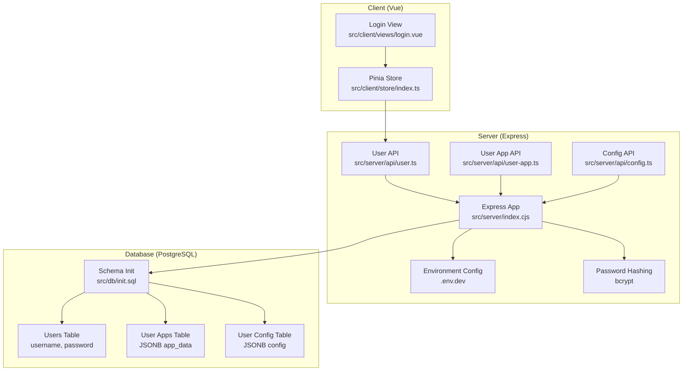
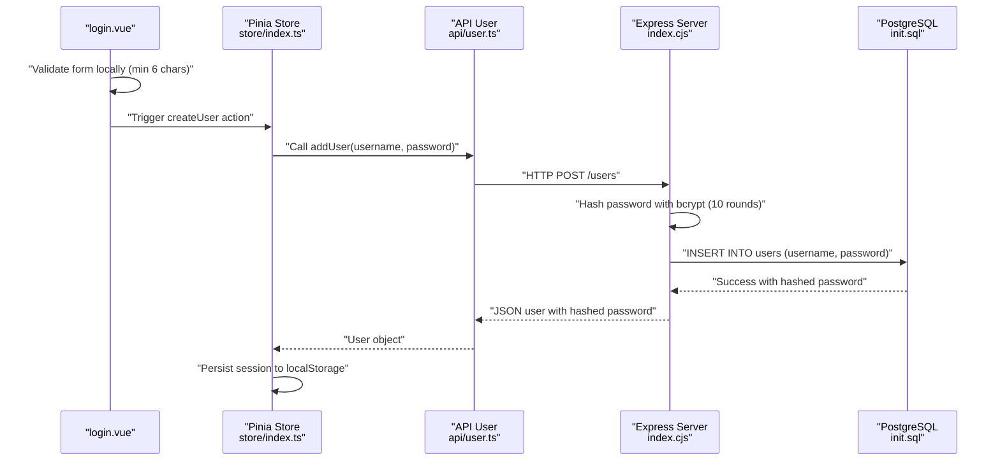
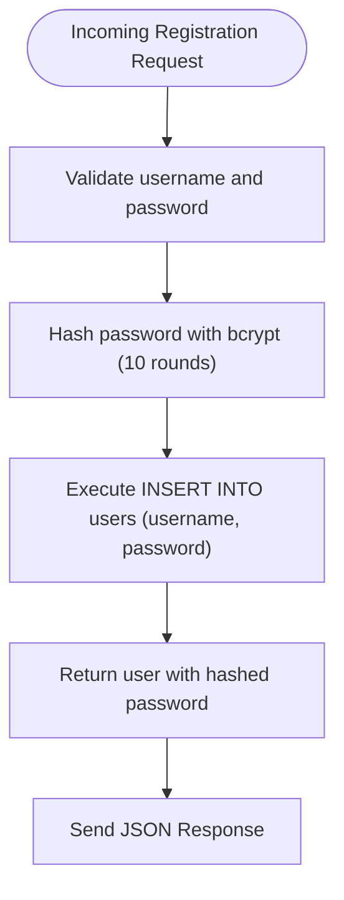
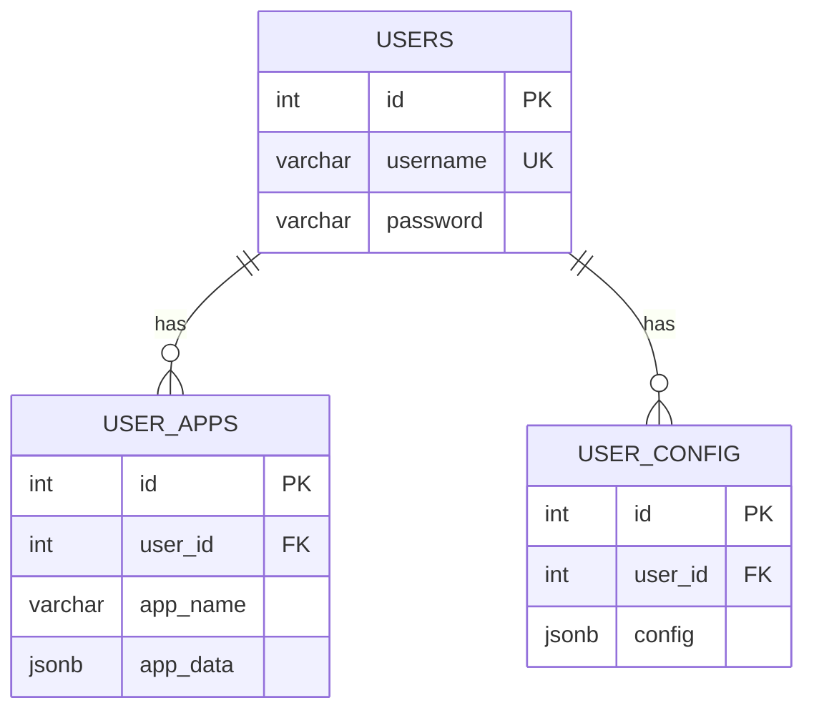
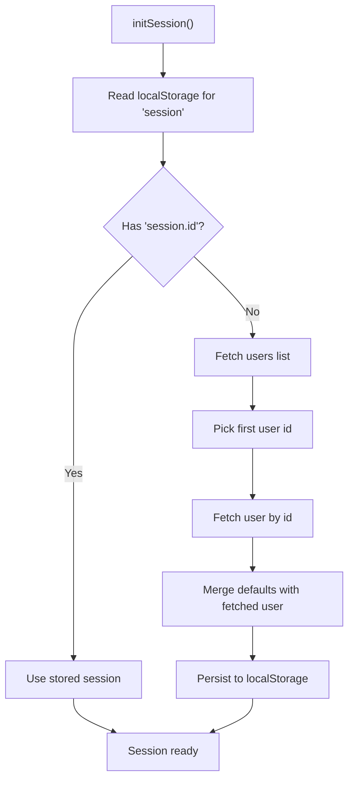
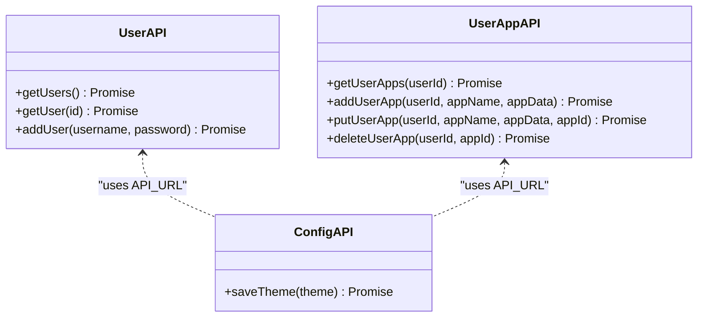
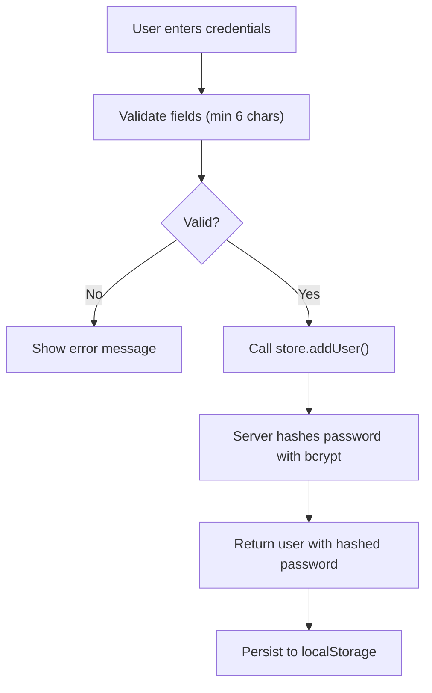
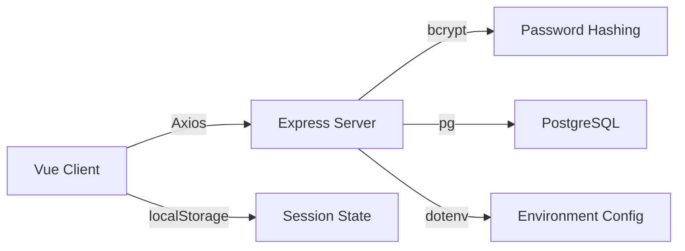

# Authentication & Authorization

<cite>
**Referenced Files in This Document**
- [index.cjs](file://src/server/index.cjs)
- [init.sql](file://src/db/init.sql)
- [api/config.ts](file://src/server/api/config.ts)
- [api/user.ts](file://src/server/api/user.ts)
- [api/user-app.ts](file://src/server/api/user-app.ts)
- [store/index.ts](file://src/client/store/index.ts)
- [login.vue](file://src/client/views/login.vue)
- [package.json](file://package.json)
</cite>

## Update Summary
**Changes Made**
- Updated authentication implementation to include bcrypt password hashing for secure credential storage
- Enhanced user registration endpoint with password hashing and validation
- Added comprehensive environment variable configuration through dotenv
- Updated database schema to support username/password authentication
- Modified client-side authentication flow to support user creation with hashed passwords

## Table of Contents
1. [Introduction](#introduction)
2. [Project Structure](#project-structure)
3. [Core Components](#core-components)
4. [Architecture Overview](#architecture-overview)
5. [Detailed Component Analysis](#detailed-component-analysis)
6. [Dependency Analysis](#dependency-analysis)
7. [Performance Considerations](#performance-considerations)
8. [Troubleshooting Guide](#troubleshooting-guide)
9. [Conclusion](#conclusion)
10. [Appendices](#appendices)

## Introduction
This document analyzes the authentication and authorization patterns implemented in the backend server and associated frontend components. The system now features a comprehensive user authentication system with bcrypt password hashing, secure credential storage, and environment variable configuration through dotenv. It explains the current user management system, session handling approaches, and security considerations. It also documents how user data is validated and sanitized, input validation strategies, and protections against common vulnerabilities such as SQL injection and cross-site scripting (XSS). Finally, it provides recommendations for implementing more robust authentication mechanisms and authorization patterns.

## Project Structure
The system comprises:
- A Node.js/Express server exposing REST endpoints for users, user applications, and user configuration with bcrypt password hashing.
- A PostgreSQL database initialized with tables for users, user configuration, and user applications.
- A Vue client using Pinia for state management and Axios for API communication.
- Environment variable configuration through dotenv for secure credential management.
- Minimal server middleware: CORS enabled globally and JSON body parsing.

**Diagram sources**
- [index.cjs:3-9](file://src/server/index.cjs#L3-L9)
- [index.cjs:134-162](file://src/server/index.cjs#L134-L162)
- [init.sql:5-24](file://src/db/init.sql#L5-L24)
- [login.vue:1-127](file://src/client/views/login.vue#L1-L127)
- [store/index.ts:1-101](file://src/client/store/index.ts#L1-L101)

**Section sources**
- [index.cjs:1-199](file://src/server/index.cjs#L1-L199)
- [init.sql:1-25](file://src/db/init.sql#L1-L25)
- [api/config.ts:1-19](file://src/server/api/config.ts#L1-L19)
- [api/user.ts:1-46](file://src/server/api/user.ts#L1-L46)
- [api/user-app.ts:1-73](file://src/server/api/user-app.ts#L1-L73)
- [store/index.ts:1-101](file://src/client/store/index.ts#L1-L101)
- [login.vue:1-127](file://src/client/views/login.vue#L1-L127)
- [package.json:1-31](file://package.json#L1-L31)

## Core Components
- Express server with global CORS and JSON body parsing middleware, enhanced with bcrypt password hashing and dotenv configuration.
- Database-backed endpoints for users with secure password storage using bcrypt hashing.
- Frontend state management storing a synthetic session and persisting it to local storage.
- Client-side input validation via a form library with password strength validation.
- Environment variable configuration for secure database credential management.

Key observations:
- Passwords are now hashed using bcrypt with 10 salt rounds before storage.
- Environment variables are loaded from .env.dev for secure configuration.
- Users are identified by numeric IDs with username/password authentication.
- SQL queries use parameterized placeholders to mitigate injection risks.
- XSS protections rely on client-side templating and lack of inline script execution.

**Section sources**
- [index.cjs:3-9](file://src/server/index.cjs#L3-L9)
- [index.cjs:134-162](file://src/server/index.cjs#L134-L162)
- [store/index.ts:24-47](file://src/client/store/index.ts#L24-L47)
- [login.vue:44-48](file://src/client/views/login.vue#L44-L48)

## Architecture Overview
The system follows a thin-client architecture with enhanced security:
- Client stores a session object locally and initializes it by fetching the first user from the backend.
- All API interactions are performed via Axios to the server's REST endpoints.
- The server executes parameterized SQL queries against PostgreSQL with bcrypt password hashing.
- Environment variables are loaded from .env.dev for secure configuration management.

**Diagram sources**
- [login.vue:41-67](file://src/client/views/login.vue#L41-L67)
- [store/index.ts:58-67](file://src/client/store/index.ts#L58-L67)
- [api/user.ts:36-46](file://src/server/api/user.ts#L36-L46)
- [index.cjs:134-162](file://src/server/index.cjs#L134-L162)
- [init.sql:5-9](file://src/db/init.sql#L5-L9)

## Detailed Component Analysis

### Backend Server (Express) - Enhanced Authentication
- Middleware stack:
  - Global CORS enabled without restrictions.
  - JSON body parser for request payloads.
  - dotenv configuration loading from .env.dev.
- Database connectivity:
  - Uses environment variables for connection parameters with interactive fallback for missing password.
- Enhanced authentication endpoints:
  - User registration with bcrypt password hashing (10 salt rounds).
  - Username/password validation with duplicate detection.
  - Parameterized queries prevent SQL injection.
- Security posture:
  - Passwords are hashed before storage using bcrypt.
  - Parameterized queries prevent SQL injection.
  - No CSRF protection, authentication, or authorization middleware.
  - No HTTPS enforcement or secure cookie flags.

**Diagram sources**
- [index.cjs:134-162](file://src/server/index.cjs#L134-L162)

**Section sources**
- [index.cjs:3-9](file://src/server/index.cjs#L3-L9)
- [index.cjs:134-162](file://src/server/index.cjs#L134-L162)

### Database Schema - Authentication Support
- Users table with unique username and bcrypt-hashed password storage.
- User apps table with JSONB app data.
- User configuration table linking to users.

**Diagram sources**
- [init.sql:5-24](file://src/db/init.sql#L5-L24)

**Section sources**
- [init.sql:1-25](file://src/db/init.sql#L1-L25)

### Frontend Session Management (Pinia Store)
- Initializes session by:
  - Loading from localStorage if present.
  - Otherwise fetching the first user and the user's profile, merging defaults, and persisting to localStorage.
- Provides actions to manage user apps and theme persistence.
- Supports user creation with password validation.

**Diagram sources**
- [store/index.ts:24-47](file://src/client/store/index.ts#L24-L47)

**Section sources**
- [store/index.ts:1-101](file://src/client/store/index.ts#L1-L101)

### API Layer (Axios-based) - Enhanced Authentication
- Exposes typed functions for:
  - Listing and retrieving users.
  - Adding users with password hashing.
  - Managing user apps (list, add, update, delete).
  - Saving and retrieving theme.
- API base URL configured for localhost.
- Enhanced user registration with server-side password hashing.

**Diagram sources**
- [api/user.ts:5-46](file://src/server/api/user.ts#L5-L46)
- [api/user-app.ts:5-73](file://src/server/api/user-app.ts#L5-L73)
- [api/config.ts:6-18](file://src/server/api/config.ts#L6-L18)

**Section sources**
- [api/config.ts:1-19](file://src/server/api/config.ts#L1-L19)
- [api/user.ts:1-46](file://src/server/api/user.ts#L1-L46)
- [api/user-app.ts:1-73](file://src/server/api/user-app.ts#L1-L73)

### Client-Side Login View - Enhanced Authentication Flow
- Implements client-side validation using a form library.
- Validates password length (minimum 6 characters) before sending to server.
- Supports user creation with password hashing handled server-side.
- Provides UI scaffolding for username/password and user registration.

**Diagram sources**
- [login.vue:41-67](file://src/client/views/login.vue#L41-L67)

**Section sources**
- [login.vue:1-127](file://src/client/views/login.vue#L1-L127)

## Dependency Analysis
- Runtime dependencies include Express, CORS, PostgreSQL driver, Axios, Prompts, and bcrypt for password hashing.
- The client consumes server APIs via Axios and persists a session in localStorage.
- Environment variables are loaded from .env.dev for secure configuration.
- No explicit JWT, OAuth, or session middleware is present in the server.

**Diagram sources**
- [package.json:12-21](file://package.json#L12-L21)
- [store/index.ts:24-47](file://src/client/store/index.ts#L24-L47)
- [index.cjs:3-9](file://src/server/index.cjs#L3-L9)

**Section sources**
- [package.json:1-31](file://package.json#L1-L31)
- [store/index.ts:24-47](file://src/client/store/index.ts#L24-L47)
- [index.cjs:3-9](file://src/server/index.cjs#L3-L9)

## Performance Considerations
- Parameterized queries are used consistently, reducing overhead and preventing repeated parsing of SQL statements.
- bcrypt password hashing adds computational overhead but ensures security.
- Global CORS without origin restriction may increase attack surface; consider narrowing origins in production.
- Environment variable loading from .env.dev provides flexibility but may impact startup performance.
- Frequent round-trips to the database occur during initialization; consider caching or batching where appropriate.
- JSONB fields enable flexible storage but may increase payload sizes; validate and prune unnecessary fields.

## Troubleshooting Guide
Common issues and mitigations:
- CORS errors: Verify allowed origins and credentials settings on the server.
- SQL errors: Ensure parameters match placeholders and types; confirm table existence and constraints.
- Session not persisting: Check browser localStorage availability and quota limits.
- API timeouts: Confirm server is reachable and database connection is healthy.
- Password hash errors: Verify bcrypt installation and salt rounds configuration.
- Environment variable loading: Ensure .env.dev file exists and contains proper database credentials.

Operational checks:
- Confirm environment variables for database credentials are set or prompted correctly.
- Validate that the database schema exists and matches expectations.
- Check bcrypt module installation and version compatibility.
- Verify .env.dev file permissions and accessibility.

**Section sources**
- [index.cjs:12-28](file://src/server/index.cjs#L12-L28)
- [index.cjs:38-44](file://src/server/index.cjs#L38-L44)
- [store/index.ts:24-47](file://src/client/store/index.ts#L24-L47)
- [index.cjs:3](file://src/server/index.cjs#L3)

## Conclusion
The current implementation provides a significantly enhanced authentication foundation with bcrypt password hashing, secure credential storage, and environment variable configuration through dotenv. The system now features proper password security with 10 salt rounds of bcrypt hashing, comprehensive input validation, and secure environment management. However, it still lacks comprehensive authentication middleware, authorization patterns, and hardened security controls. The frontend simulates a session by persisting a user ID locally, but does not enforce role-based access or secure token handling. To achieve robust security, the system should adopt standardized authentication and authorization patterns with strict middleware, secure transport, comprehensive input validation, and proper session management.

## Appendices

### Recommendations for Robust Authentication and Authorization
- Implement comprehensive authentication middleware:
  - Use signed tokens (e.g., JWT) or secure session cookies with HttpOnly and SameSite flags.
  - Enforce bearer token checks on protected routes.
  - Implement proper session lifecycle management.
- Role-based access control (RBAC):
  - Define roles (e.g., admin, user) and enforce authorization per endpoint.
  - Implement user permission checking and resource-based authorization.
- Enhanced input validation and sanitization:
  - Validate and sanitize all inputs server-side; avoid echoing raw user input in responses.
  - Implement rate limiting and brute force protection.
- Advanced protection against common vulnerabilities:
  - Enforce HTTPS/TLS in production with proper certificate management.
  - Add CSRF protection for state-changing operations.
  - Sanitize HTML output to prevent XSS; avoid innerHTML and escape dynamic content.
  - Implement proper error handling to avoid information disclosure.
- CORS and security hardening:
  - Restrict allowed origins, methods, and headers; enable credentials only when necessary.
  - Add security headers (Content-Security-Policy, X-Frame-Options, etc.).
- Audit logging and monitoring:
  - Log authentication events and suspicious activities; monitor for anomalies.
  - Implement proper error logging and debugging controls.
- Password security enhancements:
  - Consider implementing password policies and complexity requirements.
  - Add password expiration and rotation mechanisms.
  - Implement account lockout and recovery procedures.