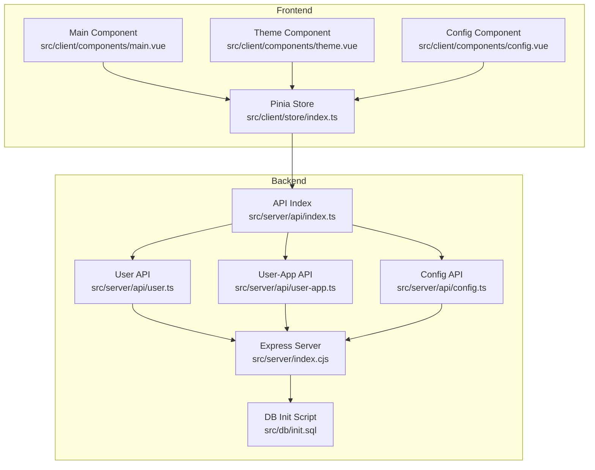
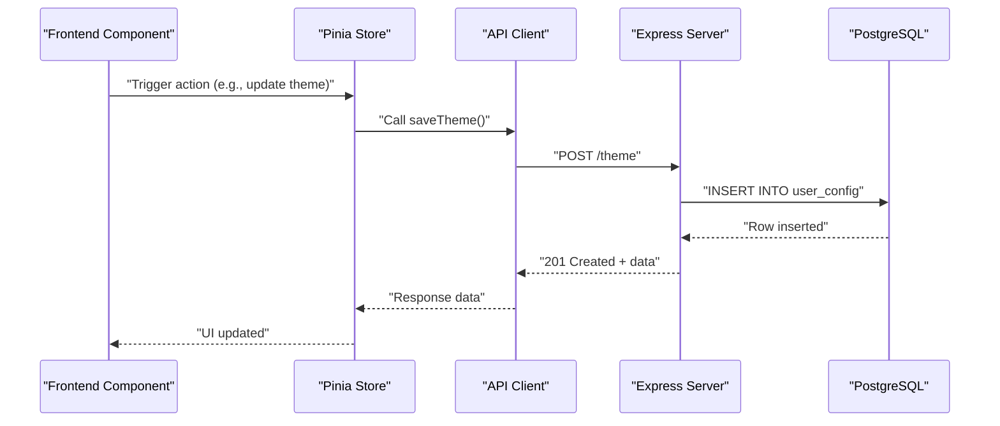
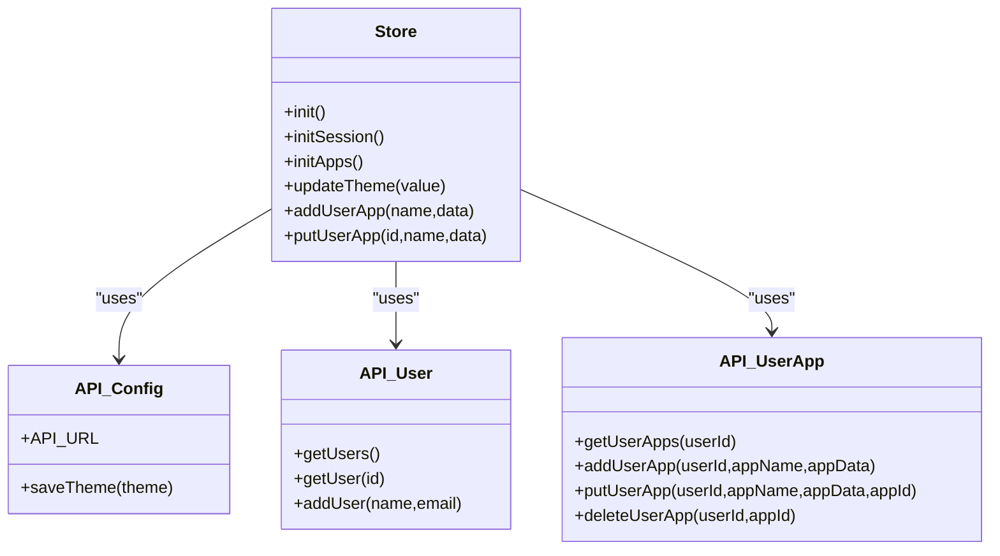
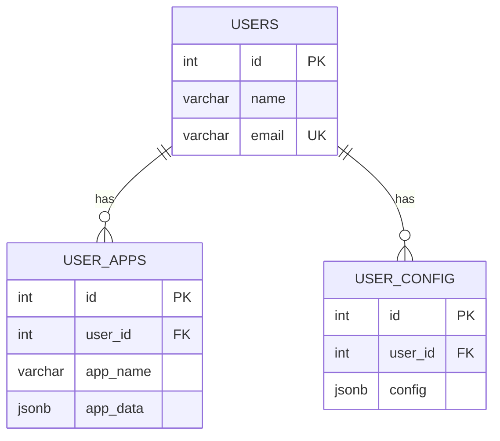
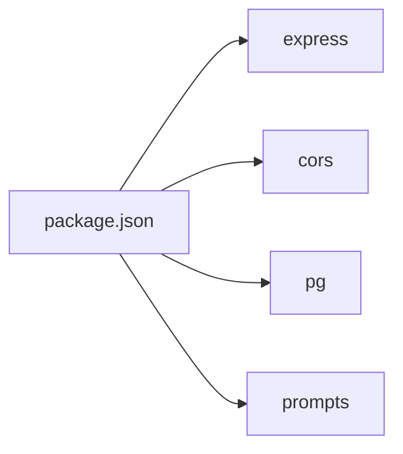

# Backend API Server

<cite>
**Referenced Files in This Document**
- [index.cjs](file://src/server/index.cjs)
- [api.ts](file://src/server/api.ts)
- [api/index.ts](file://src/server/api/index.ts)
- [api/config.ts](file://src/server/api/config.ts)
- [api/user.ts](file://src/server/api/user.ts)
- [api/user-app.ts](file://src/server/api/user-app.ts)
- [init.sql](file://src/db/init.sql)
- [package.json](file://package.json)
- [README.md](file://README.md)
- [store/index.ts](file://src/client/store/index.ts)
- [components/main.vue](file://src/client/components/main.vue)
- [components/theme.vue](file://src/client/components/theme.vue)
- [components/config.vue](file://src/client/components/config.vue)
- [types/store.d.ts](file://src/client/types/store.d.ts)
- [types/user.d.ts](file://src/client/types/user.d.ts)
</cite>

## Table of Contents
1. [Introduction](#introduction)
2. [Project Structure](#project-structure)
3. [Core Components](#core-components)
4. [Architecture Overview](#architecture-overview)
5. [Detailed Component Analysis](#detailed-component-analysis)
6. [Dependency Analysis](#dependency-analysis)
7. [Performance Considerations](#performance-considerations)
8. [Security Considerations](#security-considerations)
9. [Monitoring and Observability](#monitoring-and-observability)
10. [Troubleshooting Guide](#troubleshooting-guide)
11. [Conclusion](#conclusion)
12. [Appendices](#appendices)

## Introduction
This document describes the Express.js backend API server that powers a personal start page application. It covers server configuration, middleware, CORS and security posture, API endpoint structure, database integration with PostgreSQL, authentication and authorization patterns, input validation strategies, error handling, and practical usage examples integrated with the frontend. The backend exposes REST endpoints for user and application management, and the frontend consumes these endpoints via a dedicated API client module.

## Project Structure
The backend is organized under src/server with modular API clients and a single Express entry point. The database schema is initialized via a SQL script. The frontend integrates with the backend through a typed API client and Pinia store.

**Diagram sources**
- [index.cjs:1-173](file://src/server/index.cjs#L1-L173)
- [api/index.ts:1-4](file://src/server/api/index.ts#L1-L4)
- [api/user.ts:1-46](file://src/server/api/user.ts#L1-L46)
- [api/user-app.ts:1-73](file://src/server/api/user-app.ts#L1-L73)
- [api/config.ts:1-19](file://src/server/api/config.ts#L1-L19)
- [init.sql:1-26](file://src/db/init.sql#L1-L26)
- [store/index.ts:1-91](file://src/client/store/index.ts#L1-L91)
- [components/main.vue:1-109](file://src/client/components/main.vue#L1-L109)
- [components/theme.vue:1-70](file://src/client/components/theme.vue#L1-L70)
- [components/config.vue:1-102](file://src/client/components/config.vue#L1-L102)

**Section sources**
- [README.md:33-56](file://README.md#L33-L56)
- [package.json:1-31](file://package.json#L1-L31)

## Core Components
- Express server entry point initializes middleware, connects to PostgreSQL, and defines routes for users, user applications, and theme configuration.
- Modular API client exports provide a unified surface for frontend consumption.
- Database schema defines three tables: users, user_config, and user_apps with appropriate constraints and JSONB fields for flexible data storage.

Key implementation references:
- Server bootstrap and middleware: [index.cjs:3-11](file://src/server/index.cjs#L3-L11)
- PostgreSQL connection and environment variables: [index.cjs:12-44](file://src/server/index.cjs#L12-L44)
- Routes and handlers: [index.cjs:46-164](file://src/server/index.cjs#L46-L164)
- API re-exports: [api.ts:1-2](file://src/server/api.ts#L1-L2), [api/index.ts:1-4](file://src/server/api/index.ts#L1-L4)
- Database schema: [init.sql:6-25](file://src/db/init.sql#L6-L25)

**Section sources**
- [index.cjs:3-173](file://src/server/index.cjs#L3-L173)
- [api.ts:1-2](file://src/server/api.ts#L1-L2)
- [api/index.ts:1-4](file://src/server/api/index.ts#L1-L4)
- [init.sql:1-26](file://src/db/init.sql#L1-L26)

## Architecture Overview
The backend follows a straightforward layered architecture:
- HTTP layer: Express routes and handlers
- Data access layer: pg client queries against PostgreSQL
- API client layer: Axios-based modules for frontend integration
- Frontend integration: Pinia store orchestrating API calls and state updates

**Diagram sources**
- [store/index.ts:58-62](file://src/client/store/index.ts#L58-L62)
- [api/config.ts:6-18](file://src/server/api/config.ts#L6-L18)
- [index.cjs:138-150](file://src/server/index.cjs#L138-L150)

**Section sources**
- [index.cjs:12-169](file://src/server/index.cjs#L12-L169)
- [store/index.ts:1-91](file://src/client/store/index.ts#L1-L91)
- [api/config.ts:1-19](file://src/server/api/config.ts#L1-L19)

## Detailed Component Analysis

### Express Server and Middleware
- Middleware stack:
  - CORS enabled globally to allow cross-origin requests from any origin.
  - JSON body parsing for request payloads.
- Environment-driven database connection using pg Client with optional interactive password prompt when missing.
- Route coverage:
  - Users: list all, fetch by ID, create.
  - User apps: list, add, update, delete by user and app identifiers.
  - Theme: persist and retrieve per-user theme preferences.

Implementation references:
- Middleware and CORS: [index.cjs:9-10](file://src/server/index.cjs#L9-L10)
- Connection and CLI prompt fallback: [index.cjs:12-28](file://src/server/index.cjs#L12-L28)
- Users routes: [index.cjs:46-136](file://src/server/index.cjs#L46-L136)
- User apps routes: [index.cjs:72-122](file://src/server/index.cjs#L72-L122)
- Theme routes: [index.cjs:138-164](file://src/server/index.cjs#L138-L164)

**Section sources**
- [index.cjs:3-173](file://src/server/index.cjs#L3-L173)

### API Modules and Frontend Integration
- Unified API export: [api.ts:1-2](file://src/server/api.ts#L1-L2), [api/index.ts:1-4](file://src/server/api/index.ts#L1-L4)
- User API: list, fetch by ID, create user. [api/user.ts:1-46](file://src/server/api/user.ts#L1-L46)
- User-app API: list user apps, add, update, delete. [api/user-app.ts:1-73](file://src/server/api/user-app.ts#L1-L73)
- Config API: save theme and base URL constant. [api/config.ts:1-19](file://src/server/api/config.ts#L1-L19)
- Frontend store orchestrates session initialization, app loading, and theme updates. [store/index.ts:1-91](file://src/client/store/index.ts#L1-L91)
- Frontend components consume the store and API client for rendering and editing. [components/main.vue:1-109](file://src/client/components/main.vue#L1-L109), [components/theme.vue:1-70](file://src/client/components/theme.vue#L1-L70), [components/config.vue:1-102](file://src/client/components/config.vue#L1-L102)

**Diagram sources**
- [api/config.ts:1-19](file://src/server/api/config.ts#L1-L19)
- [api/user.ts:1-46](file://src/server/api/user.ts#L1-L46)
- [api/user-app.ts:1-73](file://src/server/api/user-app.ts#L1-L73)
- [store/index.ts:1-91](file://src/client/store/index.ts#L1-L91)

**Section sources**
- [api.ts:1-2](file://src/server/api.ts#L1-L2)
- [api/index.ts:1-4](file://src/server/api/index.ts#L1-L4)
- [api/config.ts:1-19](file://src/server/api/config.ts#L1-L19)
- [api/user.ts:1-46](file://src/server/api/user.ts#L1-L46)
- [api/user-app.ts:1-73](file://src/server/api/user-app.ts#L1-L73)
- [store/index.ts:1-91](file://src/client/store/index.ts#L1-L91)

### Database Integration and Schema
- PostgreSQL connection managed by pg Client with environment variables for credentials and host.
- Initialization script creates:
  - users table with unique email and auto-incrementing ID.
  - user_config table storing JSONB configuration per user.
  - user_apps table storing app metadata and JSONB payload per user.
- Queries leverage parameterized statements to prevent SQL injection.

References:
- Connection and environment variables: [index.cjs:12-44](file://src/server/index.cjs#L12-L44)
- Schema definitions: [init.sql:6-25](file://src/db/init.sql#L6-L25)

**Diagram sources**
- [init.sql:6-25](file://src/db/init.sql#L6-L25)
- [index.cjs:38-44](file://src/server/index.cjs#L38-L44)

**Section sources**
- [index.cjs:12-44](file://src/server/index.cjs#L12-L44)
- [init.sql:1-26](file://src/db/init.sql#L1-L26)

### Authentication and Authorization Patterns
- Current implementation does not enforce authentication or authorization checks on endpoints. Access is not restricted by tokens or sessions.
- Session state in the frontend is simulated by selecting the first user returned by the users endpoint and caching it in localStorage. [store/index.ts:24-47](file://src/client/store/index.ts#L24-L47)
- Recommendations for future enhancement:
  - Introduce JWT-based authentication and protected routes.
  - Enforce per-user resource ownership (e.g., only allow modifying apps belonging to the authenticated user).
  - Add rate limiting and input validation middleware.

**Section sources**
- [index.cjs:46-164](file://src/server/index.cjs#L46-L164)
- [store/index.ts:24-47](file://src/client/store/index.ts#L24-L47)

### Input Validation Strategies
- Minimal validation is present:
  - JSON body parsing is enabled, but no schema validation or sanitization middleware is configured.
  - Parameterized queries mitigate SQL injection risks for database operations.
- Recommended improvements:
  - Add schema validation (e.g., Joi, Zod) for request bodies and query parameters.
  - Sanitize inputs and enforce field presence/type constraints.
  - Centralize validation errors with consistent HTTP responses.

**Section sources**
- [index.cjs:9-10](file://src/server/index.cjs#L9-L10)
- [index.cjs:46-164](file://src/server/index.cjs#L46-L164)

### Error Handling Approaches
- Try/catch around database operations with generic 500 responses containing error messages.
- Specific NotFound handling for user retrieval and app updates when rows are absent.
- Frontend catches and logs errors during API calls, displaying user-visible feedback where applicable.

References:
- Generic error handling in routes: [index.cjs:48-53](file://src/server/index.cjs#L48-L53), [index.cjs:67-68](file://src/server/index.cjs#L67-L68), [index.cjs:100-101](file://src/server/index.cjs#L100-L101)
- NotFound handling: [index.cjs:64-66](file://src/server/index.cjs#L64-L66), [index.cjs:114-118](file://src/server/index.cjs#L114-L118)
- Frontend error logging: [store/index.ts:11-14](file://src/client/store/index.ts#L11-L14), [store/index.ts:54-56](file://src/client/store/index.ts#L54-L56), [store/index.ts:85-87](file://src/client/store/index.ts#L85-L87)

**Section sources**
- [index.cjs:46-164](file://src/server/index.cjs#L46-L164)
- [store/index.ts:1-91](file://src/client/store/index.ts#L1-L91)

### API Endpoint Reference
- Users
  - GET /users → Returns array of users
  - GET /user/:userid → Returns single user by ID
  - POST /users → Creates a new user
- User Apps
  - GET /user/:userid/apps → Returns all apps for a user
  - POST /user/:userid/apps → Adds a new app for a user
  - PUT /user/:userid/apps/:appId → Updates an existing app
  - DELETE /user/:userid/apps/:appId → Removes an app
- Theme
  - POST /theme → Saves theme for current user
  - GET /theme → Retrieves theme for current user

References:
- Endpoints and handlers: [index.cjs:46-164](file://src/server/index.cjs#L46-L164)

**Section sources**
- [index.cjs:46-164](file://src/server/index.cjs#L46-L164)

### Practical Usage Examples
- Initialize session and load apps:
  - Frontend calls API to fetch users and the first user, then loads user apps. [store/index.ts:34-56](file://src/client/store/index.ts#L34-L56)
- Update theme:
  - Frontend triggers store.updateTheme, which persists to backend and applies CSS variables. [store/index.ts:58-62](file://src/client/store/index.ts#L58-L62), [components/theme.vue:11-21](file://src/client/components/theme.vue#L11-L21)
- Edit app:
  - Frontend opens modal, calls store.putUserApp, which invokes API.putUserApp and refreshes app list. [components/main.vue:13-25](file://src/client/components/main.vue#L13-L25), [store/index.ts:76-88](file://src/client/store/index.ts#L76-L88)

**Section sources**
- [store/index.ts:1-91](file://src/client/store/index.ts#L1-L91)
- [components/main.vue:1-109](file://src/client/components/main.vue#L1-L109)
- [components/theme.vue:1-70](file://src/client/components/theme.vue#L1-L70)

## Dependency Analysis
External dependencies relevant to the backend:
- express: Web framework for routing and middleware
- cors: Cross-origin allowance
- pg: PostgreSQL client for Node.js
- prompts: Interactive password prompt when environment variable is missing

References:
- Dependencies and scripts: [package.json:12-29](file://package.json#L12-L29), [package.json:6-11](file://package.json#L6-L11)

**Diagram sources**
- [package.json:12-29](file://package.json#L12-L29)

**Section sources**
- [package.json:1-31](file://package.json#L1-L31)

## Performance Considerations
- Connection lifecycle: The server establishes a single pg Client connection at startup. For production workloads, consider a connection pool to handle concurrent requests efficiently.
- Query patterns: Parameterized queries are used, which is good for security and performance predictability.
- Payload sizes: user_apps and user_config store JSONB payloads; ensure payloads remain reasonable to avoid large round trips.
- Caching: Frontend caches session data in localStorage to reduce repeated network calls.

Recommendations:
- Replace single Client with a pool (pg.Pool) for scalability.
- Add pagination for /users and /user/:userid/apps when datasets grow.
- Implement response compression and limit request payload sizes.

**Section sources**
- [index.cjs:30-44](file://src/server/index.cjs#L30-L44)
- [store/index.ts:26-47](file://src/client/store/index.ts#L26-L47)

## Security Considerations
- CORS: Enabled globally without origin restrictions. In production, configure allowed origins and credentials policy.
- Authentication: No authentication or authorization enforced. Protect endpoints and enforce ownership semantics.
- Input validation: None implemented. Add schema validation and sanitization.
- Secrets: Password prompting is supported; ensure environment variables are set securely in production.
- Transport: Run behind HTTPS/TLS in production environments.

**Section sources**
- [index.cjs:9-10](file://src/server/index.cjs#L9-L10)
- [index.cjs:12-28](file://src/server/index.cjs#L12-L28)
- [index.cjs:46-164](file://src/server/index.cjs#L46-L164)

## Monitoring and Observability
- Logging: Console logs for connection success/failure and request handling. Consider structured logging and error tracking.
- Metrics: Add middleware to record request latency, throughput, and error rates.
- Health checks: Expose a /health endpoint returning service status.
- Tracing: Integrate distributed tracing for end-to-end visibility across frontend and backend.

[No sources needed since this section provides general guidance]

## Troubleshooting Guide
Common issues and resolutions:
- PostgreSQL connection failures:
  - Verify environment variables for user, host, database, password, and port.
  - Ensure the database exists and is reachable.
  - Reference: [index.cjs:12-44](file://src/server/index.cjs#L12-L44), [init.sql:2-4](file://src/db/init.sql#L2-L4)
- CORS errors in the browser:
  - Confirm that the frontend runs on a port that the backend allows (currently any origin).
  - Reference: [index.cjs](file://src/server/index.cjs#L9)
- 404 Not Found for user/app operations:
  - Ensure the user ID and app ID exist in the database.
  - Reference: [index.cjs:64-66](file://src/server/index.cjs#L64-L66), [index.cjs:114-118](file://src/server/index.cjs#L114-L118)
- Frontend not reflecting updates:
  - Confirm store.initApps is invoked after mutations and that API calls succeed.
  - Reference: [store/index.ts:50-56](file://src/client/store/index.ts#L50-L56), [store/index.ts:76-88](file://src/client/store/index.ts#L76-L88)

**Section sources**
- [index.cjs:9-10](file://src/server/index.cjs#L9-L10)
- [index.cjs:12-44](file://src/server/index.cjs#L12-L44)
- [index.cjs:46-164](file://src/server/index.cjs#L46-L164)
- [store/index.ts:50-56](file://src/client/store/index.ts#L50-L56)
- [store/index.ts:76-88](file://src/client/store/index.ts#L76-L88)

## Conclusion
The backend provides a minimal but functional foundation for user and application management backed by PostgreSQL. It leverages Express for routing, pg for database connectivity, and Axios-based API modules for frontend integration. To operate reliably in production, prioritize authentication/authorization, input validation, CORS hardening, and connection pooling, while adopting structured logging, metrics, and health checks.

[No sources needed since this section summarizes without analyzing specific files]

## Appendices

### Environment Variables
- PG_USER: PostgreSQL user (default: postgres)
- PG_HOST: PostgreSQL host (default: localhost)
- PG_DATABASE: Database name (default: startora)
- PG_PASSWORD: PostgreSQL password (prompted if not provided)
- PG_PORT: PostgreSQL port (default: 5432)
- PORT: Server port (default: 3000)

References:
- [index.cjs:12-36](file://src/server/index.cjs#L12-L36), [index.cjs:166-169](file://src/server/index.cjs#L166-L169)

**Section sources**
- [index.cjs:12-36](file://src/server/index.cjs#L12-L36)
- [index.cjs:166-169](file://src/server/index.cjs#L166-L169)