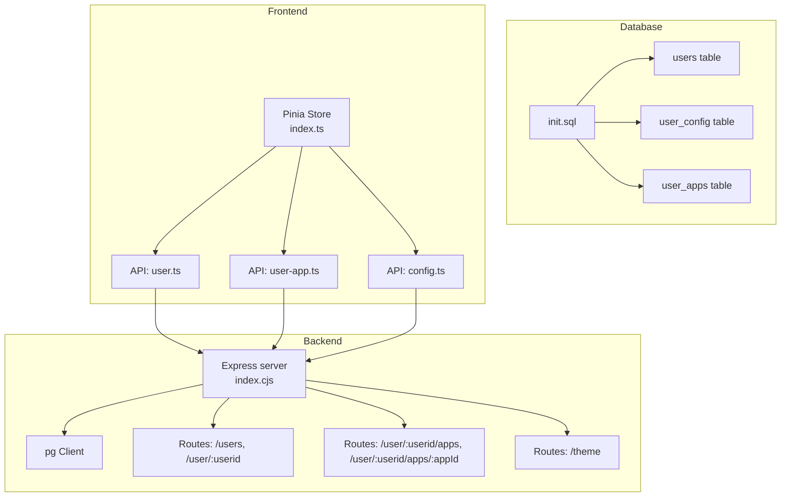
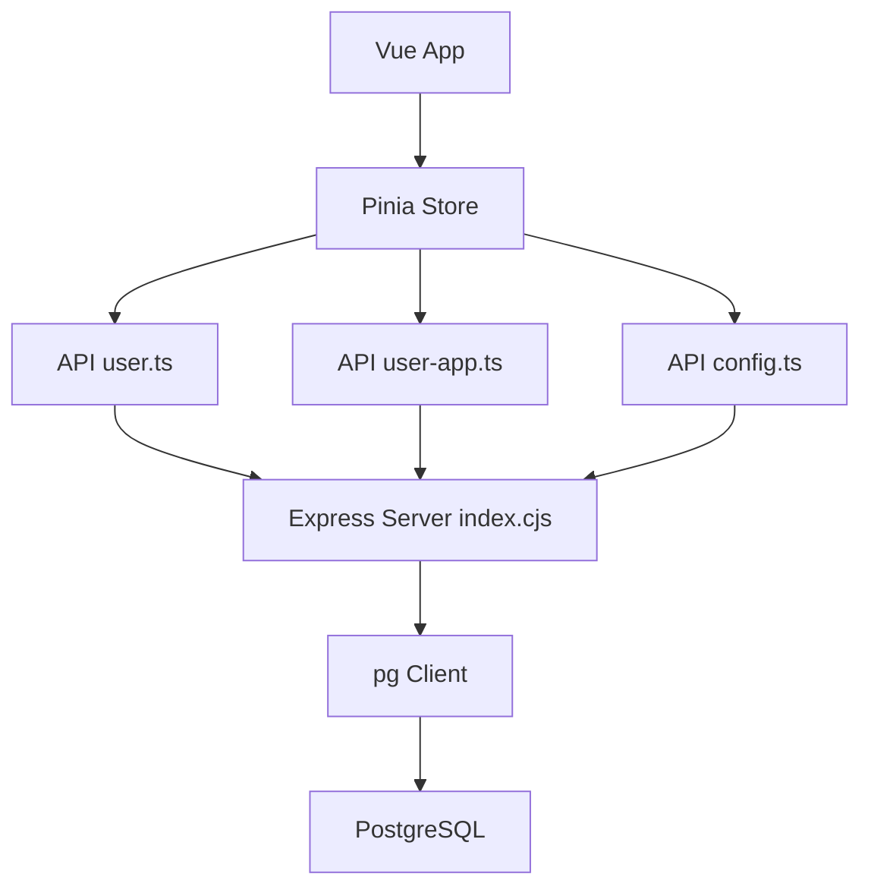
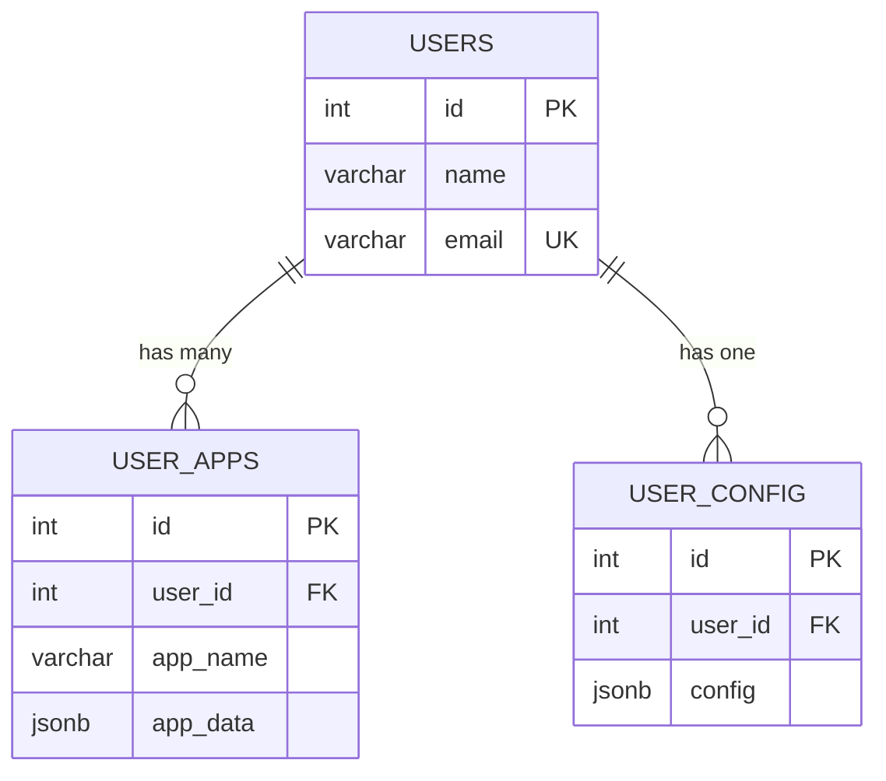
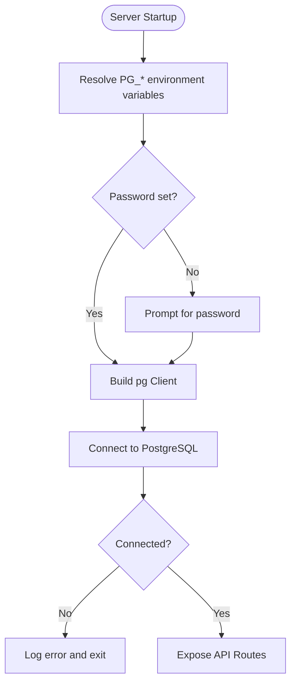
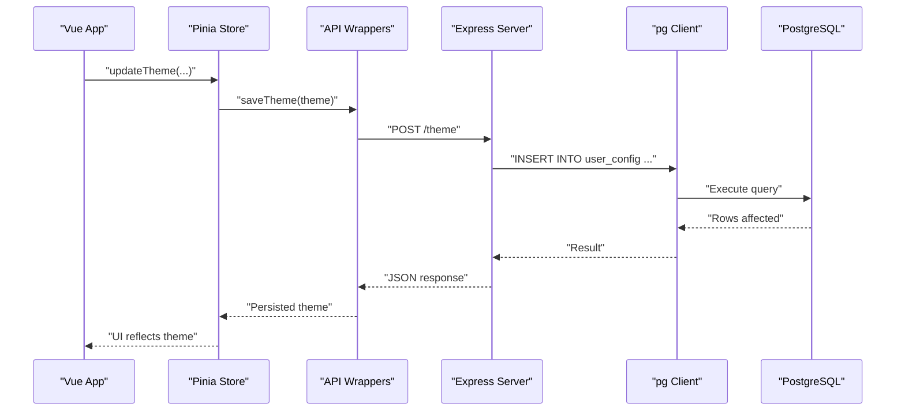
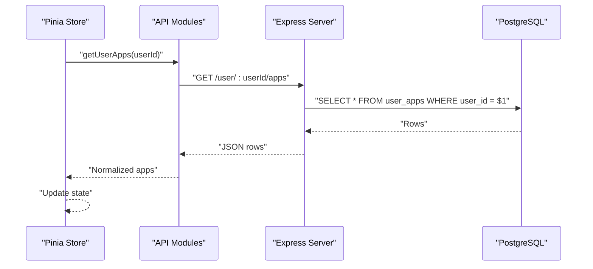
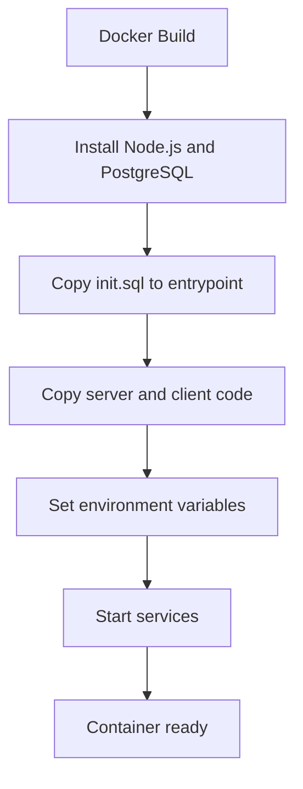
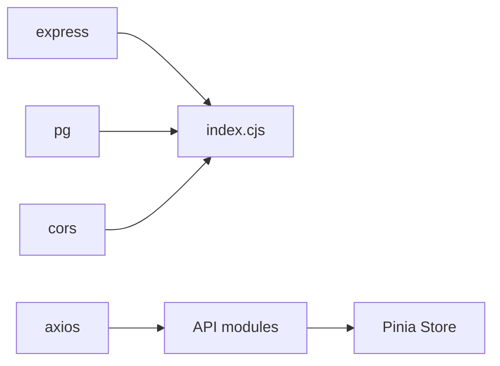

# Database Integration

<cite>
**Referenced Files in This Document**
- [init.sql](file://src/db/init.sql)
- [index.cjs](file://src/server/index.cjs)
- [user.ts](file://src/server/api/user.ts)
- [user-app.ts](file://src/server/api/user-app.ts)
- [config.ts](file://src/server/api/config.ts)
- [index.ts](file://src/client/store/index.ts)
- [docker-compose.yml](file://docker-compose.yml)
- [Dockerfile](file://Dockerfile)
- [package.json](file://package.json)
</cite>

## Table of Contents
1. [Introduction](#introduction)
2. [Project Structure](#project-structure)
3. [Core Components](#core-components)
4. [Architecture Overview](#architecture-overview)
5. [Detailed Component Analysis](#detailed-component-analysis)
6. [Dependency Analysis](#dependency-analysis)
7. [Performance Considerations](#performance-considerations)
8. [Troubleshooting Guide](#troubleshooting-guide)
9. [Conclusion](#conclusion)
10. [Appendices](#appendices)

## Introduction
This document explains how the project integrates with a PostgreSQL database using the pg client. It covers connection setup, environment variable configuration, schema structure, query execution patterns, parameterized queries, error handling, and operational best practices. It also outlines migration and schema evolution strategies grounded in the provided initialization script and server implementation.

## Project Structure
The database integration spans three layers:
- Database schema initialization via an SQL script
- Backend API server using the pg client for database operations
- Frontend client that consumes the backend API

**Diagram sources**
- [init.sql:1-26](file://src/db/init.sql#L1-L26)
- [index.cjs:12-173](file://src/server/index.cjs#L12-L173)
- [index.ts:1-91](file://src/client/store/index.ts#L1-L91)

**Section sources**
- [init.sql:1-26](file://src/db/init.sql#L1-L26)
- [index.cjs:12-173](file://src/server/index.cjs#L12-L173)
- [index.ts:1-91](file://src/client/store/index.ts#L1-L91)

## Core Components
- Database schema: Three tables are initialized, representing users, user configurations, and user applications.
- Backend API: Express routes that connect to PostgreSQL using the pg Client, execute parameterized queries, and return JSON responses.
- Frontend API wrappers: Axios-based functions that call backend endpoints and normalize data for the store.
- Pinia store: Centralized state managing session, apps, and theme updates, persisting session data locally and delegating persistence of theme to the backend.

Key responsibilities:
- Schema creation and relationships are defined in the initialization script.
- Connection configuration is driven by environment variables resolved at runtime.
- Queries leverage parameterized placeholders to prevent SQL injection.
- Error handling returns structured JSON errors to clients.

**Section sources**
- [init.sql:6-25](file://src/db/init.sql#L6-L25)
- [index.cjs:30-44](file://src/server/index.cjs#L30-L44)
- [user.ts:1-46](file://src/server/api/user.ts#L1-L46)
- [user-app.ts:1-73](file://src/server/api/user-app.ts#L1-L73)
- [config.ts:1-19](file://src/server/api/config.ts#L1-L19)
- [index.ts:1-91](file://src/client/store/index.ts#L1-L91)

## Architecture Overview
The system follows a classic layered architecture:
- Presentation layer: Vue frontend with Pinia store
- Application layer: Express API with pg client
- Data layer: PostgreSQL database

**Diagram sources**
- [index.cjs:12-173](file://src/server/index.cjs#L12-L173)
- [user.ts:1-46](file://src/server/api/user.ts#L1-L46)
- [user-app.ts:1-73](file://src/server/api/user-app.ts#L1-L73)
- [config.ts:1-19](file://src/server/api/config.ts#L1-L19)
- [index.ts:1-91](file://src/client/store/index.ts#L1-L91)

## Detailed Component Analysis

### Database Schema and Relationships
The initialization script defines:
- users: primary table for user records
- user_config: stores per-user configuration (JSONB)
- user_apps: stores per-user applications (JSONB)

- Relationships:
  - users.id references user_apps.user_id and user_config.user_id
- Data types:
  - JSONB fields enable flexible storage of configuration and application data
- Constraints:
  - Unique constraint on users.email ensures uniqueness

**Diagram sources**
- [init.sql:6-25](file://src/db/init.sql#L6-L25)

**Section sources**
- [init.sql:6-25](file://src/db/init.sql#L6-L25)

### Environment Variables and Connection Setup
The backend resolves connection parameters from environment variables:
- User: PG_USER or defaults to postgres
- Host: PG_HOST or defaults to localhost
- Database: PG_DATABASE or defaults to startora
- Password: PG_PASSWORD or PGPASSWORD; otherwise prompts the user
- Port: PG_PORT or defaults to 5432

Connection lifecycle:
- On startup, the server constructs a pg Client with the resolved parameters
- Attempts to connect; logs success or exits on failure
- Exposes routes for users, apps, and theme configuration

**Diagram sources**
- [index.cjs:12-44](file://src/server/index.cjs#L12-L44)

**Section sources**
- [index.cjs:12-44](file://src/server/index.cjs#L12-L44)

### Query Execution Patterns and Parameterized Queries
The backend executes parameterized queries to prevent SQL injection:
- Select all users
- Select user by id
- Insert user
- Insert user app
- Update user app
- Insert theme configuration
- Select theme configuration

**Diagram sources**
- [index.cjs:139-150](file://src/server/index.cjs#L139-L150)
- [config.ts:6-18](file://src/server/api/config.ts#L6-L18)
- [index.ts:58-62](file://src/client/store/index.ts#L58-L62)

**Section sources**
- [index.cjs:47-164](file://src/server/index.cjs#L47-L164)
- [config.ts:6-18](file://src/server/api/config.ts#L6-L18)
- [index.ts:58-62](file://src/client/store/index.ts#L58-L62)

### Frontend API Wrappers and Store Integration
The frontend interacts with the backend through typed API functions:
- Users: fetch all users, fetch a single user, add a user
- Apps: fetch user apps, add an app, update an app, delete an app
- Theme: save theme configuration

The Pinia store orchestrates:
- Session initialization by fetching users and a selected user
- Persisting session to localStorage
- Loading user apps and updating theme via backend

**Diagram sources**
- [user-app.ts:5-17](file://src/server/api/user-app.ts#L5-L17)
- [index.cjs:72-84](file://src/server/index.cjs#L72-L84)
- [index.ts:49-57](file://src/client/store/index.ts#L49-L57)

**Section sources**
- [user.ts:1-46](file://src/server/api/user.ts#L1-L46)
- [user-app.ts:1-73](file://src/server/api/user-app.ts#L1-L73)
- [index.ts:1-91](file://src/client/store/index.ts#L1-L91)

### Containerization and Environment Configuration
The Docker setup:
- Builds a container with Node.js and PostgreSQL installed
- Copies the initialization script into the PostgreSQL entrypoint directory
- Starts PostgreSQL, the Node.js server, and the Vite dev server concurrently
- Sets environment variables for database connectivity

**Diagram sources**
- [Dockerfile:1-40](file://Dockerfile#L1-L40)
- [docker-compose.yml:1-27](file://docker-compose.yml#L1-L27)

**Section sources**
- [Dockerfile:1-40](file://Dockerfile#L1-L40)
- [docker-compose.yml:1-27](file://docker-compose.yml#L1-L27)

## Dependency Analysis
External dependencies relevant to database integration:
- pg: PostgreSQL client library used by the server
- cors: Enables cross-origin requests for development
- express: Web framework hosting database-backed routes
- axios: HTTP client used by frontend API wrappers

**Diagram sources**
- [package.json:12-21](file://package.json#L12-L21)
- [index.cjs:3-10](file://src/server/index.cjs#L3-L10)
- [user.ts:1-2](file://src/server/api/user.ts#L1-L2)
- [user-app.ts:1-2](file://src/server/api/user-app.ts#L1-L2)
- [config.ts:1-2](file://src/server/api/config.ts#L1-L2)

**Section sources**
- [package.json:12-21](file://package.json#L12-L21)

## Performance Considerations
- Connection lifecycle: The current implementation creates a single pg Client and reuses it for all requests. While simple, this does not leverage connection pooling. For production workloads, consider:
  - Using a dedicated connection pooler (e.g., pgBouncer) or a pooling client library
  - Configuring pool size, timeouts, and idle limits appropriate for expected concurrency
- Query patterns:
  - Prefer prepared statements or connection pools for repeated queries
  - Use LIMIT and pagination for large datasets
- Indexing:
  - Add indexes on frequently filtered columns (e.g., users(email), user_apps(user_id))
- JSONB usage:
  - Consider normalization if queries frequently target nested fields; otherwise, keep JSONB for flexibility
- Network:
  - Keep the database and application close (same container/network in development, same region in production)

[No sources needed since this section provides general guidance]

## Troubleshooting Guide
Common issues and resolutions:
- Connection failures:
  - Verify environment variables (PG_USER, PG_HOST, PG_DATABASE, PG_PASSWORD, PG_PORT)
  - Confirm PostgreSQL is reachable and accepting connections
  - Review startup logs for connection errors
- Parameterized query errors:
  - Ensure parameter placeholders match the number and order of bound values
  - Validate types passed to placeholders (e.g., numeric ids)
- Missing or invalid data:
  - Check foreign key constraints (user_id references users.id)
  - Validate unique constraints (users.email)
- CORS issues:
  - Confirm cors middleware is enabled during development
- Frontend state synchronization:
  - After CRUD operations, refresh cached lists (e.g., re-fetch apps after add/update/delete)

**Section sources**
- [index.cjs:12-44](file://src/server/index.cjs#L12-L44)
- [index.cjs:47-164](file://src/server/index.cjs#L47-L164)
- [init.sql:6-25](file://src/db/init.sql#L6-L25)

## Conclusion
The project integrates PostgreSQL using the pg client with a straightforward single-client model suitable for development and small-scale usage. The schema supports users, per-user configuration, and per-user applications with JSONB for flexibility. Parameterized queries mitigate SQL injection risks, while Axios-based API wrappers and a Pinia store provide a clean frontend-backend boundary. For production, adopt connection pooling, indexing, and schema normalization strategies as outlined above.

[No sources needed since this section summarizes without analyzing specific files]

## Appendices

### Environment Variables Reference
- PG_USER: Database user (default: postgres)
- PG_HOST: Database host (default: localhost)
- PG_DATABASE: Database name (default: startora)
- PG_PASSWORD or PGPASSWORD: Database password; prompted if unset
- PG_PORT: Database port (default: 5432)
- PORT: API server port (default: 3000)

**Section sources**
- [index.cjs:12-36](file://src/server/index.cjs#L12-L36)
- [docker-compose.yml:12-18](file://docker-compose.yml#L12-L18)
- [Dockerfile:21-27](file://Dockerfile#L21-L27)

### Migration and Schema Evolution Strategies
Given the initialization script, recommended strategies:
- Versioned migrations: Maintain a migrations directory with numbered SQL scripts applied in order
- Downward compatibility: Add new columns with defaults; avoid dropping columns or tables
- Indexes: Add indexes for new frequently queried columns
- Data seeding: Use INSERT scripts for static reference data
- Rollback plan: Keep reversible DDL (e.g., DROP COLUMN IF EXISTS) and maintain backups

[No sources needed since this section provides general guidance]