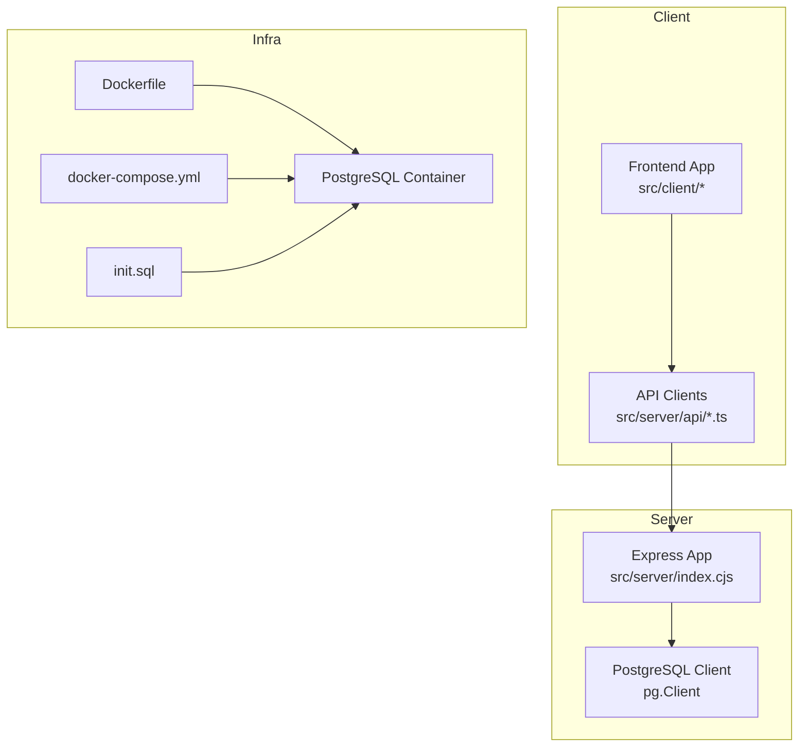
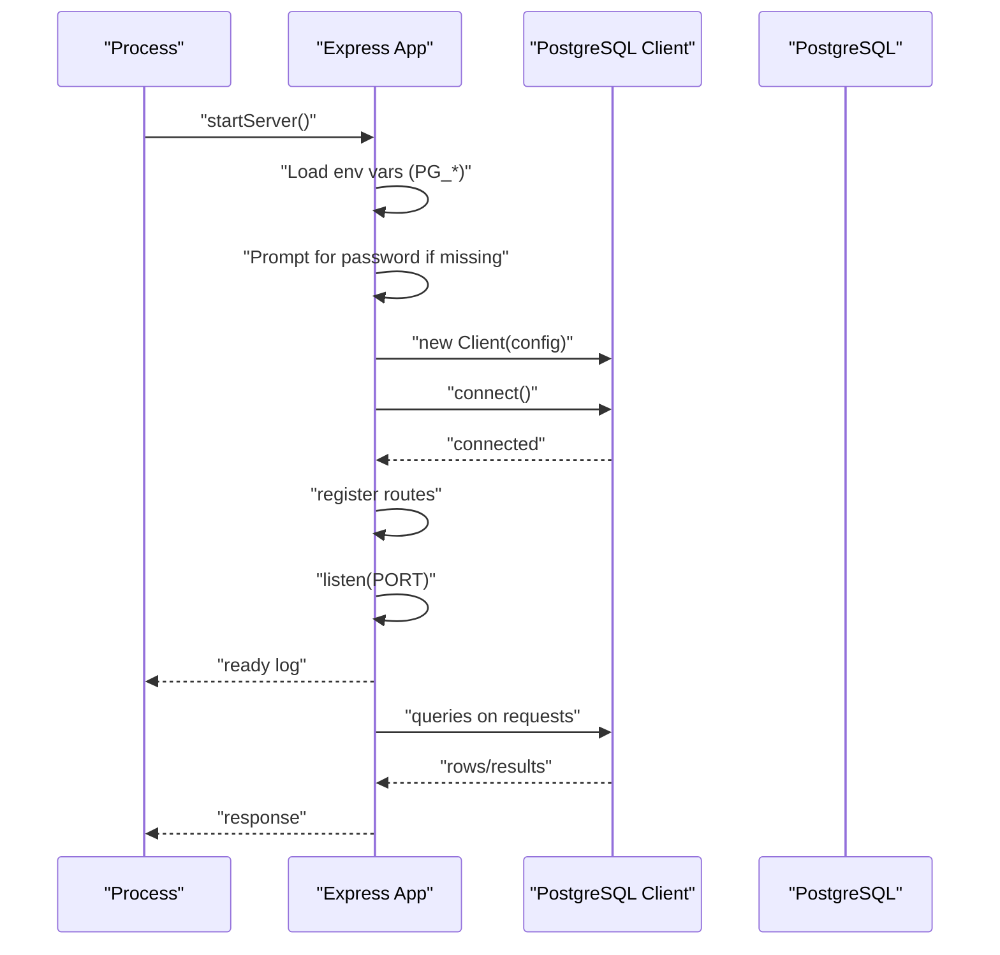
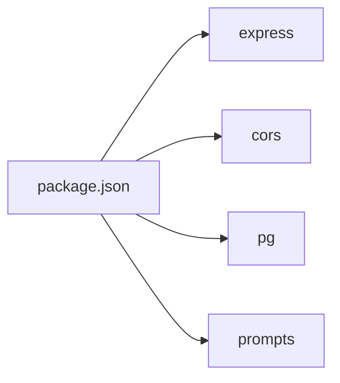

# Express Server Configuration

<cite>
**Referenced Files in This Document**
- [index.cjs](file://src/server/index.cjs)
- [package.json](file://package.json)
- [Dockerfile](file://Dockerfile)
- [docker-compose.yml](file://docker-compose.yml)
- [init.sql](file://src/db/init.sql)
- [README.md](file://README.md)
- [api/config.ts](file://src/server/api/config.ts)
- [api/user.ts](file://src/server/api/user.ts)
- [api/user-app.ts](file://src/server/api/user-app.ts)
- [vite.config.ts](file://vite.config.ts)
</cite>

## Table of Contents
1. [Introduction](#introduction)
2. [Project Structure](#project-structure)
3. [Core Components](#core-components)
4. [Architecture Overview](#architecture-overview)
5. [Detailed Component Analysis](#detailed-component-analysis)
6. [Dependency Analysis](#dependency-analysis)
7. [Performance Considerations](#performance-considerations)
8. [Troubleshooting Guide](#troubleshooting-guide)
9. [Conclusion](#conclusion)
10. [Appendices](#appendices)

## Introduction
This document explains the Express.js server configuration and setup for the project. It covers server initialization, middleware configuration (CORS and JSON parsing), environment variable handling for database connections, dynamic PostgreSQL password prompting, server startup sequence, error handling during connection attempts, graceful shutdown considerations, and practical deployment notes for Docker and docker-compose. It also provides troubleshooting guidance for common startup issues.

## Project Structure
The server is implemented as a single-file Express application that initializes a PostgreSQL client, exposes REST endpoints, and listens on a configurable port. Supporting files include Docker and docker-compose configurations, a database initialization script, and client-side API clients used by the frontend.

**Diagram sources**
- [index.cjs:1-173](file://src/server/index.cjs#L1-L173)
- [Dockerfile:1-40](file://Dockerfile#L1-L40)
- [docker-compose.yml:1-27](file://docker-compose.yml#L1-L27)
- [init.sql:1-26](file://src/db/init.sql#L1-L26)
- [api/config.ts:1-19](file://src/server/api/config.ts#L1-L19)
- [api/user.ts:1-46](file://src/server/api/user.ts#L1-L46)
- [api/user-app.ts:1-73](file://src/server/api/user-app.ts#L1-L73)

**Section sources**
- [README.md:33-96](file://README.md#L33-L96)
- [package.json:1-31](file://package.json#L1-L31)

## Core Components
- Express application with CORS enabled and JSON body parsing middleware.
- PostgreSQL client configured via environment variables with a dynamic password prompt fallback.
- REST endpoints for users, user applications, and theme configuration.
- Server startup with port configuration and logging.

Key implementation references:
- Middleware and routes: [index.cjs:9-173](file://src/server/index.cjs#L9-L173)
- Environment variables for database: [index.cjs:12-36](file://src/server/index.cjs#L12-L36)
- Dynamic password prompt: [index.cjs:15-28](file://src/server/index.cjs#L15-L28)
- Port configuration: [index.cjs:166-169](file://src/server/index.cjs#L166-L169)

**Section sources**
- [index.cjs:1-173](file://src/server/index.cjs#L1-L173)

## Architecture Overview
The server initializes a PostgreSQL client, connects to the database, registers REST endpoints, and starts listening on a port. The frontend communicates with the server via Axios-based API clients.

**Diagram sources**
- [index.cjs:12-173](file://src/server/index.cjs#L12-L173)

## Detailed Component Analysis

### Express Initialization and Middleware
- CORS is enabled globally to allow cross-origin requests.
- JSON body parsing is enabled to handle incoming JSON payloads.
- Routes are registered after successful database connection.

Implementation references:
- Middleware setup: [index.cjs:9-10](file://src/server/index.cjs#L9-L10)
- Route registration: [index.cjs:46-164](file://src/server/index.cjs#L46-L164)

**Section sources**
- [index.cjs:9-173](file://src/server/index.cjs#L9-L173)

### Database Connection and Environment Variables
- The PostgreSQL client is constructed using environment variables:
  - PG_USER, PG_HOST, PG_DATABASE, PG_PASSWORD, PG_PORT
- Defaults are applied when environment variables are not set.
- If PG_PASSWORD or PGPASSWORD is not present, the application prompts for a password at runtime.
- On connection failure, the process exits with a non-zero status code.

Implementation references:
- Environment variable loading and defaults: [index.cjs:12-36](file://src/server/index.cjs#L12-L36)
- Dynamic password prompt: [index.cjs:15-28](file://src/server/index.cjs#L15-L28)
- Connection attempt and error handling: [index.cjs:38-44](file://src/server/index.cjs#L38-L44)

**Section sources**
- [index.cjs:12-44](file://src/server/index.cjs#L12-L44)

### Security Considerations for Password Handling
- The dynamic password prompt prevents storing secrets in code or configuration files.
- Exiting on prompt cancellation avoids proceeding with undefined credentials.
- Using environment variables for other database settings reduces exposure risk.
- Recommendation: Prefer external secret managers or orchestrator-managed secrets in production environments.

Implementation references:
- Prompt and exit on abort: [index.cjs:22-28](file://src/server/index.cjs#L22-L28)

**Section sources**
- [index.cjs:15-28](file://src/server/index.cjs#L15-L28)

### Server Startup Sequence and Port Configuration
- After a successful database connection, the server listens on:
  - PORT from environment variables, defaulting to 3000.
- Logging confirms the server is running on the selected port.

Implementation references:
- Port selection and listen: [index.cjs:166-169](file://src/server/index.cjs#L166-L169)

**Section sources**
- [index.cjs:166-169](file://src/server/index.cjs#L166-L169)

### API Endpoints and Client Integration
- The server exposes endpoints for users, user applications, and theme configuration.
- The frontend consumes these endpoints via Axios-based API clients located under src/server/api.

Endpoints and related references:
- Users: [index.cjs:46-54](file://src/server/index.cjs#L46-L54), [api/user.ts:4-15](file://src/server/api/user.ts#L4-L15)
- Get user by ID: [index.cjs:56-70](file://src/server/index.cjs#L56-L70), [api/user.ts:17-34](file://src/server/api/user.ts#L17-L34)
- User apps: [index.cjs:72-84](file://src/server/index.cjs#L72-L84), [api/user-app.ts:4-17](file://src/server/api/user-app.ts#L4-L17)
- Add user app: [index.cjs:86-103](file://src/server/index.cjs#L86-L103), [api/user-app.ts:19-39](file://src/server/api/user-app.ts#L19-L39)
- Update user app: [index.cjs:105-122](file://src/server/index.cjs#L105-L122), [api/user-app.ts:41-60](file://src/server/api/user-app.ts#L41-L60)
- Add user: [index.cjs:124-136](file://src/server/index.cjs#L124-L136), [api/user.ts:36-45](file://src/server/api/user.ts#L36-L45)
- Theme save: [index.cjs:138-150](file://src/server/index.cjs#L138-L150), [api/config.ts:5-18](file://src/server/api/config.ts#L5-L18)
- Theme get: [index.cjs:152-164](file://src/server/index.cjs#L152-L164), [api/config.ts:5-18](file://src/server/api/config.ts#L5-L18)

**Section sources**
- [index.cjs:46-164](file://src/server/index.cjs#L46-L164)
- [api/user.ts:1-46](file://src/server/api/user.ts#L1-L46)
- [api/user-app.ts:1-73](file://src/server/api/user-app.ts#L1-L73)
- [api/config.ts:1-19](file://src/server/api/config.ts#L1-L19)

### Graceful Shutdown Procedures
- The current implementation does not register signal handlers or close the database connection gracefully.
- Recommended enhancements:
  - Register SIGTERM/SIGINT listeners.
  - Close the PostgreSQL client and stop accepting new requests.
  - Drain in-flight requests before exiting.

[No sources needed since this section provides general guidance]

### Deployment with Docker and docker-compose
- Dockerfile:
  - Installs PostgreSQL client tools.
  - Copies server and client sources.
  - Sets environment variables for database connectivity.
  - Starts PostgreSQL, the Express server, and the Vite dev server concurrently.
- docker-compose:
  - Builds the image and runs the app service.
  - Exposes ports 3000 (Express) and 5173 (Vite).
  - Mounts a volume for PostgreSQL data persistence.
  - Defines environment variables for database configuration.

Implementation references:
- Dockerfile environment variables and commands: [Dockerfile:21-39](file://Dockerfile#L21-L39)
- docker-compose service and ports: [docker-compose.yml:7-18](file://docker-compose.yml#L7-L18)
- Database initialization script: [init.sql:1-26](file://src/db/init.sql#L1-L26)

**Section sources**
- [Dockerfile:1-40](file://Dockerfile#L1-L40)
- [docker-compose.yml:1-27](file://docker-compose.yml#L1-L27)
- [init.sql:1-26](file://src/db/init.sql#L1-L26)

## Dependency Analysis
The server depends on Express, CORS, the PostgreSQL driver, and the prompts library for interactive password input. The frontend uses Axios-based API clients to communicate with the server.

**Diagram sources**
- [package.json:12-21](file://package.json#L12-L21)

**Section sources**
- [package.json:12-21](file://package.json#L12-L21)

## Performance Considerations
- Connection pooling: Consider using a dedicated connection pooler (e.g., pgBouncer) in production to reduce connection overhead.
- Middleware order: Keep CORS and JSON parsing early to avoid unnecessary work for invalid requests.
- Endpoint design: Use pagination for large datasets and appropriate HTTP status codes.
- Resource cleanup: Implement graceful shutdown to prevent resource leaks.

[No sources needed since this section provides general guidance]

## Troubleshooting Guide
Common startup issues and resolutions:

- PostgreSQL connection fails:
  - Verify environment variables for host, port, user, password, and database.
  - Confirm the database is reachable and credentials are correct.
  - Review connection error logs and exit status.
  - References: [index.cjs:38-44](file://src/server/index.cjs#L38-L44)

- Missing or empty password:
  - Ensure PG_PASSWORD or PGPASSWORD is set in the environment.
  - If not set, the application will prompt for a password; canceling exits the process.
  - References: [index.cjs:13-28](file://src/server/index.cjs#L13-L28)

- Port already in use:
  - Change the PORT environment variable or stop the conflicting service.
  - References: [index.cjs:166-169](file://src/server/index.cjs#L166-L169)

- Docker container networking:
  - Confirm ports 3000 and 5173 are exposed and mapped correctly.
  - Ensure database environment variables match the container’s network configuration.
  - References: [Dockerfile:33-39](file://Dockerfile#L33-L39), [docker-compose.yml:7-18](file://docker-compose.yml#L7-L18)

- Database initialization:
  - Confirm the init script creates the database and tables as expected.
  - References: [init.sql:1-26](file://src/db/init.sql#L1-L26)

**Section sources**
- [index.cjs:13-44](file://src/server/index.cjs#L13-L44)
- [index.cjs:166-169](file://src/server/index.cjs#L166-L169)
- [Dockerfile:33-39](file://Dockerfile#L33-L39)
- [docker-compose.yml:7-18](file://docker-compose.yml#L7-L18)
- [init.sql:1-26](file://src/db/init.sql#L1-L26)

## Conclusion
The Express server is a minimal, self-contained backend that connects to PostgreSQL, exposes essential CRUD endpoints, and integrates with a Vue-based frontend. Its configuration relies heavily on environment variables, with a dynamic password prompt for interactive setups. For production deployments, consider adding connection pooling, graceful shutdown, and robust secret management.

## Appendices

### Environment Variable Reference
- PG_USER: PostgreSQL user (default: postgres)
- PG_HOST: PostgreSQL host (default: localhost)
- PG_DATABASE: Database name (default: startora)
- PG_PASSWORD or PGPASSWORD: PostgreSQL password (prompted if missing)
- PG_PORT: PostgreSQL port (default: 5432)
- PORT: Server port (default: 3000)

References:
- [index.cjs:12-36](file://src/server/index.cjs#L12-L36)
- [index.cjs:166-169](file://src/server/index.cjs#L166-L169)

**Section sources**
- [index.cjs:12-36](file://src/server/index.cjs#L12-L36)
- [index.cjs:166-169](file://src/server/index.cjs#L166-L169)

### Frontend API Base URL
- The frontend API base URL is configured to http://localhost:3000.
- Adjust this value when deploying behind a proxy or different host/port.

References:
- [api/config.ts](file://src/server/api/config.ts#L3)

**Section sources**
- [api/config.ts](file://src/server/api/config.ts#L3)

### Vite Configuration Notes
- Vite aliases @ to /src for convenient imports.
- Useful for frontend tooling alignment with the project structure.

References:
- [vite.config.ts:7-11](file://vite.config.ts#L7-L11)

**Section sources**
- [vite.config.ts:7-11](file://vite.config.ts#L7-L11)