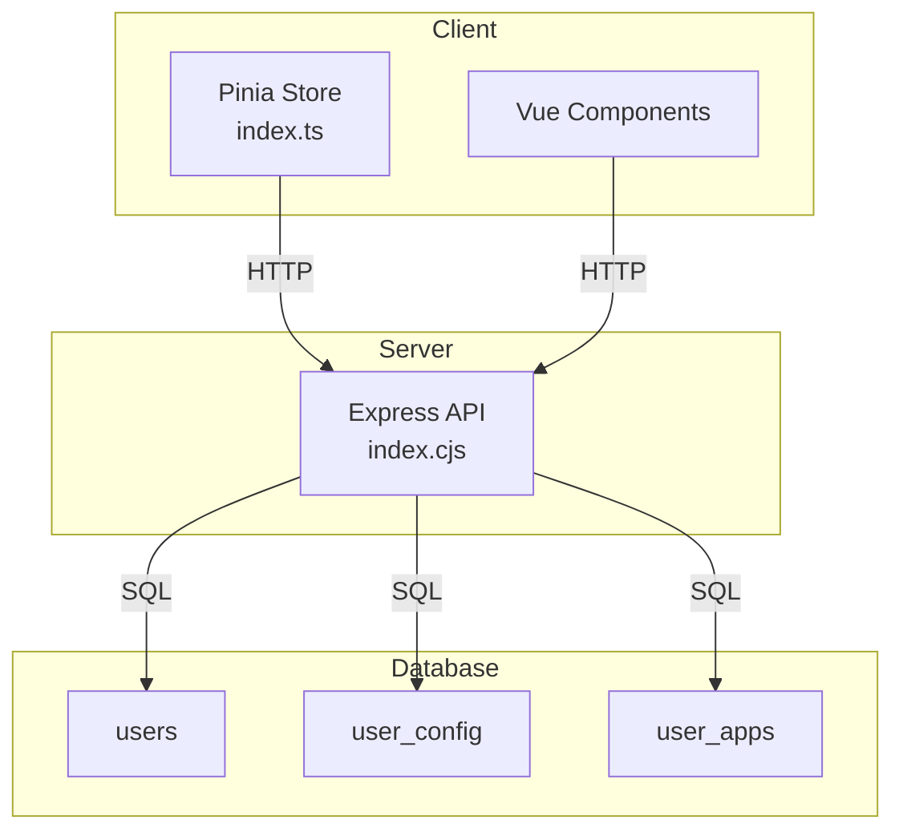
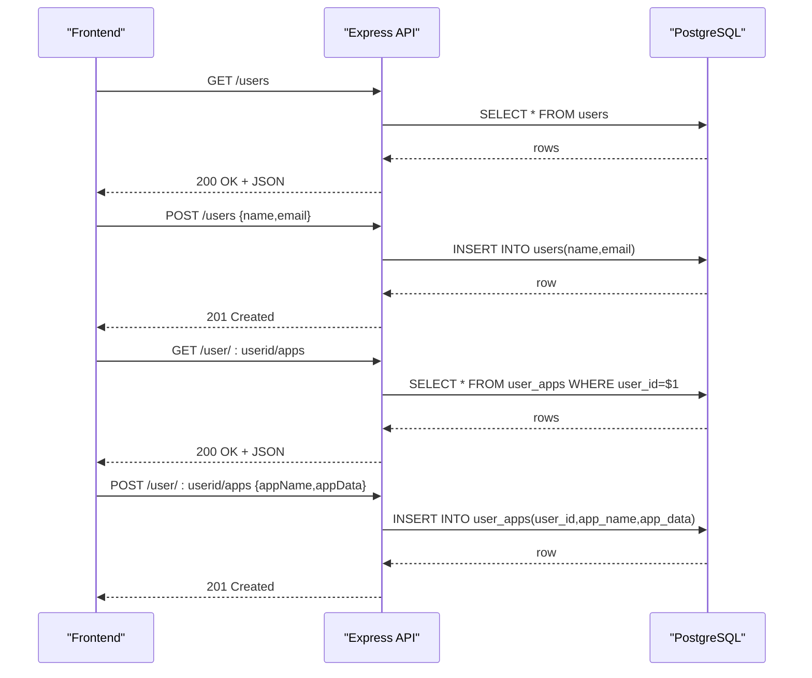
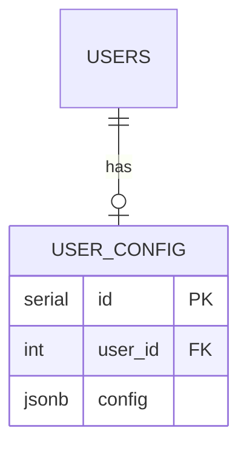
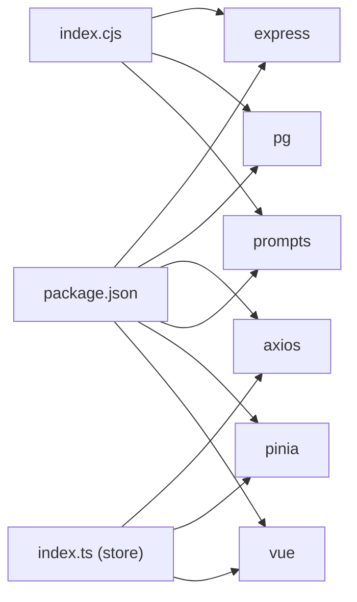

# Database Schema

<cite>
**Referenced Files in This Document**
- [init.sql](file://src/db/init.sql)
- [index.cjs](file://src/server/index.cjs)
- [user.ts](file://src/server/api/user.ts)
- [user-app.ts](file://src/server/api/user-app.ts)
- [config.ts](file://src/server/api/config.ts)
- [index.ts](file://src/client/store/index.ts)
- [user.d.ts](file://src/client/types/user.d.ts)
- [store.d.ts](file://src/client/types/store.d.ts)
- [docker-compose.yml](file://docker-compose.yml)
- [package.json](file://package.json)
</cite>

## Table of Contents
1. [Introduction](#introduction)
2. [Project Structure](#project-structure)
3. [Core Components](#core-components)
4. [Architecture Overview](#architecture-overview)
5. [Detailed Component Analysis](#detailed-component-analysis)
6. [Dependency Analysis](#dependency-analysis)
7. [Performance Considerations](#performance-considerations)
8. [Troubleshooting Guide](#troubleshooting-guide)
9. [Conclusion](#conclusion)
10. [Appendices](#appendices)

## Introduction
This document describes Startora’s PostgreSQL database schema and the associated data access patterns. It focuses on the users, user configuration, and user applications tables, detailing table structures, constraints, relationships, and indexing strategies. It also covers data validation rules, business logic constraints, data lifecycle considerations, security posture, and migration/versioning guidance derived from the repository’s implementation.

## Project Structure
The database schema is initialized via a SQL script and consumed by a Node.js/Express API server that exposes CRUD endpoints. The frontend Vue/Pinia store interacts with the API to manage user sessions, applications, and theme preferences.



**Diagram sources**
- [init.sql:6-25](file://src/db/init.sql#L6-L25)
- [index.cjs:46-172](file://src/server/index.cjs#L46-L172)
- [index.ts:1-91](file://src/client/store/index.ts#L1-L91)

**Section sources**
- [init.sql:1-26](file://src/db/init.sql#L1-L26)
- [index.cjs:1-173](file://src/server/index.cjs#L1-L173)
- [docker-compose.yml:1-27](file://docker-compose.yml#L1-L27)

## Core Components
This section documents the three core relational tables and their roles in the system.

- users
  - Purpose: Stores user identities.
  - Primary key: id (auto-incrementing integer).
  - Fields:
    - id: serial (primary key)
    - name: varchar(100)
    - email: varchar(100) unique, not null
  - Constraints:
    - Unique constraint on email.
    - Not-null constraint on email.
  - Indexing strategy:
    - Primary key index is implicit.
    - Consider adding an index on email for frequent lookups by email address.

- user_config
  - Purpose: Stores per-user configuration data (e.g., theme).
  - Primary key: id (auto-incrementing integer).
  - Foreign key: user_id references users(id).
  - Fields:
    - id: serial (primary key)
    - user_id: int (foreign key)
    - config: jsonb (stores structured configuration)
  - Constraints:
    - Foreign key relationship to users.
  - Indexing strategy:
    - Primary key index is implicit.
    - Consider adding an index on user_id for efficient joins and lookups.

- user_apps
  - Purpose: Stores user-specific application entries.
  - Primary key: id (auto-incrementing integer).
  - Foreign key: user_id references users(id).
  - Fields:
    - id: serial (primary key)
    - user_id: int (foreign key)
    - app_name: varchar(100) not null
    - app_data: jsonb (stores structured app metadata)
  - Constraints:
    - Foreign key relationship to users.
    - Not-null constraint on app_name.
  - Indexing strategy:
    - Primary key index is implicit.
    - Consider adding an index on user_id and app_name for filtering and joins.

Notes on JSONB usage:
- config and app_data are stored as JSONB, enabling flexible schema-less storage and efficient querying of nested fields. Consider adding generated columns or GIN indexes if frequently queried subfields are accessed often.

**Section sources**
- [init.sql:6-25](file://src/db/init.sql#L6-L25)

## Architecture Overview
The system follows a thin server architecture:
- Frontend (Vue + Pinia) calls REST endpoints exposed by the Express server.
- The Express server connects to PostgreSQL using the pg client and executes queries against the users, user_config, and user_apps tables.



**Diagram sources**
- [index.cjs:46-136](file://src/server/index.cjs#L46-L136)
- [user-app.ts:5-39](file://src/server/api/user-app.ts#L5-L39)
- [user.ts:5-45](file://src/server/api/user.ts#L5-L45)

**Section sources**
- [index.cjs:1-173](file://src/server/index.cjs#L1-L173)
- [user-app.ts:1-73](file://src/server/api/user-app.ts#L1-L73)
- [user.ts:1-46](file://src/server/api/user.ts#L1-L46)

## Detailed Component Analysis

### users Table
- Purpose: Identity and contact information for users.
- Constraints:
  - email uniqueness enforced at the database level.
  - email not null enforced at the database level.
- Access patterns:
  - Listing all users.
  - Fetching a single user by id.
  - Creating a new user.
- Recommendations:
  - Add an index on email if email-based lookups are frequent.
  - Consider normalizing roles/permissions into a separate table if access control grows.

```mermaid
erDiagram
USERS {
serial id PK
varchar name
varchar email UK NN
}
```

**Diagram sources**
- [init.sql:6-10](file://src/db/init.sql#L6-L10)

**Section sources**
- [init.sql:6-10](file://src/db/init.sql#L6-L10)
- [index.cjs:46-70](file://src/server/index.cjs#L46-L70)
- [user.ts:5-45](file://src/server/api/user.ts#L5-L45)

### user_config Table
- Purpose: Per-user configuration (e.g., theme).
- Relationship: One user has one configuration row.
- Constraints:
  - user_id references users(id).
- Access patterns:
  - Save theme for a user.
  - Retrieve theme for a user.
- Recommendations:
  - Add an index on user_id for fast joins.
  - Consider a unique index on user_id to enforce one-config-per-user semantics.



**Diagram sources**
- [init.sql:13-17](file://src/db/init.sql#L13-L17)
- [index.cjs:138-164](file://src/server/index.cjs#L138-L164)

**Section sources**
- [init.sql:13-17](file://src/db/init.sql#L13-L17)
- [index.cjs:138-164](file://src/server/index.cjs#L138-L164)
- [config.ts:1-19](file://src/server/api/config.ts#L1-L19)

### user_apps Table
- Purpose: Stores user-specific application entries with flexible metadata.
- Relationship: One user can have many apps.
- Constraints:
  - user_id references users(id).
  - app_name not null.
- Access patterns:
  - List apps for a user.
  - Add a new app for a user.
  - Update an existing app for a user.
  - Delete an app for a user.
- Recommendations:
  - Add an index on user_id for filtering by user.
  - Consider adding an index on app_name if searching by name is common.

```mermaid
erDiagram
USERS ||--o{ USER_APPS : "owns"
USER_APPS {
serial id PK
int user_id FK
varchar app_name NN
jsonb app_data
}
```

**Diagram sources**
- [init.sql:19-25](file://src/db/init.sql#L19-L25)
- [index.cjs:72-136](file://src/server/index.cjs#L72-L136)
- [user-app.ts:5-73](file://src/server/api/user-app.ts#L5-L73)

**Section sources**
- [init.sql:19-25](file://src/db/init.sql#L19-L25)
- [index.cjs:72-136](file://src/server/index.cjs#L72-L136)
- [user-app.ts:1-73](file://src/server/api/user-app.ts#L1-L73)

### Data Validation and Business Logic Constraints
- Email uniqueness and not-null enforcement are handled at the database level for users.
- app_name not-null enforcement is handled at the database level for user_apps.
- user_id foreign key constraints ensure referential integrity between users and user_config/user_apps.
- API-level validations:
  - Users are fetched and created via API endpoints.
  - Apps are fetched, added, updated, and deleted via API endpoints.
  - Theme persistence is handled via API endpoints.

**Section sources**
- [init.sql:6-25](file://src/db/init.sql#L6-L25)
- [index.cjs:46-172](file://src/server/index.cjs#L46-L172)
- [user.ts:1-46](file://src/server/api/user.ts#L1-L46)
- [user-app.ts:1-73](file://src/server/api/user-app.ts#L1-L73)
- [config.ts:1-19](file://src/server/api/config.ts#L1-L19)

### Sample Data Structures
- users
  - Example fields: id, name, email
  - Example constraints: unique email, not null email
- user_config
  - Example fields: id, user_id, config (JSONB)
  - Example constraints: foreign key to users
- user_apps
  - Example fields: id, user_id, app_name, app_data (JSONB)
  - Example constraints: foreign key to users, not null app_name

**Section sources**
- [init.sql:6-25](file://src/db/init.sql#L6-L25)
- [user.d.ts:1-6](file://src/client/types/user.d.ts#L1-L6)
- [store.d.ts:1-7](file://src/client/types/store.d.ts#L1-L7)

## Dependency Analysis
- Backend dependencies:
  - Express for HTTP routing.
  - pg for PostgreSQL connectivity.
  - cors for cross-origin allowance.
  - prompts for interactive password input when environment variables are not set.
- Frontend dependencies:
  - axios for HTTP requests to the API.
  - pinia for state management.
  - vue for UI components.



**Diagram sources**
- [package.json:12-30](file://package.json#L12-L30)
- [index.cjs:3-10](file://src/server/index.cjs#L3-L10)
- [index.ts:1-4](file://src/client/store/index.ts#L1-L4)

**Section sources**
- [package.json:1-31](file://package.json#L1-L31)
- [index.cjs:1-173](file://src/server/index.cjs#L1-L173)
- [index.ts:1-91](file://src/client/store/index.ts#L1-L91)

## Performance Considerations
- Current state:
  - No explicit indexes beyond primary keys.
  - Queries use simple filters (by id and user_id).
- Recommended improvements:
  - Add indexes on users(email) and user_apps(user_id) for improved lookup performance.
  - Consider GIN indexes on JSONB columns if deep queries on config/app_data are frequent.
  - Connection pooling:
    - The current implementation creates a single Client per server startup. For production, adopt a dedicated connection pooler (e.g., pgBouncer) or a higher-level ORM with built-in pooling to handle concurrent requests efficiently.
  - Query patterns:
    - Favor parameterized queries (already used) to prevent SQL injection and improve plan reuse.
    - Batch operations should be considered if bulk updates are needed.

[No sources needed since this section provides general guidance]

## Troubleshooting Guide
- Connection failures:
  - Verify environment variables for database credentials and host.
  - Confirm the database service is reachable and accepting connections.
- Permission errors:
  - Ensure the database user has privileges to create tables and insert data.
- Data integrity errors:
  - Duplicate email during user creation will fail due to unique constraint.
  - Attempting to insert an app without app_name will fail due to not-null constraint.
- API errors:
  - Inspect server logs for 5xx responses indicating internal errors.
  - Validate request payloads match expected shapes (e.g., user creation requires name and email).

**Section sources**
- [index.cjs:12-44](file://src/server/index.cjs#L12-L44)
- [init.sql:6-25](file://src/db/init.sql#L6-L25)

## Conclusion
Startora’s database schema is intentionally minimal and flexible, leveraging PostgreSQL’s native capabilities (e.g., JSONB) to support evolving configuration and application metadata. The schema enforces essential integrity constraints at the database level and is consumed by a straightforward Express API and Vue/Pinia frontend. To operate reliably at scale, introduce targeted indexes, adopt connection pooling, and formalize migration/versioning practices.

[No sources needed since this section summarizes without analyzing specific files]

## Appendices

### Data Lifecycle, Retention, and Backup/Recovery
- Lifecycle:
  - Users are created and retained until deletion.
  - Applications and configurations persist per user.
- Retention:
  - No explicit retention policies are defined in the schema or server code.
- Backup/Recovery:
  - Use standard PostgreSQL backup tools (e.g., pg_dump/pg_restore).
  - Consider WAL archiving and point-in-time recovery (PITR) for production environments.

[No sources needed since this section provides general guidance]

### Security and Access Control
- Transport:
  - The API runs on localhost by default; expose externally with TLS termination at a reverse proxy.
- Authentication:
  - No authentication or authorization logic is present in the server code; consider adding JWT or session-based auth.
- Authorization:
  - Enforce row-level access control (RLS) or application-level checks to ensure users can only access their own data.
- Secrets:
  - Store database credentials in environment variables or a secrets manager; avoid hardcoding.

[No sources needed since this section provides general guidance]

### Migration Paths and Version Management
- Current state:
  - Schema is initialized via a single SQL script.
- Recommendations:
  - Adopt a lightweight migration framework (e.g., migrate, Knex migrations, or a custom migration runner).
  - Keep migrations idempotent and reversible.
  - Track applied migrations in a dedicated table.
  - Automate migrations in CI/CD pipelines before deploying schema changes.

[No sources needed since this section provides general guidance]