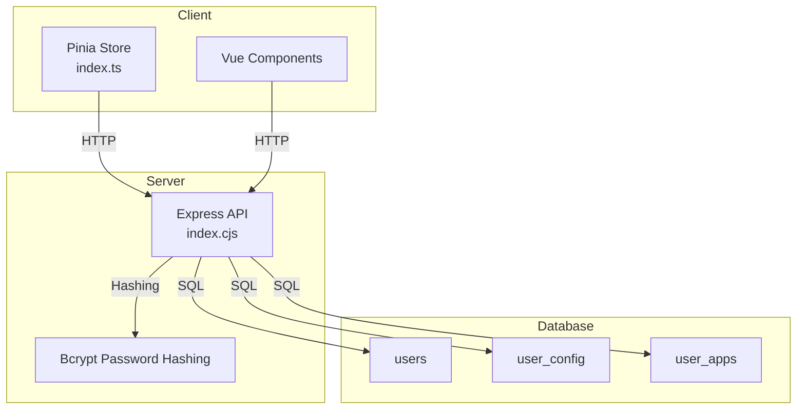
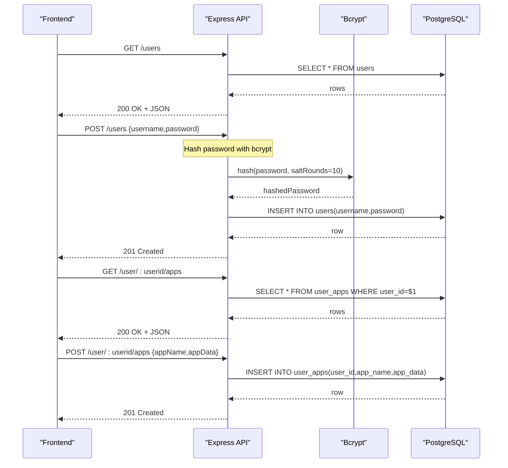
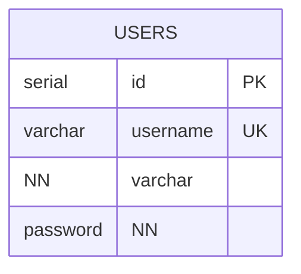
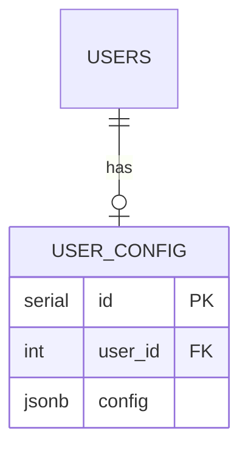
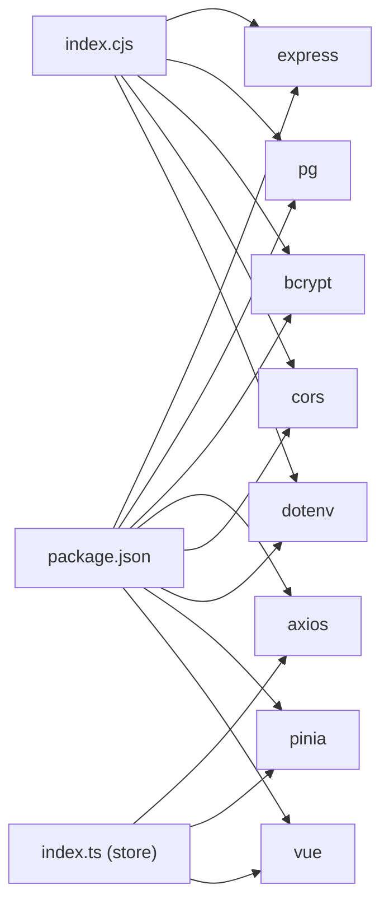

# Database Schema

<cite>
**Referenced Files in This Document**
- [init.sql](file://src/db/init.sql)
- [index.cjs](file://src/server/index.cjs)
- [user.ts](file://src/server/api/user.ts)
- [user-app.ts](file://src/server/api/user-app.ts)
- [config.ts](file://src/server/api/config.ts)
- [index.ts](file://src/client/store/index.ts)
- [user.d.ts](file://src/client/types/user.d.ts)
- [store.d.ts](file://src/client/types/store.d.ts)
- [docker-compose.yml](file://docker-compose.yml)
- [package.json](file://package.json)
</cite>

## Update Summary
**Changes Made**
- Updated user table structure from name/email to username/password fields
- Added bcrypt password hashing integration
- Updated API endpoints to handle username/password authentication
- Modified client-side user type definitions to reflect new structure
- Enhanced database initialization with Node.js compatibility

## Table of Contents
1. [Introduction](#introduction)
2. [Project Structure](#project-structure)
3. [Core Components](#core-components)
4. [Architecture Overview](#architecture-overview)
5. [Detailed Component Analysis](#detailed-component-analysis)
6. [Dependency Analysis](#dependency-analysis)
7. [Performance Considerations](#performance-considerations)
8. [Troubleshooting Guide](#troubleshooting-guide)
9. [Conclusion](#conclusion)
10. [Appendices](#appendices)

## Introduction
This document describes Startora's PostgreSQL database schema and the associated data access patterns. It focuses on the users, user configuration, and user applications tables, detailing table structures, constraints, relationships, and indexing strategies. The schema has been modernized with improved table structures, enhanced security measures including password hashing, and Node.js compatible initialization scripts. It also covers data validation rules, business logic constraints, data lifecycle considerations, security posture, and migration/versioning guidance derived from the repository's implementation.

## Project Structure
The database schema is initialized via a Node.js compatible SQL script and consumed by a Node.js/Express API server that exposes CRUD endpoints with bcrypt password hashing. The frontend Vue/Pinia store interacts with the API to manage user sessions, applications, and theme preferences.



**Diagram sources**
- [init.sql:1-25](file://src/db/init.sql#L1-L25)
- [index.cjs:9,146-151](file://src/server/index.cjs#L9,L146-L151)
- [index.ts:1-101](file://src/client/store/index.ts#L1-L101)

**Section sources**
- [init.sql:1-25](file://src/db/init.sql#L1-L25)
- [index.cjs:1-199](file://src/server/index.cjs#L1-L199)
- [docker-compose.yml:1-27](file://docker-compose.yml#L1-L27)

## Core Components
This section documents the three core relational tables and their roles in the system, reflecting the updated user table structure with username/password authentication.

- users
  - Purpose: Stores user identities with secure credential management.
  - Primary key: id (auto-incrementing integer).
  - Fields:
    - id: serial (primary key)
    - username: varchar(100) unique, not null
    - password: varchar(255) not null
  - Constraints:
    - Unique constraint on username.
    - Not-null constraint on username and password.
  - Security measures:
    - Passwords are hashed using bcrypt before storage.
    - Salt rounds: 10 for password hashing.
  - Indexing strategy:
    - Primary key index is implicit.
    - Consider adding an index on username for frequent lookups by username.

- user_config
  - Purpose: Stores per-user configuration data (e.g., theme).
  - Primary key: id (auto-incrementing integer).
  - Foreign key: user_id references users(id).
  - Fields:
    - id: serial (primary key)
    - user_id: int (foreign key)
    - config: jsonb (stores structured configuration)
  - Constraints:
    - Foreign key relationship to users.
  - Indexing strategy:
    - Primary key index is implicit.
    - Consider adding an index on user_id for efficient joins and lookups.

- user_apps
  - Purpose: Stores user-specific application entries.
  - Primary key: id (auto-incrementing integer).
  - Foreign key: user_id references users(id).
  - Fields:
    - id: serial (primary key)
    - user_id: int (foreign key)
    - app_name: varchar(100) not null
    - app_data: jsonb (stores structured app metadata)
  - Constraints:
    - Foreign key relationship to users.
    - Not-null constraint on app_name.
  - Indexing strategy:
    - Primary key index is implicit.
    - Consider adding an index on user_id and app_name for filtering and joins.

Notes on JSONB usage:
- config and app_data are stored as JSONB, enabling flexible schema-less storage and efficient querying of nested fields. Consider adding generated columns or GIN indexes if frequently queried subfields are accessed often.

**Section sources**
- [init.sql:5-24](file://src/db/init.sql#L5-L24)
- [index.cjs:146-151](file://src/server/index.cjs#L146-L151)

## Architecture Overview
The system follows a thin server architecture with enhanced security:
- Frontend (Vue + Pinia) calls REST endpoints exposed by the Express server.
- The Express server connects to PostgreSQL using the pg client and executes queries against the users, user_config, and user_apps tables.
- Passwords are hashed using bcrypt before being stored in the database.
- Database initialization is performed via a Node.js compatible SQL script.



**Diagram sources**
- [index.cjs:55-162](file://src/server/index.cjs#L55-L162)
- [user-app.ts:5-73](file://src/server/api/user-app.ts#L5-L73)
- [user.ts:37-46](file://src/server/api/user.ts#L37-L46)

**Section sources**
- [index.cjs:1-199](file://src/server/index.cjs#L1-L199)
- [user-app.ts:1-73](file://src/server/api/user-app.ts#L1-L73)
- [user.ts:1-47](file://src/server/api/user.ts#L1-L47)

## Detailed Component Analysis

### users Table
- Purpose: Identity and credential storage for users with enhanced security.
- Security enhancements:
  - Username/password authentication system replaces name/email.
  - Passwords are hashed using bcrypt with salt rounds = 10.
  - Unique username constraint prevents duplicate accounts.
- Constraints:
  - username uniqueness enforced at the database level.
  - username and password not null enforced at the database level.
- Access patterns:
  - Listing all users.
  - Fetching a single user by id.
  - Creating a new user with hashed password.
- Recommendations:
  - Add an index on username if username-based lookups are frequent.
  - Consider normalizing roles/permissions into a separate table if access control grows.



**Diagram sources**
- [init.sql:5-9](file://src/db/init.sql#L5-L9)

**Section sources**
- [init.sql:5-9](file://src/db/init.sql#L5-L9)
- [index.cjs:134-162](file://src/server/index.cjs#L134-L162)
- [user.ts:37-46](file://src/server/api/user.ts#L37-L46)

### user_config Table
- Purpose: Per-user configuration (e.g., theme).
- Relationship: One user has one configuration row.
- Constraints:
  - user_id references users(id).
- Access patterns:
  - Save theme for a user.
  - Retrieve theme for a user.
- Recommendations:
  - Add an index on user_id for fast joins.
  - Consider a unique index on user_id to enforce one-config-per-user semantics.



**Diagram sources**
- [init.sql:12-16](file://src/db/init.sql#L12-L16)
- [index.cjs:164-190](file://src/server/index.cjs#L164-L190)

**Section sources**
- [init.sql:12-16](file://src/db/init.sql#L12-L16)
- [index.cjs:164-190](file://src/server/index.cjs#L164-L190)
- [config.ts:1-19](file://src/server/api/config.ts#L1-L19)

### user_apps Table
- Purpose: Stores user-specific application entries with flexible metadata.
- Relationship: One user can have many apps.
- Constraints:
  - user_id references users(id).
  - app_name not null.
- Access patterns:
  - List apps for a user.
  - Add a new app for a user.
  - Update an existing app for a user.
  - Delete an app for a user.
- Recommendations:
  - Add an index on user_id for filtering by user.
  - Consider adding an index on app_name if searching by name is common.

```mermaid
erDiagram
USERS ||--o{ USER_APPS : "owns"
USER_APPS {
serial id PK
int user_id FK
varchar app_name NN
jsonb app_data
}
```

**Diagram sources**
- [init.sql:18-24](file://src/db/init.sql#L18-L24)
- [index.cjs:81-131](file://src/server/index.cjs#L81-L131)
- [user-app.ts:5-73](file://src/server/api/user-app.ts#L5-L73)

**Section sources**
- [init.sql:18-24](file://src/db/init.sql#L18-L24)
- [index.cjs:81-131](file://src/server/index.cjs#L81-L131)
- [user-app.ts:1-73](file://src/server/api/user-app.ts#L1-L73)

### Data Validation and Business Logic Constraints
- Username uniqueness and not-null enforcement are handled at the database level for users.
- Password hashing is implemented using bcrypt with salt rounds = 10 before database insertion.
- app_name not-null enforcement is handled at the database level for user_apps.
- user_id foreign key constraints ensure referential integrity between users and user_config/user_apps.
- API-level validations:
  - Users are fetched and created via API endpoints with proper error handling.
  - Passwords are validated and hashed before insertion.
  - Apps are fetched, added, updated, and deleted via API endpoints.
  - Theme persistence is handled via API endpoints.

**Section sources**
- [init.sql:5-24](file://src/db/init.sql#L5-L24)
- [index.cjs:134-162](file://src/server/index.cjs#L134-L162)
- [user.ts:1-47](file://src/server/api/user.ts#L1-L47)
- [user-app.ts:1-73](file://src/server/api/user-app.ts#L1-L73)
- [config.ts:1-19](file://src/server/api/config.ts#L1-L19)

### Sample Data Structures
- users
  - Example fields: id, username, password (hashed)
  - Example constraints: unique username, not null username and password
- user_config
  - Example fields: id, user_id, config (JSONB)
  - Example constraints: foreign key to users
- user_apps
  - Example fields: id, user_id, app_name, app_data (JSONB)
  - Example constraints: foreign key to users, not null app_name

**Section sources**
- [init.sql:5-24](file://src/db/init.sql#L5-L24)
- [user.d.ts:1-6](file://src/client/types/user.d.ts#L1-L6)
- [store.d.ts:1-7](file://src/client/types/store.d.ts#L1-L7)

## Dependency Analysis
- Backend dependencies:
  - Express for HTTP routing.
  - pg for PostgreSQL connectivity.
  - bcrypt for password hashing.
  - cors for cross-origin allowance.
  - dotenv for environment variable management.
- Frontend dependencies:
  - axios for HTTP requests to the API.
  - pinia for state management.
  - vue for UI components.



**Diagram sources**
- [package.json:12-31](file://package.json#L12-L31)
- [index.cjs:3-10](file://src/server/index.cjs#L3-L10)
- [index.ts:1-4](file://src/client/store/index.ts#L1-L4)

**Section sources**
- [package.json:1-33](file://package.json#L1-L33)
- [index.cjs:1-199](file://src/server/index.cjs#L1-L199)
- [index.ts:1-101](file://src/client/store/index.ts#L1-L101)

## Performance Considerations
- Current state:
  - No explicit indexes beyond primary keys.
  - Queries use simple filters (by id and user_id).
  - Password hashing adds computational overhead but improves security.
- Recommended improvements:
  - Add indexes on users(username) and user_apps(user_id) for improved lookup performance.
  - Consider GIN indexes on JSONB columns if deep queries on config/app_data are frequent.
  - Connection pooling:
    - The current implementation creates a single Client per server startup. For production, adopt a dedicated connection pooler (e.g., pgBouncer) or a higher-level ORM with built-in pooling to handle concurrent requests efficiently.
  - Query patterns:
    - Favor parameterized queries (already used) to prevent SQL injection and improve plan reuse.
    - Batch operations should be considered if bulk updates are needed.
  - Security performance:
    - Bcrypt salt rounds = 10 provides good security/performance balance.
    - Consider adjusting salt rounds based on hardware capabilities and security requirements.

## Troubleshooting Guide
- Connection failures:
  - Verify environment variables for database credentials and host.
  - Confirm the database service is reachable and accepting connections.
- Permission errors:
  - Ensure the database user has privileges to create tables and insert data.
- Data integrity errors:
  - Duplicate username during user creation will fail due to unique constraint.
  - Attempting to insert an app without app_name will fail due to not-null constraint.
- Password-related issues:
  - Passwords are automatically hashed using bcrypt before storage.
  - Ensure bcrypt is properly installed and configured.
- API errors:
  - Inspect server logs for 5xx responses indicating internal errors.
  - Validate request payloads match expected shapes (e.g., user creation requires username and password).
  - Check for duplicate username errors (error code 23505).

**Section sources**
- [index.cjs:12-53](file://src/server/index.cjs#L12-L53)
- [init.sql:5-24](file://src/db/init.sql#L5-L24)
- [index.cjs:145-162](file://src/server/index.cjs#L145-L162)

## Conclusion
Startora's database schema has been modernized with enhanced security measures and improved table structures. The transition from name/email to username/password authentication, combined with bcrypt password hashing, provides a more secure foundation for user management. The schema leverages PostgreSQL's native capabilities (e.g., JSONB) to support evolving configuration and application metadata while enforcing essential integrity constraints. To operate reliably at scale, introduce targeted indexes, adopt connection pooling, implement proper authentication/authorization, and formalize migration/versioning practices.

## Appendices

### Data Lifecycle, Retention, and Backup/Recovery
- Lifecycle:
  - Users are created with hashed passwords and retained until deletion.
  - Applications and configurations persist per user.
- Retention:
  - No explicit retention policies are defined in the schema or server code.
- Backup/Recovery:
  - Use standard PostgreSQL backup tools (e.g., pg_dump/pg_restore).
  - Consider WAL archiving and point-in-time recovery (PITR) for production environments.
  - Ensure backup includes both schema and hashed password data.

### Security and Access Control
- Transport:
  - The API runs on localhost by default; expose externally with TLS termination at a reverse proxy.
- Authentication:
  - Username/password authentication with bcrypt password hashing.
  - Passwords are hashed with salt rounds = 10 before storage.
  - Consider implementing rate limiting for authentication attempts.
- Authorization:
  - Enforce row-level access control (RLS) or application-level checks to ensure users can only access their own data.
  - Implement session management and token-based authentication for production use.
- Secrets:
  - Store database credentials in environment variables or a secrets manager; avoid hardcoding.
  - Consider rotating bcrypt salt rounds periodically for enhanced security.

### Migration Paths and Version Management
- Current state:
  - Schema is initialized via a Node.js compatible SQL script (init.sql renamed to init-node.sql).
  - Database initialization checks for table existence and creates tables if they don't exist.
- Recommendations:
  - Adopt a lightweight migration framework (e.g., migrate, Knex migrations, or a custom migration runner).
  - Keep migrations idempotent and reversible.
  - Track applied migrations in a dedicated table.
  - Automate migrations in CI/CD pipelines before deploying schema changes.
  - Consider implementing database versioning alongside application versioning.
  - Document the transition from name/email to username/password schema changes.

### Database Initialization and Node.js Compatibility
- The database initialization script has been updated to be Node.js compatible:
  - Removed psql meta-commands and replaced with standard SQL statements.
  - Uses CREATE TABLE IF NOT EXISTS for safe initialization.
  - Server-side initialization checks for table existence before creating tables.
  - Supports dynamic database initialization through the Express server.

**Section sources**
- [init.sql:1-4](file://src/db/init.sql#L1-L4)
- [index.cjs:32-53](file://src/server/index.cjs#L32-L53)