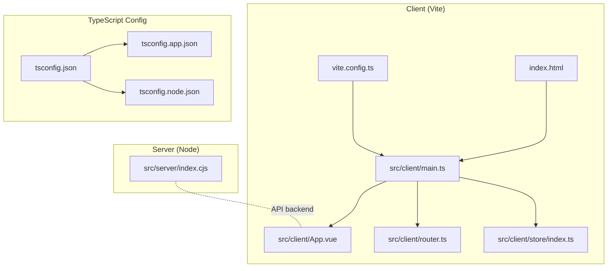
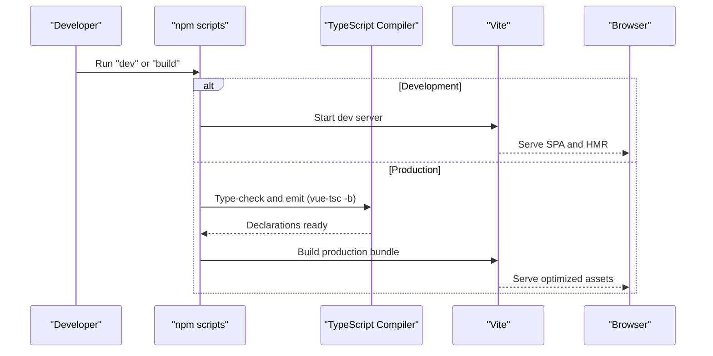
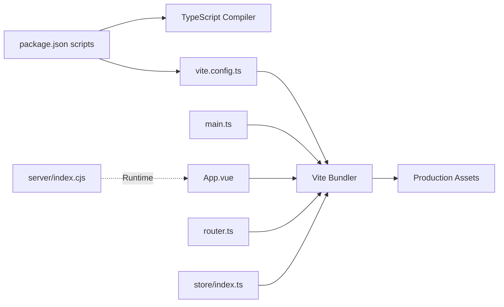

# Build System Configuration

<cite>
**Referenced Files in This Document**
- [vite.config.ts](file://vite.config.ts)
- [package.json](file://package.json)
- [tsconfig.json](file://tsconfig.json)
- [tsconfig.app.json](file://tsconfig.app.json)
- [tsconfig.node.json](file://tsconfig.node.json)
- [index.html](file://index.html)
- [src/client/main.ts](file://src/client/main.ts)
- [src/client/App.vue](file://src/client/App.vue)
- [src/client/router.ts](file://src/client/router.ts)
- [src/client/store/index.ts](file://src/client/store/index.ts)
- [src/server/index.cjs](file://src/server/index.cjs)
</cite>

## Table of Contents
1. [Introduction](#introduction)
2. [Project Structure](#project-structure)
3. [Core Components](#core-components)
4. [Architecture Overview](#architecture-overview)
5. [Detailed Component Analysis](#detailed-component-analysis)
6. [Dependency Analysis](#dependency-analysis)
7. [Performance Considerations](#performance-considerations)
8. [Troubleshooting Guide](#troubleshooting-guide)
9. [Conclusion](#conclusion)

## Introduction
This document explains Startora’s build system architecture and configuration. It covers Vite configuration for development and production, asset processing, and plugin integration. It documents the TypeScript compilation and type-checking setup, build optimization strategies, asset bundling and code splitting, and the end-to-end build pipeline from source to production bundles. It also outlines environment configuration, build targets, deployment scenarios, performance optimization, bundle analysis, and troubleshooting.

## Project Structure
Startora is a frontend-first application with a Vue 3 + TypeScript client and a Node.js/Express server. The build system centers around Vite for the client and a dedicated script invoking TypeScript compiler before building with Vite. The server runs independently via Node.

**Diagram sources**
- [vite.config.ts:1-13](file://vite.config.ts#L1-L13)
- [index.html:1-14](file://index.html#L1-L14)
- [src/client/main.ts:1-11](file://src/client/main.ts#L1-L11)
- [src/client/App.vue:1-16](file://src/client/App.vue#L1-L16)
- [src/client/router.ts:1-24](file://src/client/router.ts#L1-L24)
- [src/client/store/index.ts:1-91](file://src/client/store/index.ts#L1-L91)
- [tsconfig.json:1-8](file://tsconfig.json#L1-L8)
- [tsconfig.app.json:1-32](file://tsconfig.app.json#L1-L32)
- [tsconfig.node.json:1-25](file://tsconfig.node.json#L1-L25)
- [src/server/index.cjs:1-173](file://src/server/index.cjs#L1-L173)

**Section sources**
- [vite.config.ts:1-13](file://vite.config.ts#L1-L13)
- [package.json:1-31](file://package.json#L1-L31)
- [tsconfig.json:1-8](file://tsconfig.json#L1-L8)
- [tsconfig.app.json:1-32](file://tsconfig.app.json#L1-L32)
- [tsconfig.node.json:1-25](file://tsconfig.node.json#L1-L25)
- [index.html:1-14](file://index.html#L1-L14)
- [src/client/main.ts:1-11](file://src/client/main.ts#L1-L11)
- [src/client/App.vue:1-16](file://src/client/App.vue#L1-L16)
- [src/client/router.ts:1-24](file://src/client/router.ts#L1-L24)
- [src/client/store/index.ts:1-91](file://src/client/store/index.ts#L1-L91)
- [src/server/index.cjs:1-173](file://src/server/index.cjs#L1-L173)

## Core Components
- Vite configuration: Defines the Vue plugin, path aliasing, and defaults for dev and build.
- TypeScript configuration: Two-project setup with separate configs for app and node environments.
- Build scripts: Dev, build, preview, and server commands orchestrated via npm-style scripts.
- Client entry and routing: Single-page app bootstrapped from main.ts with router and Pinia store.
- Server: Express-based API service for PostgreSQL-backed data.

Key build artifacts and roles:
- Development: Vite dev server serves the SPA entry and hot-reloads modules.
- Production: TypeScript emits declarations and Vite bundles optimized assets.
- Preview: Local static preview of built assets.

**Section sources**
- [vite.config.ts:1-13](file://vite.config.ts#L1-L13)
- [package.json:6-11](file://package.json#L6-L11)
- [tsconfig.app.json:1-32](file://tsconfig.app.json#L1-L32)
- [tsconfig.node.json:1-25](file://tsconfig.node.json#L1-L25)
- [src/client/main.ts:1-11](file://src/client/main.ts#L1-L11)
- [src/client/router.ts:1-24](file://src/client/router.ts#L1-L24)
- [src/client/store/index.ts:1-91](file://src/client/store/index.ts#L1-L91)
- [src/server/index.cjs:1-173](file://src/server/index.cjs#L1-L173)

## Architecture Overview
The build pipeline integrates TypeScript type-checking with Vite bundling. The client SPA is bootstrapped from index.html and main.ts, using Vue, Pinia, and Vue Router. The server exposes REST endpoints for user and app data.

**Diagram sources**
- [package.json:6-11](file://package.json#L6-L11)
- [tsconfig.app.json:1-32](file://tsconfig.app.json#L1-L32)
- [vite.config.ts:1-13](file://vite.config.ts#L1-L13)
- [index.html:1-14](file://index.html#L1-L14)

## Detailed Component Analysis

### Vite Configuration
- Plugin integration: Vue SFC support via the official Vite plugin.
- Path aliasing: Alias "@" resolves to the src directory for concise imports.
- Defaults: Vite’s development server and production bundling are used with minimal overrides.

Optimization and asset handling:
- Code splitting: Achieved automatically by Vite’s dynamic imports and route-based lazy loading.
- Asset processing: Vite handles CSS, images, fonts, and other assets; Vue SFC styles are processed inline or extracted depending on configuration.
- Minification and tree shaking: Enabled by default in production builds; unused code elimination occurs during bundling.

Environment-specific behavior:
- Development: Fast HMR and source maps; no minification.
- Production: Minified JS/CSS, asset hashing, and optimized chunking.

**Section sources**
- [vite.config.ts:1-13](file://vite.config.ts#L1-L13)

### TypeScript Configuration
- Project references: Root tsconfig.json references app and node configs for isolated builds.
- App config (tsconfig.app.json):
  - Target and module set for modern browsers.
  - Bundler mode with module resolution and detection for Vite.
  - Strictness flags for linting and correctness.
  - Path aliases mirroring Vite’s alias.
- Node config (tsconfig.node.json):
  - Separate target and module for Vite config and server runtime.
  - Enforces bundler mode for Vite config typing.

Type-checking workflow:
- Pre-build type-check: The build script invokes the TypeScript compiler to validate types before bundling.
- NoEmit mode: Vite consumes TS in-memory for dev and build; declarations are produced by the pre-check step.

**Section sources**
- [tsconfig.json:1-8](file://tsconfig.json#L1-L8)
- [tsconfig.app.json:1-32](file://tsconfig.app.json#L1-L32)
- [tsconfig.node.json:1-25](file://tsconfig.node.json#L1-L25)
- [package.json:9](file://package.json#L9)

### Client Application Bootstrapping
- Entry point: main.ts creates the Vue app, installs Pinia, Vue Router, and Naive UI, then mounts to the DOM.
- App shell: App.vue wraps router-view with global message provider.
- Routing: Basic routes for home and login pages.
- Store: Centralized state with session initialization, app listing, theme updates, and CRUD actions against the server.

Asset and static resources:
- index.html injects the SPA entry and sets the base favicon path.
- Assets under src/client/assets are resolved via Vite; icons and images are imported as needed.

Code splitting:
- Route-based lazy loading is implicit through Vue Router; dynamic imports split chunks for pages.

**Section sources**
- [index.html:1-14](file://index.html#L1-L14)
- [src/client/main.ts:1-11](file://src/client/main.ts#L1-L11)
- [src/client/App.vue:1-16](file://src/client/App.vue#L1-L16)
- [src/client/router.ts:1-24](file://src/client/router.ts#L1-L24)
- [src/client/store/index.ts:1-91](file://src/client/store/index.ts#L1-L91)

### Server Configuration
- Express server with CORS enabled and JSON body parsing.
- PostgreSQL client configured via environment variables; interactive prompt if password is missing.
- Routes for users, user apps, and theme persistence.
- Runs on a configurable port via environment variable.

Build and deployment:
- The server is not bundled by Vite; it is executed directly by Node. For containerized deployments, ensure environment variables are set and the database connection string is configured.

**Section sources**
- [src/server/index.cjs:1-173](file://src/server/index.cjs#L1-L173)

## Dependency Analysis
The build system exhibits clear separation of concerns:
- Client-side build: Vite orchestrates bundling; TypeScript validates types prior to bundling.
- Server-side runtime: Independent Node process with Express and PostgreSQL.

**Diagram sources**
- [package.json:6-11](file://package.json#L6-L11)
- [vite.config.ts:1-13](file://vite.config.ts#L1-L13)
- [src/client/main.ts:1-11](file://src/client/main.ts#L1-L11)
- [src/client/App.vue:1-16](file://src/client/App.vue#L1-L16)
- [src/client/router.ts:1-24](file://src/client/router.ts#L1-L24)
- [src/client/store/index.ts:1-91](file://src/client/store/index.ts#L1-L91)
- [src/server/index.cjs:1-173](file://src/server/index.cjs#L1-L173)

**Section sources**
- [package.json:6-11](file://package.json#L6-L11)
- [vite.config.ts:1-13](file://vite.config.ts#L1-L13)
- [src/client/main.ts:1-11](file://src/client/main.ts#L1-L11)
- [src/client/router.ts:1-24](file://src/client/router.ts#L1-L24)
- [src/client/store/index.ts:1-91](file://src/client/store/index.ts#L1-L91)
- [src/server/index.cjs:1-173](file://src/server/index.cjs#L1-L173)

## Performance Considerations
- Tree shaking and minification: Enabled by default in production; ensure libraries are ES modules and avoid side-effect imports.
- Code splitting: Leverage dynamic imports for routes and heavy components to reduce initial bundle size.
- Asset optimization: Prefer vector assets and compressed images; Vite’s asset handling minimizes overhead.
- Caching: Use hashed filenames in production; configure long-term caching headers for static assets.
- Bundle analysis: Use Vite’s built-in reporter or external tools to inspect bundle composition and identify bloat.
- Environment tuning: Set NODE_ENV appropriately for production builds; disable dev-only features and logs.

[No sources needed since this section provides general guidance]

## Troubleshooting Guide
Common build issues and resolutions:
- TypeScript errors blocking build:
  - Cause: Type mismatches or missing types.
  - Resolution: Fix reported issues; ensure tsconfig references are correct and all files are included.
- Vite plugin conflicts:
  - Cause: Misconfigured plugin order or incompatible versions.
  - Resolution: Verify plugin installation and versions; keep Vue plugin aligned with Vue version.
- Alias resolution failures:
  - Cause: Incorrect alias usage or missing path mapping.
  - Resolution: Confirm alias matches tsconfig paths and Vite resolve.alias.
- Missing assets or broken favicon:
  - Cause: Incorrect asset path or missing file.
  - Resolution: Verify asset path in index.html and ensure the asset exists.
- Server startup and DB connectivity:
  - Cause: Missing environment variables or incorrect credentials.
  - Resolution: Set required environment variables; confirm database availability and credentials.

**Section sources**
- [tsconfig.app.json:1-32](file://tsconfig.app.json#L1-L32)
- [tsconfig.node.json:1-25](file://tsconfig.node.json#L1-L25)
- [vite.config.ts:1-13](file://vite.config.ts#L1-L13)
- [index.html:1-14](file://index.html#L1-L14)
- [src/server/index.cjs:1-173](file://src/server/index.cjs#L1-L173)

## Conclusion
Startora’s build system leverages Vite for a fast, modern client-side development experience and a robust TypeScript configuration for type safety. The pipeline integrates pre-build type-checking with Vite’s production bundling, enabling optimized delivery of a Vue 3 SPA. With clear separation between client and server, the system supports scalable development and deployment across environments. For advanced optimization, adopt code splitting, analyze bundles, and tune caching strategies.