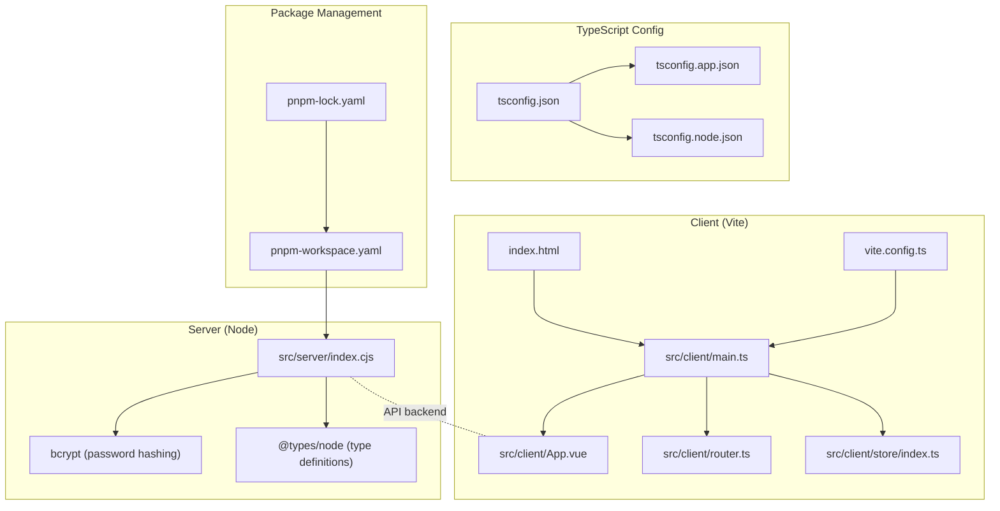
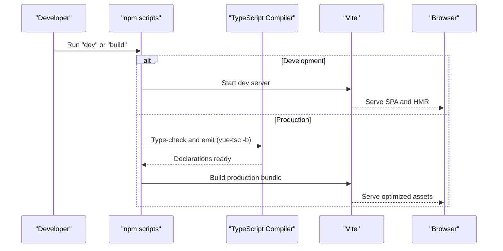
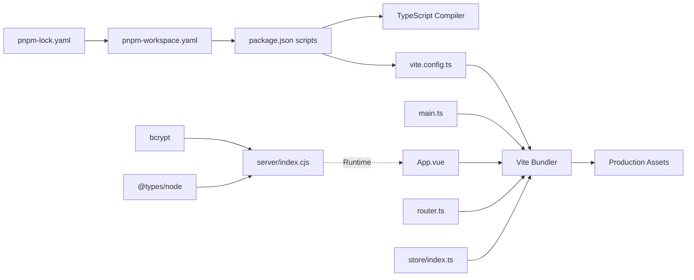

# Build System Configuration

<cite>
**Referenced Files in This Document**
- [vite.config.ts](file://vite.config.ts)
- [package.json](file://package.json)
- [pnpm-workspace.yaml](file://pnpm-workspace.yaml)
- [pnpm-lock.yaml](file://pnpm-lock.yaml)
- [tsconfig.json](file://tsconfig.json)
- [tsconfig.app.json](file://tsconfig.app.json)
- [tsconfig.node.json](file://tsconfig.node.json)
- [index.html](file://index.html)
- [src/client/main.ts](file://src/client/main.ts)
- [src/client/App.vue](file://src/client/App.vue)
- [src/client/router.ts](file://src/client/router.ts)
- [src/client/store/index.ts](file://src/client/store/index.ts)
- [src/server/index.cjs](file://src/server/index.cjs)
</cite>

## Update Summary
**Changes Made**
- Added pnpm workspace configuration documentation with build restrictions
- Updated TypeScript configuration to include @types/node for enhanced Node.js type support
- Documented bcrypt integration for secure password hashing in the server
- Enhanced dependency management documentation with pnpm workspace capabilities

## Table of Contents
1. [Introduction](#introduction)
2. [Project Structure](#project-structure)
3. [Core Components](#core-components)
4. [Architecture Overview](#architecture-overview)
5. [Detailed Component Analysis](#detailed-component-analysis)
6. [Dependency Analysis](#dependency-analysis)
7. [Performance Considerations](#performance-considerations)
8. [Troubleshooting Guide](#troubleshooting-guide)
9. [Conclusion](#conclusion)

## Introduction
This document explains Startora's build system architecture and configuration. It covers Vite configuration for development and production, asset processing, and plugin integration. It documents the TypeScript compilation and type-checking setup, build optimization strategies, asset bundling and code splitting, and the end-to-end build pipeline from source to production bundles. It also outlines environment configuration, build targets, deployment scenarios, performance optimization, bundle analysis, and troubleshooting.

**Updated** Enhanced with pnpm workspace configuration, bcrypt integration for secure password management, and improved TypeScript support with @types/node for comprehensive Node.js type definitions.

## Project Structure
Startora is a frontend-first application with a Vue 3 + TypeScript client and a Node.js/Express server. The build system centers around Vite for the client and a dedicated script invoking TypeScript compiler before building with Vite. The server runs independently via Node with bcrypt integration for secure authentication.

**Diagram sources**
- [vite.config.ts:1-13](file://vite.config.ts#L1-L13)
- [index.html:1-14](file://index.html#L1-L14)
- [src/client/main.ts:1-11](file://src/client/main.ts#L1-L11)
- [src/client/App.vue:1-16](file://src/client/App.vue#L1-L16)
- [src/client/router.ts:1-24](file://src/client/router.ts#L1-L24)
- [src/client/store/index.ts:1-91](file://src/client/store/index.ts#L1-L91)
- [tsconfig.json:1-8](file://tsconfig.json#L1-L8)
- [tsconfig.app.json:1-32](file://tsconfig.app.json#L1-L32)
- [tsconfig.node.json:1-25](file://tsconfig.node.json#L1-L25)
- [src/server/index.cjs:1-199](file://src/server/index.cjs#L1-L199)
- [pnpm-workspace.yaml:1-3](file://pnpm-workspace.yaml#L1-L3)
- [pnpm-lock.yaml:1-800](file://pnpm-lock.yaml#L1-L800)

**Section sources**
- [vite.config.ts:1-13](file://vite.config.ts#L1-L13)
- [package.json:1-33](file://package.json#L1-L33)
- [tsconfig.json:1-8](file://tsconfig.json#L1-L8)
- [tsconfig.app.json:1-32](file://tsconfig.app.json#L1-L32)
- [tsconfig.node.json:1-25](file://tsconfig.node.json#L1-L25)
- [index.html:1-14](file://index.html#L1-L14)
- [src/client/main.ts:1-11](file://src/client/main.ts#L1-L11)
- [src/client/App.vue:1-16](file://src/client/App.vue#L1-L16)
- [src/client/router.ts:1-24](file://src/client/router.ts#L1-L24)
- [src/client/store/index.ts:1-91](file://src/client/store/index.ts#L1-L91)
- [src/server/index.cjs:1-199](file://src/server/index.cjs#L1-L199)
- [pnpm-workspace.yaml:1-3](file://pnpm-workspace.yaml#L1-L3)
- [pnpm-lock.yaml:1-800](file://pnpm-lock.yaml#L1-L800)

## Core Components
- Vite configuration: Defines the Vue plugin, path aliasing, and defaults for dev and build.
- TypeScript configuration: Two-project setup with separate configs for app and node environments, enhanced with @types/node support.
- Package management: pnpm workspace configuration with build restrictions for specific packages.
- Build scripts: Dev, build, preview, and server commands orchestrated via npm-style scripts.
- Client entry and routing: Single-page app bootstrapped from main.ts with router and Pinia store.
- Server: Express-based API service with bcrypt integration for secure password hashing and PostgreSQL-backed data.

Key build artifacts and roles:
- Development: Vite dev server serves the SPA entry and hot-reloads modules.
- Production: TypeScript emits declarations and Vite bundles optimized assets.
- Preview: Local static preview of built assets.
- Security: bcrypt provides secure password hashing with salt rounds for authentication.

**Section sources**
- [vite.config.ts:1-13](file://vite.config.ts#L1-L13)
- [package.json:6-11](file://package.json#L6-L11)
- [tsconfig.app.json:1-32](file://tsconfig.app.json#L1-L32)
- [tsconfig.node.json:1-25](file://tsconfig.node.json#L1-L25)
- [pnpm-workspace.yaml:1-3](file://pnpm-workspace.yaml#L1-L3)
- [src/client/main.ts:1-11](file://src/client/main.ts#L1-L11)
- [src/client/router.ts:1-24](file://src/client/router.ts#L1-L24)
- [src/client/store/index.ts:1-91](file://src/client/store/index.ts#L1-L91)
- [src/server/index.cjs:1-199](file://src/server/index.cjs#L1-L199)

## Architecture Overview
The build pipeline integrates TypeScript type-checking with Vite bundling. The client SPA is bootstrapped from index.html and main.ts, using Vue, Pinia, and Vue Router. The server exposes REST endpoints for user and app data with bcrypt integration for secure authentication.

**Diagram sources**
- [package.json:6-11](file://package.json#L6-L11)
- [tsconfig.app.json:1-32](file://tsconfig.app.json#L1-L32)
- [vite.config.ts:1-13](file://vite.config.ts#L1-L13)
- [index.html:1-14](file://index.html#L1-L14)

## Detailed Component Analysis

### Vite Configuration
- Plugin integration: Vue SFC support via the official Vite plugin.
- Path aliasing: Alias "@" resolves to the src directory for concise imports.
- Defaults: Vite's development server and production bundling are used with minimal overrides.

Optimization and asset handling:
- Code splitting: Achieved automatically by Vite's dynamic imports and route-based lazy loading.
- Asset processing: Vite handles CSS, images, fonts, and other assets; Vue SFC styles are processed inline or extracted depending on configuration.
- Minification and tree shaking: Enabled by default in production builds; unused code elimination occurs during bundling.

Environment-specific behavior:
- Development: Fast HMR and source maps; no minification.
- Production: Minified JS/CSS, asset hashing, and optimized chunking.

**Section sources**
- [vite.config.ts:1-13](file://vite.config.ts#L1-L13)

### TypeScript Configuration
- Project references: Root tsconfig.json references app and node configs for isolated builds.
- App config (tsconfig.app.json):
  - Target and module set for modern browsers.
  - Bundler mode with module resolution and detection for Vite.
  - Strictness flags for linting and correctness.
  - Path aliases mirroring Vite's alias.
- Node config (tsconfig.node.json):
  - Separate target and module for Vite config and server runtime.
  - Enforces bundler mode for Vite config typing.
  - Enhanced with @types/node support for comprehensive Node.js API type definitions.

Type-checking workflow:
- Pre-build type-check: The build script invokes the TypeScript compiler to validate types before bundling.
- NoEmit mode: Vite consumes TS in-memory for dev and build; declarations are produced by the pre-check step.

**Updated** Enhanced with @types/node dependency for improved TypeScript support and type safety across the entire codebase.

**Section sources**
- [tsconfig.json:1-8](file://tsconfig.json#L1-L8)
- [tsconfig.app.json:1-32](file://tsconfig.app.json#L1-L32)
- [tsconfig.node.json:1-25](file://tsconfig.node.json#L1-L25)
- [package.json:24](file://package.json#L24)
- [package.json:9](file://package.json#L9)

### Package Management with pnpm Workspace
- Workspace configuration: pnpm workspace enables monorepo-style package management with build restrictions.
- Build restrictions: Specific packages like bcrypt can have build processes disabled for security or compatibility reasons.
- Lockfile management: Comprehensive dependency tracking ensures consistent builds across environments.
- Peer dependency resolution: Automatic handling of Vue and TypeScript peer dependencies.

**New** Added comprehensive pnpm workspace configuration documentation covering build restrictions and dependency management.

**Section sources**
- [pnpm-workspace.yaml:1-3](file://pnpm-workspace.yaml#L1-L3)
- [pnpm-lock.yaml:1-800](file://pnpm-lock.yaml#L1-L800)
- [package.json:12-31](file://package.json#L12-L31)

### Client Application Bootstrapping
- Entry point: main.ts creates the Vue app, installs Pinia, Vue Router, and Naive UI, then mounts to the DOM.
- App shell: App.vue wraps router-view with global message provider.
- Routing: Basic routes for home and login pages.
- Store: Centralized state with session initialization, app listing, theme updates, and CRUD actions against the server.

Asset and static resources:
- index.html injects the SPA entry and sets the base favicon path.
- Assets under src/client/assets are resolved via Vite; icons and images are imported as needed.

Code splitting:
- Route-based lazy loading is implicit through Vue Router; dynamic imports split chunks for pages.

**Section sources**
- [index.html:1-14](file://index.html#L1-L14)
- [src/client/main.ts:1-11](file://src/client/main.ts#L1-L11)
- [src/client/App.vue:1-16](file://src/client/App.vue#L1-L16)
- [src/client/router.ts:1-24](file://src/client/router.ts#L1-L24)
- [src/client/store/index.ts:1-91](file://src/client/store/index.ts#L1-L91)

### Server Configuration with bcrypt Integration
- Express server with CORS enabled and JSON body parsing.
- PostgreSQL client configured via environment variables; interactive prompt if password is missing.
- Routes for users, user apps, and theme persistence.
- Password security: bcrypt integration provides secure password hashing with configurable salt rounds.
- Runs on a configurable port via environment variable.

**Updated** Enhanced with bcrypt integration for secure password management and improved authentication security.

Security features:
- Password hashing: User passwords are hashed using bcrypt with 10 salt rounds.
- Duplicate prevention: Database constraints prevent duplicate usernames and emails.
- Error handling: Proper HTTP status codes for authentication failures and validation errors.

**Section sources**
- [src/server/index.cjs:1-199](file://src/server/index.cjs#L1-L199)
- [package.json:14](file://package.json#L14)

## Dependency Analysis
The build system exhibits clear separation of concerns with enhanced package management:
- Client-side build: Vite orchestrates bundling; TypeScript validates types prior to bundling.
- Server-side runtime: Independent Node process with Express, bcrypt for security, and PostgreSQL.
- Package management: pnpm workspace coordinates dependencies with build restrictions.

**Diagram sources**
- [package.json:6-11](file://package.json#L6-L11)
- [vite.config.ts:1-13](file://vite.config.ts#L1-L13)
- [src/client/main.ts:1-11](file://src/client/main.ts#L1-L11)
- [src/client/App.vue:1-16](file://src/client/App.vue#L1-L16)
- [src/client/router.ts:1-24](file://src/client/router.ts#L1-L24)
- [src/client/store/index.ts:1-91](file://src/client/store/index.ts#L1-L91)
- [src/server/index.cjs:1-199](file://src/server/index.cjs#L1-L199)
- [pnpm-workspace.yaml:1-3](file://pnpm-workspace.yaml#L1-L3)
- [pnpm-lock.yaml:1-800](file://pnpm-lock.yaml#L1-L800)

**Section sources**
- [package.json:6-11](file://package.json#L6-L11)
- [vite.config.ts:1-13](file://vite.config.ts#L1-L13)
- [src/client/main.ts:1-11](file://src/client/main.ts#L1-L11)
- [src/client/router.ts:1-24](file://src/client/router.ts#L1-L24)
- [src/client/store/index.ts:1-91](file://src/client/store/index.ts#L1-L91)
- [src/server/index.cjs:1-199](file://src/server/index.cjs#L1-L199)
- [pnpm-workspace.yaml:1-3](file://pnpm-workspace.yaml#L1-L3)
- [pnpm-lock.yaml:1-800](file://pnpm-lock.yaml#L1-L800)

## Performance Considerations
- Tree shaking and minification: Enabled by default in production; ensure libraries are ES modules and avoid side-effect imports.
- Code splitting: Leverage dynamic imports for routes and heavy components to reduce initial bundle size.
- Asset optimization: Prefer vector assets and compressed images; Vite's asset handling minimizes overhead.
- Caching: Use hashed filenames in production; configure long-term caching headers for static assets.
- Bundle analysis: Use Vite's built-in reporter or external tools to inspect bundle composition and identify bloat.
- Environment tuning: Set NODE_ENV appropriately for production builds; disable dev-only features and logs.
- Package management: pnpm workspace reduces disk usage and improves install performance through shared dependencies.

**Updated** Enhanced with pnpm workspace benefits for improved package management performance.

## Troubleshooting Guide
Common build issues and resolutions:
- TypeScript errors blocking build:
  - Cause: Type mismatches or missing types.
  - Resolution: Fix reported issues; ensure tsconfig references are correct and all files are included.
- Vite plugin conflicts:
  - Cause: Misconfigured plugin order or incompatible versions.
  - Resolution: Verify plugin installation and versions; keep Vue plugin aligned with Vue version.
- Alias resolution failures:
  - Cause: Incorrect alias usage or missing path mapping.
  - Resolution: Confirm alias matches tsconfig paths and Vite resolve.alias.
- Missing assets or broken favicon:
  - Cause: Incorrect asset path or missing file.
  - Resolution: Verify asset path in index.html and ensure the asset exists.
- Server startup and DB connectivity:
  - Cause: Missing environment variables or incorrect credentials.
  - Resolution: Set required environment variables; confirm database availability and credentials.
- bcrypt build issues:
  - Cause: Native module compilation failures or platform compatibility.
  - Resolution: Check pnpm workspace build restrictions; ensure compatible Node.js version; verify native dependencies.
- Type definition errors:
  - Cause: Missing @types/node or version mismatches.
  - Resolution: Update @types/node dependency; ensure TypeScript and Vue versions are compatible.

**Updated** Added troubleshooting guidance for bcrypt integration and enhanced TypeScript support.

**Section sources**
- [tsconfig.app.json:1-32](file://tsconfig.app.json#L1-L32)
- [tsconfig.node.json:1-25](file://tsconfig.node.json#L1-L25)
- [vite.config.ts:1-13](file://vite.config.ts#L1-L13)
- [index.html:1-14](file://index.html#L1-L14)
- [src/server/index.cjs:1-199](file://src/server/index.cjs#L1-L199)
- [pnpm-workspace.yaml:1-3](file://pnpm-workspace.yaml#L1-L3)
- [package.json:24](file://package.json#L24)

## Conclusion
Startora's build system leverages Vite for a fast, modern client-side development experience and a robust TypeScript configuration for type safety. The pipeline integrates pre-build type-checking with Vite's production bundling, enabling optimized delivery of a Vue 3 SPA. With clear separation between client and server, the system supports scalable development and deployment across environments.

**Updated** Enhanced with pnpm workspace configuration for improved package management, bcrypt integration for secure authentication, and comprehensive TypeScript support with @types/node for enhanced development experience.

The system now provides:
- Secure password management through bcrypt integration
- Enhanced type safety with @types/node support
- Optimized package management via pnpm workspace
- Improved build performance and reliability
- Comprehensive error handling and security measures

For advanced optimization, adopt code splitting, analyze bundles, and tune caching strategies while leveraging the enhanced package management capabilities.