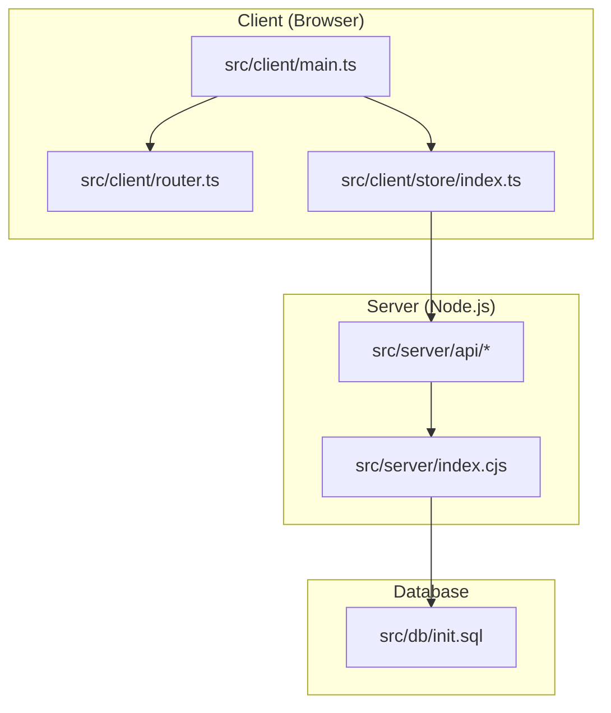
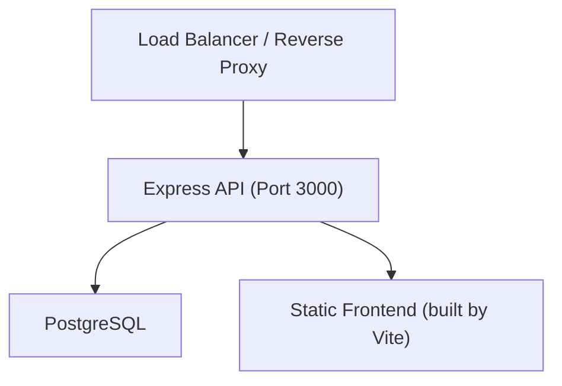
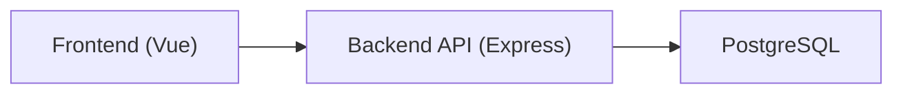

# Deployment Guide

<cite>
**Referenced Files in This Document**
- [README.md](file://README.md)
- [package.json](file://package.json)
- [Dockerfile](file://Dockerfile)
- [docker-compose.yml](file://docker-compose.yml)
- [vite.config.ts](file://vite.config.ts)
- [src/server/index.cjs](file://src/server/index.cjs)
- [src/db/init.sql](file://src/db/init.sql)
- [src/client/main.ts](file://src/client/main.ts)
- [src/client/router.ts](file://src/client/router.ts)
- [src/client/store/index.ts](file://src/client/store/index.ts)
- [src/server/api/config.ts](file://src/server/api/config.ts)
- [src/server/api/user.ts](file://src/server/api/user.ts)
- [src/server/api/user-app.ts](file://src/server/api/user-app.ts)
</cite>

## Table of Contents
1. [Introduction](#introduction)
2. [Project Structure](#project-structure)
3. [Core Components](#core-components)
4. [Architecture Overview](#architecture-overview)
5. [Detailed Component Analysis](#detailed-component-analysis)
6. [Dependency Analysis](#dependency-analysis)
7. [Performance Considerations](#performance-considerations)
8. [Troubleshooting Guide](#troubleshooting-guide)
9. [Conclusion](#conclusion)
10. [Appendices](#appendices)

## Introduction
This guide provides production deployment documentation for Startora, a full-stack application composed of a Vue 3 + TypeScript frontend and a Node.js + Express backend backed by PostgreSQL. It covers production build processes, environment configuration, containerized deployment, and operational practices for cloud and traditional server environments. It also includes database migration and backup guidance, monitoring and logging recommendations, security hardening, and troubleshooting.

## Project Structure
Startora follows a clear separation of concerns:
- Frontend: Vue 3 application bootstrapped in the client entry module, with routing and state management wired to backend APIs.
- Backend: Express server exposing REST endpoints for users, themes, and user-specific app lists.
- Database: PostgreSQL schema initialized via an initialization script.

**Diagram sources**
- [src/client/main.ts:1-11](file://src/client/main.ts#L1-L11)
- [src/client/router.ts:1-24](file://src/client/router.ts#L1-L24)
- [src/client/store/index.ts:1-91](file://src/client/store/index.ts#L1-L91)
- [src/server/index.cjs:1-173](file://src/server/index.cjs#L1-L173)
- [src/db/init.sql:1-26](file://src/db/init.sql#L1-L26)

**Section sources**
- [README.md:33-56](file://README.md#L33-L56)
- [src/client/main.ts:1-11](file://src/client/main.ts#L1-L11)
- [src/server/index.cjs:1-173](file://src/server/index.cjs#L1-L173)
- [src/db/init.sql:1-26](file://src/db/init.sql#L1-L26)

## Core Components
- Frontend entry and mounting: Initializes Vue app, Pinia, router, and UI library.
- Backend entry and API: Express server with CORS enabled, JSON body parsing, and PostgreSQL connectivity. Exposes endpoints for users, user apps, and theme configuration.
- Database initialization: Creates database and tables for users, user configuration, and user apps.

Key runtime and build configuration references:
- Production build command and scripts are defined in the project scripts.
- Vite configuration sets aliases and plugin integration for the Vue application.

**Section sources**
- [src/client/main.ts:1-11](file://src/client/main.ts#L1-L11)
- [src/server/index.cjs:12-173](file://src/server/index.cjs#L12-L173)
- [src/db/init.sql:1-26](file://src/db/init.sql#L1-L26)
- [package.json:6-11](file://package.json#L6-L11)
- [vite.config.ts:1-13](file://vite.config.ts#L1-L13)

## Architecture Overview
Startora’s runtime architecture consists of:
- A single container or VM hosting the Express API and the static frontend bundle.
- PostgreSQL as the persistent data store.
- Optional reverse proxy and load balancer in front of the API in production.

**Diagram sources**
- [src/server/index.cjs:166-169](file://src/server/index.cjs#L166-L169)
- [src/db/init.sql:6-25](file://src/db/init.sql#L6-L25)

## Detailed Component Analysis

### Frontend Build and Runtime
- Build process: TypeScript type-check and Vite build produce a static site.
- Runtime: The built assets are served by the Express server in production.
- Routing and state: Vue Router and Pinia manage navigation and application state; the store interacts with backend APIs.

Operational notes:
- The frontend entry initializes the app and mounts it to the DOM.
- The store performs initial session and app loading, persisting session data locally.

**Section sources**
- [package.json:9](file://package.json#L9)
- [src/client/main.ts:1-11](file://src/client/main.ts#L1-L11)
- [src/client/router.ts:1-24](file://src/client/router.ts#L1-L24)
- [src/client/store/index.ts:19-91](file://src/client/store/index.ts#L19-L91)

### Backend API and Environment Configuration
- Express server exposes CRUD endpoints for users and user apps, and theme configuration.
- Database connectivity is configured via environment variables for user, host, database, password, and port.
- Default port is 3000; configurable via environment variable.

Security and operational considerations:
- CORS is enabled broadly; in production, restrict origins to your domain.
- The server logs connection status and errors; ensure structured logging and error boundaries in production.

**Section sources**
- [src/server/index.cjs:9-11](file://src/server/index.cjs#L9-L11)
- [src/server/index.cjs:30-44](file://src/server/index.cjs#L30-L44)
- [src/server/index.cjs:166-169](file://src/server/index.cjs#L166-L169)

### Database Initialization and Schema
- Initialization script creates the target database and three tables: users, user_config, and user_apps.
- The schema supports storing user metadata, per-user configuration (JSONB), and per-user app entries (JSONB).

Operational notes:
- Ensure the database is provisioned and accessible by the backend.
- Use migrations for schema changes in production; keep initialization script for seed data or minimal bootstrap.

**Section sources**
- [src/db/init.sql:1-26](file://src/db/init.sql#L1-L26)

### API Client Layer
- Frontend communicates with the backend via Axios-based API modules.
- Base URL is configured in the API configuration module; adjust for production domains.

**Section sources**
- [src/server/api/config.ts:1-19](file://src/server/api/config.ts#L1-L19)
- [src/server/api/user.ts:1-46](file://src/server/api/user.ts#L1-L46)
- [src/server/api/user-app.ts:1-73](file://src/server/api/user-app.ts#L1-L73)

### Containerization and Orchestration
- Single-container deployment: The Dockerfile installs Node, PostgreSQL, builds the client, and starts PostgreSQL, the API, and the development frontend server.
- Compose deployment: docker-compose.yml defines a service exposing API and frontend ports, mounts PostgreSQL data, and passes environment variables.

Production considerations:
- Use a production-grade reverse proxy (e.g., Nginx) to serve the static frontend and proxy API requests.
- Separate containers for API and PostgreSQL; orchestrate with Kubernetes or Docker Swarm.
- Configure health checks, resource limits, and persistent storage for PostgreSQL.

**Section sources**
- [Dockerfile:1-40](file://Dockerfile#L1-L40)
- [docker-compose.yml:1-27](file://docker-compose.yml#L1-L27)

## Dependency Analysis
The frontend depends on the backend APIs, which depend on PostgreSQL. The backend depends on the database being reachable and initialized.

**Diagram sources**
- [src/client/store/index.ts:1-1](file://src/client/store/index.ts#L1)
- [src/server/index.cjs:1-1](file://src/server/index.cjs#L1)
- [src/db/init.sql:1-1](file://src/db/init.sql#L1)

**Section sources**
- [src/client/store/index.ts:1-1](file://src/client/store/index.ts#L1)
- [src/server/index.cjs:1-1](file://src/server/index.cjs#L1)
- [src/db/init.sql:1-1](file://src/db/init.sql#L1)

## Performance Considerations
- Build optimization: Use Vite’s production build to minimize bundle sizes and enable code splitting.
- Database tuning: Ensure PostgreSQL is sized appropriately, connections are pooled, and indexes exist for frequently queried columns.
- Caching: Consider caching non-sensitive user configuration and app lists at the application level.
- CDN: Serve static assets via a CDN behind a reverse proxy for global latency reduction.
- Health checks: Implement readiness/liveness probes in container orchestrators.

[No sources needed since this section provides general guidance]

## Troubleshooting Guide
Common deployment issues and resolutions:
- Database connection failures:
  - Verify environment variables for database credentials and host.
  - Confirm the database is initialized and accepting connections.
- CORS errors:
  - Restrict CORS origins to your domain in production.
- Port conflicts:
  - Ensure port 3000 (and any reverse proxy ports) are free and open.
- Static asset serving:
  - Confirm the built frontend is served by the Express server in production.
- API timeouts:
  - Check network policies, firewall rules, and database connection pooling.

**Section sources**
- [src/server/index.cjs:12-44](file://src/server/index.cjs#L12-L44)
- [src/server/index.cjs:166-169](file://src/server/index.cjs#L166-L169)

## Conclusion
Startora’s deployment model is straightforward: a single container or orchestrated pods hosting the Express API and the static frontend, backed by PostgreSQL. By securing the API, optimizing builds, and adopting robust observability and backup practices, you can operate Startora reliably in production.

[No sources needed since this section summarizes without analyzing specific files]

## Appendices

### A. Production Build Process
- Run the production build to generate optimized frontend assets.
- Ensure the backend serves the built assets in production.

References:
- [package.json:9](file://package.json#L9)

**Section sources**
- [package.json:9](file://package.json#L9)

### B. Environment Configuration
- Backend environment variables:
  - Database user, host, database name, password, and port.
  - API port (default 3000).
- Frontend API base URL:
  - Adjust the API base URL to point to the production backend.

References:
- [src/server/index.cjs:30-36](file://src/server/index.cjs#L30-L36)
- [src/server/index.cjs:166-169](file://src/server/index.cjs#L166-L169)
- [src/server/api/config.ts:3](file://src/server/api/config.ts#L3)

**Section sources**
- [src/server/index.cjs:30-36](file://src/server/index.cjs#L30-L36)
- [src/server/index.cjs:166-169](file://src/server/index.cjs#L166-L169)
- [src/server/api/config.ts:3](file://src/server/api/config.ts#L3)

### C. Cloud Platform Deployment Strategies
- Container orchestration:
  - Deploy the API and PostgreSQL in separate pods/services.
  - Use a reverse proxy/load balancer to expose HTTPS and route traffic to the API.
- Auto-scaling:
  - Scale the API pods based on CPU or custom metrics.
- Storage:
  - Persist PostgreSQL data using managed volumes or external storage with backups enabled.

[No sources needed since this section provides general guidance]

### D. Traditional Server Deployment
- Reverse proxy:
  - Configure a reverse proxy to serve the static frontend and proxy API requests to the backend.
- SSL/TLS:
  - Obtain and install certificates; enforce HTTPS.
- Process supervision:
  - Use systemd or similar supervisors to manage the Node.js process and restart on failure.

[No sources needed since this section provides general guidance]

### E. Database Migration, Backup, and Disaster Recovery
- Migrations:
  - Use a migration tool to evolve the schema safely across environments.
- Backups:
  - Schedule regular logical backups of PostgreSQL; test restoration procedures.
- DR:
  - Maintain offsite backups and document failover steps.

[No sources needed since this section provides general guidance]

### F. Monitoring, Logging, and Observability
- Logs:
  - Centralize application and database logs; apply log retention policies.
- Metrics:
  - Track API latency, error rates, and database query performance.
- Alerts:
  - Configure alerts for downtime, high error rates, and disk pressure.

[No sources needed since this section provides general guidance]

### G. Security Hardening and Compliance
- Access control:
  - Enforce least privilege for database users; restrict API endpoints.
- Network:
  - Limit inbound ports; use private subnets for databases.
- Secrets:
  - Store secrets in environment variables or a secret manager; avoid committing secrets to source control.
- Compliance:
  - Audit data access; retain logs per policy; ensure data residency requirements.

[No sources needed since this section provides general guidance]

### H. Rollback Procedures
- Versioning:
  - Tag releases and maintain artifacts for quick rollback.
- Database:
  - Keep a recent backup before applying schema changes.
- Steps:
  - Roll back the API container/image; restore database from last known good backup if needed.

[No sources needed since this section provides general guidance]