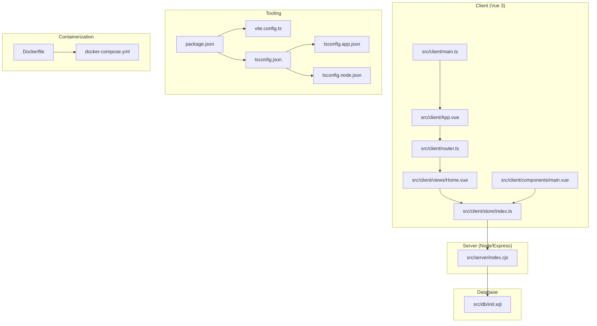
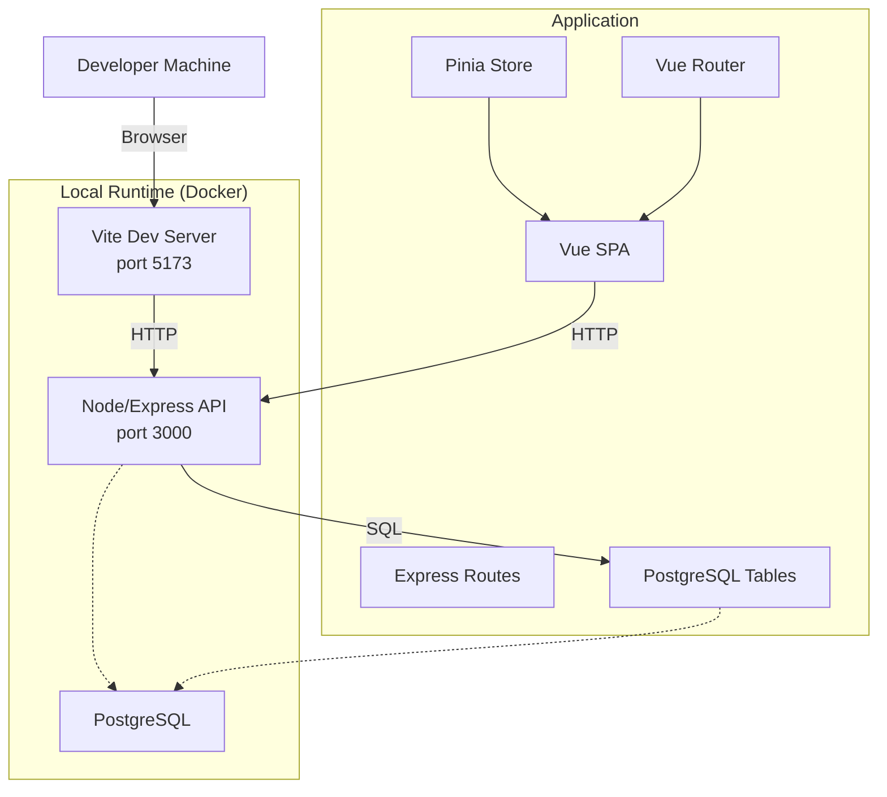
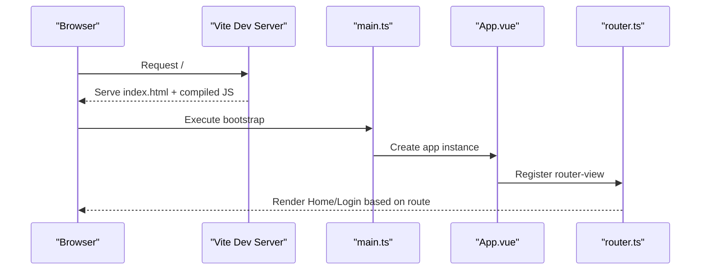
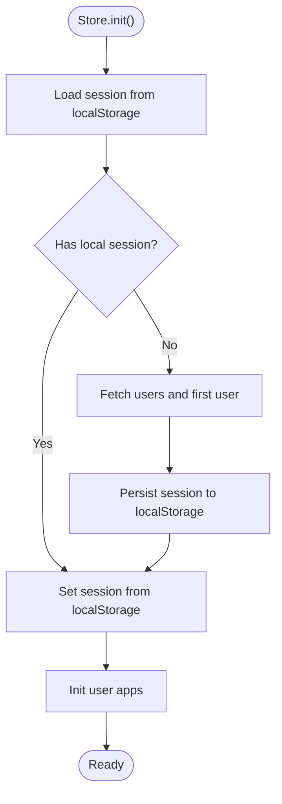
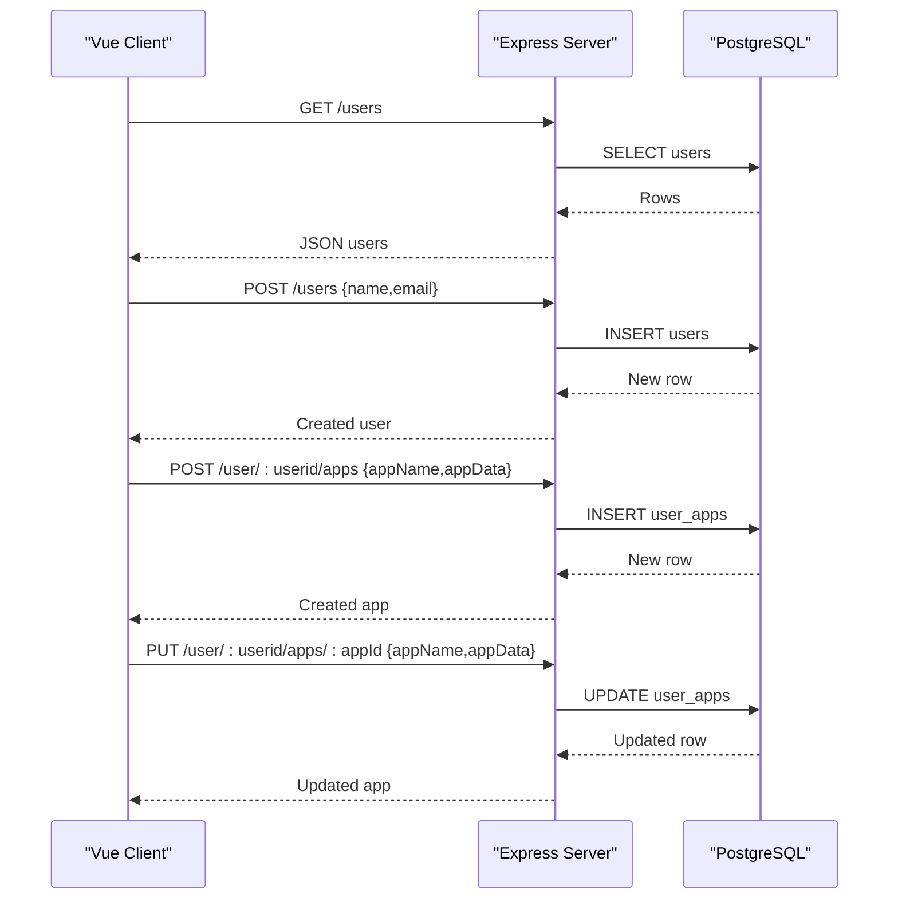
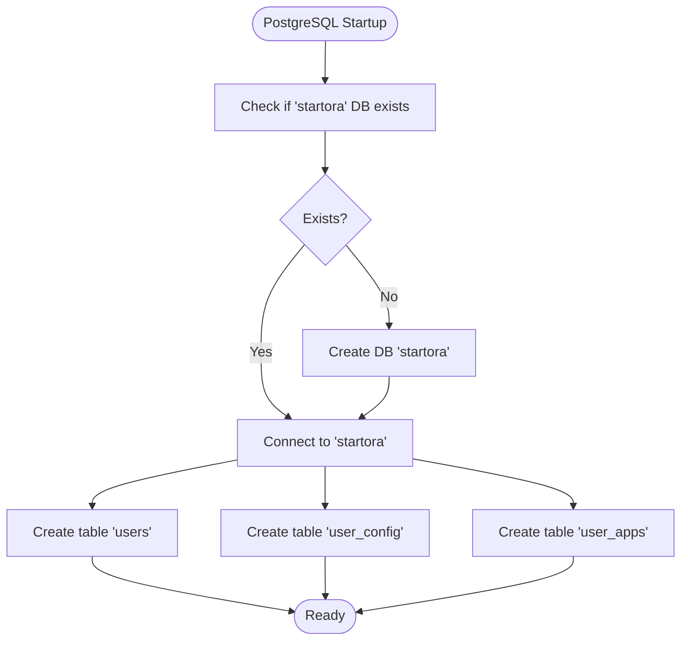
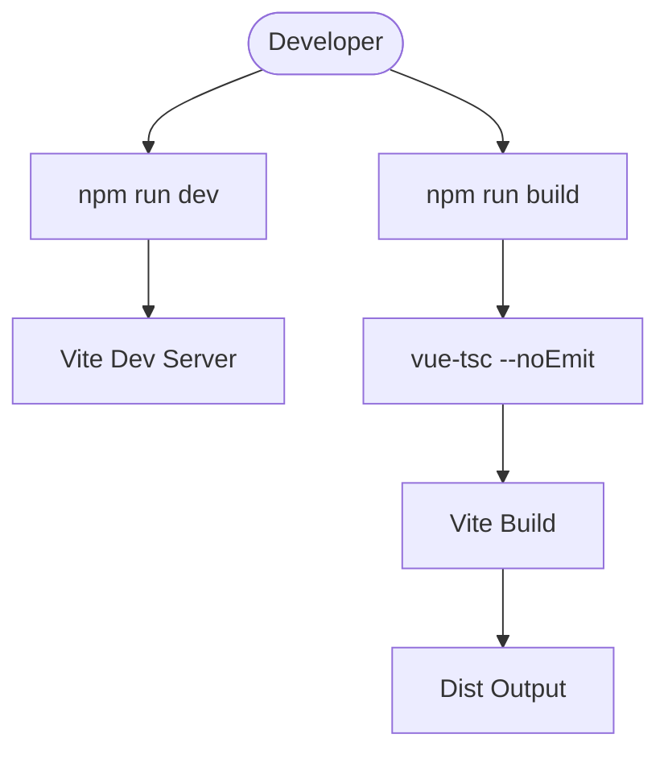
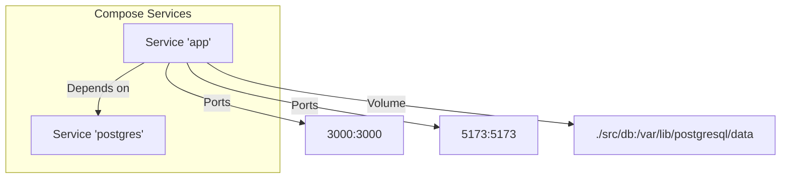
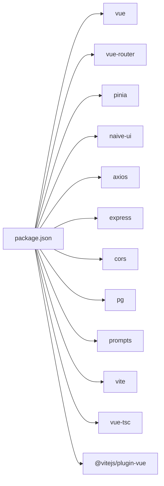

# Development Workflow

<cite>
**Referenced Files in This Document**
- [package.json](file://package.json)
- [vite.config.ts](file://vite.config.ts)
- [tsconfig.json](file://tsconfig.json)
- [tsconfig.app.json](file://tsconfig.app.json)
- [tsconfig.node.json](file://tsconfig.node.json)
- [Dockerfile](file://Dockerfile)
- [docker-compose.yml](file://docker-compose.yml)
- [src/client/main.ts](file://src/client/main.ts)
- [src/client/App.vue](file://src/client/App.vue)
- [src/client/router.ts](file://src/client/router.ts)
- [src/client/store/index.ts](file://src/client/store/index.ts)
- [src/client/views/Home.vue](file://src/client/views/Home.vue)
- [src/client/components/main.vue](file://src/client/components/main.vue)
- [src/server/index.cjs](file://src/server/index.cjs)
- [src/db/init.sql](file://src/db/init.sql)
</cite>

## Table of Contents
1. [Introduction](#introduction)
2. [Project Structure](#project-structure)
3. [Core Components](#core-components)
4. [Architecture Overview](#architecture-overview)
5. [Detailed Component Analysis](#detailed-component-analysis)
6. [Dependency Analysis](#dependency-analysis)
7. [Performance Considerations](#performance-considerations)
8. [Troubleshooting Guide](#troubleshooting-guide)
9. [Conclusion](#conclusion)
10. [Appendices](#appendices)

## Introduction
This document describes Startora’s development workflow and build processes. It covers local development setup, environment configuration, hot-reloading development server, debugging techniques, build system with Vite and TypeScript, asset processing, production builds, Docker containerization, deployment strategies, testing and code quality practices, CI considerations, troubleshooting, performance optimization, and contribution best practices.

## Project Structure
Startora is a full-stack web application composed of:
- A Vue 3 client with TypeScript, Pinia store, and Naive UI
- A Node.js/Express server exposing REST endpoints backed by PostgreSQL
- Build tooling via Vite and TypeScript compiler
- Containerization with Docker and Docker Compose

**Diagram sources**
- [src/client/main.ts:1-11](file://src/client/main.ts#L1-L11)
- [src/client/App.vue:1-16](file://src/client/App.vue#L1-L16)
- [src/client/router.ts:1-24](file://src/client/router.ts#L1-L24)
- [src/client/store/index.ts:1-91](file://src/client/store/index.ts#L1-L91)
- [src/client/views/Home.vue:1-62](file://src/client/views/Home.vue#L1-L62)
- [src/client/components/main.vue:1-109](file://src/client/components/main.vue#L1-L109)
- [src/server/index.cjs:1-173](file://src/server/index.cjs#L1-L173)
- [src/db/init.sql:1-26](file://src/db/init.sql#L1-L26)
- [package.json:1-31](file://package.json#L1-L31)
- [vite.config.ts:1-13](file://vite.config.ts#L1-L13)
- [tsconfig.json:1-8](file://tsconfig.json#L1-L8)
- [tsconfig.app.json:1-32](file://tsconfig.app.json#L1-L32)
- [tsconfig.node.json:1-25](file://tsconfig.node.json#L1-L25)
- [Dockerfile:1-40](file://Dockerfile#L1-L40)
- [docker-compose.yml:1-27](file://docker-compose.yml#L1-L27)

**Section sources**
- [package.json:1-31](file://package.json#L1-L31)
- [vite.config.ts:1-13](file://vite.config.ts#L1-L13)
- [tsconfig.json:1-8](file://tsconfig.json#L1-L8)
- [tsconfig.app.json:1-32](file://tsconfig.app.json#L1-L32)
- [tsconfig.node.json:1-25](file://tsconfig.node.json#L1-L25)
- [Dockerfile:1-40](file://Dockerfile#L1-L40)
- [docker-compose.yml:1-27](file://docker-compose.yml#L1-L27)

## Core Components
- Client bootstrap and routing: Vue app initialization, router setup, and global UI provider.
- Store and API integration: Pinia store orchestrating session, apps, and theme persistence via server APIs.
- Server endpoints: Express routes for users, user apps, and theme configuration backed by PostgreSQL.
- Database initialization: SQL script creating tables and ensuring database existence.
- Tooling: Vite for dev/build, TypeScript configuration for app and node contexts, and scripts in package.json.

Key responsibilities:
- Local development: Hot reload via Vite, server auto-start, and environment-driven configuration.
- Production build: Type-check then bundle via Vite for the client; server remains Node/CJS.
- Containerization: Multi-stage-like setup with PostgreSQL preinstalled, DB init script, and combined client/server runtime.

**Section sources**
- [src/client/main.ts:1-11](file://src/client/main.ts#L1-L11)
- [src/client/router.ts:1-24](file://src/client/router.ts#L1-L24)
- [src/client/store/index.ts:1-91](file://src/client/store/index.ts#L1-L91)
- [src/server/index.cjs:1-173](file://src/server/index.cjs#L1-L173)
- [src/db/init.sql:1-26](file://src/db/init.sql#L1-L26)
- [package.json:6-11](file://package.json#L6-L11)

## Architecture Overview
The system comprises a Vue 3 SPA served by Vite during development and built for production, paired with a Node/Express API server accessing a PostgreSQL database. Docker and Docker Compose orchestrate local environments.

**Diagram sources**
- [docker-compose.yml:1-27](file://docker-compose.yml#L1-L27)
- [Dockerfile:1-40](file://Dockerfile#L1-L40)
- [src/server/index.cjs:1-173](file://src/server/index.cjs#L1-L173)
- [src/client/main.ts:1-11](file://src/client/main.ts#L1-L11)
- [src/client/router.ts:1-24](file://src/client/router.ts#L1-L24)
- [src/client/store/index.ts:1-91](file://src/client/store/index.ts#L1-L91)
- [src/db/init.sql:1-26](file://src/db/init.sql#L1-L26)

## Detailed Component Analysis

### Client Application Bootstrap
- Initializes Vue app, Pinia, Naive UI, and mounts to DOM.
- Sets up router and global message provider.

**Diagram sources**
- [src/client/main.ts:1-11](file://src/client/main.ts#L1-L11)
- [src/client/App.vue:1-16](file://src/client/App.vue#L1-L16)
- [src/client/router.ts:1-24](file://src/client/router.ts#L1-L24)

**Section sources**
- [src/client/main.ts:1-11](file://src/client/main.ts#L1-L11)
- [src/client/App.vue:1-16](file://src/client/App.vue#L1-L16)
- [src/client/router.ts:1-24](file://src/client/router.ts#L1-L24)

### Store and Session Management
- Manages session state, user apps, and theme.
- Persists session to localStorage and fetches defaults from server.
- Integrates with server APIs for CRUD operations on user apps and theme.

**Diagram sources**
- [src/client/store/index.ts:19-48](file://src/client/store/index.ts#L19-L48)

**Section sources**
- [src/client/store/index.ts:1-91](file://src/client/store/index.ts#L1-L91)

### Server API Endpoints
- Provides endpoints for users, user apps, and theme configuration.
- Uses environment variables for database credentials and port.
- Includes interactive prompt fallback if password is missing.

**Diagram sources**
- [src/server/index.cjs:46-136](file://src/server/index.cjs#L46-L136)

**Section sources**
- [src/server/index.cjs:1-173](file://src/server/index.cjs#L1-L173)

### Database Initialization
- Ensures the target database exists and creates tables for users, user_config, and user_apps.
- Supports JSONB fields for flexible configuration and app metadata.

**Diagram sources**
- [src/db/init.sql:1-26](file://src/db/init.sql#L1-L26)

**Section sources**
- [src/db/init.sql:1-26](file://src/db/init.sql#L1-L26)

### Build System and Tooling
- Scripts:
  - dev: starts Vite dev server
  - server: runs Node server
  - build: type-check then Vite build
  - preview: serves built assets locally
- Vite configuration:
  - Vue plugin enabled
  - Path alias @ mapped to src
- TypeScript:
  - Root references app and node configs
  - App config targets modern JS, bundler mode, strictness, and DOM libs
  - Node config targets Node runtime and bundler mode

**Diagram sources**
- [package.json:6-11](file://package.json#L6-L11)
- [vite.config.ts:1-13](file://vite.config.ts#L1-L13)
- [tsconfig.app.json:1-32](file://tsconfig.app.json#L1-L32)
- [tsconfig.node.json:1-25](file://tsconfig.node.json#L1-L25)

**Section sources**
- [package.json:6-11](file://package.json#L6-L11)
- [vite.config.ts:1-13](file://vite.config.ts#L1-L13)
- [tsconfig.json:1-8](file://tsconfig.json#L1-L8)
- [tsconfig.app.json:1-32](file://tsconfig.app.json#L1-L32)
- [tsconfig.node.json:1-25](file://tsconfig.node.json#L1-L25)

### Containerization and Deployment
- Dockerfile:
  - Base: Node 21
  - Installs PostgreSQL client/server
  - Copies package manifests and installs deps
  - Copies server and client sources
  - Sets environment variables for DB connection
  - Builds client dependencies and exposes ports
  - Starts PostgreSQL, Node server, and Vite dev server on container start
- docker-compose.yml:
  - Builds from Dockerfile
  - Maps ports 3000 (API) and 5173 (Vite)
  - Mounts PostgreSQL data directory
  - Passes environment variables
  - Depends on DB service

**Diagram sources**
- [Dockerfile:1-40](file://Dockerfile#L1-L40)
- [docker-compose.yml:1-27](file://docker-compose.yml#L1-L27)

**Section sources**
- [Dockerfile:1-40](file://Dockerfile#L1-L40)
- [docker-compose.yml:1-27](file://docker-compose.yml#L1-L27)

## Dependency Analysis
- Client depends on Vue, Vue Router, Pinia, Naive UI, and Axios for HTTP.
- Server depends on Express, CORS, pg (PostgreSQL client), and prompts for interactive password input.
- Build-time dependencies include Vite, @vitejs/plugin-vue, TypeScript, and vue-tsc.
- Path alias @ resolves to src for both client and TypeScript configs.

**Diagram sources**
- [package.json:12-29](file://package.json#L12-L29)

**Section sources**
- [package.json:12-29](file://package.json#L12-L29)
- [tsconfig.app.json:26-28](file://tsconfig.app.json#L26-L28)

## Performance Considerations
- Prefer lazy-loading heavy components and routes to reduce initial bundle size.
- Keep TypeScript strictness for early bug detection; avoid unnecessary runtime checks.
- Minimize large payloads in user_apps and user_config; consider pagination for lists.
- Use Vite’s built-in code splitting and dynamic imports where appropriate.
- Optimize database queries with indexes on frequently filtered columns (e.g., user_id).
- Cache static assets and leverage browser caching headers in production.

## Troubleshooting Guide
Common issues and resolutions:
- PostgreSQL connection failures:
  - Verify environment variables for DB credentials and host/port.
  - Confirm the DB service is reachable and initialized.
- Vite dev server not starting:
  - Ensure Node.js and npm are installed and PATH is correct.
  - Clear node_modules and reinstall dependencies if needed.
- Hot reload not triggering:
  - Check file watching limits and firewall settings.
  - Restart Vite dev server after major config changes.
- Build errors:
  - Run type-check first to catch TS issues.
  - Clean dist and cache directories before rebuilding.
- Docker container not exposing ports:
  - Confirm port mappings and firewall rules.
  - Check logs for PostgreSQL and Node server startup errors.
- API 404/500 errors:
  - Validate route paths and parameter binding.
  - Inspect server logs for SQL exceptions.

**Section sources**
- [src/server/index.cjs:12-44](file://src/server/index.cjs#L12-L44)
- [docker-compose.yml:7-9](file://docker-compose.yml#L7-L9)
- [Dockerfile:33-39](file://Dockerfile#L33-L39)

## Conclusion
Startora’s development workflow leverages Vite for fast iteration, TypeScript for safety, and a clear separation between client and server. Docker simplifies local environment provisioning and aligns with production deployment patterns. Following the outlined scripts, configurations, and best practices ensures smooth development, reliable builds, and predictable deployments.

## Appendices

### Local Development Setup
- Install dependencies:
  - Client and server dependencies are installed via package manager.
- Start services:
  - Run the Vite dev server for the frontend.
  - Run the Node server for the backend.
- Environment variables:
  - Configure database credentials and port via environment variables.
- Hot reloading:
  - Vite automatically refreshes the browser on file changes.

**Section sources**
- [package.json:6-11](file://package.json#L6-L11)
- [src/server/index.cjs:12-44](file://src/server/index.cjs#L12-L44)

### Build and Preview
- Type-check and build:
  - Use the build script to compile TypeScript and bundle the client.
- Preview production build:
  - Use the preview script to serve built assets locally.

**Section sources**
- [package.json:9-10](file://package.json#L9-L10)
- [tsconfig.app.json:1-32](file://tsconfig.app.json#L1-L32)

### Testing and Code Quality
- Recommended practices:
  - Add unit tests for store actions and API adapters.
  - Add integration tests for server endpoints.
  - Enforce linting and formatting standards in CI.
  - Keep TypeScript strict mode enabled.

### Continuous Integration
- Typical pipeline stages:
  - Install dependencies
  - Type-check
  - Run tests
  - Build artifacts
  - Optional: push images to registry
- Secrets management:
  - Inject database credentials and tokens via CI environment variables.

### Contribution Best Practices
- Branching strategy:
  - Feature branches merged via pull requests with reviews.
- Commit hygiene:
  - Atomic commits with clear messages.
- Code review:
  - Focus on correctness, readability, and performance.
- Documentation updates:
  - Update README and inline comments for significant changes.