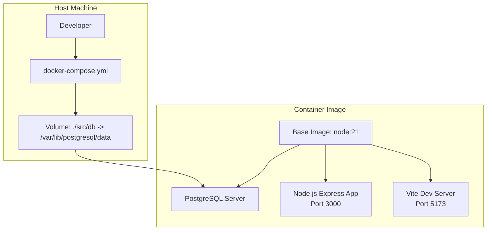
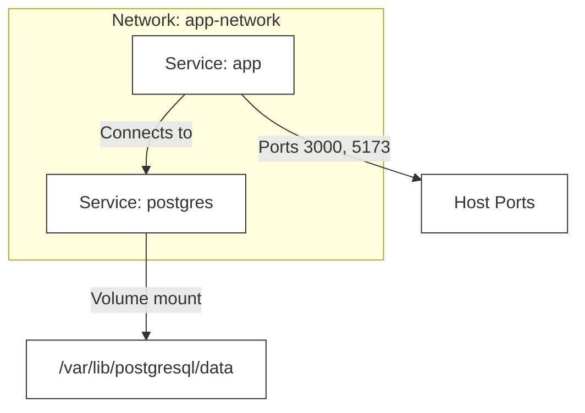
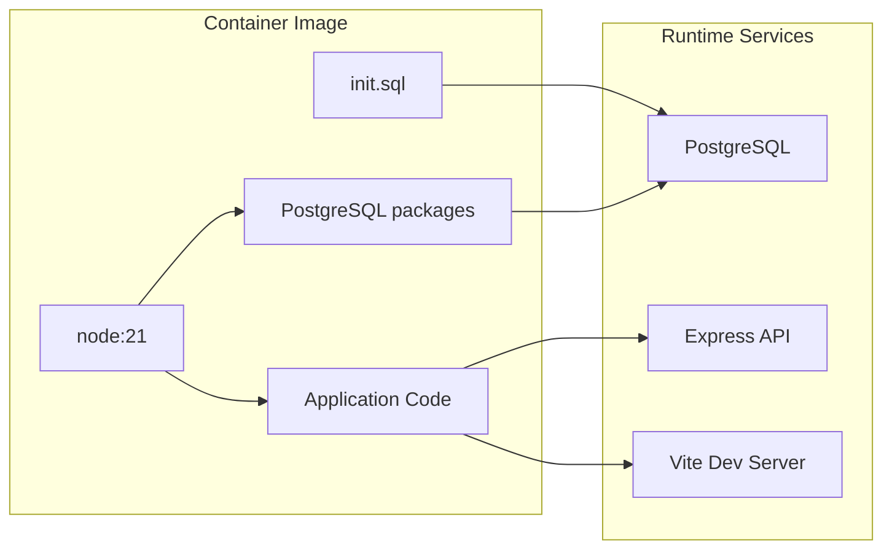

# Docker Containerization

<cite>
**Referenced Files in This Document**
- [Dockerfile](file://Dockerfile)
- [docker-compose.yml](file://docker-compose.yml)
- [package.json](file://package.json)
- [README.md](file://README.md)
- [src/server/index.cjs](file://src/server/index.cjs)
- [src/db/init.sql](file://src/db/init.sql)
- [vite.config.ts](file://vite.config.ts)
</cite>

## Table of Contents
1. [Introduction](#introduction)
2. [Project Structure](#project-structure)
3. [Core Components](#core-components)
4. [Architecture Overview](#architecture-overview)
5. [Detailed Component Analysis](#detailed-component-analysis)
6. [Dependency Analysis](#dependency-analysis)
7. [Performance Considerations](#performance-considerations)
8. [Troubleshooting Guide](#troubleshooting-guide)
9. [Conclusion](#conclusion)
10. [Appendices](#appendices)

## Introduction
This document explains Startora’s Docker containerization strategy and deployment processes. It covers the Dockerfile configuration, docker-compose orchestration, environment variables, volume mounts, port mappings, and operational guidance for development and production. It also includes troubleshooting tips for networking, database connectivity, and service discovery, along with security, resource limits, and monitoring recommendations.

## Project Structure
Startora is a full-stack application composed of:
- A Vue 3 + TypeScript + Vite frontend (client)
- An Express server (server)
- A PostgreSQL database (db)

The Docker strategy packages both the frontend and backend into a single container image and orchestrates them with docker-compose. The database is persisted via a mounted volume.

**Diagram sources**
- [Dockerfile:1-40](file://Dockerfile#L1-L40)
- [docker-compose.yml:1-27](file://docker-compose.yml#L1-L27)

**Section sources**
- [README.md:33-56](file://README.md#L33-L56)
- [package.json:1-31](file://package.json#L1-L31)

## Core Components
- Dockerfile: Defines the base image, installs PostgreSQL, copies application code, sets environment variables, installs client-side dependencies, exposes ports, and starts PostgreSQL, the Node.js API, and the Vite dev server.
- docker-compose.yml: Builds the image, defines port mappings, mounts the database data directory, sets environment variables, declares service dependencies, and creates a bridge network.
- Environment variables: Used by the Express server to connect to PostgreSQL and to set the API port.
- Database initialization: A SQL script initializes the database schema and seed data during first-run initialization.

Key runtime behaviors:
- PostgreSQL is started inside the container and initialized with the provided SQL script.
- The Express server listens on port 3000 and connects to the PostgreSQL instance using environment variables.
- The Vite dev server runs on port 5173 for local development.

**Section sources**
- [Dockerfile:1-40](file://Dockerfile#L1-L40)
- [docker-compose.yml:1-27](file://docker-compose.yml#L1-L27)
- [src/server/index.cjs:12-44](file://src/server/index.cjs#L12-L44)
- [src/db/init.sql:1-26](file://src/db/init.sql#L1-L26)

## Architecture Overview
The container architecture runs a single container hosting:
- PostgreSQL (initialized via the provided SQL script)
- Node.js Express API server
- Vite development server

The docker-compose service “app” depends on the database lifecycle and shares a custom bridge network for internal communication.

**Diagram sources**
- [docker-compose.yml:3-27](file://docker-compose.yml#L3-L27)
- [Dockerfile:14-15](file://Dockerfile#L14-L15)

**Section sources**
- [docker-compose.yml:19-22](file://docker-compose.yml#L19-L22)
- [Dockerfile:37-39](file://Dockerfile#L37-L39)

## Detailed Component Analysis

### Dockerfile Configuration
- Base image: Uses the official Node.js 21 image.
- PostgreSQL installation: Installs PostgreSQL and contrib packages.
- Working directory: Sets the application root.
- Dependencies: Copies and installs both server and client dependencies.
- Initialization: Copies the database initialization script into the PostgreSQL entrypoint directory so it runs on first container startup.
- Client build: Installs client-side dependencies under the client directory.
- Ports: Exposes ports 3000 (API) and 5173 (Vite dev server).
- Command: Starts PostgreSQL, launches the Node.js API, and runs the Vite dev server concurrently.

Operational notes:
- The command starts multiple processes in the foreground; ensure the container remains healthy by monitoring logs.
- The initialization script is copied into the PostgreSQL entrypoint directory to create the database and tables on first run.

**Section sources**
- [Dockerfile:1-40](file://Dockerfile#L1-L40)
- [src/db/init.sql:1-26](file://src/db/init.sql#L1-L26)

### docker-compose Orchestration
- Version: Uses Compose file version 3.8.
- Services:
  - app: Builds from the current directory, sets container name, maps ports 3000 and 5173, mounts the database data directory, sets environment variables, declares dependency on postgres, and joins app-network.
- Networks:
  - app-network: Bridge driver for internal service communication.

Environment variables propagated to the container:
- NODE_ENV, DB_HOST, DB_PORT, DB_USER, DB_PASSWORD, DB_NAME.

Volumes:
- Mounts the local database directory to the PostgreSQL data directory inside the container.

**Section sources**
- [docker-compose.yml:1-27](file://docker-compose.yml#L1-L27)

### Environment Variables and Secrets
The Express server reads database credentials and connection parameters from environment variables. If PG_PASSWORD is not present, it prompts for a password at startup.

- PG_USER, PG_HOST, PG_DATABASE, PG_PASSWORD, PG_PORT are read by the server.
- PORT controls the API server binding (defaults to 3000).

Security note:
- The current configuration passes secrets via environment variables. Prefer external secret management in production (e.g., Docker secrets or Kubernetes secrets).

**Section sources**
- [src/server/index.cjs:12-44](file://src/server/index.cjs#L12-L44)
- [docker-compose.yml:12-18](file://docker-compose.yml#L12-L18)

### Volume Mounting and Persistence
- The database data directory is mounted from the host to persist PostgreSQL data across container restarts.
- The mount target aligns with PostgreSQL’s default data directory.

Best practice:
- Use a dedicated persistent volume or bind mount to ensure durability and backupability.

**Section sources**
- [docker-compose.yml:10-11](file://docker-compose.yml#L10-L11)
- [Dockerfile:14-15](file://Dockerfile#L14-L15)

### Port Mapping Strategy
- API server: Exposed on host port 3000 mapped to container port 3000.
- Vite dev server: Exposed on host port 5173 mapped to container port 5173.

For development, accessing http://localhost:5173 serves the frontend; the frontend makes API calls to http://localhost:3000.

**Section sources**
- [docker-compose.yml:7-9](file://docker-compose.yml#L7-L9)
- [Dockerfile:33-34](file://Dockerfile#L33-L34)

### Multi-stage Build Considerations
- Current Dockerfile does not implement multi-stage builds.
- Recommendation: Separate build and runtime stages to reduce image size and attack surface. For example:
  - Stage 1: Install dependencies and build the client bundle.
  - Stage 2: Copy only the necessary runtime artifacts into a minimal base image (e.g., node:alpine).
- Benefits: Smaller images, fewer vulnerabilities, faster pulls.

[No sources needed since this section provides general guidance]

### Production Deployment Workflow
- Build the image: Use docker build to produce a production-ready image.
- Registry integration: Push the image to a container registry (e.g., Docker Hub, AWS ECR, GitHub Packages).
- Orchestration: Deploy using docker-compose or a platform like Kubernetes. For Kubernetes, define Deployments, Services, PersistentVolumeClaims, and Secrets.
- Scaling: Scale the API service horizontally; keep a single PostgreSQL instance or use managed PostgreSQL for HA/DR.
- Health checks: Add readiness/liveness probes for the API and database.

[No sources needed since this section provides general guidance]

### Security Considerations
- Secrets management: Move sensitive environment variables out of docker-compose into secure secret stores.
- Network isolation: Use isolated networks and restrict ingress/egress policies.
- Image hygiene: Pin base images to specific versions and rebuild periodically to pick up security updates.
- Least privilege: Run containers as non-root where feasible.
- TLS: Terminate TLS at an ingress controller or reverse proxy; avoid plaintext traffic internally.

[No sources needed since this section provides general guidance]

### Monitoring and Observability
- Logs: Stream container logs to a centralized logging system.
- Metrics: Expose application metrics and scrape with Prometheus.
- Health checks: Implement health endpoints and integrate with container orchestrators.
- Tracing: Add distributed tracing for API requests.

[No sources needed since this section provides general guidance]

## Dependency Analysis
The application stack and its containerization dependencies are summarized below.

**Diagram sources**
- [Dockerfile:1-40](file://Dockerfile#L1-L40)
- [src/db/init.sql:1-26](file://src/db/init.sql#L1-L26)

**Section sources**
- [Dockerfile:1-40](file://Dockerfile#L1-L40)
- [src/server/index.cjs:12-44](file://src/server/index.cjs#L12-L44)

## Performance Considerations
- Image size: Reduce image size by consolidating layers and removing unnecessary packages.
- Startup time: Minimize cold starts by pre-building the client bundle and avoiding heavy initialization steps at runtime.
- Resource limits: Set CPU/memory limits in docker-compose or Kubernetes to prevent noisy-neighbor issues.
- Caching: Leverage Docker layer caching and CDN for static assets.

[No sources needed since this section provides general guidance]

## Troubleshooting Guide

### Container Networking
- Symptom: API requests fail from the frontend.
  - Verify port mappings in docker-compose and confirm the frontend is requesting http://localhost:3000.
  - Confirm the container is attached to the intended network and that DNS resolution works within the container.

**Section sources**
- [docker-compose.yml:7-9](file://docker-compose.yml#L7-L9)
- [docker-compose.yml:21-22](file://docker-compose.yml#L21-L22)

### Database Connectivity
- Symptom: Express server fails to connect to PostgreSQL.
  - Check environment variables for host, port, user, password, and database name.
  - Ensure the database volume is mounted and initialized.
  - Validate that the initialization script ran and created the expected tables.

**Section sources**
- [src/server/index.cjs:12-44](file://src/server/index.cjs#L12-L44)
- [docker-compose.yml:12-18](file://docker-compose.yml#L12-L18)
- [Dockerfile:14-15](file://Dockerfile#L14-L15)
- [src/db/init.sql:1-26](file://src/db/init.sql#L1-L26)

### Service Discovery
- Symptom: Services cannot reach each other.
  - Confirm both services are on the same custom network.
  - Use container names or service names for inter-service communication.

**Section sources**
- [docker-compose.yml:24-27](file://docker-compose.yml#L24-L27)

### Development vs Production Behavior
- Symptom: Vite dev server not serving assets in production.
  - The current Dockerfile starts the Vite dev server; for production, build the client and serve statically via the Express server or an Nginx reverse proxy.

**Section sources**
- [Dockerfile:29-31](file://Dockerfile#L29-L31)
- [package.json:6-10](file://package.json#L6-L10)

### Health and Logs
- Use docker logs to inspect the container logs for PostgreSQL startup messages and Express server logs.
- Add health checks to detect unresponsive services early.

[No sources needed since this section provides general guidance]

## Conclusion
Startora’s current Docker strategy provides a straightforward, single-container development environment that runs PostgreSQL, the Express API, and the Vite dev server together. For production, consider multi-stage builds, external secret management, and a managed database service. Adopt robust networking, health checks, and observability practices to ensure reliable deployments at scale.

## Appendices

### Appendix A: Environment Variables Reference
- NODE_ENV: Controls environment mode.
- DB_HOST: Database hostname.
- DB_PORT: Database port.
- DB_USER: Database username.
- DB_PASSWORD: Database password.
- DB_NAME: Database name.
- PORT: API server port (default 3000).
- PG_*: Express server reads these for database connection.

**Section sources**
- [docker-compose.yml:12-18](file://docker-compose.yml#L12-L18)
- [src/server/index.cjs:12-44](file://src/server/index.cjs#L12-L44)

### Appendix B: Ports and Paths
- API port: 3000
- Vite dev port: 5173
- Database data directory: /var/lib/postgresql/data
- Initialization script path inside container: /docker-entrypoint-initdb.d/init.sql

**Section sources**
- [docker-compose.yml:7-9](file://docker-compose.yml#L7-L9)
- [docker-compose.yml:10-11](file://docker-compose.yml#L10-L11)
- [Dockerfile:14-15](file://Dockerfile#L14-L15)
- [Dockerfile:33-34](file://Dockerfile#L33-L34)