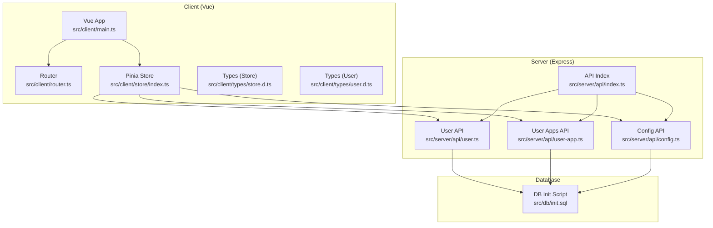
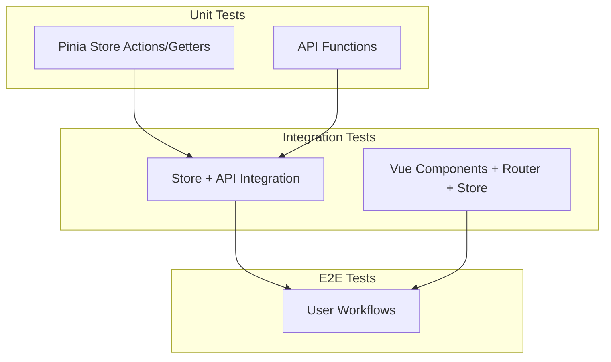
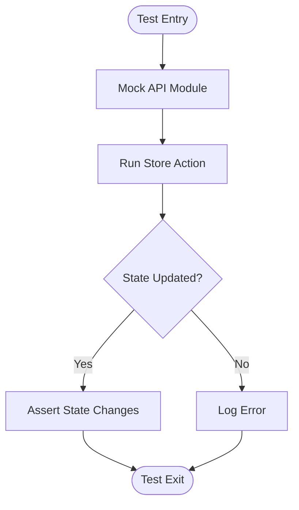
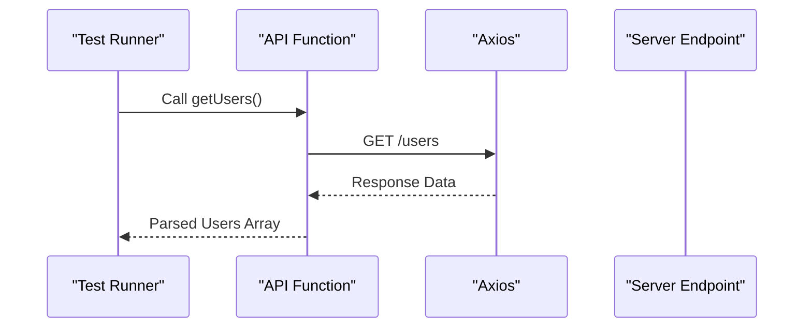
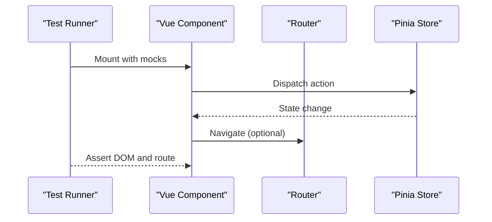
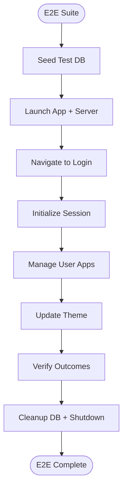
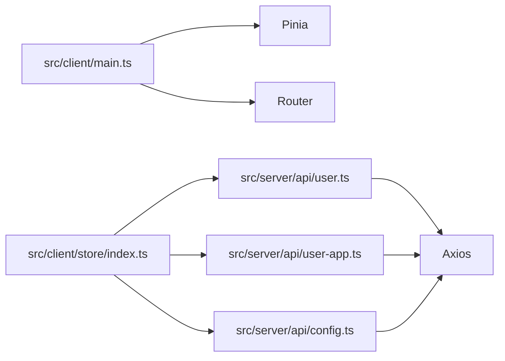

# Testing Strategy

<cite>
**Referenced Files in This Document**
- [package.json](file://package.json)
- [vite.config.ts](file://vite.config.ts)
- [src/client/main.ts](file://src/client/main.ts)
- [src/client/router.ts](file://src/client/router.ts)
- [src/client/store/index.ts](file://src/client/store/index.ts)
- [src/client/types/store.d.ts](file://src/client/types/store.d.ts)
- [src/client/types/user.d.ts](file://src/client/types/user.d.ts)
- [src/server/api/index.ts](file://src/server/api/index.ts)
- [src/server/api/config.ts](file://src/server/api/config.ts)
- [src/server/api/user.ts](file://src/server/api/user.ts)
- [src/server/api/user-app.ts](file://src/server/api/user-app.ts)
- [src/db/init.sql](file://src/db/init.sql)
</cite>

## Table of Contents
1. [Introduction](#introduction)
2. [Project Structure](#project-structure)
3. [Core Components](#core-components)
4. [Architecture Overview](#architecture-overview)
5. [Detailed Component Analysis](#detailed-component-analysis)
6. [Dependency Analysis](#dependency-analysis)
7. [Performance Considerations](#performance-considerations)
8. [Troubleshooting Guide](#troubleshooting-guide)
9. [Conclusion](#conclusion)
10. [Appendices](#appendices)

## Introduction
This document outlines Startora’s testing strategy and quality assurance practices. It covers unit testing for Vue components, Pinia store modules, and API functions; integration testing for component interactions, state management, and API endpoints; configuration of testing frameworks and utilities; mocking strategies; end-to-end testing setup for user workflows; code coverage expectations; best practices; CI pipeline considerations; database setup and test data management; and guidelines for writing effective tests, debugging failures, and maintaining test suites.

## Project Structure
Startora is a Vue 3 + TypeScript application with a frontend client and a Node.js/Express server. The client uses Pinia for state management and Axios for API communication. The server exposes REST endpoints consumed by the client. The database schema is defined via SQL initialization scripts.

**Diagram sources**
- [src/client/main.ts:1-11](file://src/client/main.ts#L1-L11)
- [src/client/router.ts:1-24](file://src/client/router.ts#L1-L24)
- [src/client/store/index.ts:1-91](file://src/client/store/index.ts#L1-L91)
- [src/client/types/store.d.ts:1-7](file://src/client/types/store.d.ts#L1-L7)
- [src/client/types/user.d.ts:1-6](file://src/client/types/user.d.ts#L1-L6)
- [src/server/api/index.ts:1-4](file://src/server/api/index.ts#L1-L4)
- [src/server/api/user.ts:1-46](file://src/server/api/user.ts#L1-L46)
- [src/server/api/user-app.ts:1-73](file://src/server/api/user-app.ts#L1-L73)
- [src/server/api/config.ts:1-19](file://src/server/api/config.ts#L1-L19)
- [src/db/init.sql:1-26](file://src/db/init.sql#L1-L26)

**Section sources**
- [package.json:1-31](file://package.json#L1-L31)
- [vite.config.ts:1-13](file://vite.config.ts#L1-L13)
- [src/client/main.ts:1-11](file://src/client/main.ts#L1-L11)
- [src/client/router.ts:1-24](file://src/client/router.ts#L1-L24)
- [src/client/store/index.ts:1-91](file://src/client/store/index.ts#L1-L91)
- [src/server/api/index.ts:1-4](file://src/server/api/index.ts#L1-L4)
- [src/db/init.sql:1-26](file://src/db/init.sql#L1-L26)

## Core Components
- Vue Application bootstrap initializes Pinia, router, and UI library, forming the foundation for component and store testing.
- Pinia store encapsulates state, getters, and actions interacting with server APIs. It is central to unit and integration tests.
- API modules expose typed functions for user retrieval, user app CRUD, and theme persistence, serving as targets for unit and integration tests.
- Router defines navigation paths used in E2E tests and component integration scenarios.
- Types define shape of state and user data, ensuring type-safe tests.

Key testing entry points:
- Unit tests for Pinia store actions and getters.
- Unit tests for API functions with mocked Axios.
- Integration tests for component rendering, routing, and store interactions.
- E2E tests for user workflows (login, session initialization, app management).

**Section sources**
- [src/client/main.ts:1-11](file://src/client/main.ts#L1-L11)
- [src/client/store/index.ts:1-91](file://src/client/store/index.ts#L1-L91)
- [src/server/api/user.ts:1-46](file://src/server/api/user.ts#L1-L46)
- [src/server/api/user-app.ts:1-73](file://src/server/api/user-app.ts#L1-L73)
- [src/server/api/config.ts:1-19](file://src/server/api/config.ts#L1-L19)
- [src/client/router.ts:1-24](file://src/client/router.ts#L1-L24)

## Architecture Overview
The testing architecture aligns with the application’s layered structure: client-side unit/integration tests, server-side unit tests, and E2E tests spanning both layers.

[No sources needed since this diagram shows conceptual workflow, not actual code structure]

## Detailed Component Analysis

### Pinia Store Testing Strategy
- Isolate store actions by injecting mocked API modules to avoid real network calls.
- Test state transitions after actions (e.g., session initialization, app list updates).
- Verify side effects like localStorage writes during session initialization.
- Mock Axios globally or per-test to simulate success/failure scenarios.
- Validate error handling paths and logging behavior.

Recommended test categories:
- Initialization actions: session loading from storage vs. API.
- CRUD actions: add/update user app, refresh app list.
- Theme updates: persist to API and update local state.

**Diagram sources**
- [src/client/store/index.ts:19-88](file://src/client/store/index.ts#L19-L88)

**Section sources**
- [src/client/store/index.ts:1-91](file://src/client/store/index.ts#L1-L91)
- [src/client/types/store.d.ts:1-7](file://src/client/types/store.d.ts#L1-L7)

### API Functions Testing Strategy
- Wrap Axios calls in typed functions for deterministic testing.
- Use a test harness to intercept HTTP requests and return controlled fixtures.
- Parameterize tests for success and failure paths.
- Validate request payloads and response transformations.

**Diagram sources**
- [src/server/api/user.ts:4-15](file://src/server/api/user.ts#L4-L15)
- [src/server/api/user-app.ts:4-17](file://src/server/api/user-app.ts#L4-L17)
- [src/server/api/config.ts:5-18](file://src/server/api/config.ts#L5-L18)

**Section sources**
- [src/server/api/user.ts:1-46](file://src/server/api/user.ts#L1-L46)
- [src/server/api/user-app.ts:1-73](file://src/server/api/user-app.ts#L1-L73)
- [src/server/api/config.ts:1-19](file://src/server/api/config.ts#L1-L19)

### Component Interaction Testing Strategy
- Mount components with Vue Test Utils, configure Pinia and Router mocks.
- Simulate user interactions (clicks, form inputs) and assert DOM updates.
- Verify route transitions and component visibility based on router state.
- Test store-driven behavior by asserting emitted events or DOM changes tied to store actions.

**Diagram sources**
- [src/client/router.ts:1-24](file://src/client/router.ts#L1-L24)
- [src/client/store/index.ts:19-88](file://src/client/store/index.ts#L19-L88)

**Section sources**
- [src/client/router.ts:1-24](file://src/client/router.ts#L1-L24)
- [src/client/main.ts:1-11](file://src/client/main.ts#L1-L11)

### End-to-End Testing Strategy
- Define critical user journeys: login flow, session initialization, app creation/editing, theme updates.
- Use a headless browser to automate navigation, form submission, and assertions.
- Spin up a dedicated test database instance or container for E2E runs.
- Seed test data via init script or migration before tests; truncate/rollback after runs.

**Diagram sources**
- [src/db/init.sql:1-26](file://src/db/init.sql#L1-L26)

**Section sources**
- [src/db/init.sql:1-26](file://src/db/init.sql#L1-L26)

## Dependency Analysis
- Client depends on Pinia and Axios; tests should mock these dependencies to isolate units.
- Store depends on API modules; tests should inject mocks to avoid external calls.
- API modules depend on Axios and a base URL; tests should stub HTTP responses.
- Router and components are tightly coupled; integration tests should mount components with router and store providers.

**Diagram sources**
- [src/client/main.ts:1-11](file://src/client/main.ts#L1-L11)
- [src/client/store/index.ts:1-91](file://src/client/store/index.ts#L1-L91)
- [src/server/api/user.ts:1-46](file://src/server/api/user.ts#L1-L46)
- [src/server/api/user-app.ts:1-73](file://src/server/api/user-app.ts#L1-L73)
- [src/server/api/config.ts:1-19](file://src/server/api/config.ts#L1-L19)

**Section sources**
- [src/client/main.ts:1-11](file://src/client/main.ts#L1-L11)
- [src/client/store/index.ts:1-91](file://src/client/store/index.ts#L1-L91)
- [src/server/api/user.ts:1-46](file://src/server/api/user.ts#L1-L46)
- [src/server/api/user-app.ts:1-73](file://src/server/api/user-app.ts#L1-L73)
- [src/server/api/config.ts:1-19](file://src/server/api/config.ts#L1-L19)

## Performance Considerations
- Prefer unit tests for fast feedback; keep integration tests focused and minimal.
- Use lightweight mocks and in-memory fixtures to reduce test runtime.
- Parallelize independent tests; avoid shared mutable state between tests.
- Cache repeated setup steps (e.g., store initialization) when safe.

[No sources needed since this section provides general guidance]

## Troubleshooting Guide
Common issues and resolutions:
- Network errors in API tests: stub Axios responses with success and error variants.
- Store action failures: assert error logs and fallback behavior; verify state remains consistent.
- Router-related test flakiness: ensure router is properly mocked and history is reset between tests.
- Database-dependent tests: run against a dedicated test database; seed and clean deterministically.

**Section sources**
- [src/server/api/user.ts:1-46](file://src/server/api/user.ts#L1-L46)
- [src/server/api/user-app.ts:1-73](file://src/server/api/user-app.ts#L1-L73)
- [src/server/api/config.ts:1-19](file://src/server/api/config.ts#L1-L19)
- [src/client/store/index.ts:19-88](file://src/client/store/index.ts#L19-L88)

## Conclusion
Startora’s testing approach emphasizes modular unit tests for stores and API functions, integration tests for component and state interactions, and E2E tests for critical user workflows. By mocking dependencies, isolating environments, and leveraging typed APIs, teams can maintain reliable, fast, and maintainable tests. Establishing CI pipelines and coverage thresholds ensures ongoing quality.

[No sources needed since this section summarizes without analyzing specific files]

## Appendices

### Testing Frameworks and Tooling
- Unit and integration tests: use a framework compatible with Vue 3 and TypeScript (e.g., Vitest or Jest).
- Component testing: Vue Test Utils with a Vue 3-compatible renderer.
- API tests: Axios mocking via a test adapter or interceptor.
- Coverage: enforce thresholds for statements, branches, functions, and lines.

**Section sources**
- [package.json:1-31](file://package.json#L1-L31)
- [vite.config.ts:1-13](file://vite.config.ts#L1-L13)

### Code Coverage Expectations
- Target: 80%+ for statements, branches, functions, and lines.
- Focus on critical paths: store actions, API functions, and user workflows.
- Exclude generated or third-party code from coverage metrics.

[No sources needed since this section provides general guidance]

### Continuous Integration Testing Pipelines
- Trigger tests on pull requests and pushes to main.
- Run unit and integration tests in parallel jobs.
- Run E2E tests with a dedicated database service.
- Publish coverage reports and block PRs below threshold.

[No sources needed since this section provides general guidance]

### Database Setup and Test Data Management
- Initialize a separate test database using the provided schema.
- Seed data via SQL scripts or migrations before running tests.
- Use transactions or truncation to rollback state between tests.
- Keep environment variables isolated (e.g., TEST_DB_URL) for CI.

**Section sources**
- [src/db/init.sql:1-26](file://src/db/init.sql#L1-L26)

### Guidelines for Writing Effective Tests
- Use descriptive test names and clear assertions.
- Test both success and failure paths.
- Keep tests independent and deterministic.
- Avoid testing implementation details; focus on behavior.
- Maintain small, readable fixtures and mocks.

[No sources needed since this section provides general guidance]