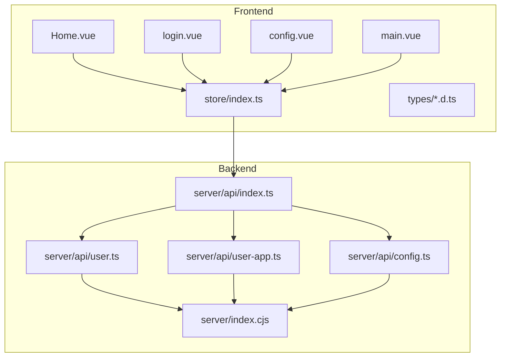
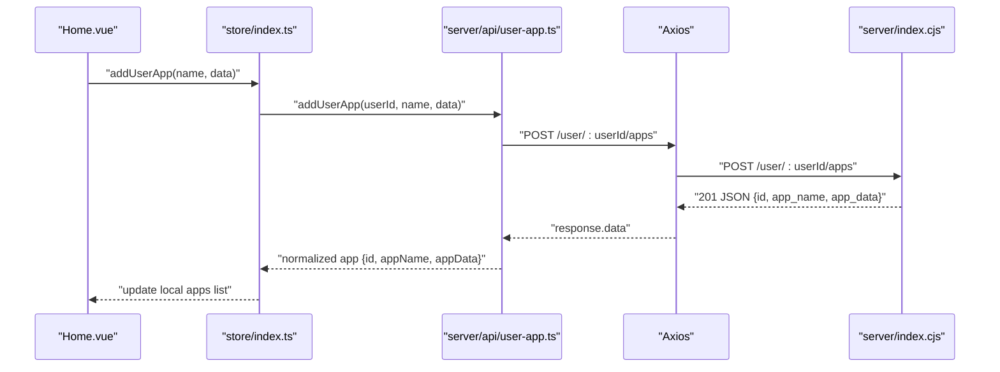
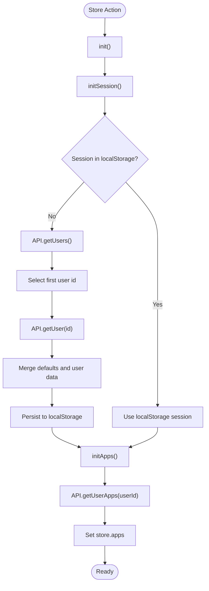
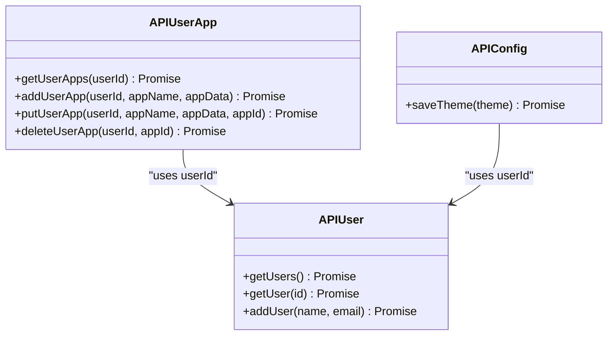
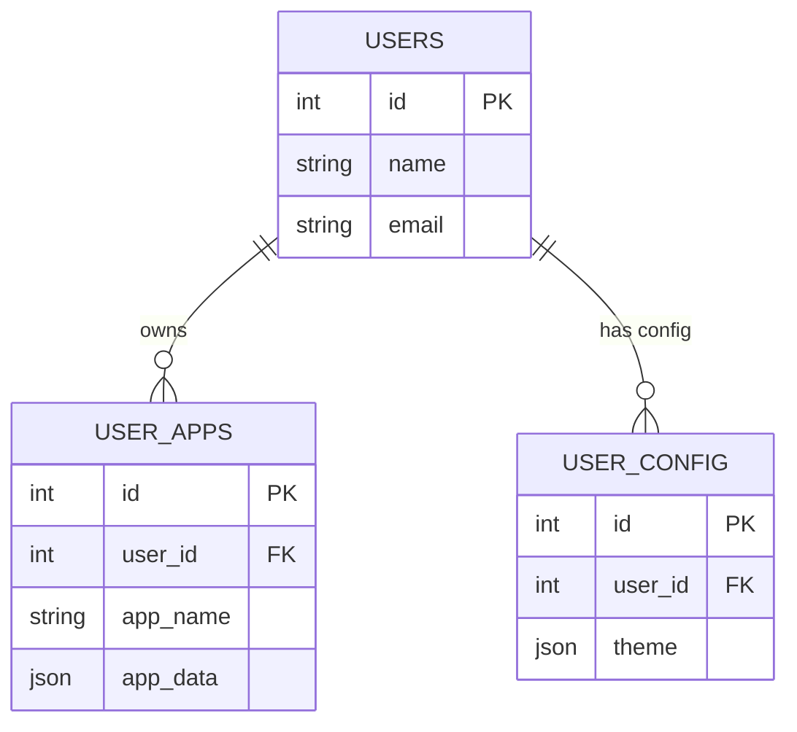
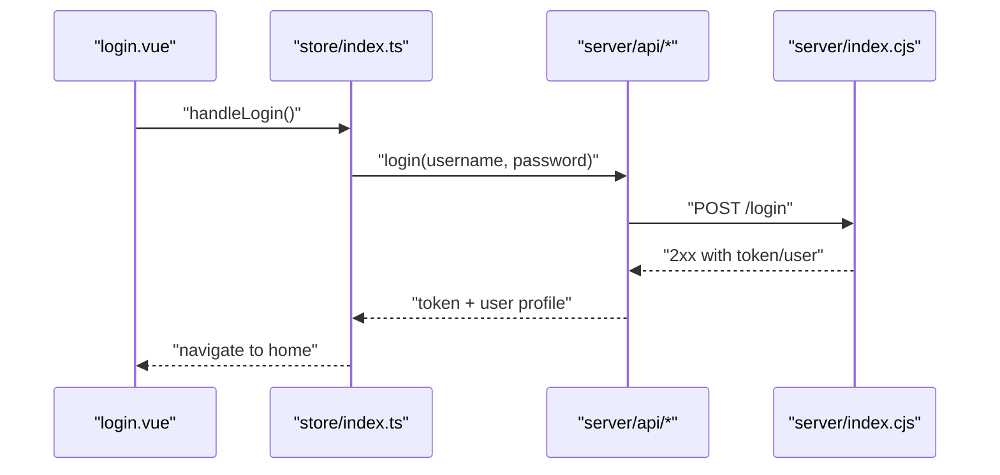
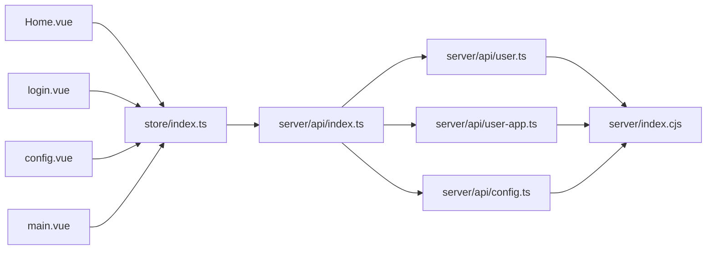

# API Integration

<cite>
**Referenced Files in This Document**
- [index.ts](file://src/client/store/index.ts)
- [main.ts](file://src/client/main.ts)
- [router.ts](file://src/client/router.ts)
- [Home.vue](file://src/client/views/Home.vue)
- [login.vue](file://src/client/views/login.vue)
- [config.vue](file://src/client/components/config.vue)
- [main.vue](file://src/client/components/main.vue)
- [store.d.ts](file://src/client/types/store.d.ts)
- [user.d.ts](file://src/client/types/user.d.ts)
- [index.ts](file://src/server/api/index.ts)
- [config.ts](file://src/server/api/config.ts)
- [user.ts](file://src/server/api/user.ts)
- [user-app.ts](file://src/server/api/user-app.ts)
- [index.cjs](file://src/server/index.cjs)
</cite>

## Table of Contents
1. [Introduction](#introduction)
2. [Project Structure](#project-structure)
3. [Core Components](#core-components)
4. [Architecture Overview](#architecture-overview)
5. [Detailed Component Analysis](#detailed-component-analysis)
6. [Dependency Analysis](#dependency-analysis)
7. [Performance Considerations](#performance-considerations)
8. [Troubleshooting Guide](#troubleshooting-guide)
9. [Conclusion](#conclusion)

## Introduction
This document explains the frontend-backend API integration patterns used by the Vue application and the Express.js backend. It focuses on how the frontend communicates with the backend via HTTP requests, how API wrappers are organized under server/api, and how the frontend store consumes these wrappers to manage application state. It covers request/response patterns, error handling strategies, data transformation, CRUD operations, authentication flows, and real-time-like state updates. It also documents Axios configuration, interceptors, and response processing, along with API versioning, error propagation, and loading state management.

## Project Structure
The integration spans two primary areas:
- Frontend (Vue + Pinia): Views, components, and a centralized store that orchestrates API calls and state updates.
- Backend (Express.js): Routes exposing HTTP endpoints backed by a PostgreSQL database.

**Diagram sources**
- [index.ts:1-91](file://src/client/store/index.ts#L1-L91)
- [Home.vue:1-62](file://src/client/views/Home.vue#L1-L62)
- [login.vue:1-106](file://src/client/views/login.vue#L1-L106)
- [config.vue:1-102](file://src/client/components/config.vue#L1-L102)
- [main.vue:1-109](file://src/client/components/main.vue#L1-L109)
- [index.ts:1-4](file://src/server/api/index.ts#L1-L4)
- [user.ts:1-46](file://src/server/api/user.ts#L1-L46)
- [user-app.ts:1-73](file://src/server/api/user-app.ts#L1-L73)
- [config.ts:1-19](file://src/server/api/config.ts#L1-L19)
- [index.cjs:1-173](file://src/server/index.cjs#L1-L173)

**Section sources**
- [index.ts:1-91](file://src/client/store/index.ts#L1-L91)
- [index.ts:1-4](file://src/server/api/index.ts#L1-L4)
- [index.cjs:1-173](file://src/server/index.cjs#L1-L173)

## Core Components
- Frontend store: Centralizes initialization, session retrieval, app lists, theme persistence, and CRUD actions for user apps. It imports API wrappers and updates local state after successful responses.
- API wrappers: Thin Axios-based functions that encapsulate HTTP calls to the backend. They expose typed functions for users, user apps, and theme persistence.
- Backend routes: Provide endpoints for users, user apps, and theme configuration. They return JSON responses with appropriate HTTP status codes.

Key responsibilities:
- Initialization: Loads session from localStorage or backend, then loads user apps.
- CRUD for apps: Add, update, delete, and list user apps.
- Theme persistence: Save and load theme preferences per user.
- Error propagation: Wrappers rethrow errors so callers can handle them.

**Section sources**
- [index.ts:1-91](file://src/client/store/index.ts#L1-L91)
- [user.ts:1-46](file://src/server/api/user.ts#L1-L46)
- [user-app.ts:1-73](file://src/server/api/user-app.ts#L1-L73)
- [config.ts:1-19](file://src/server/api/config.ts#L1-L19)
- [index.cjs:46-164](file://src/server/index.cjs#L46-L164)

## Architecture Overview
The frontend and backend communicate over HTTP. The store invokes API wrappers, which use Axios to call Express routes. Responses are transformed into normalized shapes for the frontend, and errors are propagated upward for handling.

**Diagram sources**
- [Home.vue:14-26](file://src/client/views/Home.vue#L14-L26)
- [index.ts:63-75](file://src/client/store/index.ts#L63-L75)
- [user-app.ts:19-39](file://src/server/api/user-app.ts#L19-L39)
- [index.cjs:86-103](file://src/server/index.cjs#L86-L103)

## Detailed Component Analysis

### Frontend Store Integration
The store coordinates initialization, session hydration, app management, and theme persistence. It imports API wrappers and updates state upon successful responses. Error handling is performed locally to log failures and prevent unhandled exceptions.

**Diagram sources**
- [index.ts:20-57](file://src/client/store/index.ts#L20-L57)
- [user.ts:4-34](file://src/server/api/user.ts#L4-L34)
- [user-app.ts:4-17](file://src/server/api/user-app.ts#L4-L17)

**Section sources**
- [index.ts:1-91](file://src/client/store/index.ts#L1-L91)

### API Wrapper Layer
The server/api module exports wrappers for users, user apps, and theme persistence. These wrappers:
- Construct URLs using a base API_URL constant.
- Perform HTTP requests with Axios.
- Transform responses to frontend-friendly shapes.
- Rethrow errors for upstream handling.

**Diagram sources**
- [user.ts:1-46](file://src/server/api/user.ts#L1-L46)
- [user-app.ts:1-73](file://src/server/api/user-app.ts#L1-L73)
- [config.ts:1-19](file://src/server/api/config.ts#L1-L19)

**Section sources**
- [index.ts:1-4](file://src/server/api/index.ts#L1-L4)
- [user.ts:1-46](file://src/server/api/user.ts#L1-L46)
- [user-app.ts:1-73](file://src/server/api/user-app.ts#L1-L73)
- [config.ts:1-19](file://src/server/api/config.ts#L1-L19)

### Backend Route Endpoints
The Express server exposes endpoints for:
- Users: list all users and retrieve a single user by ID.
- User apps: list, add, update, and delete apps associated with a user.
- Theme: persist and retrieve theme configuration for a user.

**Diagram sources**
- [index.cjs:46-164](file://src/server/index.cjs#L46-L164)

**Section sources**
- [index.cjs:46-164](file://src/server/index.cjs#L46-L164)

### Authentication Flow
The current login view validates form fields but does not yet integrate with backend authentication. To implement authentication:
- Add a login action in the store that calls a backend login endpoint.
- On success, persist a session token and hydrate user/session state.
- On failure, surface errors to the UI.

[No sources needed since this diagram shows conceptual workflow, not actual code structure]

### CRUD Operations
- List apps: GET /user/:userid/apps
- Add app: POST /user/:userid/apps
- Update app: PUT /user/:userid/apps/:appId
- Delete app: DELETE /user/:userid/apps/:appId

These operations are invoked from the store and mapped to normalized frontend models.

**Section sources**
- [user-app.ts:4-73](file://src/server/api/user-app.ts#L4-L73)
- [index.cjs:72-122](file://src/server/index.cjs#L72-L122)

### Data Transformation
- getUserApps transforms backend rows to frontend shape with camelCase keys.
- addUserApp normalizes the response to match frontend expectations.
- Theme persistence uses a POST to /theme with a user_id field.

**Section sources**
- [user-app.ts:8-34](file://src/server/api/user-app.ts#L8-L34)
- [config.ts:10-18](file://src/server/api/config.ts#L10-L18)
- [index.cjs:138-150](file://src/server/index.cjs#L138-L150)

### Error Handling Strategies
- API wrappers catch Axios errors and rethrow them for callers.
- Frontend store catches errors during initialization and CRUD operations, logs them, and continues.
- Backend routes return 404 for missing resources and 500 for internal errors with JSON bodies.

Recommendations:
- Surface user-friendly messages via UI notifications.
- Distinguish between network errors, validation errors, and resource-not-found scenarios.
- Consider centralized error middleware on the backend.

**Section sources**
- [user.ts:11-14](file://src/server/api/user.ts#L11-L14)
- [user-app.ts:13-16](file://src/server/api/user-app.ts#L13-L16)
- [index.cjs:56-69](file://src/server/index.cjs#L56-L69)
- [index.cjs:80-83](file://src/server/index.cjs#L80-L83)
- [index.cjs:114-121](file://src/server/index.cjs#L114-L121)

### Loading State Management
- The store currently logs progress but does not expose explicit loading booleans.
- Recommended improvements:
  - Introduce a loading flag per operation.
  - Disable UI controls while loading.
  - Provide global loading indicators.

[No sources needed since this section provides general guidance]

### Real-Time Data Updates
- The current implementation is request-response driven.
- To support near-real-time updates:
  - Use WebSocket connections for live events.
  - On server-side changes, broadcast updates to subscribed clients.
  - Update the store on incoming events to refresh local state.

[No sources needed since this section provides general guidance]

### Axios Configuration and Interceptors
- Base URL: API_URL constant defines the backend origin.
- No interceptors are configured in the current code.
- Recommendations:
  - Centralize Axios instance creation.
  - Add request/response interceptors for logging, auth tokens, and response normalization.
  - Configure timeout and retry policies.

**Section sources**
- [config.ts](file://src/server/api/config.ts#L3)
- [user.ts:1-2](file://src/server/api/user.ts#L1-L2)
- [user-app.ts:1-2](file://src/server/api/user-app.ts#L1-L2)

### API Versioning
- No explicit versioning is present in the current routes or wrappers.
- Recommendations:
  - Prefix routes with /api/v1.
  - Maintain backward compatibility during transitions.
  - Expose a version endpoint for clients to detect capabilities.

[No sources needed since this section provides general guidance]

## Dependency Analysis
The frontend depends on the API wrappers, which depend on Axios and the backend routes. The store orchestrates all interactions.

**Diagram sources**
- [Home.vue:1-62](file://src/client/views/Home.vue#L1-L62)
- [login.vue:1-106](file://src/client/views/login.vue#L1-L106)
- [config.vue:1-102](file://src/client/components/config.vue#L1-L102)
- [main.vue:1-109](file://src/client/components/main.vue#L1-L109)
- [index.ts:1-91](file://src/client/store/index.ts#L1-L91)
- [index.ts:1-4](file://src/server/api/index.ts#L1-L4)
- [user.ts:1-46](file://src/server/api/user.ts#L1-L46)
- [user-app.ts:1-73](file://src/server/api/user-app.ts#L1-L73)
- [config.ts:1-19](file://src/server/api/config.ts#L1-L19)
- [index.cjs:1-173](file://src/server/index.cjs#L1-L173)

**Section sources**
- [index.ts:1-91](file://src/client/store/index.ts#L1-L91)
- [index.ts:1-4](file://src/server/api/index.ts#L1-L4)
- [index.cjs:1-173](file://src/server/index.cjs#L1-L173)

## Performance Considerations
- Minimize redundant requests: cache user sessions and app lists where appropriate.
- Batch updates: combine related mutations when feasible.
- Debounce user input: avoid excessive API calls during typing.
- Lazy loading: defer non-critical data until needed.

[No sources needed since this section provides general guidance]

## Troubleshooting Guide
Common issues and resolutions:
- Network errors: Verify API_URL and CORS configuration on the backend.
- 404 Not Found: Confirm resource IDs and route parameters.
- 500 Internal Server Error: Inspect server logs and database connectivity.
- Type mismatches: Ensure frontend models align with backend schemas.

**Section sources**
- [index.cjs:9-10](file://src/server/index.cjs#L9-L10)
- [index.cjs:56-69](file://src/server/index.cjs#L56-L69)
- [index.cjs:80-83](file://src/server/index.cjs#L80-L83)
- [index.cjs:114-121](file://src/server/index.cjs#L114-L121)

## Conclusion
The application follows a clean separation of concerns: the frontend store orchestrates API interactions via thin wrappers, the backend exposes straightforward HTTP endpoints, and the UI reflects state changes. Enhancements such as centralized Axios configuration, interceptors, explicit loading states, and authentication integration would further improve reliability and developer experience. The current patterns support robust CRUD and initialization flows and can be extended to support real-time updates and API versioning.