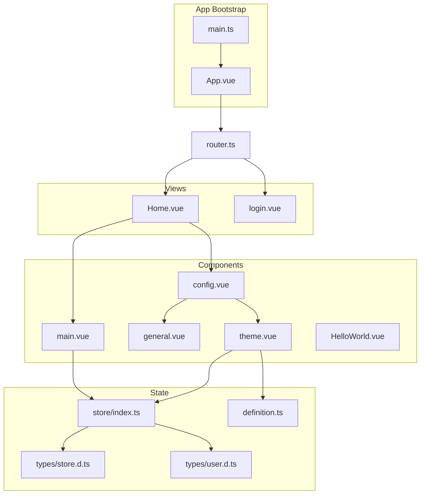
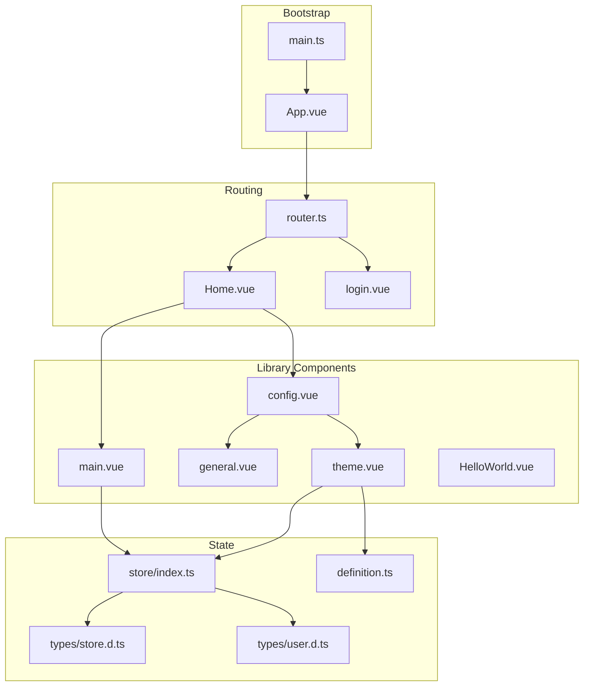
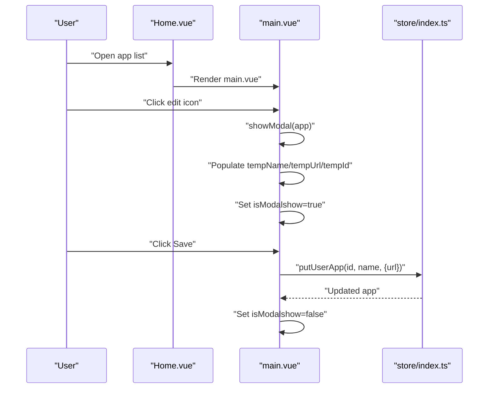
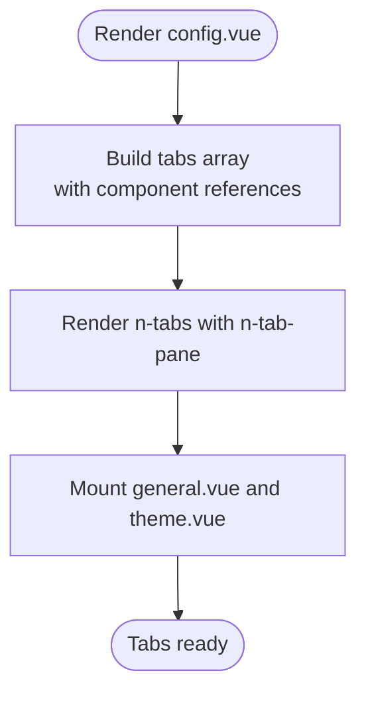
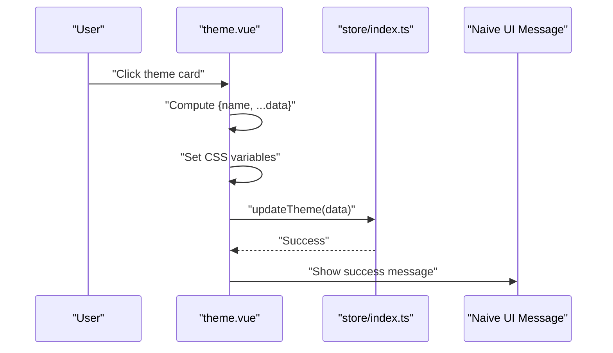
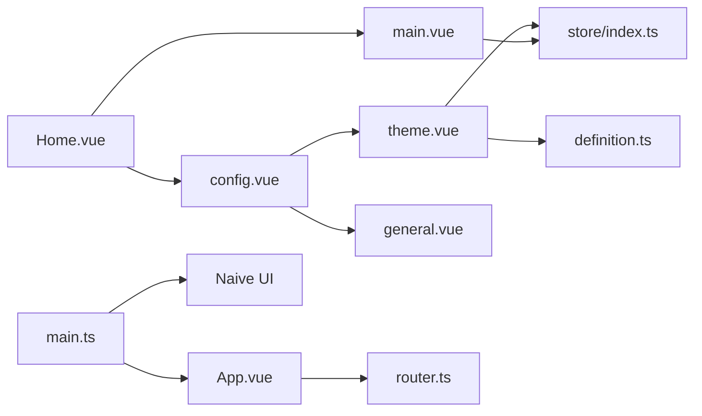

# Component Library

<cite>
**Referenced Files in This Document**
- [main.vue](file://src/client/components/main.vue)
- [config.vue](file://src/client/components/config.vue)
- [theme.vue](file://src/client/components/theme.vue)
- [general.vue](file://src/client/components/general.vue)
- [HelloWorld.vue](file://src/client/components/HelloWorld.vue)
- [index.ts](file://src/client/store/index.ts)
- [store.d.ts](file://src/client/types/store.d.ts)
- [user.d.ts](file://src/client/types/user.d.ts)
- [definition.ts](file://src/client/definition.ts)
- [App.vue](file://src/client/App.vue)
- [main.ts](file://src/client/main.ts)
- [router.ts](file://src/client/router.ts)
- [Home.vue](file://src/client/views/Home.vue)
- [login.vue](file://src/client/views/login.vue)
- [style.css](file://src/client/style.css)
</cite>

## Table of Contents
1. [Introduction](#introduction)
2. [Project Structure](#project-structure)
3. [Core Components](#core-components)
4. [Architecture Overview](#architecture-overview)
5. [Detailed Component Analysis](#detailed-component-analysis)
6. [Dependency Analysis](#dependency-analysis)
7. [Performance Considerations](#performance-considerations)
8. [Troubleshooting Guide](#troubleshooting-guide)
9. [Conclusion](#conclusion)
10. [Appendices](#appendices)

## Introduction
This document describes the reusable Vue components and UI library used in the client application. It focuses on the component library entries main.vue, config.vue, theme.vue, general.vue, and HelloWorld.vue, detailing their props, events, slots, usage patterns, and composition. It also explains how Naive UI is integrated, how custom components leverage the component library, and how styling and responsiveness are handled. Practical usage scenarios are included to guide developers in building upon and extending the library.

## Project Structure
The component library resides under src/client/components and is composed of:
- main.vue: Application launcher and editor for user applications
- config.vue: Configuration hub with tabbed navigation
- theme.vue: Theme selection and persistence
- general.vue: Placeholder for general configuration content
- HelloWorld.vue: Example component demonstrating props and interactivity

These components are orchestrated by views and the Pinia store, with Naive UI integrated globally via the application bootstrap.

**Diagram sources**
- [main.ts:1-11](file://src/client/main.ts#L1-L11)
- [App.vue:1-16](file://src/client/App.vue#L1-L16)
- [router.ts:1-24](file://src/client/router.ts#L1-L24)
- [Home.vue:1-62](file://src/client/views/Home.vue#L1-L62)
- [login.vue:1-106](file://src/client/views/login.vue#L1-L106)
- [config.vue:1-102](file://src/client/components/config.vue#L1-L102)
- [theme.vue:1-70](file://src/client/components/theme.vue#L1-L70)
- [general.vue:1-10](file://src/client/components/general.vue#L1-L10)
- [main.vue:1-109](file://src/client/components/main.vue#L1-L109)
- [HelloWorld.vue:1-42](file://src/client/components/HelloWorld.vue#L1-L42)
- [index.ts:1-91](file://src/client/store/index.ts#L1-L91)
- [store.d.ts:1-7](file://src/client/types/store.d.ts#L1-L7)
- [user.d.ts:1-6](file://src/client/types/user.d.ts#L1-L6)
- [definition.ts:1-21](file://src/client/definition.ts#L1-L21)

**Section sources**
- [main.ts:1-11](file://src/client/main.ts#L1-L11)
- [App.vue:1-16](file://src/client/App.vue#L1-L16)
- [router.ts:1-24](file://src/client/router.ts#L1-L24)
- [Home.vue:1-62](file://src/client/views/Home.vue#L1-L62)
- [login.vue:1-106](file://src/client/views/login.vue#L1-L106)
- [config.vue:1-102](file://src/client/components/config.vue#L1-L102)
- [theme.vue:1-70](file://src/client/components/theme.vue#L1-L70)
- [general.vue:1-10](file://src/client/components/general.vue#L1-L10)
- [main.vue:1-109](file://src/client/components/main.vue#L1-L109)
- [HelloWorld.vue:1-42](file://src/client/components/HelloWorld.vue#L1-L42)
- [index.ts:1-91](file://src/client/store/index.ts#L1-L91)
- [store.d.ts:1-7](file://src/client/types/store.d.ts#L1-L7)
- [user.d.ts:1-6](file://src/client/types/user.d.ts#L1-L6)
- [definition.ts:1-21](file://src/client/definition.ts#L1-L21)

## Core Components
This section documents each component’s purpose, props, events, slots, and usage patterns.

- main.vue
  - Purpose: Renders a list of user applications, opens an editing modal, and updates application metadata via the store.
  - Props: None
  - Events: None (interacts with store actions)
  - Slots: None
  - Usage pattern: Rendered conditionally in Home.vue; integrates with Naive UI modal and card components.
  - Notable behaviors: Uses a local modal flag and temporary refs to stage edits before committing via store actions.

- config.vue
  - Purpose: Provides a tabbed configuration interface composed of general and theme panels.
  - Props: None
  - Events: None
  - Slots: None
  - Usage pattern: Hosts two child components (general.vue and theme.vue) inside Naive UI tabs; demonstrates dynamic component rendering via the component is attribute.

- theme.vue
  - Purpose: Presents selectable themes backed by a static palette and persists selections to the store and CSS custom properties.
  - Props: None
  - Events: None
  - Slots: None
  - Usage pattern: Iterates over a color palette and applies CSS variables on click; emits a success message via Naive UI message provider.

- general.vue
  - Purpose: Demonstrates accessing store state (session id) within a minimal template.
  - Props: None
  - Events: None
  - Slots: None
  - Usage pattern: Included as a tab panel in config.vue.

- HelloWorld.vue
  - Purpose: Example component showcasing typed props, reactive state, and basic templating.
  - Props: msg (string)
  - Events: None
  - Slots: None
  - Usage pattern: Intended as a learning/example component; demonstrates scoped styling and interactive button.

Practical examples (paths only):
- Using main.vue to edit an app: [main.vue:13-31](file://src/client/components/main.vue#L13-L31)
- Rendering tabs and switching panels: [config.vue:34-38](file://src/client/components/config.vue#L34-L38)
- Applying theme and persisting to store: [theme.vue:11-21](file://src/client/components/theme.vue#L11-L21)
- Accessing session id in general panel: [general.vue:4](file://src/client/components/general.vue#L4)
- Passing props to HelloWorld: [HelloWorld.vue:4](file://src/client/components/HelloWorld.vue#L4)

**Section sources**
- [main.vue:1-109](file://src/client/components/main.vue#L1-L109)
- [config.vue:1-102](file://src/client/components/config.vue#L1-L102)
- [theme.vue:1-70](file://src/client/components/theme.vue#L1-L70)
- [general.vue:1-10](file://src/client/components/general.vue#L1-L10)
- [HelloWorld.vue:1-42](file://src/client/components/HelloWorld.vue#L1-L42)

## Architecture Overview
The component library is integrated into the application via a global plugin setup and orchestrated by the router and views. The store encapsulates state and actions for session, apps, and theme. Naive UI is installed globally and used extensively for dialogs, forms, messages, and cards.

**Diagram sources**
- [main.ts:1-11](file://src/client/main.ts#L1-L11)
- [App.vue:1-16](file://src/client/App.vue#L1-L16)
- [router.ts:1-24](file://src/client/router.ts#L1-L24)
- [Home.vue:1-62](file://src/client/views/Home.vue#L1-L62)
- [login.vue:1-106](file://src/client/views/login.vue#L1-L106)
- [config.vue:1-102](file://src/client/components/config.vue#L1-L102)
- [theme.vue:1-70](file://src/client/components/theme.vue#L1-L70)
- [general.vue:1-10](file://src/client/components/general.vue#L1-L10)
- [main.vue:1-109](file://src/client/components/main.vue#L1-L109)
- [HelloWorld.vue:1-42](file://src/client/components/HelloWorld.vue#L1-L42)
- [index.ts:1-91](file://src/client/store/index.ts#L1-L91)
- [store.d.ts:1-7](file://src/client/types/store.d.ts#L1-L7)
- [user.d.ts:1-6](file://src/client/types/user.d.ts#L1-L6)
- [definition.ts:1-21](file://src/client/definition.ts#L1-L21)

## Detailed Component Analysis

### main.vue
- Composition: Uses script setup with TypeScript; imports Naive UI icons and buttons; manages local modal visibility and temporary edit fields.
- Data and state: Reactive refs for modal visibility and staged app fields; reads store.apps for rendering.
- Interaction flow:
  - Clicking the edit icon triggers showModal, which populates temporary refs and opens the modal.
  - Save invokes editApp, which calls store.putUserApp and closes the modal on success.
- Styling: Scoped styles define app cards, modal container layout, and icon button positioning.

**Diagram sources**
- [main.vue:13-31](file://src/client/components/main.vue#L13-L31)
- [index.ts:76-88](file://src/client/store/index.ts#L76-L88)

**Section sources**
- [main.vue:1-109](file://src/client/components/main.vue#L1-L109)
- [index.ts:19-88](file://src/client/store/index.ts#L19-L88)

### config.vue
- Composition: Uses script setup; defines tabs array with component references; renders Naive UI tabs and tab panes.
- Composition pattern: Dynamic component rendering via the component attribute binds tab content to child components.
- Integration: Includes a placeholder action and selected tab state reference.

**Diagram sources**
- [config.vue:13-38](file://src/client/components/config.vue#L13-L38)

**Section sources**
- [config.vue:1-102](file://src/client/components/config.vue#L1-L102)

### theme.vue
- Composition: Imports color palette from definition.ts; uses Naive UI message provider; updates CSS custom properties and store theme.
- Interaction: On click, computes theme payload, sets CSS variables, persists to store, and shows a success message.

**Diagram sources**
- [theme.vue:11-21](file://src/client/components/theme.vue#L11-L21)
- [index.ts:58-62](file://src/client/store/index.ts#L58-L62)
- [definition.ts:1-21](file://src/client/definition.ts#L1-L21)

**Section sources**
- [theme.vue:1-70](file://src/client/components/theme.vue#L1-L70)
- [index.ts:58-62](file://src/client/store/index.ts#L58-L62)
- [definition.ts:1-21](file://src/client/definition.ts#L1-L21)

### general.vue
- Composition: Minimal setup; accesses store session id for display.
- Usage pattern: Included as a tab panel in config.vue.

**Section sources**
- [general.vue:1-10](file://src/client/components/general.vue#L1-L10)

### HelloWorld.vue
- Composition: Typed props with defineProps; reactive count; scoped styling.
- Usage pattern: Demonstrates basic component structure and styling.

**Section sources**
- [HelloWorld.vue:1-42](file://src/client/components/HelloWorld.vue#L1-L42)

## Dependency Analysis
Key dependencies and relationships:
- main.vue depends on the Pinia store for app data and actions; uses Naive UI modal and card.
- config.vue composes general.vue and theme.vue; uses Naive UI tabs.
- theme.vue depends on definition.ts for color palette and store for persistence; uses Naive UI message provider.
- Home.vue orchestrates main.vue and config.vue and initializes the store on mount.
- App.vue wraps router-view with Naive UI message provider; main.ts installs Naive UI globally.

**Diagram sources**
- [Home.vue:1-62](file://src/client/views/Home.vue#L1-L62)
- [main.vue:1-109](file://src/client/components/main.vue#L1-L109)
- [config.vue:1-102](file://src/client/components/config.vue#L1-L102)
- [theme.vue:1-70](file://src/client/components/theme.vue#L1-L70)
- [general.vue:1-10](file://src/client/components/general.vue#L1-L10)
- [definition.ts:1-21](file://src/client/definition.ts#L1-L21)
- [index.ts:1-91](file://src/client/store/index.ts#L1-L91)
- [App.vue:1-16](file://src/client/App.vue#L1-L16)
- [main.ts:1-11](file://src/client/main.ts#L1-L11)

**Section sources**
- [Home.vue:1-62](file://src/client/views/Home.vue#L1-L62)
- [main.vue:1-109](file://src/client/components/main.vue#L1-L109)
- [config.vue:1-102](file://src/client/components/config.vue#L1-L102)
- [theme.vue:1-70](file://src/client/components/theme.vue#L1-L70)
- [general.vue:1-10](file://src/client/components/general.vue#L1-L10)
- [definition.ts:1-21](file://src/client/definition.ts#L1-L21)
- [index.ts:1-91](file://src/client/store/index.ts#L1-L91)
- [App.vue:1-16](file://src/client/App.vue#L1-L16)
- [main.ts:1-11](file://src/client/main.ts#L1-L11)

## Performance Considerations
- Prefer lazy loading for heavy tab content if the number of tabs grows.
- Debounce or batch store updates when editing multiple fields simultaneously.
- Use virtualization for long lists of apps if scalability becomes a concern.
- Minimize DOM updates by avoiding unnecessary re-renders in loops.

## Troubleshooting Guide
Common issues and resolutions:
- Modal does not close after save: Verify the modal visibility ref is toggled on successful store action.
  - Reference: [main.vue:19-25](file://src/client/components/main.vue#L19-L25)
- Theme changes not reflected: Ensure CSS variables are set on the document element and the store update completes.
  - Reference: [theme.vue:13-21](file://src/client/components/theme.vue#L13-L21)
- Tab content not rendering: Confirm the tabs array includes the correct component references and that the component attribute is used properly.
  - Reference: [config.vue:13-38](file://src/client/components/config.vue#L13-L38)
- Session or apps missing: Initialize the store on mount and verify API calls succeed.
  - Reference: [Home.vue:28-30](file://src/client/views/Home.vue#L28-L30), [index.ts:20-57](file://src/client/store/index.ts#L20-L57)

**Section sources**
- [main.vue:19-25](file://src/client/components/main.vue#L19-L25)
- [theme.vue:13-21](file://src/client/components/theme.vue#L13-L21)
- [config.vue:13-38](file://src/client/components/config.vue#L13-L38)
- [Home.vue:28-30](file://src/client/views/Home.vue#L28-L30)
- [index.ts:20-57](file://src/client/store/index.ts#L20-L57)

## Conclusion
The component library provides a cohesive set of reusable UI elements powered by Naive UI and Pinia. The main.vue component handles application listings and editing, config.vue composes modular panels, theme.vue enables dynamic theming, general.vue offers a baseline panel, and HelloWorld.vue serves as a didactic example. The architecture emphasizes composability, centralized state management, and straightforward integration patterns suitable for extension and maintenance.

## Appendices

### Naive UI Integration
- Global installation: Naive UI is installed in main.ts and used throughout components for dialogs, forms, messages, and cards.
- Provider wrappers: App.vue wraps router-view with n-message-provider to enable global messaging.

**Section sources**
- [main.ts:1-11](file://src/client/main.ts#L1-L11)
- [App.vue:7-9](file://src/client/App.vue#L7-L9)

### Styling and Responsive Patterns
- Global CSS variables: style.css defines root-level variables consumed by components.
- Scoped component styles: Components apply scoped styles for local scoping and readability.
- Responsive layout hints: Flexbox and grid are used in components and global styles to support responsive behavior.

**Section sources**
- [style.css:1-83](file://src/client/style.css#L1-L83)
- [main.vue:68-109](file://src/client/components/main.vue#L68-L109)
- [theme.vue:38-70](file://src/client/components/theme.vue#L38-L70)
- [config.vue:60-102](file://src/client/components/config.vue#L60-L102)

### Extensibility and Best Practices
- Keep components stateless where possible; push state to the store.
- Encapsulate UI concerns (dialogs, forms) behind reusable components leveraging Naive UI primitives.
- Use TypeScript interfaces for store and API payloads to improve type safety.
- Favor composition over inheritance; use dynamic component mounting for flexible layouts.
- Centralize theme tokens in a single palette file for consistent updates.