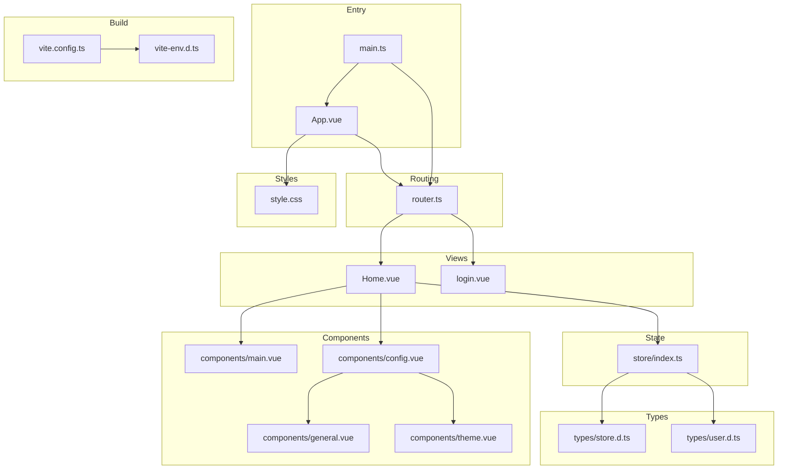
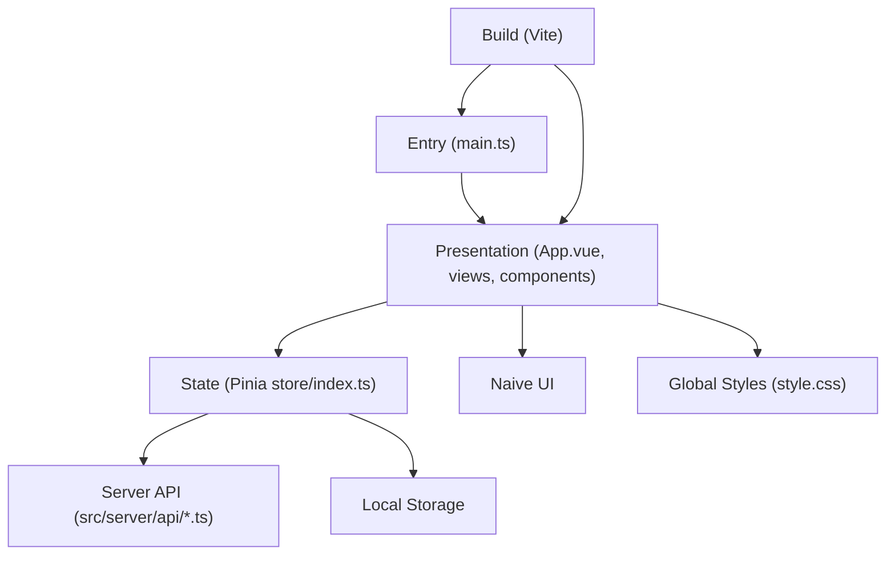
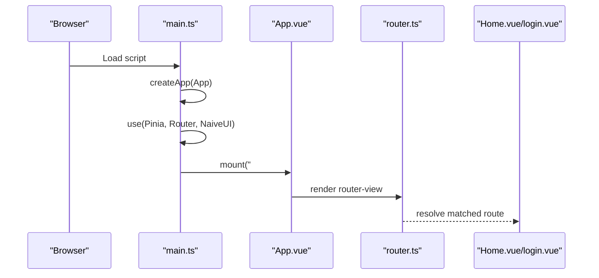
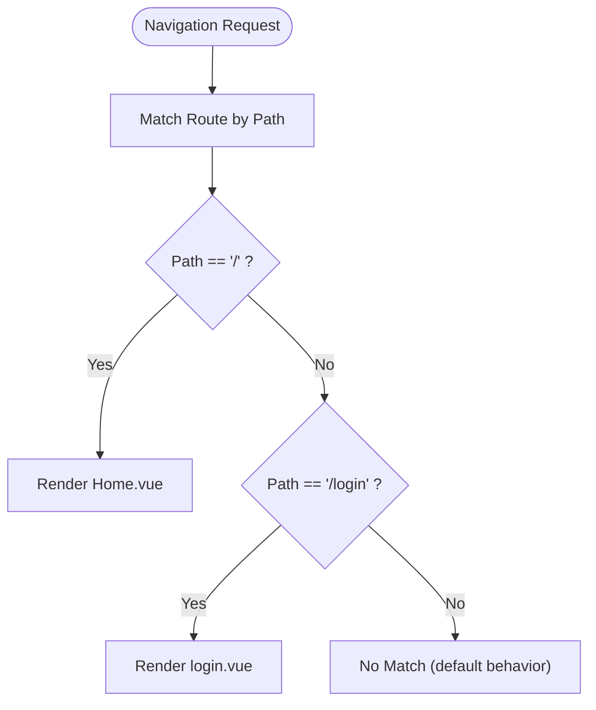
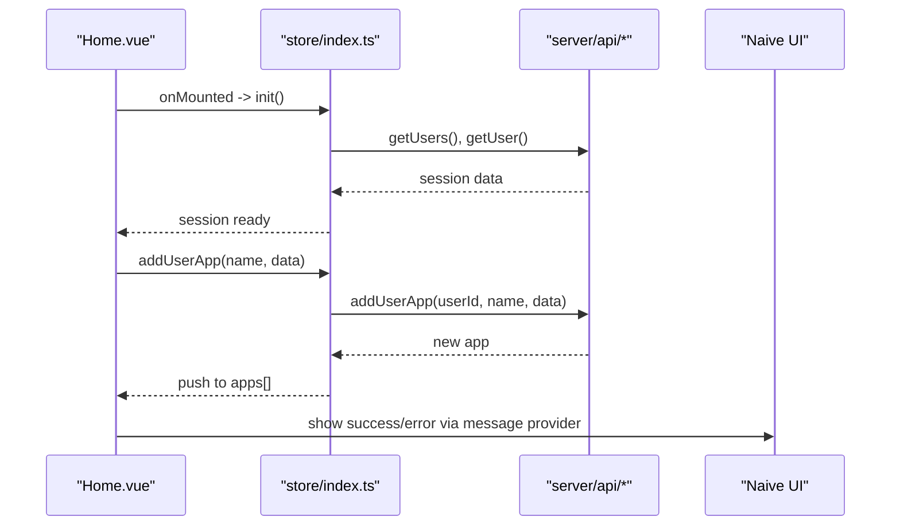
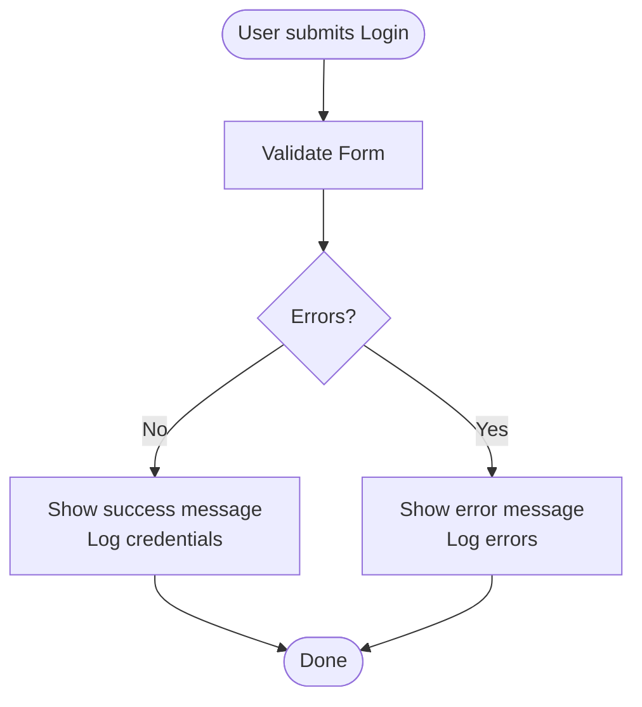
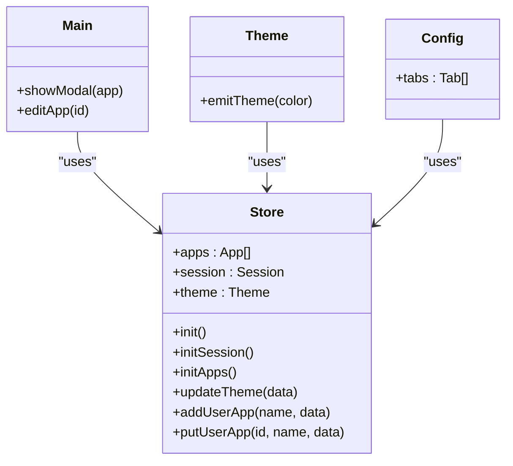
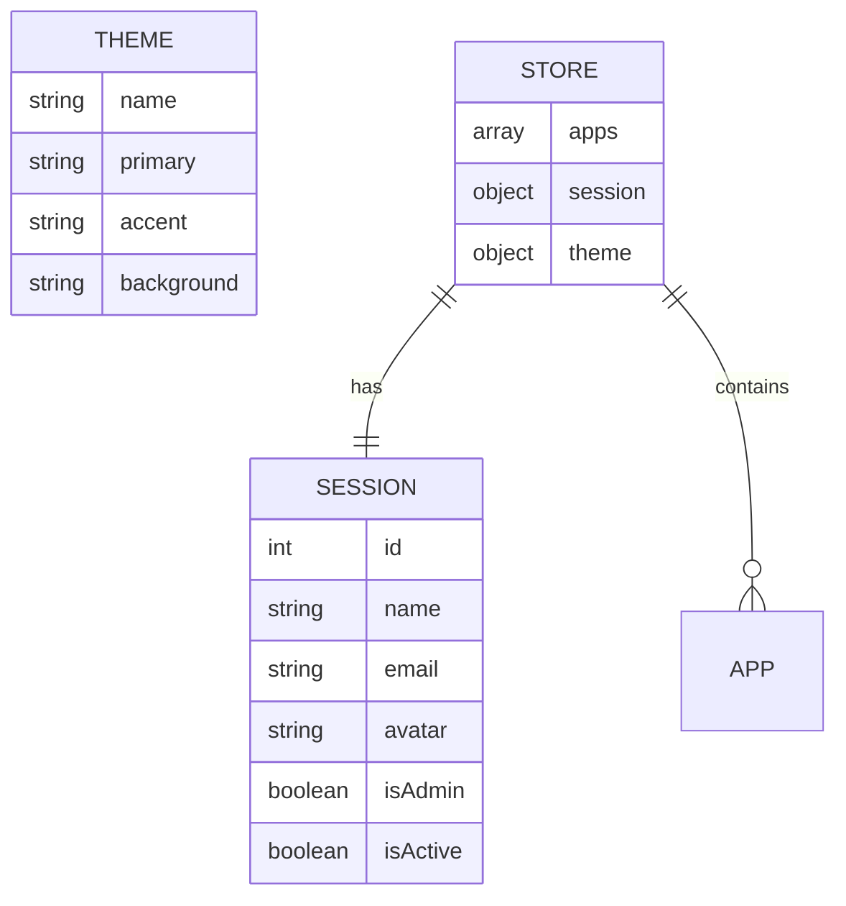
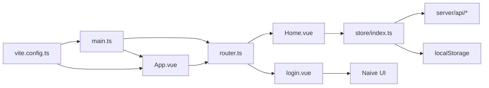

# Frontend Application

<cite>
**Referenced Files in This Document**
- [main.ts](file://src/client/main.ts)
- [App.vue](file://src/client/App.vue)
- [router.ts](file://src/client/router.ts)
- [Home.vue](file://src/client/views/Home.vue)
- [login.vue](file://src/client/views/login.vue)
- [main.vue](file://src/client/components/main.vue)
- [config.vue](file://src/client/components/config.vue)
- [general.vue](file://src/client/components/general.vue)
- [theme.vue](file://src/client/components/theme.vue)
- [index.ts](file://src/client/store/index.ts)
- [store.d.ts](file://src/client/types/store.d.ts)
- [user.d.ts](file://src/client/types/user.d.ts)
- [style.css](file://src/client/style.css)
- [vite-env.d.ts](file://src/client/vite-env.d.ts)
- [vite.config.ts](file://src/client/vite.config.ts)
</cite>

## Table of Contents
1. [Introduction](#introduction)
2. [Project Structure](#project-structure)
3. [Core Components](#core-components)
4. [Architecture Overview](#architecture-overview)
5. [Detailed Component Analysis](#detailed-component-analysis)
6. [Dependency Analysis](#dependency-analysis)
7. [Performance Considerations](#performance-considerations)
8. [Troubleshooting Guide](#troubleshooting-guide)
9. [Conclusion](#conclusion)
10. [Appendices](#appendices)

## Introduction
This document explains the Vue 3 frontend application’s structure, component hierarchy, routing configuration, and asset management. It covers the root component setup, the entry point, the router configuration, and how views integrate with Pinia for state management and with the backend API layer. Practical examples of component usage, prop-like patterns via reactive state, and event handling are included. The integration with TypeScript and Vite is also documented.

## Project Structure
The frontend is organized into a clear feature-based structure under src/client:
- Entry point and root app: main.ts, App.vue
- Routing: router.ts
- Views: Home.vue, login.vue
- Components: reusable building blocks under components/
- Store: Pinia store under store/
- Types: TypeScript type definitions under types/
- Styles and assets: style.css, assets/
- Build configuration: vite.config.ts, vite-env.d.ts

**Diagram sources**
- [main.ts:1-11](file://src/client/main.ts#L1-L11)
- [App.vue:1-16](file://src/client/App.vue#L1-L16)
- [router.ts:1-24](file://src/client/router.ts#L1-L24)
- [Home.vue:1-62](file://src/client/views/Home.vue#L1-L62)
- [login.vue:1-106](file://src/client/views/login.vue#L1-L106)
- [main.vue:1-109](file://src/client/components/main.vue#L1-L109)
- [config.vue:1-102](file://src/client/components/config.vue#L1-L102)
- [general.vue:1-10](file://src/client/components/general.vue#L1-L10)
- [theme.vue:1-70](file://src/client/components/theme.vue#L1-L70)
- [index.ts:1-91](file://src/client/store/index.ts#L1-L91)
- [store.d.ts:1-7](file://src/client/types/store.d.ts#L1-L7)
- [user.d.ts:1-6](file://src/client/types/user.d.ts#L1-L6)
- [style.css:1-83](file://src/client/style.css#L1-L83)
- [vite.config.ts:1-13](file://src/client/vite.config.ts#L1-L13)
- [vite-env.d.ts:1-2](file://src/client/vite-env.d.ts#L1-L2)

**Section sources**
- [main.ts:1-11](file://src/client/main.ts#L1-L11)
- [router.ts:1-24](file://src/client/router.ts#L1-L24)
- [App.vue:1-16](file://src/client/App.vue#L1-L16)
- [style.css:1-83](file://src/client/style.css#L1-L83)
- [vite.config.ts:1-13](file://src/client/vite.config.ts#L1-L13)
- [vite-env.d.ts:1-2](file://src/client/vite-env.d.ts#L1-L2)

## Core Components
- Root application container: App.vue wraps the router-view and provides a global message provider.
- Entry point: main.ts initializes Vue, Pinia, Naive UI, registers global styles, and mounts the app.
- Store: Pinia store encapsulates session, theme, and apps state, plus actions to initialize data and sync with the backend API.
- Views: Home.vue is the main dashboard that renders components and interacts with the store; login.vue provides a form with validation and messages.
- Components: main.vue lists apps and edits them; config.vue hosts tabbed configuration panels; general.vue and theme.vue are tabbed content.

Practical usage examples (paths only):
- Initialize store on mount: [Home.vue:28-30](file://src/client/views/Home.vue#L28-L30)
- Add app via store action: [Home.vue:14-26](file://src/client/views/Home.vue#L14-L26)
- Edit app via modal and store action: [main.vue:13-25](file://src/client/components/main.vue#L13-L25)
- Theme update and persistence: [theme.vue:11-21](file://src/client/components/theme.vue#L11-L21)
- Login form validation and message: [login.vue:26-37](file://src/client/views/login.vue#L26-L37)

**Section sources**
- [App.vue:1-16](file://src/client/App.vue#L1-L16)
- [main.ts:1-11](file://src/client/main.ts#L1-L11)
- [index.ts:1-91](file://src/client/store/index.ts#L1-L91)
- [Home.vue:1-62](file://src/client/views/Home.vue#L1-L62)
- [login.vue:1-106](file://src/client/views/login.vue#L1-L106)
- [main.vue:1-109](file://src/client/components/main.vue#L1-L109)
- [config.vue:1-102](file://src/client/components/config.vue#L1-L102)
- [general.vue:1-10](file://src/client/components/general.vue#L1-L10)
- [theme.vue:1-70](file://src/client/components/theme.vue#L1-L70)

## Architecture Overview
The frontend follows a layered architecture:
- Entry layer: main.ts bootstraps the app and installs plugins.
- Presentation layer: App.vue and views/components render UI.
- State layer: Pinia store manages session, theme, and apps.
- Backend integration: Store actions call server API modules via API namespace.

**Diagram sources**
- [main.ts:1-11](file://src/client/main.ts#L1-L11)
- [App.vue:1-16](file://src/client/App.vue#L1-L16)
- [index.ts:1-91](file://src/client/store/index.ts#L1-L91)
- [style.css:1-83](file://src/client/style.css#L1-L83)
- [vite.config.ts:1-13](file://src/client/vite.config.ts#L1-L13)

## Detailed Component Analysis

### Root Component and Entry Point
- main.ts creates the Vue app, installs Pinia, Vue Router, and Naive UI, then mounts to #app.
- App.vue delegates rendering to router-view and wraps content with a message provider.

**Diagram sources**
- [main.ts:1-11](file://src/client/main.ts#L1-L11)
- [App.vue:6-10](file://src/client/App.vue#L6-L10)
- [router.ts:18-21](file://src/client/router.ts#L18-L21)

**Section sources**
- [main.ts:1-11](file://src/client/main.ts#L1-L11)
- [App.vue:1-16](file://src/client/App.vue#L1-L16)

### Routing Configuration
- router.ts defines two routes: Home at "/" and Login at "/login".
- History mode is enabled with createWebHistory.

**Diagram sources**
- [router.ts:5-16](file://src/client/router.ts#L5-L16)

**Section sources**
- [router.ts:1-24](file://src/client/router.ts#L1-L24)

### Home.vue: Dashboard and Store Integration
- Imports assets, components, and the Pinia store.
- Uses reactive refs for app creation and toggles a configuration dialog.
- Calls store.init on mount and exposes store actions for initialization and adding apps.
- Conditionally renders Main or Config based on dialog state.

**Diagram sources**
- [Home.vue:28-30](file://src/client/views/Home.vue#L28-L30)
- [Home.vue:14-26](file://src/client/views/Home.vue#L14-L26)
- [index.ts:20-23](file://src/client/store/index.ts#L20-L23)
- [index.ts:63-75](file://src/client/store/index.ts#L63-L75)

**Section sources**
- [Home.vue:1-62](file://src/client/views/Home.vue#L1-L62)
- [index.ts:1-91](file://src/client/store/index.ts#L1-L91)

### login.vue: Form Validation and Actions
- Reactive form model with username and password.
- Validation rules and imperative validation via Naive UI FormInst.
- On successful validation, logs credentials and shows a success message.
- Provides a reset password action with a message.

**Diagram sources**
- [login.vue:26-37](file://src/client/views/login.vue#L26-L37)

**Section sources**
- [login.vue:1-106](file://src/client/views/login.vue#L1-L106)

### Components: main.vue, config.vue, general.vue, theme.vue
- main.vue displays apps from the store, opens a modal to edit app name and URL, and calls store.putUserApp to persist changes.
- config.vue organizes configuration tabs and renders child components via dynamic component binding.
- general.vue shows current session ID from the store.
- theme.vue applies CSS variables for theme colors and persists updates via store.updateTheme.

**Diagram sources**
- [index.ts:5-91](file://src/client/store/index.ts#L5-L91)
- [main.vue:13-31](file://src/client/components/main.vue#L13-L31)
- [theme.vue:11-21](file://src/client/components/theme.vue#L11-L21)
- [config.vue:13-24](file://src/client/components/config.vue#L13-L24)

**Section sources**
- [main.vue:1-109](file://src/client/components/main.vue#L1-L109)
- [config.vue:1-102](file://src/client/components/config.vue#L1-L102)
- [general.vue:1-10](file://src/client/components/general.vue#L1-L10)
- [theme.vue:1-70](file://src/client/components/theme.vue#L1-L70)

### Store and Type Safety
- The store is defined with Pinia and typed state/generic actions.
- Types for Theme and User are declared in dedicated .d.ts files.
- The store imports API module to communicate with backend endpoints.

**Diagram sources**
- [index.ts:6-17](file://src/client/store/index.ts#L6-L17)
- [store.d.ts:1-7](file://src/client/types/store.d.ts#L1-L7)
- [user.d.ts:1-6](file://src/client/types/user.d.ts#L1-L6)

**Section sources**
- [index.ts:1-91](file://src/client/store/index.ts#L1-L91)
- [store.d.ts:1-7](file://src/client/types/store.d.ts#L1-L7)
- [user.d.ts:1-6](file://src/client/types/user.d.ts#L1-L6)

### Asset Management and Global Styles
- Global styles are centralized in style.css with CSS variables for theme colors.
- Assets are imported directly in components (e.g., logo image in Home.vue).
- Vite aliases @ to /src for concise imports.

**Section sources**
- [style.css:1-83](file://src/client/style.css#L1-L83)
- [Home.vue:3](file://src/client/views/Home.vue#L3)
- [vite.config.ts:7-11](file://src/client/vite.config.ts#L7-L11)

### TypeScript and Vite Integration
- TypeScript types are declared in .d.ts files for store and user.
- Vite plugin for Vue enables SFC compilation.
- Vite types reference is declared in vite-env.d.ts.

**Section sources**
- [store.d.ts:1-7](file://src/client/types/store.d.ts#L1-L7)
- [user.d.ts:1-6](file://src/client/types/user.d.ts#L1-L6)
- [vite.config.ts:1-13](file://src/client/vite.config.ts#L1-L13)
- [vite-env.d.ts:1-2](file://src/client/vite-env.d.ts#L1-L2)

## Dependency Analysis
- Entry depends on Vue, Pinia, Naive UI, router, and App.
- Views depend on components and the store.
- Components depend on the store and UI libraries.
- Store depends on server API modules and local storage.
- Build configuration aliases and Vue plugin enable development and production bundling.

**Diagram sources**
- [main.ts:1-11](file://src/client/main.ts#L1-L11)
- [App.vue:1-16](file://src/client/App.vue#L1-L16)
- [router.ts:1-24](file://src/client/router.ts#L1-L24)
- [Home.vue:1-62](file://src/client/views/Home.vue#L1-L62)
- [login.vue:1-106](file://src/client/views/login.vue#L1-L106)
- [index.ts:1-91](file://src/client/store/index.ts#L1-L91)
- [vite.config.ts:1-13](file://src/client/vite.config.ts#L1-L13)

**Section sources**
- [main.ts:1-11](file://src/client/main.ts#L1-L11)
- [router.ts:1-24](file://src/client/router.ts#L1-L24)
- [index.ts:1-91](file://src/client/store/index.ts#L1-L91)
- [vite.config.ts:1-13](file://src/client/vite.config.ts#L1-L13)

## Performance Considerations
- Prefer lazy loading for heavy views if routes grow.
- Debounce or batch store updates when editing many apps.
- Use computed getters for derived UI state from the store.
- Keep global styles minimal and scoped where possible.
- Split large components into smaller, focused units.

## Troubleshooting Guide
- If routes do not render, verify router history mode and route definitions.
- If forms fail validation, check Naive UI FormInst usage and rule definitions.
- If theme changes do not persist, confirm store.updateTheme and API saveTheme calls.
- If assets fail to load, ensure Vite alias @ is configured and paths are correct.
- If TypeScript errors occur, validate type declarations and import paths.

## Conclusion
The application follows a clean Vue 3 + TypeScript + Vite stack with Pinia for state and Naive UI for components. The routing is straightforward and the store integrates tightly with the backend API. The component hierarchy promotes reusability and modularity, while global styles and Vite configuration support maintainable development.

## Appendices
- Example paths for component usage and interactions are referenced throughout the document with precise line ranges.