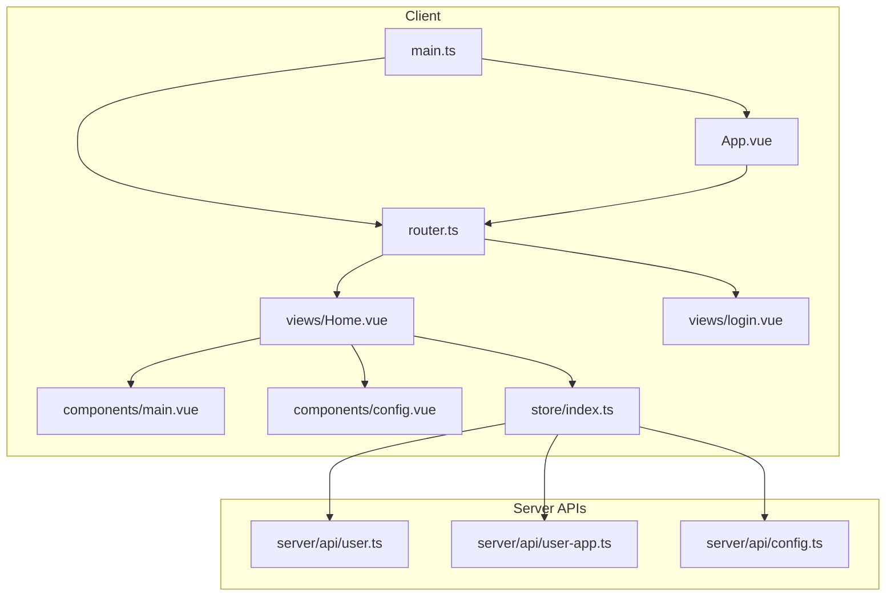
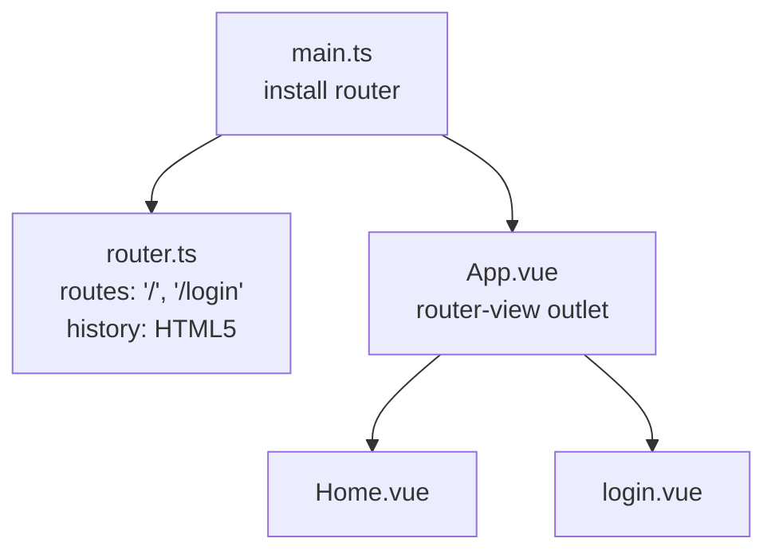
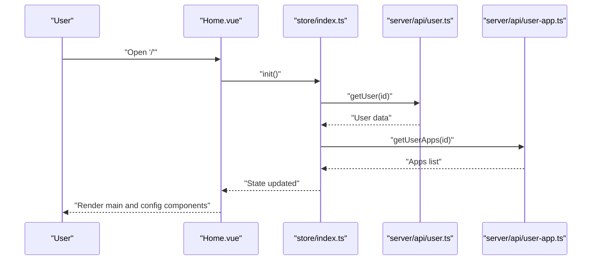
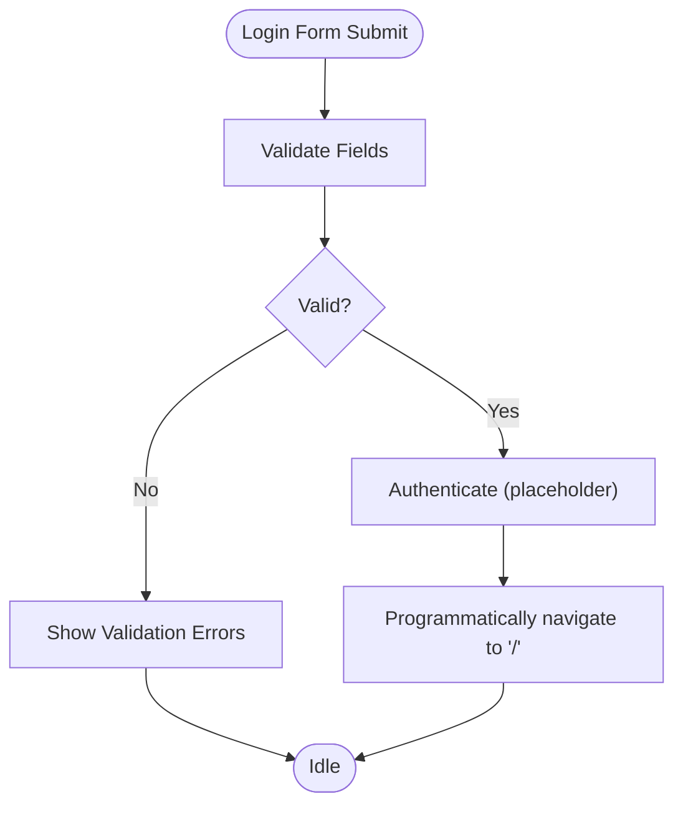
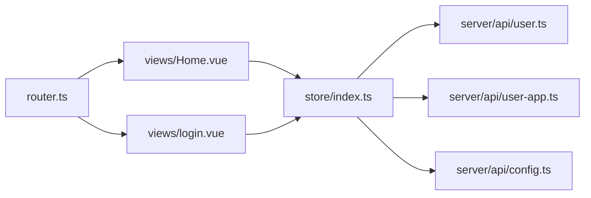

# Routing System

<cite>
**Referenced Files in This Document**
- [router.ts](file://src/client/router.ts)
- [main.ts](file://src/client/main.ts)
- [App.vue](file://src/client/App.vue)
- [Home.vue](file://src/client/views/Home.vue)
- [login.vue](file://src/client/views/login.vue)
- [main.vue](file://src/client/components/main.vue)
- [config.vue](file://src/client/components/config.vue)
- [index.ts](file://src/client/store/index.ts)
- [user.ts](file://src/server/api/user.ts)
- [user-app.ts](file://src/server/api/user-app.ts)
- [config.ts](file://src/server/api/config.ts)
- [package.json](file://package.json)
</cite>

## Table of Contents
1. [Introduction](#introduction)
2. [Project Structure](#project-structure)
3. [Core Components](#core-components)
4. [Architecture Overview](#architecture-overview)
5. [Detailed Component Analysis](#detailed-component-analysis)
6. [Dependency Analysis](#dependency-analysis)
7. [Performance Considerations](#performance-considerations)
8. [Troubleshooting Guide](#troubleshooting-guide)
9. [Conclusion](#conclusion)

## Introduction
This document explains the Vue Router configuration and navigation system used in the client application. It covers the router setup, route definitions, history mode, and how views integrate with the router. It also documents how the Home and Login views interact with the application state via the Pinia store, how navigation works, and how to extend the system with route parameters, query handling, guards, lazy loading, and dynamic routes. The document focuses on the actual code present in the repository and avoids speculating beyond what is implemented.

## Project Structure
The routing system centers around a small set of files under src/client:
- Router configuration and route definitions
- Application bootstrap and installation of the router
- Root layout that renders the active view
- Two primary views (Home and Login)
- Supporting components used within views
- A Pinia store that manages application state and integrates with server APIs

**Diagram sources**
- [main.ts:1-11](file://src/client/main.ts#L1-L11)
- [App.vue:1-16](file://src/client/App.vue#L1-L16)
- [router.ts:1-24](file://src/client/router.ts#L1-L24)
- [Home.vue:1-62](file://src/client/views/Home.vue#L1-L62)
- [login.vue:1-106](file://src/client/views/login.vue#L1-L106)
- [main.vue:1-109](file://src/client/components/main.vue#L1-L109)
- [config.vue:1-102](file://src/client/components/config.vue#L1-L102)
- [index.ts:1-91](file://src/client/store/index.ts#L1-L91)
- [user.ts:1-46](file://src/server/api/user.ts#L1-L46)
- [user-app.ts:1-73](file://src/server/api/user-app.ts#L1-L73)
- [config.ts:1-19](file://src/server/api/config.ts#L1-L19)

**Section sources**
- [main.ts:1-11](file://src/client/main.ts#L1-L11)
- [router.ts:1-24](file://src/client/router.ts#L1-L24)
- [App.vue:1-16](file://src/client/App.vue#L1-L16)

## Core Components
- Router configuration: Defines two routes (Home and Login) and uses HTML5 history mode.
- Application bootstrap: Installs Vue, Pinia, Naive UI, and Vue Router.
- Root layout: Wraps the router-view to render the active route’s component.
- Views:
  - Home: Integrates with the store to initialize session and apps, and renders child components for main content and configuration.
  - Login: Provides a form with validation and actions.
- Store: Centralizes state and exposes actions that call server APIs for session, apps, and theme persistence.

Key implementation references:
- Router creation and routes: [router.ts:1-24](file://src/client/router.ts#L1-L24)
- App bootstrap and router install: [main.ts:1-11](file://src/client/main.ts#L1-L11)
- Root layout rendering: [App.vue:6-9](file://src/client/App.vue#L6-L9)
- Home view composition and store usage: [Home.vue:1-62](file://src/client/views/Home.vue#L1-L62)
- Login view form and validation: [login.vue:1-106](file://src/client/views/login.vue#L1-L106)
- Store initialization and actions: [index.ts:1-91](file://src/client/store/index.ts#L1-L91)

**Section sources**
- [router.ts:1-24](file://src/client/router.ts#L1-L24)
- [main.ts:1-11](file://src/client/main.ts#L1-L11)
- [App.vue:1-16](file://src/client/App.vue#L1-L16)
- [Home.vue:1-62](file://src/client/views/Home.vue#L1-L62)
- [login.vue:1-106](file://src/client/views/login.vue#L1-L106)
- [index.ts:1-91](file://src/client/store/index.ts#L1-L91)

## Architecture Overview
The routing architecture is minimal and flat:
- The router defines two named routes mapped to components.
- The root App component hosts a single router-view outlet.
- Views use the store to manage application state and interact with server APIs.

**Diagram sources**
- [router.ts:1-24](file://src/client/router.ts#L1-L24)
- [main.ts:1-11](file://src/client/main.ts#L1-L11)
- [App.vue:6-9](file://src/client/App.vue#L6-L9)
- [Home.vue:1-62](file://src/client/views/Home.vue#L1-L62)
- [login.vue:1-106](file://src/client/views/login.vue#L1-L106)

## Detailed Component Analysis

### Router Setup and History Mode
- History mode: Uses HTML5 history via createWebHistory, enabling clean URLs without hash fragments.
- Routes: Two static routes:
  - Root path "/" mapped to Home
  - Path "/login" mapped to Login
- No navigation guards or middleware are currently configured.

References:
- Router creation and history: [router.ts:18-21](file://src/client/router.ts#L18-L21)
- Route definitions: [router.ts:5-16](file://src/client/router.ts#L5-L16)

**Section sources**
- [router.ts:1-24](file://src/client/router.ts#L1-L24)

### Application Bootstrap and Installation
- The application creates the Vue app instance, installs Pinia and Naive UI, and mounts the router.
- This ensures the router is globally available to all components.

References:
- App creation and plugin installation: [main.ts:1-11](file://src/client/main.ts#L1-L11)

**Section sources**
- [main.ts:1-11](file://src/client/main.ts#L1-L11)

### Root Layout and Outlet Rendering
- The root App component wraps the router-view, which renders the matched route’s component based on the current location.
- Global providers (e.g., message provider) are attached at the root level.

References:
- Router outlet: [App.vue:8](file://src/client/App.vue#L8)

**Section sources**
- [App.vue:1-16](file://src/client/App.vue#L1-L16)

### Home View Integration and State Management
- Composition script initializes the store on mount and exposes UI controls for initializing apps and adding new apps.
- The view conditionally renders child components (main content and configuration) based on state.
- The store coordinates with server APIs for session and app data.

References:
- Store initialization and add app action: [Home.vue:28-30](file://src/client/views/Home.vue#L28-L30), [Home.vue:14-26](file://src/client/views/Home.vue#L14-L26)
- Conditional rendering of child components: [Home.vue:47-49](file://src/client/views/Home.vue#L47-L49)
- Store actions and API calls: [index.ts:19-88](file://src/client/store/index.ts#L19-L88)
- Server APIs for user and apps: [user.ts:24-45](file://src/server/api/user.ts#L24-L45), [user-app.ts:4-72](file://src/server/api/user-app.ts#L4-L72)

**Diagram sources**
- [Home.vue:28-30](file://src/client/views/Home.vue#L28-L30)
- [index.ts:19-57](file://src/client/store/index.ts#L19-L57)
- [user.ts:17-34](file://src/server/api/user.ts#L17-L34)
- [user-app.ts:4-17](file://src/server/api/user-app.ts#L4-L17)

**Section sources**
- [Home.vue:1-62](file://src/client/views/Home.vue#L1-L62)
- [index.ts:1-91](file://src/client/store/index.ts#L1-L91)
- [user.ts:1-46](file://src/server/api/user.ts#L1-L46)
- [user-app.ts:1-73](file://src/server/api/user-app.ts#L1-L73)

### Login View and Navigation Patterns
- The Login view provides a form with validation and actions.
- While the current implementation logs validation outcomes and does not programmatically navigate, typical patterns include:
  - Using the router instance to push or replace routes after successful authentication.
  - Redirecting authenticated users away from the login route.

References:
- Form validation and actions: [login.vue:26-37](file://src/client/views/login.vue#L26-L37)
- Route definitions for navigation targets: [router.ts:5-16](file://src/client/router.ts#L5-L16)

**Diagram sources**
- [login.vue:26-37](file://src/client/views/login.vue#L26-L37)
- [router.ts:5-16](file://src/client/router.ts#L5-L16)

**Section sources**
- [login.vue:1-106](file://src/client/views/login.vue#L1-L106)
- [router.ts:1-24](file://src/client/router.ts#L1-L24)

### Relationship Between Routes and Components
- The router maps paths to components. The router-view renders the matched component based on the current location.
- Child components within views (e.g., main and config inside Home) are rendered conditionally by the parent view.

References:
- Route-to-component mapping: [router.ts:5-16](file://src/client/router.ts#L5-L16)
- Outlet rendering: [App.vue:8](file://src/client/App.vue#L8)
- Conditional child rendering: [Home.vue:47-49](file://src/client/views/Home.vue#L47-L49)

**Section sources**
- [router.ts:1-24](file://src/client/router.ts#L1-L24)
- [App.vue:1-16](file://src/client/App.vue#L1-L16)
- [Home.vue:1-62](file://src/client/views/Home.vue#L1-L62)

### Route Parameters, Query Handling, and Programmatic Navigation
- Current implementation does not use route parameters or query strings.
- Programmatic navigation is not implemented in the existing code.
- To extend:
  - Add parameterized routes and query parsing in views.
  - Use the router instance to navigate programmatically.
  - Consider guards for protected routes.

References:
- Route definitions (no params/query): [router.ts:5-16](file://src/client/router.ts#L5-L16)
- Router instance availability: [main.ts:6](file://src/client/main.ts#L6)

**Section sources**
- [router.ts:1-24](file://src/client/router.ts#L1-L24)
- [main.ts:1-11](file://src/client/main.ts#L1-L11)

### Route Protection, Lazy Loading, and Dynamic Routes
- No route guards are currently defined.
- No lazy-loaded route components are used.
- Dynamic routes are not implemented.
- To implement:
  - Add navigation guards in router configuration.
  - Use dynamic imports for route components.
  - Generate routes dynamically based on user permissions or runtime conditions.

References:
- Router configuration baseline: [router.ts:1-24](file://src/client/router.ts#L1-L24)

**Section sources**
- [router.ts:1-24](file://src/client/router.ts#L1-L24)

## Dependency Analysis
The routing system has low coupling and clear boundaries:
- Router depends on view components.
- Views depend on the store.
- The store depends on server API modules.
- The server API modules depend on axios and a base URL constant.

**Diagram sources**
- [router.ts:1-24](file://src/client/router.ts#L1-L24)
- [Home.vue:1-62](file://src/client/views/Home.vue#L1-L62)
- [login.vue:1-106](file://src/client/views/login.vue#L1-L106)
- [index.ts:1-91](file://src/client/store/index.ts#L1-L91)
- [user.ts:1-46](file://src/server/api/user.ts#L1-L46)
- [user-app.ts:1-73](file://src/server/api/user-app.ts#L1-L73)
- [config.ts:1-19](file://src/server/api/config.ts#L1-L19)

**Section sources**
- [router.ts:1-24](file://src/client/router.ts#L1-L24)
- [index.ts:1-91](file://src/client/store/index.ts#L1-L91)
- [user.ts:1-46](file://src/server/api/user.ts#L1-L46)
- [user-app.ts:1-73](file://src/server/api/user-app.ts#L1-L73)
- [config.ts:1-19](file://src/server/api/config.ts#L1-L19)

## Performance Considerations
- Current routes are static and simple; performance impact is negligible.
- Consider lazy-loading route components to reduce initial bundle size as the application grows.
- Keep route guards lightweight to avoid blocking navigation.

[No sources needed since this section provides general guidance]

## Troubleshooting Guide
- If routes do not render:
  - Verify router installation in the app bootstrap.
  - Confirm the router-view exists in the root layout.
- If navigation does not work:
  - Ensure the router instance is imported and used correctly.
  - Confirm route names and paths match the router configuration.
- If state appears uninitialized:
  - Check store initialization and API responses.
  - Validate server endpoints and network connectivity.

References:
- Router install: [main.ts:6](file://src/client/main.ts#L6)
- Router outlet: [App.vue:8](file://src/client/App.vue#L8)
- Route definitions: [router.ts:5-16](file://src/client/router.ts#L5-L16)
- Store initialization: [index.ts:20-23](file://src/client/store/index.ts#L20-L23)
- Server API calls: [user.ts:34-45](file://src/server/api/user.ts#L34-L45), [user-app.ts:4-17](file://src/server/api/user-app.ts#L4-L17)

**Section sources**
- [main.ts:1-11](file://src/client/main.ts#L1-L11)
- [App.vue:1-16](file://src/client/App.vue#L1-L16)
- [router.ts:1-24](file://src/client/router.ts#L1-L24)
- [index.ts:1-91](file://src/client/store/index.ts#L1-L91)
- [user.ts:1-46](file://src/server/api/user.ts#L1-L46)
- [user-app.ts:1-73](file://src/server/api/user-app.ts#L1-L73)

## Conclusion
The current routing system is intentionally simple, featuring two static routes and a single outlet. Views integrate with the store to manage state and interact with server APIs. The system is easy to extend: add navigation guards for protection, lazy-load components for performance, introduce route parameters and queries, and implement programmatic navigation. The existing structure supports incremental enhancements without major refactoring.