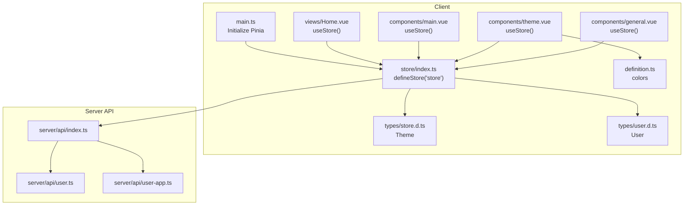
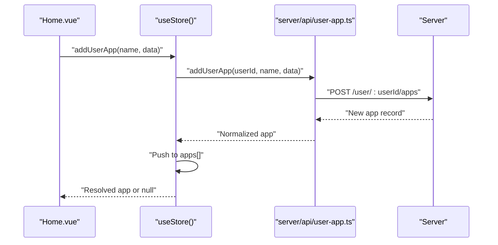
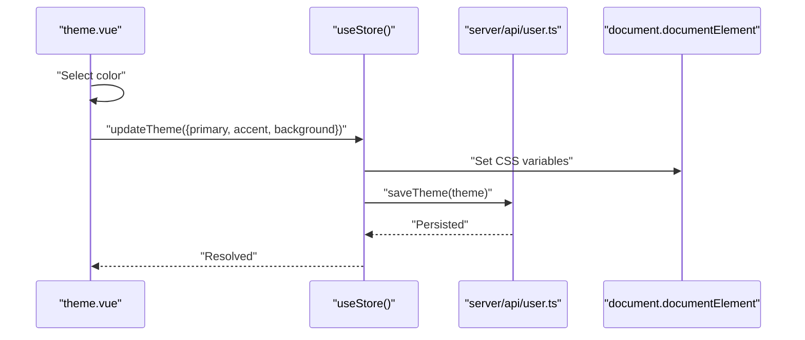
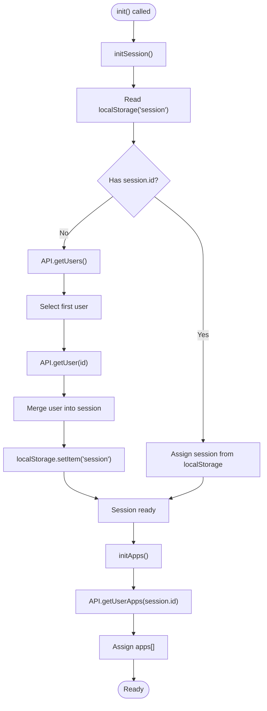
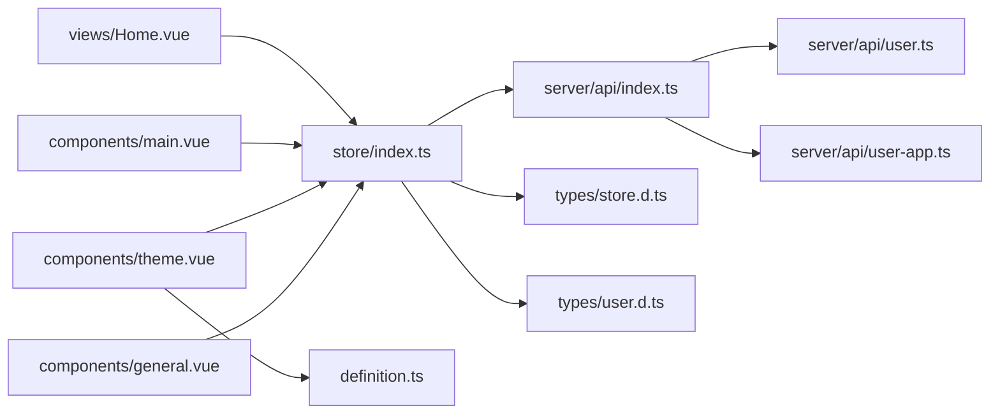

# State Management

<cite>
**Referenced Files in This Document**
- [index.ts](file://src/client/store/index.ts)
- [store.d.ts](file://src/client/types/store.d.ts)
- [user.d.ts](file://src/client/types/user.d.ts)
- [main.ts](file://src/client/main.ts)
- [Home.vue](file://src/client/views/Home.vue)
- [main.vue](file://src/client/components/main.vue)
- [config.vue](file://src/client/components/config.vue)
- [theme.vue](file://src/client/components/theme.vue)
- [general.vue](file://src/client/components/general.vue)
- [definition.ts](file://src/client/definition.ts)
- [index.ts](file://src/server/api/index.ts)
- [user.ts](file://src/server/api/user.ts)
- [user-app.ts](file://src/server/api/user-app.ts)
</cite>

## Table of Contents
1. [Introduction](#introduction)
2. [Project Structure](#project-structure)
3. [Core Components](#core-components)
4. [Architecture Overview](#architecture-overview)
5. [Detailed Component Analysis](#detailed-component-analysis)
6. [Dependency Analysis](#dependency-analysis)
7. [Performance Considerations](#performance-considerations)
8. [Troubleshooting Guide](#troubleshooting-guide)
9. [Conclusion](#conclusion)

## Introduction
This document explains the Pinia state management system used in the client application. It covers store configuration, TypeScript type definitions, state persistence strategies, reactive data patterns, component integration, and the integration with the API layer for data synchronization. Practical examples demonstrate dispatching actions, accessing state in components, and managing asynchronous operations. The document also addresses state normalization, data fetching patterns, error handling, and the relationship between store state and component data binding.

## Project Structure
The state management is centered around a single Pinia store module and associated types. The store is initialized in the application entry point and consumed by Vue components. The API layer abstracts server communication and is imported into the store to synchronize state with backend resources.

**Diagram sources**
- [main.ts:1-11](file://src/client/main.ts#L1-L11)
- [index.ts:1-91](file://src/client/store/index.ts#L1-L91)
- [store.d.ts:1-7](file://src/client/types/store.d.ts#L1-L7)
- [user.d.ts:1-6](file://src/client/types/user.d.ts#L1-L6)
- [Home.vue:1-62](file://src/client/views/Home.vue#L1-L62)
- [main.vue:1-109](file://src/client/components/main.vue#L1-L109)
- [theme.vue:1-70](file://src/client/components/theme.vue#L1-L70)
- [general.vue:1-10](file://src/client/components/general.vue#L1-L10)
- [definition.ts:1-21](file://src/client/definition.ts#L1-L21)
- [index.ts:1-4](file://src/server/api/index.ts#L1-L4)
- [user.ts:1-46](file://src/server/api/user.ts#L1-L46)
- [user-app.ts:1-73](file://src/server/api/user-app.ts#L1-L73)

**Section sources**
- [main.ts:1-11](file://src/client/main.ts#L1-L11)
- [index.ts:1-91](file://src/client/store/index.ts#L1-L91)
- [index.ts:1-4](file://src/server/api/index.ts#L1-L4)

## Core Components
- Store identity and initialization
  - The store is defined under the key "store" and is globally available via the composable useStore.
  - Pinia is installed in the application entry point and mounted to the root Vue app.

- State structure
  - apps: array of normalized app records fetched from the API.
  - session: user profile object containing identifiers and attributes.
  - theme: current theme values applied to the UI.

- Actions
  - init: orchestrates loading session and apps.
  - initSession: loads session from localStorage or falls back to API; persists to localStorage on success.
  - initApps: fetches user apps and updates the store.
  - updateTheme: updates local theme and persists to the backend.
  - addUserApp: creates a new app for the current user and appends to the list.
  - putUserApp: updates an existing app and refreshes the apps list.

- Getters
  - Currently empty; can be extended for computed derived state.

- Types
  - Theme: defines theme shape including name and color tokens.
  - User: minimal user model used by the API layer.

**Section sources**
- [index.ts:5-91](file://src/client/store/index.ts#L5-L91)
- [store.d.ts:1-7](file://src/client/types/store.d.ts#L1-L7)
- [user.d.ts:1-6](file://src/client/types/user.d.ts#L1-L6)
- [main.ts:1-11](file://src/client/main.ts#L1-L11)

## Architecture Overview
The store integrates tightly with the API layer to keep state synchronized with the server. Components trigger actions to load or mutate data, which in turn call API functions. Responses are normalized and stored in the store, while UI components reactively bind to store state.

**Diagram sources**
- [Home.vue:14-26](file://src/client/views/Home.vue#L14-L26)
- [index.ts:63-75](file://src/client/store/index.ts#L63-L75)
- [user-app.ts:19-40](file://src/server/api/user-app.ts#L19-L40)

## Detailed Component Analysis

### Store: State, Actions, and Persistence
- State definitions
  - apps: initialized as an empty array; populated asynchronously from API.
  - session: initialized with default fields; hydrated from localStorage or API.
  - theme: initialized with color tokens; updated locally and persisted to backend.

- Persistence strategy
  - Session persistence: localStorage is checked first; if absent, the store fetches users and the first user’s details, then persists the session to localStorage.
  - Theme persistence: updateTheme writes to backend after updating local theme.

- Reactive data patterns
  - Direct mutation of state arrays and objects is supported by Pinia’s reactivity.
  - Asynchronous actions encapsulate side effects and update state upon completion.

- Async operation management
  - All network-bound actions are awaited; errors are caught and logged.
  - After successful creation or update, the store refreshes dependent lists (e.g., initApps).

- Relationship to component data binding
  - Components access store state directly (e.g., store.apps, store.session).
  - Components trigger actions to mutate state (e.g., store.addUserApp, store.updateTheme).

**Section sources**
- [index.ts:6-17](file://src/client/store/index.ts#L6-L17)
- [index.ts:24-47](file://src/client/store/index.ts#L24-L47)
- [index.ts:49-57](file://src/client/store/index.ts#L49-L57)
- [index.ts:58-62](file://src/client/store/index.ts#L58-L62)
- [index.ts:63-88](file://src/client/store/index.ts#L63-L88)

### API Integration and Data Normalization
- Data fetching patterns
  - initSession: fetches users list, selects the first user, fetches user details, merges into session, and persists to localStorage.
  - initApps: fetches user apps and assigns to store.apps.
  - addUserApp: posts new app and appends normalized result to store.apps.
  - putUserApp: updates an app and refreshes the apps list.

- Data normalization
  - API responses are normalized into consistent shapes before assignment:
    - Apps: id, appName, appData.
    - Users: id, name, email, plus optional flags.
  - Theme: Omitting name from Theme allows passing only color values to updateTheme.

- Error handling
  - Try/catch blocks surround network calls; errors are logged to the console.

**Section sources**
- [index.ts:24-47](file://src/client/store/index.ts#L24-L47)
- [index.ts:49-57](file://src/client/store/index.ts#L49-L57)
- [index.ts:63-88](file://src/client/store/index.ts#L63-L88)
- [user-app.ts:5-17](file://src/server/api/user-app.ts#L5-L17)
- [user-app.ts:19-40](file://src/server/api/user-app.ts#L19-L40)
- [user-app.ts:41-60](file://src/server/api/user-app.ts#L41-L60)
- [user.ts:5-34](file://src/server/api/user.ts#L5-L34)

### Component Integration Examples
- Accessing state in components
  - general.vue reads store.session.id directly in the template.
  - main.vue iterates store.apps to render app entries.
  - theme.vue reads store.theme and triggers store.updateTheme.

- Dispatching actions from components
  - Home.vue calls store.init during onMounted and store.addUserApp on demand.
  - main.vue calls store.putUserApp when editing an app.
  - theme.vue calls store.updateTheme after computing color values.

- Managing async operations
  - Components await action results and handle falsy outcomes by logging errors.
  - Components reset form fields after successful creation.

**Section sources**
- [general.vue:1-10](file://src/client/components/general.vue#L1-L10)
- [main.vue:1-109](file://src/client/components/main.vue#L1-L109)
- [theme.vue:1-70](file://src/client/components/theme.vue#L1-L70)
- [Home.vue:14-30](file://src/client/views/Home.vue#L14-L30)

### Theme Management Flow

**Diagram sources**
- [theme.vue:11-21](file://src/client/components/theme.vue#L11-L21)
- [index.ts:58-62](file://src/client/store/index.ts#L58-L62)
- [user.ts:37-45](file://src/server/api/user.ts#L37-L45)

### Initialization and Session Hydration Flow

**Diagram sources**
- [index.ts:20-23](file://src/client/store/index.ts#L20-L23)
- [index.ts:24-47](file://src/client/store/index.ts#L24-L47)
- [index.ts:49-57](file://src/client/store/index.ts#L49-L57)
- [user.ts:5-34](file://src/server/api/user.ts#L5-L34)
- [user-app.ts:5-17](file://src/server/api/user-app.ts#L5-L17)

## Dependency Analysis
- Store depends on:
  - API module for data synchronization.
  - Theme type for type-safe theme updates.
- Components depend on:
  - useStore composable for state and actions.
  - Local storage for session persistence.
- API module depends on:
  - axios and server endpoints for CRUD operations.

**Diagram sources**
- [index.ts:1-91](file://src/client/store/index.ts#L1-L91)
- [index.ts:1-4](file://src/server/api/index.ts#L1-L4)
- [user.ts:1-46](file://src/server/api/user.ts#L1-L46)
- [user-app.ts:1-73](file://src/server/api/user-app.ts#L1-L73)
- [Home.vue:1-62](file://src/client/views/Home.vue#L1-L62)
- [main.vue:1-109](file://src/client/components/main.vue#L1-L109)
- [theme.vue:1-70](file://src/client/components/theme.vue#L1-L70)
- [general.vue:1-10](file://src/client/components/general.vue#L1-L10)
- [definition.ts:1-21](file://src/client/definition.ts#L1-L21)
- [store.d.ts:1-7](file://src/client/types/store.d.ts#L1-L7)
- [user.d.ts:1-6](file://src/client/types/user.d.ts#L1-L6)

**Section sources**
- [index.ts:1-91](file://src/client/store/index.ts#L1-L91)
- [index.ts:1-4](file://src/server/api/index.ts#L1-L4)

## Performance Considerations
- Prefer incremental updates for large lists when possible to minimize reactivity overhead.
- Debounce or batch frequent UI-triggered actions to reduce redundant API calls.
- Cache normalized entities keyed by id to avoid duplicates and simplify updates.
- Limit deep nested state to shallow structures where feasible to improve reactivity performance.
- Use getters for derived computations to avoid recomputing on each render.

## Troubleshooting Guide
- Session not persisting
  - Verify localStorage availability and absence of storage quota issues.
  - Confirm initSession logs and error handling paths.

- Apps list not updating after creation
  - Ensure addUserApp resolves and pushes to apps.
  - Confirm initApps is called after creation or on navigation.

- Theme changes not reflected
  - Check CSS variable assignments and updateTheme API call.
  - Verify saveTheme endpoint responds successfully.

- Network errors
  - Inspect console logs for thrown errors in actions.
  - Validate API endpoints and server availability.

**Section sources**
- [index.ts:24-47](file://src/client/store/index.ts#L24-L47)
- [index.ts:49-57](file://src/client/store/index.ts#L49-L57)
- [index.ts:58-62](file://src/client/store/index.ts#L58-L62)
- [index.ts:63-88](file://src/client/store/index.ts#L63-L88)

## Conclusion
The Pinia store centralizes state for session, apps, and theme, integrating seamlessly with the API layer to maintain synchronization. Components consume the store reactively, triggering actions to manage async operations and persist changes. The current implementation demonstrates robust patterns for initialization, persistence, and normalization, with clear extension points for advanced features like caching, optimistic updates, and centralized error handling.