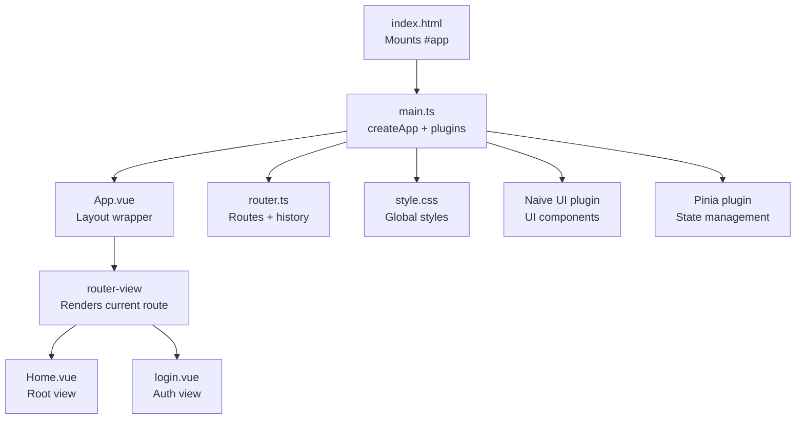
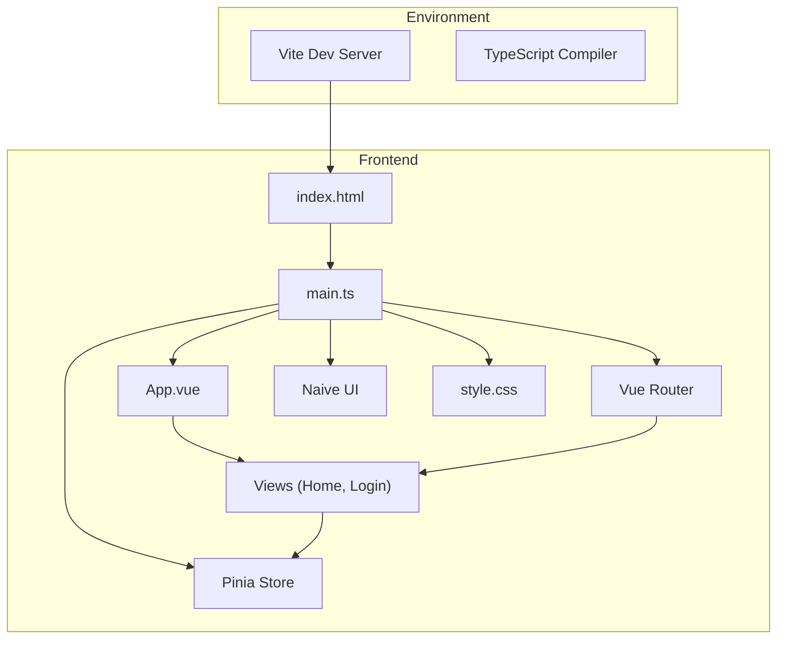
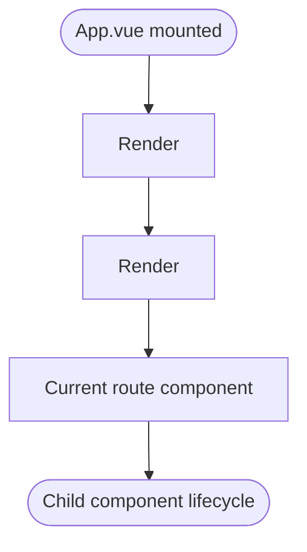
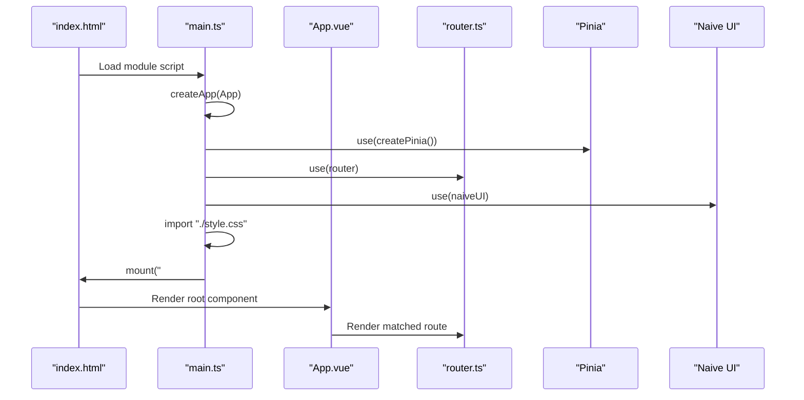
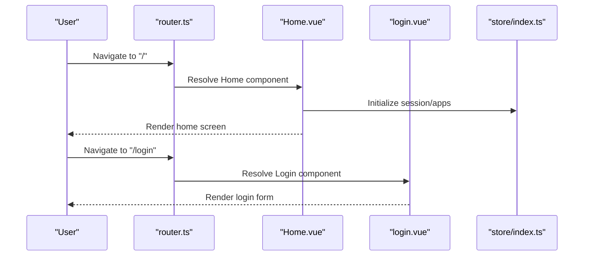
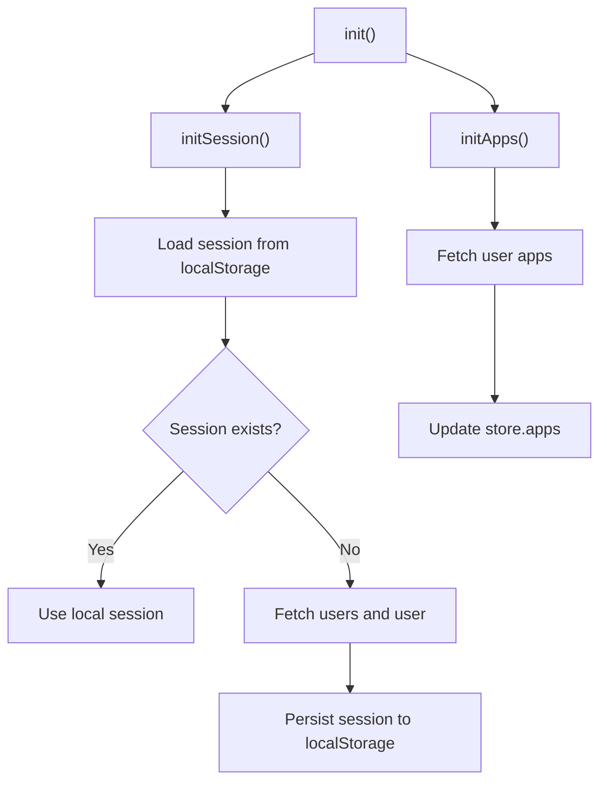
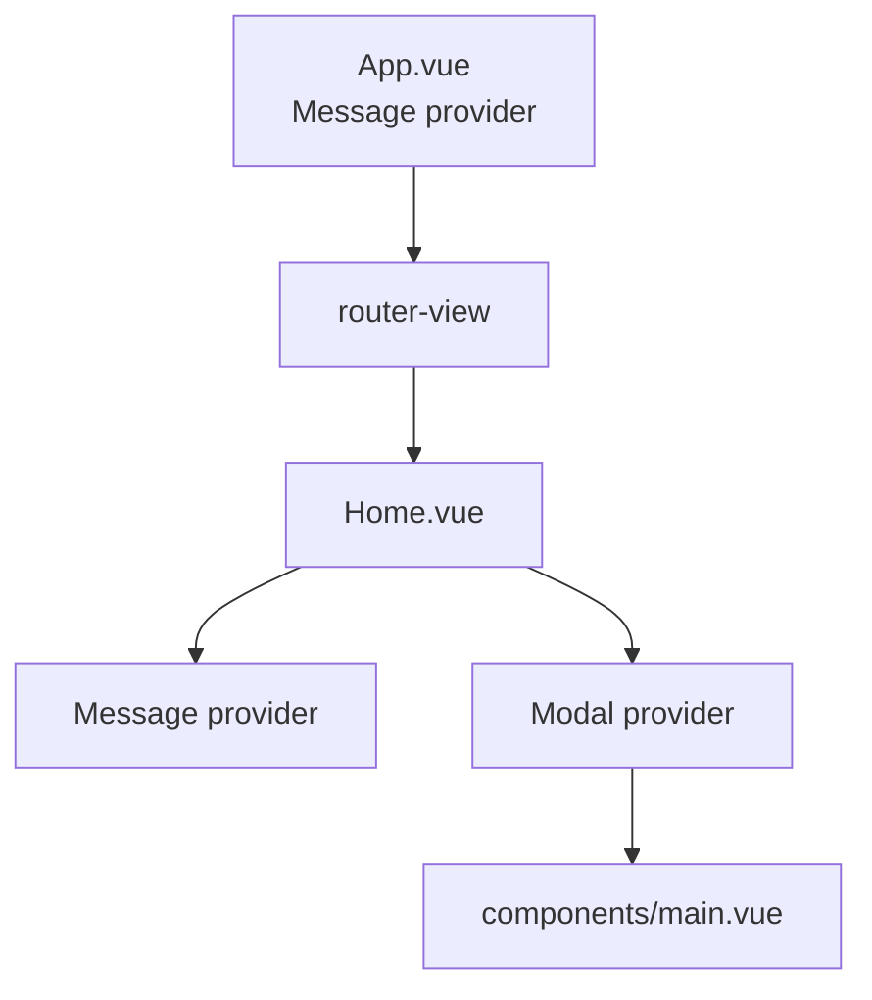
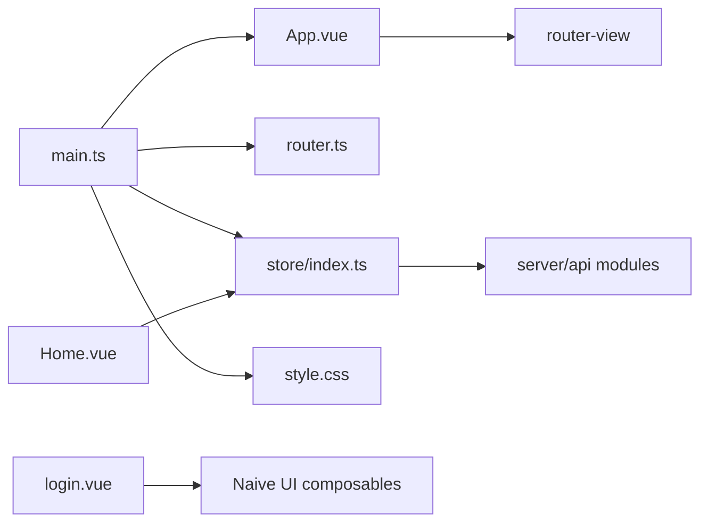

# Vue Application Structure

<cite>
**Referenced Files in This Document**
- [App.vue](file://src/client/App.vue)
- [main.ts](file://src/client/main.ts)
- [router.ts](file://src/client/router.ts)
- [Home.vue](file://src/client/views/Home.vue)
- [login.vue](file://src/client/views/login.vue)
- [style.css](file://src/client/style.css)
- [index.html](file://src/client/index.html)
- [vite.config.ts](file://vite.config.ts)
- [package.json](file://package.json)
- [store/index.ts](file://src/client/store/index.ts)
- [components/main.vue](file://src/client/components/main.vue)
- [tsconfig.json](file://tsconfig.json)
- [vite-env.d.ts](file://src/client/vite-env.d.ts)
- [server/api.ts](file://src/server/api.ts)
- [server/api/index.ts](file://src/server/api/index.ts)
</cite>

## Table of Contents
1. [Introduction](#introduction)
2. [Project Structure](#project-structure)
3. [Core Components](#core-components)
4. [Architecture Overview](#architecture-overview)
5. [Detailed Component Analysis](#detailed-component-analysis)
6. [Dependency Analysis](#dependency-analysis)
7. [Performance Considerations](#performance-considerations)
8. [Troubleshooting Guide](#troubleshooting-guide)
9. [Conclusion](#conclusion)
10. [Appendices](#appendices)

## Introduction
This document explains the Vue 3 application structure and entry point for the client-side frontend. It focuses on how the root component acts as a layout wrapper, how the application boots via the main entry point, how plugins and routing are integrated, and how global styles and the Vite environment are configured. Practical examples illustrate component mounting, plugin initialization, and application bootstrapping, along with the layout wrapper pattern and the relationship between the root component and child components.

## Project Structure
The client-side application resides under src/client and is structured around a small set of core files:
- Root component and entry point: App.vue, main.ts
- Routing: router.ts with two views: Home.vue and login.vue
- Global styles: style.css
- HTML shell: index.html
- Build tooling: vite.config.ts, package.json, tsconfig.json, vite-env.d.ts
- State management: Pinia store under store/index.ts
- UI framework: Naive UI integrated at the root level

**Diagram sources**
- [index.html:10](file://src/client/index.html#L10)
- [main.ts:1-11](file://src/client/main.ts#L1-L11)
- [App.vue:6-10](file://src/client/App.vue#L6-L10)
- [router.ts:1-24](file://src/client/router.ts#L1-L24)
- [Home.vue:1-62](file://src/client/views/Home.vue#L1-L62)
- [login.vue:1-106](file://src/client/views/login.vue#L1-L106)
- [style.css:1-83](file://src/client/style.css#L1-L83)

**Section sources**
- [index.html:1-14](file://src/client/index.html#L1-L14)
- [main.ts:1-11](file://src/client/main.ts#L1-L11)
- [router.ts:1-24](file://src/client/router.ts#L1-L24)
- [App.vue:1-16](file://src/client/App.vue#L1-L16)
- [style.css:1-83](file://src/client/style.css#L1-L83)

## Core Components
- Root component (App.vue): Minimal layout wrapper that renders router-view inside a message provider, ensuring UI notifications are available across routed views.
- Entry point (main.ts): Creates the Vue app, registers Pinia, Vue Router, and Naive UI, imports global styles, and mounts to #app.
- Router (router.ts): Defines routes for Home and Login views using web history mode.
- Views (Home.vue, login.vue): Feature-specific screens that consume the store and UI components.
- Store (store/index.ts): Pinia store managing session, apps, theme, and actions to initialize data and persist updates.
- Global styles (style.css): Provides base typography, colors, and responsive layout for the application.
- HTML shell (index.html): Provides the #app mount point and loads the module script for main.ts.
- Build configuration: Vite plugin for Vue, path alias, TypeScript references, and dev/build scripts.

Practical examples:
- Component mounting: The HTML shell defines the mount target and loads the module entry script.
- Plugin initialization: The entry point registers Pinia, Router, and Naive UI before mounting.
- Application bootstrapping: The root component wraps the router outlet with a message provider to unify UI feedback.

**Section sources**
- [App.vue:1-16](file://src/client/App.vue#L1-L16)
- [main.ts:1-11](file://src/client/main.ts#L1-L11)
- [router.ts:1-24](file://src/client/router.ts#L1-L24)
- [Home.vue:1-62](file://src/client/views/Home.vue#L1-L62)
- [login.vue:1-106](file://src/client/views/login.vue#L1-L106)
- [store/index.ts:1-91](file://src/client/store/index.ts#L1-L91)
- [style.css:1-83](file://src/client/style.css#L1-L83)
- [index.html:1-14](file://src/client/index.html#L1-L14)

## Architecture Overview
The application follows a minimal, layered architecture:
- Presentation layer: Vue components (root, views, shared components)
- State layer: Pinia store for centralized state and actions
- Routing layer: Vue Router for navigation
- UI layer: Naive UI for component primitives
- Environment: Vite for build tooling and development server

**Diagram sources**
- [index.html:10](file://src/client/index.html#L10)
- [main.ts:1-11](file://src/client/main.ts#L1-L11)
- [App.vue:6-10](file://src/client/App.vue#L6-L10)
- [router.ts:1-24](file://src/client/router.ts#L1-L24)
- [store/index.ts:1-91](file://src/client/store/index.ts#L1-L91)
- [style.css:1-83](file://src/client/style.css#L1-L83)

## Detailed Component Analysis

### Root Component Layout Wrapper (App.vue)
The root component serves as a layout wrapper:
- Wraps the router outlet with a message provider to enable global UI notifications.
- Keeps the template minimal to avoid layout concerns leaking into route components.
- Allows global styles to apply consistently across views.

**Diagram sources**
- [App.vue:6-10](file://src/client/App.vue#L6-L10)

**Section sources**
- [App.vue:1-16](file://src/client/App.vue#L1-L16)

### Entry Point Bootstrapping (main.ts)
The entry point performs:
- Creating the Vue app instance with the root component.
- Registering Pinia for state management.
- Registering Vue Router for navigation.
- Installing Naive UI for UI primitives.
- Importing global styles.
- Mounting to the #app element.

**Diagram sources**
- [index.html:10](file://src/client/index.html#L10)
- [main.ts:1-11](file://src/client/main.ts#L1-L11)
- [App.vue:6-10](file://src/client/App.vue#L6-L10)
- [router.ts:1-24](file://src/client/router.ts#L1-L24)

**Section sources**
- [main.ts:1-11](file://src/client/main.ts#L1-L11)
- [index.html:1-14](file://src/client/index.html#L1-L14)

### Routing and Views (router.ts, Home.vue, login.vue)
Routing:
- Two routes are defined: Home and Login.
- History mode uses browser history for clean URLs.

Views:
- Home view integrates the store, displays app entries, and toggles configuration dialogs.
- Login view demonstrates form validation and message usage from Naive UI.

**Diagram sources**
- [router.ts:5-21](file://src/client/router.ts#L5-L21)
- [Home.vue:12-30](file://src/client/views/Home.vue#L12-L30)
- [login.vue:26-37](file://src/client/views/login.vue#L26-L37)
- [store/index.ts:20-57](file://src/client/store/index.ts#L20-L57)

**Section sources**
- [router.ts:1-24](file://src/client/router.ts#L1-L24)
- [Home.vue:1-62](file://src/client/views/Home.vue#L1-L62)
- [login.vue:1-106](file://src/client/views/login.vue#L1-L106)
- [store/index.ts:1-91](file://src/client/store/index.ts#L1-L91)

### State Management (store/index.ts)
Key aspects:
- Centralized state for apps, session, and theme.
- Actions to initialize session and apps, update theme, and manage user applications.
- Integration with server API modules for persistence.

**Diagram sources**
- [store/index.ts:20-57](file://src/client/store/index.ts#L20-L57)

**Section sources**
- [store/index.ts:1-91](file://src/client/store/index.ts#L1-L91)

### UI Integration and Layout Wrapper Pattern
- Root component wraps router-view with a message provider, enabling consistent notification behavior across views.
- Views can further wrap content with additional providers (e.g., modal provider) when needed.
- Shared components (e.g., main.vue) consume the store and render lists with interactive modals.

**Diagram sources**
- [App.vue:7-9](file://src/client/App.vue#L7-L9)
- [Home.vue:38-50](file://src/client/views/Home.vue#L38-L50)
- [components/main.vue:51-63](file://src/client/components/main.vue#L51-L63)

**Section sources**
- [App.vue:1-16](file://src/client/App.vue#L1-L16)
- [Home.vue:1-62](file://src/client/views/Home.vue#L1-L62)
- [components/main.vue:1-109](file://src/client/components/main.vue#L1-L109)

## Dependency Analysis
External dependencies and roles:
- Vue 3: Core framework
- Vue Router: Navigation
- Pinia: State management
- Naive UI: UI primitives and composables
- Axios, Express, pg, cors: Server-side dependencies (not part of the client bootstrap but used by the backend)

Internal relationships:
- main.ts depends on App.vue, router.ts, store, and style.css.
- Views depend on the store and UI components.
- The store imports server API modules for data operations.

**Diagram sources**
- [main.ts:1-11](file://src/client/main.ts#L1-L11)
- [App.vue:6-10](file://src/client/App.vue#L6-L10)
- [router.ts:1-24](file://src/client/router.ts#L1-L24)
- [store/index.ts:1](file://src/client/store/index.ts#L1)
- [Home.vue:4-6](file://src/client/views/Home.vue#L4-L6)
- [login.vue:3](file://src/client/views/login.vue#L3)
- [server/api.ts:1](file://src/server/api.ts#L1)
- [server/api/index.ts:1-4](file://src/server/api/index.ts#L1-L4)

**Section sources**
- [package.json:12-30](file://package.json#L12-L30)
- [main.ts:1-11](file://src/client/main.ts#L1-L11)
- [store/index.ts:1](file://src/client/store/index.ts#L1)

## Performance Considerations
- Keep the root component minimal to reduce re-renders when switching routes.
- Lazy-load heavy views or components if the application grows.
- Prefer scoped styles for components to limit cascade and improve maintainability.
- Use the store to centralize data fetching and caching to avoid redundant requests.
- Leverage Vite’s fast refresh during development and optimized builds for production.

## Troubleshooting Guide
Common issues and checks:
- App does not render: Verify the HTML mount target exists and the module script path is correct.
  - See [index.html:10](file://src/client/index.html#L10)
- Plugins not working: Ensure Pinia, Router, and Naive UI are registered before mounting.
  - See [main.ts:8-9](file://src/client/main.ts#L8-L9)
- Routes not changing: Confirm router configuration and that router-view is present in the root component.
  - See [App.vue:8](file://src/client/App.vue#L8) and [router.ts:5-21](file://src/client/router.ts#L5-L21)
- Styles not applied: Check global styles import and specificity.
  - See [main.ts:4](file://src/client/main.ts#L4) and [style.css:1-83](file://src/client/style.css#L1-L83)
- Build errors: Ensure TypeScript references and Vite configuration are correct.
  - See [tsconfig.json:1-8](file://tsconfig.json#L1-L8) and [vite.config.ts:1-13](file://vite.config.ts#L1-L13)

**Section sources**
- [index.html:1-14](file://src/client/index.html#L1-L14)
- [main.ts:1-11](file://src/client/main.ts#L1-L11)
- [App.vue:6-10](file://src/client/App.vue#L6-L10)
- [router.ts:1-24](file://src/client/router.ts#L1-L24)
- [style.css:1-83](file://src/client/style.css#L1-L83)
- [tsconfig.json:1-8](file://tsconfig.json#L1-L8)
- [vite.config.ts:1-13](file://vite.config.ts#L1-L13)

## Conclusion
The application employs a clean, minimal structure with a root layout wrapper, a straightforward entry point, and a clear separation of concerns. The root component delegates routing to App.vue while providing a consistent UI provider for messages. The entry point initializes the Vue app, registers essential plugins, and mounts to the DOM. Global styles and Vite configuration support a smooth developer experience. The store encapsulates state and actions, and the router connects views to user flows. This foundation supports scalable enhancements while maintaining simplicity.

## Appendices

### Vite Environment and TypeScript Setup
- Vite configuration enables the Vue plugin and sets a path alias for imports.
  - See [vite.config.ts:1-13](file://vite.config.ts#L1-L13)
- TypeScript references split configurations for app and node environments.
  - See [tsconfig.json:1-8](file://tsconfig.json#L1-L8)
- Module declaration for Vite client types.
  - See [vite-env.d.ts:1-2](file://src/client/vite-env.d.ts#L1-L2)

**Section sources**
- [vite.config.ts:1-13](file://vite.config.ts#L1-L13)
- [tsconfig.json:1-8](file://tsconfig.json#L1-L8)
- [vite-env.d.ts:1-2](file://src/client/vite-env.d.ts#L1-L2)

### Practical Examples Index
- Component mounting: [index.html:10](file://src/client/index.html#L10)
- Plugin initialization: [main.ts:8-9](file://src/client/main.ts#L8-L9)
- Application bootstrapping: [main.ts:9](file://src/client/main.ts#L9)
- Route resolution: [router.ts:5-21](file://src/client/router.ts#L5-L21)
- Store initialization: [Home.vue:28-30](file://src/client/views/Home.vue#L28-L30), [store/index.ts:20-23](file://src/client/store/index.ts#L20-L23)