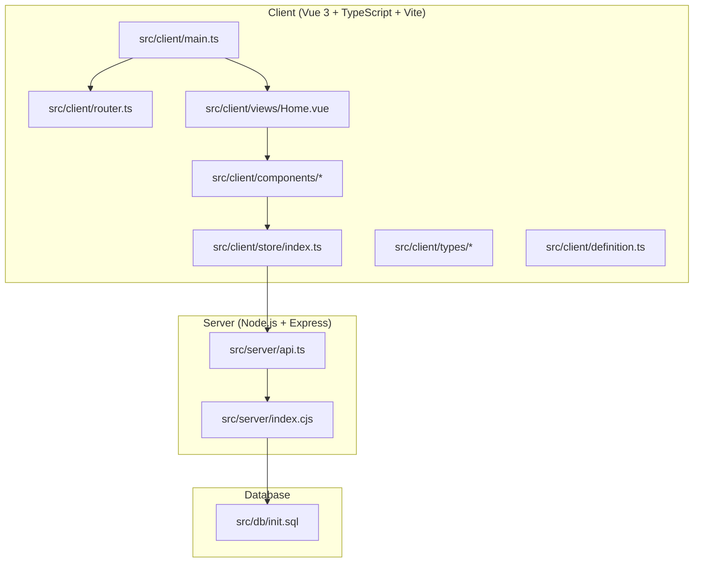
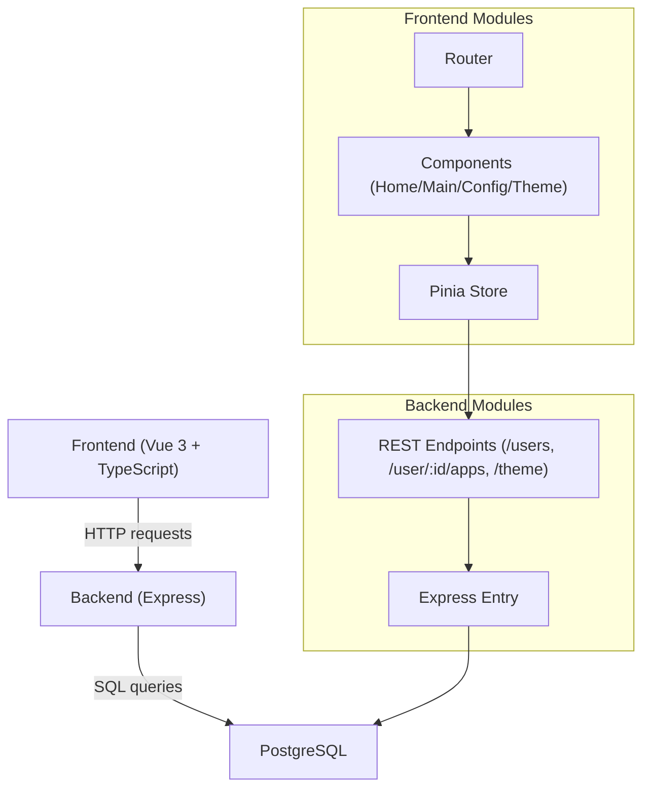
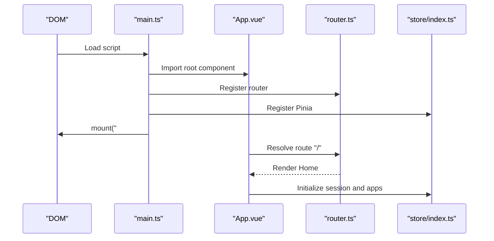
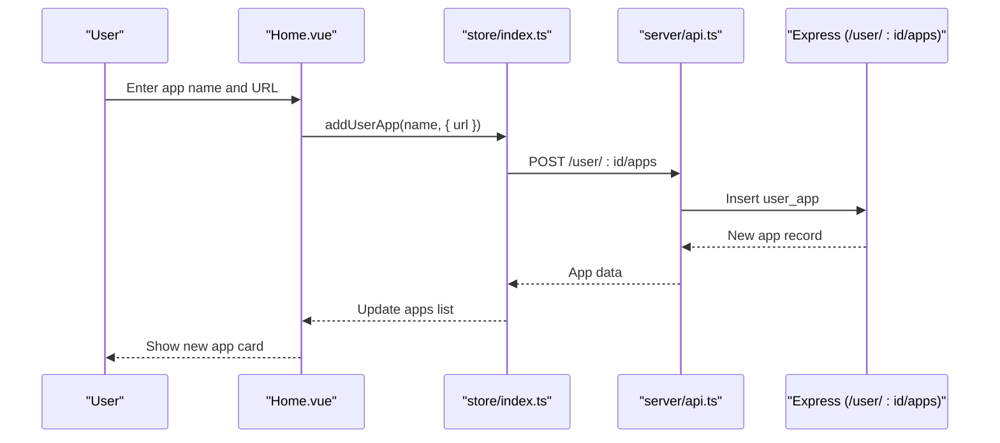
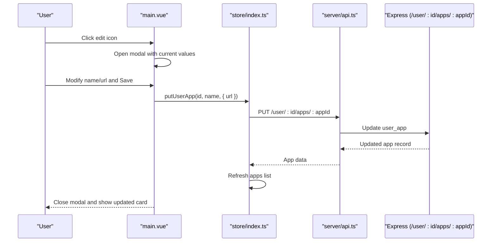
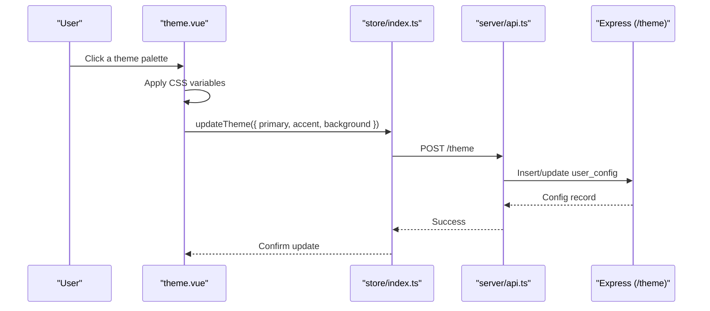
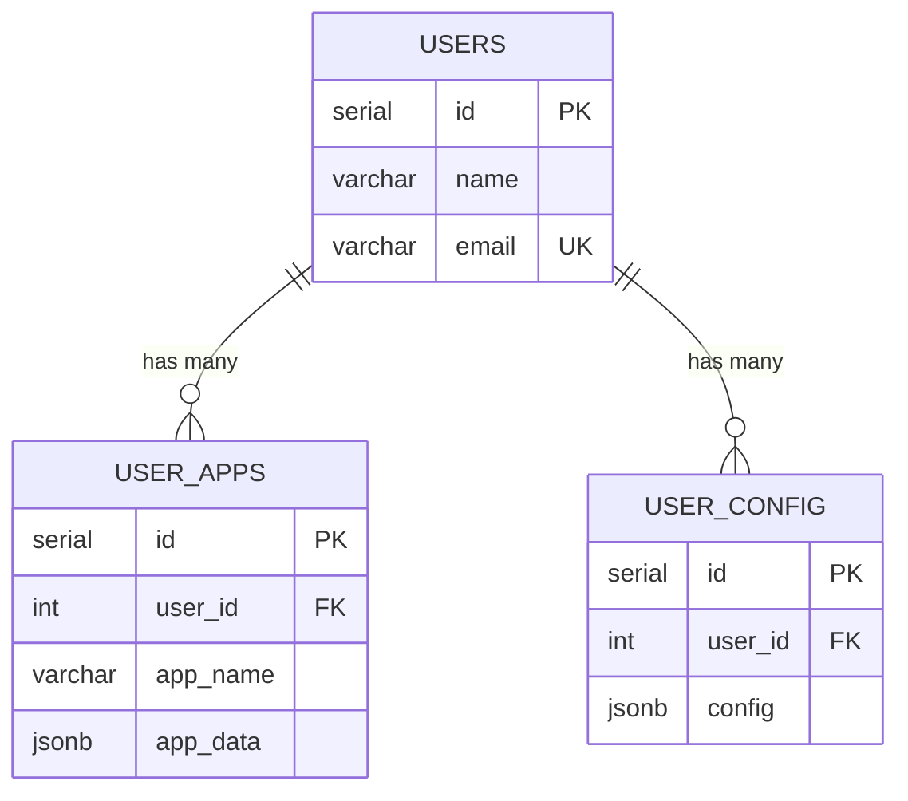
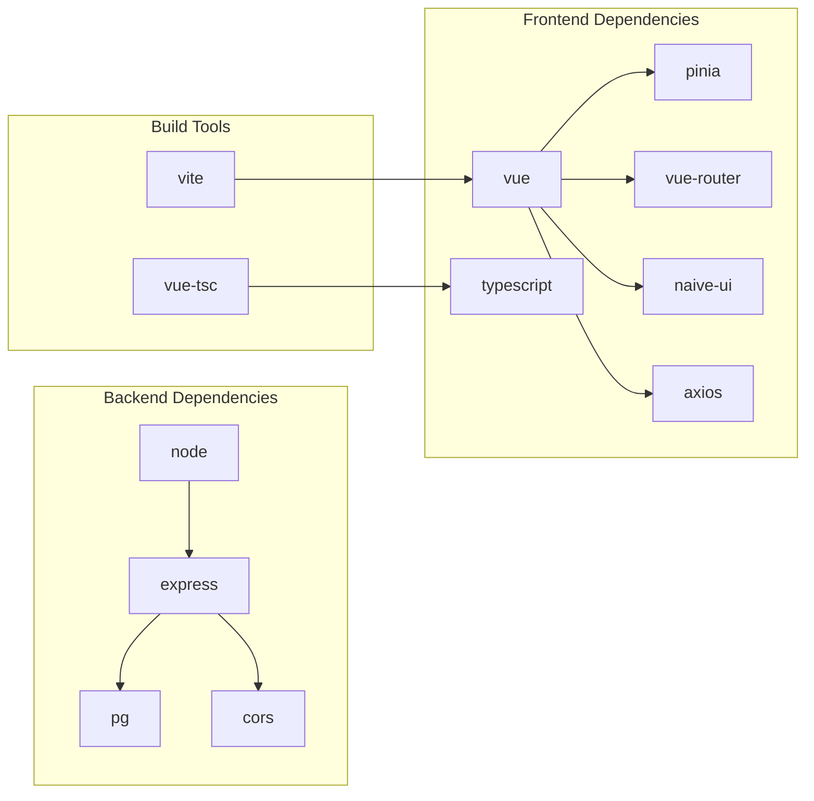

# Project Overview

<cite>
**Referenced Files in This Document**
- [README.md](file://README.md)
- [package.json](file://package.json)
- [vite.config.ts](file://vite.config.ts)
- [src/client/main.ts](file://src/client/main.ts)
- [src/client/router.ts](file://src/client/router.ts)
- [src/client/views/Home.vue](file://src/client/views/Home.vue)
- [src/client/components/main.vue](file://src/client/components/main.vue)
- [src/client/components/config.vue](file://src/client/components/config.vue)
- [src/client/components/theme.vue](file://src/client/components/theme.vue)
- [src/client/store/index.ts](file://src/client/store/index.ts)
- [src/client/types/store.d.ts](file://src/client/types/store.d.ts)
- [src/client/definition.ts](file://src/client/definition.ts)
- [src/server/index.cjs](file://src/server/index.cjs)
- [src/server/api.ts](file://src/server/api.ts)
- [src/db/init.sql](file://src/db/init.sql)
</cite>

## Table of Contents
1. [Introduction](#introduction)
2. [Project Structure](#project-structure)
3. [Core Components](#core-components)
4. [Architecture Overview](#architecture-overview)
5. [Detailed Component Analysis](#detailed-component-analysis)
6. [Dependency Analysis](#dependency-analysis)
7. [Performance Considerations](#performance-considerations)
8. [Troubleshooting Guide](#troubleshooting-guide)
9. [Conclusion](#conclusion)

## Introduction
Startora is a modern personal application launcher and dashboard designed to help users organize and launch their frequently used applications through a clean, configurable interface. It provides a simple UI for adding, editing, and removing shortcut apps, while persisting user data and configuration in a PostgreSQL database. The application targets individuals who want a personalized start page or a small team’s shared link collection, offering a lightweight yet extensible solution.

Key value propositions:
- Personalized dashboard: Launch shortcuts with a single click.
- Persistent configuration: Store user profiles and app lists reliably.
- Modern UI: Built with a contemporary component library for a smooth experience.
- Full-stack workflow: Frontend and backend run together during development for rapid iteration.
- Type safety: Shared TypeScript types and strict typing across the stack.

## Project Structure
The repository follows a clear separation between a Vue 3 + TypeScript + Vite frontend and a Node.js + Express + PostgreSQL backend, with a dedicated database initialization script.

**Diagram sources**
- [src/client/main.ts:1-11](file://src/client/main.ts#L1-L11)
- [src/client/router.ts:1-24](file://src/client/router.ts#L1-L24)
- [src/client/views/Home.vue:1-62](file://src/client/views/Home.vue#L1-L62)
- [src/client/components/main.vue:1-109](file://src/client/components/main.vue#L1-L109)
- [src/client/store/index.ts:1-91](file://src/client/store/index.ts#L1-L91)
- [src/server/index.cjs:1-173](file://src/server/index.cjs#L1-L173)
- [src/server/api.ts:1-2](file://src/server/api.ts#L1-L2)
- [src/db/init.sql:1-26](file://src/db/init.sql#L1-L26)

**Section sources**
- [README.md:33-56](file://README.md#L33-L56)
- [package.json:1-31](file://package.json#L1-L31)
- [vite.config.ts:1-13](file://vite.config.ts#L1-L13)

## Core Components
Startora’s core functionality centers around three pillars:
- App management: Add, edit, and remove shortcut apps with name and URL.
- Data persistence: Store user profiles, app lists, and theme preferences in PostgreSQL.
- Modern UI: Clean, responsive interface powered by a UI library and configurable themes.

Target audience:
- Individuals seeking a personal dashboard to streamline daily tasks.
- Small teams needing a simple, shared link hub.
- Developers who want a minimal, type-safe foundation to extend with additional features.

Practical examples:
- Add a shortcut for a cloud service by entering a name and URL; open it directly from the dashboard.
- Switch themes to personalize the look-and-feel; the selection persists per user.
- Configure general settings and manage apps through the in-app configuration panel.

**Section sources**
- [README.md:7-14](file://README.md#L7-L14)
- [README.md:113-119](file://README.md#L113-L119)
- [src/client/views/Home.vue:14-26](file://src/client/views/Home.vue#L14-L26)
- [src/client/components/main.vue:36-50](file://src/client/components/main.vue#L36-L50)
- [src/client/components/theme.vue:11-21](file://src/client/components/theme.vue#L11-L21)

## Architecture Overview
Startora uses a straightforward full-stack architecture:
- Frontend: Vue 3 with TypeScript, Pinia for state management, Naive UI for components, and Axios for HTTP requests.
- Backend: Express server exposing REST endpoints for users, user apps, and theme configuration.
- Database: PostgreSQL storing users, user configurations, and user-defined app entries.

**Diagram sources**
- [src/client/main.ts:1-11](file://src/client/main.ts#L1-L11)
- [src/client/router.ts:1-24](file://src/client/router.ts#L1-L24)
- [src/client/store/index.ts:1-91](file://src/client/store/index.ts#L1-L91)
- [src/client/views/Home.vue:1-62](file://src/client/views/Home.vue#L1-L62)
- [src/client/components/main.vue:1-109](file://src/client/components/main.vue#L1-L109)
- [src/client/components/config.vue:1-102](file://src/client/components/config.vue#L1-L102)
- [src/client/components/theme.vue:1-70](file://src/client/components/theme.vue#L1-L70)
- [src/server/index.cjs:1-173](file://src/server/index.cjs#L1-L173)

## Detailed Component Analysis

### Frontend Application Bootstrap
The frontend initializes the Vue app with Pinia, routing, and the UI library, then mounts to the DOM. This sets up the runtime environment for all subsequent components and stores.

**Diagram sources**
- [src/client/main.ts:1-11](file://src/client/main.ts#L1-L11)
- [src/client/router.ts:1-24](file://src/client/router.ts#L1-L24)
- [src/client/store/index.ts:20-48](file://src/client/store/index.ts#L20-L48)

**Section sources**
- [src/client/main.ts:1-11](file://src/client/main.ts#L1-L11)
- [src/client/router.ts:1-24](file://src/client/router.ts#L1-L24)

### Home View and App Management Flow
The Home view orchestrates adding and initializing apps. It captures user input, delegates to the store, and updates the UI accordingly.

**Diagram sources**
- [src/client/views/Home.vue:14-26](file://src/client/views/Home.vue#L14-L26)
- [src/client/store/index.ts:63-75](file://src/client/store/index.ts#L63-L75)
- [src/server/index.cjs:86-103](file://src/server/index.cjs#L86-L103)

**Section sources**
- [src/client/views/Home.vue:14-26](file://src/client/views/Home.vue#L14-L26)
- [src/client/store/index.ts:63-75](file://src/client/store/index.ts#L63-L75)

### App List and Edit Modal
The main component renders a grid of app cards with an edit action. Clicking edit opens a modal pre-filled with current values, allowing updates persisted via PUT endpoints.

**Diagram sources**
- [src/client/components/main.vue:13-31](file://src/client/components/main.vue#L13-L31)
- [src/client/store/index.ts:76-88](file://src/client/store/index.ts#L76-L88)
- [src/server/index.cjs:105-122](file://src/server/index.cjs#L105-L122)

**Section sources**
- [src/client/components/main.vue:13-31](file://src/client/components/main.vue#L13-L31)
- [src/client/store/index.ts:76-88](file://src/client/store/index.ts#L76-L88)

### Theme Configuration and Persistence
The theme component presents predefined color palettes. Selecting a theme updates CSS variables and persists the preference to the database via a theme endpoint.

**Diagram sources**
- [src/client/components/theme.vue:11-21](file://src/client/components/theme.vue#L11-L21)
- [src/client/store/index.ts:58-62](file://src/client/store/index.ts#L58-L62)
- [src/server/index.cjs:138-150](file://src/server/index.cjs#L138-L150)

**Section sources**
- [src/client/components/theme.vue:11-21](file://src/client/components/theme.vue#L11-L21)
- [src/client/store/index.ts:58-62](file://src/client/store/index.ts#L58-L62)
- [src/client/definition.ts:1-21](file://src/client/definition.ts#L1-L21)

### Database Schema and Initialization
PostgreSQL tables store users, user configurations, and user-defined apps. The initialization script ensures the database exists and creates the necessary tables.

**Diagram sources**
- [src/db/init.sql:6-25](file://src/db/init.sql#L6-L25)

**Section sources**
- [src/db/init.sql:1-26](file://src/db/init.sql#L1-L26)

## Dependency Analysis
The project integrates a cohesive set of libraries and tools across the stack, with clear boundaries between client and server concerns.

**Diagram sources**
- [package.json:12-29](file://package.json#L12-L29)

**Section sources**
- [package.json:1-31](file://package.json#L1-L31)

## Performance Considerations
- Minimize unnecessary re-renders: Keep the store state flat and avoid deep reactive objects where possible.
- Debounce user input: For frequent updates (e.g., search or filters), debounce API calls to reduce network overhead.
- Lazy load components: Split large components to reduce initial bundle size.
- Optimize database queries: Use indexes on foreign keys and frequently queried columns; batch updates when adding many apps.
- CDN and caching: Serve static assets via CDN and enable appropriate cache headers for production builds.

## Troubleshooting Guide
Common issues and resolutions:
- Database connection errors: Verify credentials and connection parameters; ensure the database exists and the initialization script has been applied.
- CORS errors: Confirm the backend enables CORS and that the frontend base URL matches the backend origin.
- Build failures: Ensure TypeScript and Vite are installed; check for missing type definitions or module resolution issues.
- Hot reload not working: Confirm Vite is running and the configured port is free; check for conflicting processes.

**Section sources**
- [src/server/index.cjs:38-44](file://src/server/index.cjs#L38-L44)
- [src/db/init.sql:1-26](file://src/db/init.sql#L1-L26)
- [README.md:89-95](file://README.md#L89-L95)

## Conclusion
Startora delivers a focused, type-safe personal dashboard with robust app management, persistent configuration, and a modern UI. Its clear separation of concerns and straightforward full-stack workflow make it easy to extend and integrate into broader personal or team ecosystems. By leveraging Vue 3 + TypeScript + Vite for the frontend and Node.js + Express + PostgreSQL for the backend, it balances developer productivity with maintainability and scalability.