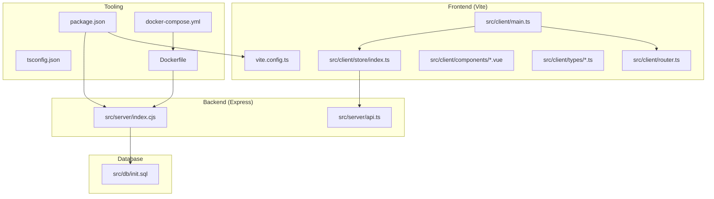
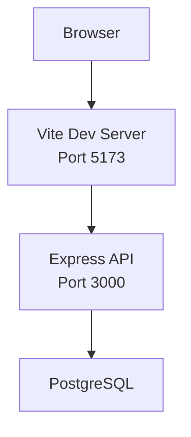
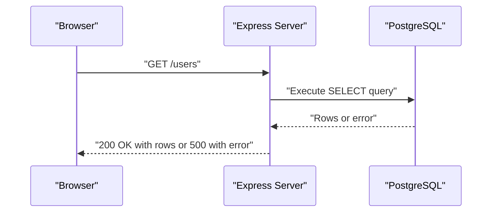
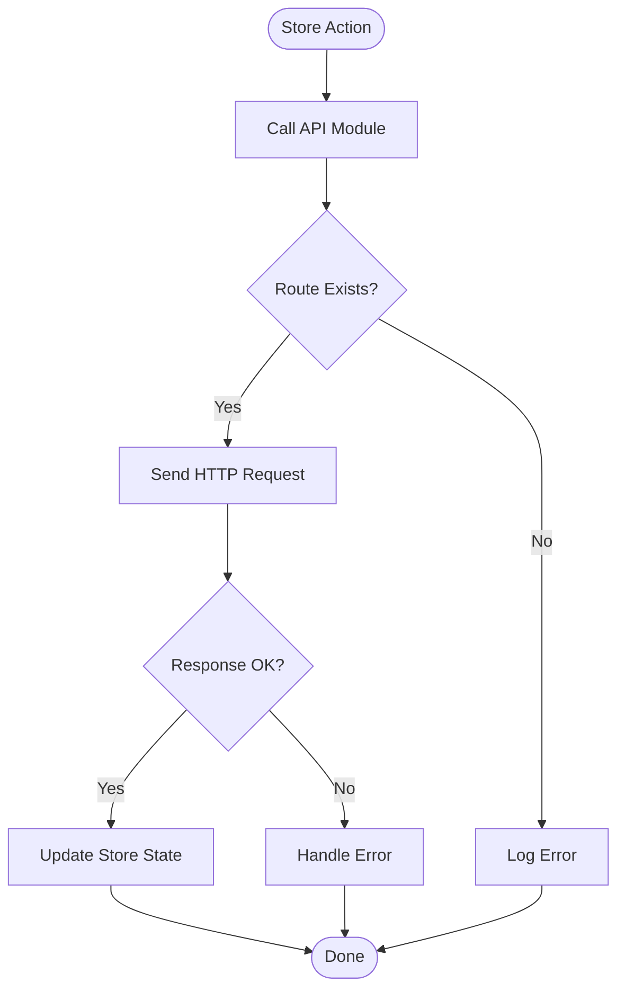
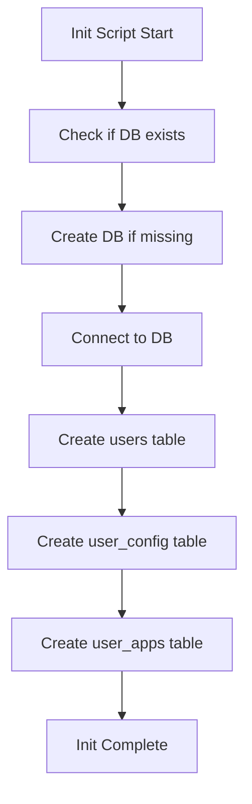
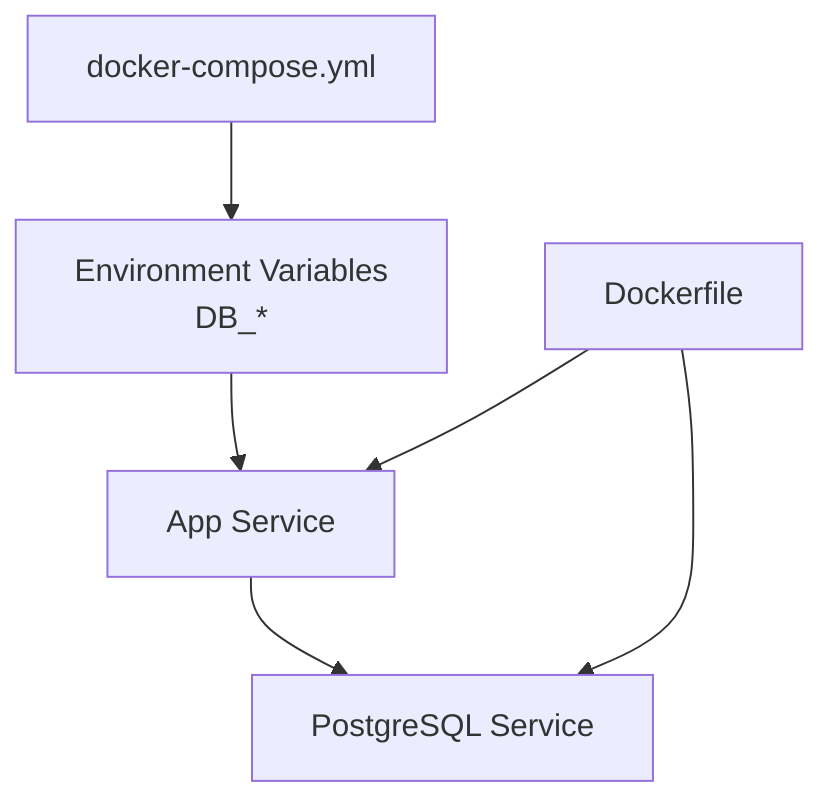
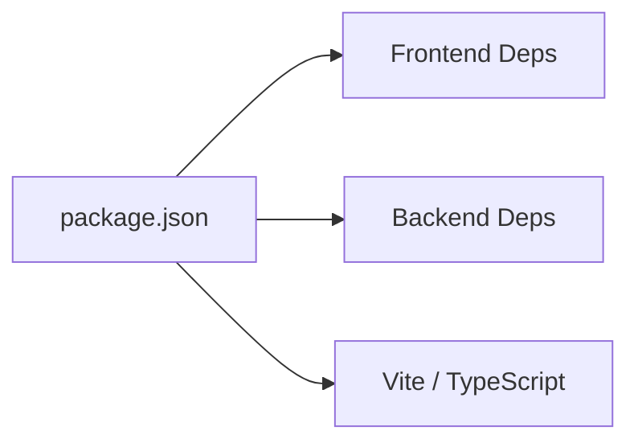

# Troubleshooting Guide

<cite>
**Referenced Files in This Document**
- [README.md](file://README.md)
- [package.json](file://package.json)
- [docker-compose.yml](file://docker-compose.yml)
- [Dockerfile](file://Dockerfile)
- [src/db/init.sql](file://src/db/init.sql)
- [src/server/index.cjs](file://src/server/index.cjs)
- [src/server/api.ts](file://src/server/api.ts)
- [src/client/main.ts](file://src/client/main.ts)
- [src/client/router.ts](file://src/client/router.ts)
- [src/client/store/index.ts](file://src/client/store/index.ts)
- [src/client/components/main.vue](file://src/client/components/main.vue)
- [src/client/components/config.vue](file://src/client/components/config.vue)
- [src/client/types/store.d.ts](file://src/client/types/store.d.ts)
- [src/client/types/user.d.ts](file://src/client/types/user.d.ts)
- [vite.config.ts](file://vite.config.ts)
- [tsconfig.json](file://tsconfig.json)
</cite>

## Table of Contents
1. [Introduction](#introduction)
2. [Project Structure](#project-structure)
3. [Core Components](#core-components)
4. [Architecture Overview](#architecture-overview)
5. [Detailed Component Analysis](#detailed-component-analysis)
6. [Dependency Analysis](#dependency-analysis)
7. [Performance Considerations](#performance-considerations)
8. [Troubleshooting Guide](#troubleshooting-guide)
9. [Conclusion](#conclusion)
10. [Appendices](#appendices)

## Introduction
This guide provides practical troubleshooting steps for common Startora issues across development and production environments. It focuses on database connectivity (PostgreSQL), API endpoint failures, server startup problems, frontend build issues, environment configuration, dependency conflicts, and deployment concerns. It also includes debugging techniques, log analysis, performance profiling, diagnostic commands, monitoring approaches, and escalation procedures.

## Project Structure
Startora is a full-stack application composed of:
- Frontend (Vue 3 + TypeScript + Vite)
- Backend (Node.js + Express + PostgreSQL)
- Database initialization scripts
- Containerization with Docker Compose and Dockerfile
- Build and development tooling via Vite and TypeScript

**Diagram sources**
- [src/client/main.ts:1-11](file://src/client/main.ts#L1-L11)
- [src/client/router.ts:1-24](file://src/client/router.ts#L1-L24)
- [src/client/store/index.ts:1-91](file://src/client/store/index.ts#L1-L91)
- [src/server/index.cjs:1-173](file://src/server/index.cjs#L1-L173)
- [src/db/init.sql:1-26](file://src/db/init.sql#L1-L26)
- [vite.config.ts:1-13](file://vite.config.ts#L1-L13)
- [package.json:1-31](file://package.json#L1-L31)
- [docker-compose.yml:1-27](file://docker-compose.yml#L1-L27)
- [Dockerfile:1-40](file://Dockerfile#L1-L40)

**Section sources**
- [README.md:33-56](file://README.md#L33-L56)
- [package.json:1-31](file://package.json#L1-L31)
- [docker-compose.yml:1-27](file://docker-compose.yml#L1-L27)
- [Dockerfile:1-40](file://Dockerfile#L1-L40)
- [vite.config.ts:1-13](file://vite.config.ts#L1-L13)
- [tsconfig.json:1-8](file://tsconfig.json#L1-L8)

## Core Components
- Backend entry and database client: The Express server initializes a PostgreSQL client, exposes REST endpoints, and logs connection status and errors.
- Frontend entry and routing: The Vue app mounts with Pinia and router; the store coordinates API calls and state.
- Database initialization: The init script creates the database and tables if they do not exist.
- Container orchestration: Docker Compose defines environment variables and network dependencies for PostgreSQL and the app.

Key entrypoints and responsibilities:
- Backend entry: [src/server/index.cjs:1-173](file://src/server/index.cjs#L1-L173)
- Frontend entry: [src/client/main.ts:1-11](file://src/client/main.ts#L1-L11)
- Router: [src/client/router.ts:1-24](file://src/client/router.ts#L1-L24)
- Store and API usage: [src/client/store/index.ts:1-91](file://src/client/store/index.ts#L1-L91)
- Database init: [src/db/init.sql:1-26](file://src/db/init.sql#L1-L26)
- Environment config: [docker-compose.yml:12-18](file://docker-compose.yml#L12-L18), [Dockerfile:21-27](file://Dockerfile#L21-L27)

**Section sources**
- [src/server/index.cjs:12-44](file://src/server/index.cjs#L12-L44)
- [src/client/main.ts:1-11](file://src/client/main.ts#L1-L11)
- [src/client/router.ts:1-24](file://src/client/router.ts#L1-L24)
- [src/client/store/index.ts:19-88](file://src/client/store/index.ts#L19-L88)
- [src/db/init.sql:1-26](file://src/db/init.sql#L1-L26)
- [docker-compose.yml:12-18](file://docker-compose.yml#L12-L18)
- [Dockerfile:21-27](file://Dockerfile#L21-L27)

## Architecture Overview
The system follows a classic full-stack pattern:
- Frontend (Vite) communicates with the backend (Express) via HTTP.
- Backend connects to PostgreSQL using the pg driver.
- Docker Compose provisions the app service and PostgreSQL, sharing environment variables for DB credentials and host/port.

**Diagram sources**
- [src/server/index.cjs:166-169](file://src/server/index.cjs#L166-L169)
- [docker-compose.yml:7-9](file://docker-compose.yml#L7-L9)
- [Dockerfile:33-39](file://Dockerfile#L33-L39)

## Detailed Component Analysis

### Backend Database Client and API Endpoints
- Connection: The server constructs a PostgreSQL client using environment variables for user, host, database, password, and port. If no password is provided, it prompts the user and exits on failure.
- Endpoints: Users and apps CRUD endpoints are exposed; theme configuration endpoints are included.
- Error handling: Routes return JSON error messages on exceptions; connection failures exit the process.

**Diagram sources**
- [src/server/index.cjs:46-54](file://src/server/index.cjs#L46-L54)

**Section sources**
- [src/server/index.cjs:12-44](file://src/server/index.cjs#L12-L44)
- [src/server/index.cjs:46-164](file://src/server/index.cjs#L46-L164)

### Frontend Store and API Integration
- Store actions call backend APIs for users, apps, and theme operations.
- Initialization loads session and apps; updates trigger re-fetches.
- Components rely on Pinia state and router navigation.

**Diagram sources**
- [src/client/store/index.ts:19-88](file://src/client/store/index.ts#L19-L88)

**Section sources**
- [src/client/store/index.ts:19-88](file://src/client/store/index.ts#L19-L88)
- [src/client/router.ts:1-24](file://src/client/router.ts#L1-L24)

### Database Initialization Script
- Creates the target database if missing.
- Creates tables for users, user_config, and user_apps with appropriate constraints.

**Diagram sources**
- [src/db/init.sql:1-26](file://src/db/init.sql#L1-L26)

**Section sources**
- [src/db/init.sql:1-26](file://src/db/init.sql#L1-L26)

### Containerization and Environment Variables
- Docker Compose sets DB_HOST, DB_PORT, DB_USER, DB_PASSWORD, DB_NAME and exposes ports 3000 and 5173.
- Dockerfile installs dependencies, copies code, sets environment variables, and starts PostgreSQL, Node API, and Vite dev server.

**Diagram sources**
- [docker-compose.yml:12-18](file://docker-compose.yml#L12-L18)
- [Dockerfile:21-27](file://Dockerfile#L21-L27)

**Section sources**
- [docker-compose.yml:1-27](file://docker-compose.yml#L1-L27)
- [Dockerfile:1-40](file://Dockerfile#L1-L40)

## Dependency Analysis
- Frontend dependencies include Vue, Pinia, Naive UI, Axios, and Vue Router.
- Backend depends on Express and the pg driver.
- Tooling includes Vite, TypeScript, and Vue type checking.

**Diagram sources**
- [package.json:12-29](file://package.json#L12-L29)

**Section sources**
- [package.json:1-31](file://package.json#L1-L31)

## Performance Considerations
- Minimize synchronous blocking operations in API handlers.
- Use prepared statements and parameterized queries consistently.
- Enable connection pooling for PostgreSQL in production deployments.
- Optimize frontend rendering by avoiding unnecessary re-renders in components.
- Profile bundle sizes and disable heavy dev-time plugins in production builds.

[No sources needed since this section provides general guidance]

## Troubleshooting Guide

### Database Connection Problems (PostgreSQL)
Symptoms:
- Backend fails to start with a PostgreSQL connection error.
- API endpoints return 500 errors related to database access.
- Frontend cannot load users or apps.

Root causes and resolutions:
- Incorrect credentials or missing environment variables:
  - Verify DB_HOST, DB_PORT, DB_USER, DB_PASSWORD, DB_NAME are set in the environment.
  - Confirm values align with your local or containerized PostgreSQL setup.
  - Reference: [docker-compose.yml:12-18](file://docker-compose.yml#L12-L18), [Dockerfile:21-27](file://Dockerfile#L21-L27), [src/server/index.cjs:12-36](file://src/server/index.cjs#L12-L36)
- PostgreSQL not running or unreachable:
  - Ensure PostgreSQL is started and listening on the configured port.
  - Test connectivity externally using a PostgreSQL client.
- Database does not exist:
  - Run the initialization script to create the database and tables.
  - Reference: [src/db/init.sql:1-26](file://src/db/init.sql#L1-L26)
- Permission errors:
  - Confirm the user has privileges to connect and create tables.
  - Review PostgreSQL roles and grants.
- Connection string issues:
  - Prefer using individual environment variables (PG_USER, PG_HOST, etc.) rather than a single connection string for clarity.
  - Reference: [src/server/index.cjs:12-36](file://src/server/index.cjs#L12-L36)

Diagnostic commands:
- Check backend logs for connection errors.
- Validate environment variables at runtime.
- Use a PostgreSQL client to test connectivity with the same credentials.
- Confirm the database exists and tables are present.

Monitoring approaches:
- Tail backend logs during startup to capture connection attempts.
- Monitor PostgreSQL logs for authentication and connection events.

Escalation procedures:
- If using Docker, confirm service health and port exposure.
  - Reference: [docker-compose.yml:7-9](file://docker-compose.yml#L7-L9), [Dockerfile:33-39](file://Dockerfile#L33-L39)
- If running natively, verify local PostgreSQL installation and firewall rules.

**Section sources**
- [src/server/index.cjs:12-44](file://src/server/index.cjs#L12-L44)
- [src/db/init.sql:1-26](file://src/db/init.sql#L1-L26)
- [docker-compose.yml:12-18](file://docker-compose.yml#L12-L18)
- [Dockerfile:21-27](file://Dockerfile#L21-L27)

### API Endpoint Failures
Symptoms:
- GET /users returns 500.
- POST /users or PUT /user/:userid/apps returns 500.
- Frontend shows generic errors when loading data.

Root causes and resolutions:
- Database connectivity issues (see above).
- Missing or invalid request body for POST/PUT endpoints.
  - Ensure appName and appData are provided for app endpoints.
  - Reference: [src/server/index.cjs:87-103](file://src/server/index.cjs#L87-L103), [src/server/index.cjs:105-122](file://src/server/index.cjs#L105-L122)
- Parameter mismatch (e.g., wrong userid or appId).
  - Validate route parameters and query parameters.
  - Reference: [src/server/index.cjs:56-70](file://src/server/index.cjs#L56-L70), [src/server/index.cjs:105-122](file://src/server/index.cjs#L105-L122)
- CORS issues (rare given the wildcard configuration):
  - Confirm frontend and backend ports are correctly proxied or served together.

Debugging techniques:
- Inspect backend logs for thrown errors.
- Add logging around query execution and parameter binding.
- Use curl or Postman to reproduce and inspect responses.

**Section sources**
- [src/server/index.cjs:46-164](file://src/server/index.cjs#L46-L164)

### Server Startup Issues
Symptoms:
- Backend process exits immediately after startup.
- No server listens on the expected port.

Root causes and resolutions:
- Missing or empty PostgreSQL password triggers interactive prompt and exit on cancellation.
  - Provide PG_PASSWORD via environment variable to avoid prompts.
  - Reference: [src/server/index.cjs:12-28](file://src/server/index.cjs#L12-L28)
- Port conflict on 3000:
  - Change PORT environment variable or stop the conflicting process.
  - Reference: [src/server/index.cjs:166-169](file://src/server/index.cjs#L166-L169)
- Uncaught exceptions during client.connect():
  - Review PostgreSQL logs and environment configuration.
  - Reference: [src/server/index.cjs:38-44](file://src/server/index.cjs#L38-L44)

Diagnostic commands:
- Start the server with verbose logging.
- Verify environment variables are loaded correctly.

**Section sources**
- [src/server/index.cjs:12-44](file://src/server/index.cjs#L12-L44)
- [src/server/index.cjs:166-169](file://src/server/index.cjs#L166-L169)

### Frontend Build Problems
Symptoms:
- Vite fails to start in development.
- Production build fails with TypeScript or plugin errors.
- Assets not loading in preview.

Root causes and resolutions:
- Missing dependencies or lockfile inconsistencies:
  - Reinstall dependencies using the supported package manager.
  - Reference: [package.json:6-11](file://package.json#L6-L11)
- TypeScript configuration issues:
  - Ensure tsconfig references are correct.
  - Reference: [tsconfig.json:1-8](file://tsconfig.json#L1-L8)
- Vite configuration misalignment:
  - Verify aliases and plugins.
  - Reference: [vite.config.ts:1-13](file://vite.config.ts#L1-L13)
- Conflicting browserslist or plugin versions:
  - Align versions with the project’s pinned dependencies.

Diagnostic commands:
- Run the dev script and inspect error messages.
- Attempt a clean build and preview.

**Section sources**
- [package.json:1-31](file://package.json#L1-L31)
- [tsconfig.json:1-8](file://tsconfig.json#L1-L8)
- [vite.config.ts:1-13](file://vite.config.ts#L1-L13)

### Environment Configuration Issues
Symptoms:
- Backend connects to the wrong database or host.
- Frontend cannot reach the API.

Root causes and resolutions:
- Environment variables not set or incorrect:
  - Set DB_HOST, DB_PORT, DB_USER, DB_PASSWORD, DB_NAME consistently across environments.
  - Reference: [docker-compose.yml:12-18](file://docker-compose.yml#L12-L18), [Dockerfile:21-27](file://Dockerfile#L21-L27)
- Inconsistent ports:
  - Ensure frontend and backend ports are aligned with proxying or container exposure.
  - Reference: [docker-compose.yml:7-9](file://docker-compose.yml#L7-L9)
- Development vs production differences:
  - Use separate .env files or CI/CD secrets management.

Diagnostic commands:
- Print environment variables at runtime.
- Validate configuration in both development and containerized contexts.

**Section sources**
- [docker-compose.yml:12-18](file://docker-compose.yml#L12-L18)
- [Dockerfile:21-27](file://Dockerfile#L21-L27)

### Dependency Conflicts
Symptoms:
- Build errors due to incompatible versions.
- Runtime warnings about peer dependencies.

Root causes and resolutions:
- Mismatched major versions of Vite, Vue, or TypeScript.
  - Align versions with the project’s pinned dependencies.
  - Reference: [package.json:12-29](file://package.json#L12-L29)
- Conflicting plugin versions:
  - Remove node_modules and reinstall with the lockfile.

Diagnostic commands:
- Compare installed versions with package.json.
- Clean install and rebuild.

**Section sources**
- [package.json:1-31](file://package.json#L1-L31)

### Deployment Problems
Symptoms:
- Containers fail to start or crashloop.
- Ports not exposed or reachable.

Root causes and resolutions:
- PostgreSQL not initialized or data directory issues:
  - Ensure the init script runs and data persists.
  - Reference: [Dockerfile:14-15](file://Dockerfile#L14-L15)
- Port conflicts or incorrect exposure:
  - Verify port mappings and host bindings.
  - Reference: [docker-compose.yml:7-9](file://docker-compose.yml#L7-L9)
- Missing environment variables in production:
  - Provide DB_* variables via secrets or environment files.
  - Reference: [docker-compose.yml:12-18](file://docker-compose.yml#L12-L18), [Dockerfile:21-27](file://Dockerfile#L21-L27)

Diagnostic commands:
- Inspect container logs for startup errors.
- Verify service health checks and readiness.

**Section sources**
- [Dockerfile:14-15](file://Dockerfile#L14-L15)
- [docker-compose.yml:7-9](file://docker-compose.yml#L7-L9)
- [docker-compose.yml:12-18](file://docker-compose.yml#L12-L18)
- [Dockerfile:21-27](file://Dockerfile#L21-L27)

### Common Error Messages and Resolution Steps
- “Error connecting to PostgreSQL”:
  - Cause: Incorrect credentials, unreachable host, or database not created.
  - Resolution: Validate environment variables, run init script, check PostgreSQL logs.
  - Reference: [src/server/index.cjs:38-44](file://src/server/index.cjs#L38-L44), [src/db/init.sql:1-26](file://src/db/init.sql#L1-L26)
- “PostgreSQL password:” prompt and exit:
  - Cause: Missing PG_PASSWORD.
  - Resolution: Set PG_PASSWORD or pass via environment.
  - Reference: [src/server/index.cjs:12-28](file://src/server/index.cjs#L12-L28)
- “User not found” or “App not found”:
  - Cause: Nonexistent ids or wrong parameters.
  - Resolution: Validate route parameters and existence of records.
  - Reference: [src/server/index.cjs:64-66](file://src/server/index.cjs#L64-L66), [src/server/index.cjs:117-118](file://src/server/index.cjs#L117-L118)
- 500 errors on endpoints:
  - Cause: Database exceptions or malformed requests.
  - Resolution: Inspect backend logs, validate payloads, and ensure connectivity.
  - Reference: [src/server/index.cjs:51-53](file://src/server/index.cjs#L51-L53), [src/server/index.cjs:99-102](file://src/server/index.cjs#L99-L102)

**Section sources**
- [src/server/index.cjs:38-44](file://src/server/index.cjs#L38-L44)
- [src/server/index.cjs:51-53](file://src/server/index.cjs#L51-L53)
- [src/server/index.cjs:64-66](file://src/server/index.cjs#L64-L66)
- [src/server/index.cjs:99-102](file://src/server/index.cjs#L99-L102)
- [src/server/index.cjs:117-118](file://src/server/index.cjs#L117-L118)
- [src/db/init.sql:1-26](file://src/db/init.sql#L1-L26)

### Debugging Techniques Using Development Tools
- Backend:
  - Enable Node debug flags and attach a debugger to the Express process.
  - Add structured logging around database queries and route handlers.
  - Reference: [src/server/index.cjs:12-44](file://src/server/index.cjs#L12-L44)
- Frontend:
  - Use Vue DevTools to inspect component state and Pinia store.
  - Enable source maps and breakpoints in Vite dev server.
  - Reference: [src/client/main.ts:1-11](file://src/client/main.ts#L1-L11), [vite.config.ts:1-13](file://vite.config.ts#L1-L13)
- Database:
  - Use psql to manually execute queries and verify schema.
  - Reference: [src/db/init.sql:1-26](file://src/db/init.sql#L1-L26)

**Section sources**
- [src/server/index.cjs:12-44](file://src/server/index.cjs#L12-L44)
- [src/client/main.ts:1-11](file://src/client/main.ts#L1-L11)
- [vite.config.ts:1-13](file://vite.config.ts#L1-L13)
- [src/db/init.sql:1-26](file://src/db/init.sql#L1-L26)

### Log Analysis Approaches
- Backend:
  - Filter logs by connection attempts and query execution.
  - Look for thrown errors and stack traces.
  - Reference: [src/server/index.cjs:40-44](file://src/server/index.cjs#L40-L44), [src/server/index.cjs:51-53](file://src/server/index.cjs#L51-L53)
- Frontend:
  - Inspect browser console for network errors and component warnings.
  - Reference: [src/client/store/index.ts:34-46](file://src/client/store/index.ts#L34-L46), [src/client/store/index.ts:54-56](file://src/client/store/index.ts#L54-L56)
- Database:
  - Review PostgreSQL logs for authentication failures and connection drops.
  - Reference: [src/db/init.sql:1-26](file://src/db/init.sql#L1-L26)

**Section sources**
- [src/server/index.cjs:40-44](file://src/server/index.cjs#L40-L44)
- [src/server/index.cjs:51-53](file://src/server/index.cjs#L51-L53)
- [src/client/store/index.ts:34-46](file://src/client/store/index.ts#L34-L46)
- [src/client/store/index.ts:54-56](file://src/client/store/index.ts#L54-L56)
- [src/db/init.sql:1-26](file://src/db/init.sql#L1-L26)

### Performance Profiling Methods
- Backend:
  - Use Node profiler to identify slow database queries or route handlers.
  - Enable query logging in PostgreSQL for long-running statements.
- Frontend:
  - Use Vite devtools and browser performance panel to detect render bottlenecks.
  - Minimize reactive updates and avoid unnecessary deep watchers.
- Database:
  - Analyze query plans and add indexes if needed.
  - Monitor connections and pool usage.

[No sources needed since this section provides general guidance]

### Monitoring Approbes
- Health checks:
  - Add a simple GET route returning server status.
- Metrics:
  - Track response times and error rates at the API gateway or reverse proxy level.
- Observability:
  - Centralize logs and correlate backend, frontend, and database logs.

[No sources needed since this section provides general guidance]

### Escalation Procedures for Complex Issues
- Collect environment details:
  - OS, Node.js version, PostgreSQL version, and dependency versions.
- Isolate the problem:
  - Reproduce with minimal configuration (e.g., Docker Compose).
- Capture artifacts:
  - Backend logs, database logs, browser console logs, and dependency versions.
- Engage support channels:
  - Provide reproducible steps, environment details, and collected logs.

[No sources needed since this section provides general guidance]

## Conclusion
This guide consolidates actionable troubleshooting steps for Startora’s most common issues. By validating environment configuration, verifying database connectivity, inspecting logs, and applying the recommended debugging and monitoring techniques, most problems can be resolved quickly. For persistent or complex issues, escalate with comprehensive logs and environment details.

## Appendices

### Quick Diagnostic Checklist
- Backend:
  - Confirm PostgreSQL is reachable and credentials are correct.
  - Check backend logs for connection and query errors.
  - Reference: [src/server/index.cjs:12-44](file://src/server/index.cjs#L12-L44), [src/db/init.sql:1-26](file://src/db/init.sql#L1-L26)
- Frontend:
  - Verify Vite dev server is running and ports are open.
  - Check browser console for network and component errors.
  - Reference: [vite.config.ts:1-13](file://vite.config.ts#L1-L13)
- Deployment:
  - Validate Docker Compose port mappings and environment variables.
  - Reference: [docker-compose.yml:7-9](file://docker-compose.yml#L7-L9), [docker-compose.yml:12-18](file://docker-compose.yml#L12-L18)

**Section sources**
- [src/server/index.cjs:12-44](file://src/server/index.cjs#L12-L44)
- [src/db/init.sql:1-26](file://src/db/init.sql#L1-L26)
- [vite.config.ts:1-13](file://vite.config.ts#L1-L13)
- [docker-compose.yml:7-9](file://docker-compose.yml#L7-L9)
- [docker-compose.yml:12-18](file://docker-compose.yml#L12-L18)